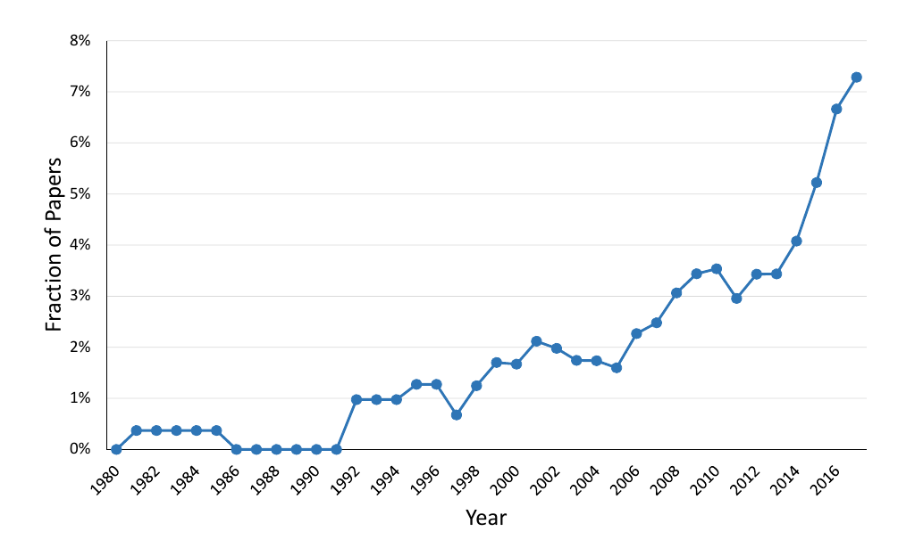

class: inverse, middle, center

```{r, load_refs, include=FALSE, cache=FALSE}
library(RefManageR)
BibOptions(check.entries = FALSE,
           bib.style = "alphabetic",
           cite.style = "alphabetic",
           style = "markdown",
           hyperlink = FALSE,
           dashed = FALSE)
myBib <- ReadBib("./esp_bib.bib", check = FALSE)
```

# Introdução

---
class: middle

```{r, echo=FALSE, out.width = '50%', fig.align="center"}
knitr::include_graphics("figs/syllabus.jpg")
```

---
class: middle

```{r, echo=FALSE, out.width = '90%'}
knitr::include_graphics("figs/wordcloud.png")
```

As palavras mais importantes no estudo da economia para estudantes de graduação ao redor do mundo &mdash; quase todas as principais delas vamos abordar nesse curso

---
class: middle
## Economia do setor público

O governo tem uma participação enorme em economias modernas:

1. Regulando atividades e setores inteiros (*organização industrial*)
3. Agindo diretamente para prover bens públicos ou corrigir externalidades, e fornecer seguro e assistência social (*parte 1 desse curso*)
2. Governos arrecadam renda de alguns agentes e transferem para outros, afetando a distribuição de recursos na economia (*parte 2 desse curso*)
4. Políticas de estabilização de ciclos e dívida pública (*macro*)

---
class: middle
## Economia positiva vs economia normativa

**Economia positiva** é o estudo de questões sobre *como o mundo é*: pontos *factuais* de discussão, e portanto podem ser argumentados de forma empírica e "científica"

**Economia normativa** é o estudo de questões sobre *como o mundo deveria ser*: envolve, portanto, *julgamentos de valor*, e não é "refutável" &mdash; é ética, não "ciência"

Políticas públicas *sempre* envolvem julgamentos de valor &mdash; como economistas podemos ajudar estabelecendo para quais valores sociais cada política pública vai ser desejável

---
class: middle
## Economia do setor público

Em economia do setor público estudamos quatro tipos de questões:

1. Em que situações o governo *deve* intervir na economia? (economia normativa)
2. Como o governo *deve* intervir? (economia normativa)
3. Qual é o efeito dessas intervenções para a sociedade? (economia positiva)
4. Como o governo *de fato* intervém na economia, e por que? (economia positiva)

A quarta questão é o que conhecemos como **economia política** (moderna)


---
class: middle
## 1. Quando o governo deve intervir na economia?

Teoria tradicional: o papel da intervenção govenamental é de *apenas* resolver as **falhas de mercado**

As mais conhecidas são externalidades e bens públicos, mas também importante são assimetrias informacionais, mercados incompletos (de seguro) e, mais recentemente, internalidades

Abordar outra "falha de mercado", o poder de mercado, é papel da *política antitruste*

Teoria moderna: além disso, a taxação e redistribuição governamental é a principal ferramenta para **reduzir desigualdades**


---
class: middle

```{r, echo=FALSE, out.width = '95%'}
knitr::include_graphics("figs/eae0310-1-15.png")
```

O capitalismo suporta estruturas completamente diferentes de distribuição do produto social: de desigualdade extrema, como no Brasil, até igualidade quase completa, como na Escandinávia nos anos 70, quando os 2-10% mais ricos recebiam apenas 2 vezes mais que o salário médio (!) `r Citep(myBib, "piketty2018capital")`

---
class: middle

```{r, echo=FALSE, out.width = '80%'}

```

Governos têm um papel central em mitigar a desigualdade &mdash; em quase todas as economias modernas, a desigualdade de renda após impostos e transferências é significativamente menor que a desigualdade de renda tributável

---
class: middle

```{r, echo=FALSE, out.width = '80%'}

```

Proporção dos artigos acadêmicos na área de setor público da NBER que citam os "1% mais ricos" `r Citep(myBib, "kleven2018language")`

---
class: middle

```{r, echo=FALSE, out.width = '90%'}

```

O Brasil sempre foi uma economia extremamente desigual (comparar com a tabela anterior), com o 1% mais rico recebendo 1/4 da renda e o 1-em-1000 mais rico 10% `r Citep(myBib, "souza2016")`

---
class: middle

```{r, echo=FALSE, out.width = '90%'}

```

Se a proporção da "classe dominante" não mudou desde o começo da série histórica, houve uma queda considerável da proporção dos 10% mais ricos na renda com a redemocratização `r Citep(myBib, "souza2016")`

---
class: middle

```{r, echo=FALSE, out.width = '80%'}

```

Por ser um país de renda média e extremamente desigual no topo, quem recebe R`$`3mil/mês já é parte dos 10% mais ricos e R`$`5,7 mil nos 5% mais ricos, mas para entrar na "classe dominante" precisa de uma renda >5x maior (~20mil/mês), e nos "ultra-ricos" >25x maior (~75mil/mês) `r Citep(myBib, "souza2016")`

---
class: middle

```{r, echo=FALSE, out.width = '90%', fig.align="center"}

```

O Brasil é mais desigual que qualquer outra grande economia (5º maior do mundo/UNDP), embora o crescimento recente da desigualdade nos EUA tenha o aproximado do nosso país `r Citep(myBib, "souza2016")`

---
class: middle
## 2. Como o governo pode intervir na economia?

Por exemplo, digamos que o governo queira incentivar a produção de bens desejáveis (e.g. saúde) ou desicentivar de indesejáveis, ele pode: 

1. Intervir no mecanismo de preços (incentivos dos agentes) por meio de taxação (ou subsídios)
2. Proibir ou obrigar diretamente o consumo de dado bem (a ser oferecido usualmente pelo mercado)
3. Provisão *pública* direta do bem (SUS) ou financiar a provisão *privada* (concessão administrativa, PPPs)

---
class: middle
## 3. Qual é o efeito dessas intervenções?

Qualquer intervenção governamental tem dois efeitos: os efeitos diretos e os indiretos (ou **efeitos mecânicos** e **comportamentais**)

> In the economic world an economic action, an institution, a law, do not generate only one effect but a whole series of effects. Only the first effect is obvious. It is manifested simultaneously with its cause: *it can be seen*. 

> The others only unroll in succession. *They cannot be seen*: we are lucky if we can predict them. Here is the whole difference between a good and a bad economist: the
latter only minds the visible effect, while the former accounts for both the effect that can be seen and those that must be predicted... `r Citep(myBib, "bastiat1873")`

---
class: middle
## 3. Qual é o efeito dessas intervenções?

**Efeitos diretos/mecânicos** de uma política pública são aqueles efeitos que ocorreriam *se os indivíduos não mudassem o seu comportamento em resposta à política*

Os efeitos que surgem pela alteração no comportamento dos agentes são chamados de **efeitos indiretos ou comportamentais**

*É para calcular os efeitos indiretos que existem modelos microeconômicos*: modelos comportamentais para prever como os indivíduos responderão a diferentes intervenções

Mas a teoria econômica raramente consegue precisar essa resposta &mdash; a magnitude dos efeitos indiretos se torna uma questão empírica 

---
class: middle
## 4. Por que o governo age da forma que age?

Embora seja etapa importante definir o que os governantes fariam *se fossem* "planejadores benevolentes" (1 e 2), sabemos que na prática eles não são

Decisões de políticas públicas são *decisões políticas*, e o estudo de como isso afeta as políticas implementadas é chamado de **economia política**

A existência de falhas de mercado abre a *possibilidade* de que a intervenção governamental aumente a eficiência

Mas para que isso de fato ocorra, a sociedade deve superar as **falhas de governo** (grupos de interesse, corrupção, populismo)

---
class: middle

```{r, echo=FALSE, out.width = '100%'}

```

Em todas as economias modernas, transferências e gastos governamentais (educação, saúde, defesa, etc.) formam grande parte &mdash; e em alguns países a maior parte &mdash; do produto nacional `r Citep(myBib, "gruber")`

---
class: inverse, middle, center

# Gastos públicos no Brasil

---
class: middle
## Gastos públicos no Brasil

O Brasil gasta 36% do PIB, o que é próximo dos EUA e abaixo da OCDE &mdash; o ESP gasta 11% do PIB estadual e a prefeitura 9% do PIB da capital (mas há bastante dupla contagem aí)

No pacto federativo brasileiro, o governo federal é responsável pelas políticas sociais (47% do orçamento federal), os estados pela política de segurança, e municípios pelo provimento de saúde básica

Em educação, o governo federal provê ensino superior, ensino médio frequentemente é estadual, e municípios oferecem a educação básica (a grosso modo)

---
class: middle

<iframe width="700" height="433" seamless frameborder="0" scrolling="no" src="https://docs.google.com/spreadsheets/d/e/2PACX-1vQWjA0CiuIqQYZEk7SaiQkI8nak6NkhiYOicXjb0jaV6VVDxAOsIjz7ELQgJz5FZqu4Bz6sDWPYOMzL/pubchart?oid=1369697175&amp;format=interactive"></iframe>

Despesas por função do governo central (COFOG/2020) &mdash; o governo federal é o responsável pela massa dos programas sociais

---
class: middle

```{r, echo=FALSE, out.width = '90%'}

```

O maior gasto social é previdência (7% do PIB). O governo gasta ~6% do PIB com pagamento de juros da dívida, quase o mesmo que o gasto com educação, onde o gasto federal é concentrado no ensino superior (COFOG/2020)

---
class: middle

<iframe width="600" height="371" seamless frameborder="0" scrolling="no" src="https://docs.google.com/spreadsheets/d/e/2PACX-1vQWjA0CiuIqQYZEk7SaiQkI8nak6NkhiYOicXjb0jaV6VVDxAOsIjz7ELQgJz5FZqu4Bz6sDWPYOMzL/pubchart?oid=1665153157&amp;format=interactive"></iframe>

Os estados são responsáveis pela segurança pública (10% do orçamento do GESP), além de parte da educação (18%) e saúde (12%). Previdência dos servidores consome quase 1/5 do orçamento estadual de 11,4% do PIB [(SFP/ESP)](https://www.fazenda.sp.gov.br/SigeoLei131/Paginas/FlexConsDespesa.aspx)

---
class: middle

<iframe width="600" height="371" seamless frameborder="0" scrolling="no" src="https://docs.google.com/spreadsheets/d/e/2PACX-1vQWjA0CiuIqQYZEk7SaiQkI8nak6NkhiYOicXjb0jaV6VVDxAOsIjz7ELQgJz5FZqu4Bz6sDWPYOMzL/pubchart?oid=1124154423&amp;format=interactive"></iframe>

Já a prefeitura gasta 9% do PIB (de 2018), e é a grande responsável pelo provimento de saúde (21% do orçamento de São Paulo), além de educação (20%), além de urbanismo e transporte (18%) [(Prefeitura de SP)](https://www.prefeitura.sp.gov.br/cidade/secretarias/licenciamento/desenvolvimento_urbano/dados_estatisticos/info_cidade/financas_municipais/)

---
class: middle

```{r, echo=FALSE, out.width = '80%', fig.align="center"}
knitr::include_graphics("figs/eae0310-1-6.png")
```

Nos anos 2000 houve uma descentralização da provisão de bens públicos, com o número de servidores municipais quase dobrando no período, para por volta de 7% da PEA (enquanto o emprego estadual e federal se mantiveram quase constantes em 4% e 1% da PEA, respectivamente) [(Atlas do Estado Brasileiro/IPEA)](https://www.ipea.gov.br/atlasestado/)

---
class: middle

```{r, echo=FALSE, out.width = '60%', fig.align="center"}

```

Muito se fala dos salários altos no funcionalismo brasileiro, e eles existem: mas quase apenas no governo federal e, especialmente, no Judiciário. Nas prefeituras o **diferencial salarial público-privado** estima-se como até um pouco negativo [(Atlas do Estado Brasileiro/IPEA)](https://www.ipea.gov.br/atlasestado/)

---
class: inverse, middle, center

# Análise normativa

---
class: middle
## Excedente do consumidor e do produtor

*Quando não há efeito-renda*, podemos representar o ganho de bem-estar dos consumidores e produtores de um mercado pelos seus "excedentes"

**Excedente do consumidor** é o que fica abaixo da curva de demanda (*disposição a pagar* por dada unidade) e acima do preço de mercado

**Excedente do produtor** é o lucro de vender uma dada unidade: a diferença entre o custo marginal (naquela quantidade), representado pela curva de oferta, e o preço de mercado

---
class: middle

```{r, echo=FALSE, out.width = '90%'}
knitr::include_graphics("figs/eae0310-1-10.png")
```

Quanto mais elástica a demanda, menor o *excedente do consumidor*: se estou indiferente entre manteiga e margarina (demanda muito elástica), a existência do mercado de manteiga não me gera muito ganho de bem-estar `r Citep(myBib, "gruber")`

---
class: middle

```{r, echo=FALSE, out.width = '90%'}

```

O mesmo vale para o *excedente do produtor*, que mede a renda econômica de plantas mais produtivas que a marginal &mdash; no longo prazo, quando o processo produtivo tem *ganhos constantes de escala*, o excedente do produtor é zero (não há lucro econômico) `r Citep(myBib, "gruber")`

---
class: middle

```{r, echo=FALSE, out.width = '70%'}

```

O efeito de um teto de preços $P_R$ no bem-estar social: consumidores ganham $B - D$ e produtores perdem $B + E$: há uma perda de eficiência, *mas se é desejável depende da importância do bem-estar de cada grupo* `r Citep(myBib, "gruber")`

---
class: middle
## Eficiência de Pareto

O conceito mais incontroverso na análise normativa é o de **melhoria de Pareto**: uma intervenção que melhore a situação de alguns indivíduos sem prejudicar nenhum outro claramente é desejável

Se uma alocação não permite melhorias de Pareto, chamamos ela de *eficiente de Pareto* &mdash; o problema do conceito é que é *fraco*: em geral, há infinitas tais alocações

A melhoria de Pareto é conveniente (e extremamente convincente) pois é uma intervenção que seria *aprovada por unanimidade*: devemos ser bastante relutantes em relação a políticas que permitam melhorias de Pareto 

---
class: middle
## Primeiro Teorema do Bem-estar

A economia do setor público parte do princípio de que o *benchmark* deve ser a não intervenção estatal, e o governo só deve agir se houver motivos especiais para isso. A justificativa teórica para essa "ideologia" é o 1o TBE

**Primeiro Teorema "Fundamental" do Bem-estar:** Se (i) domicílios e firmas são *price-takers*, ou seja, eles atuam de forma *perfeitamente competitiva* tomando preços como dados; (ii) os *mercados são completos*; e (iii) informação é completa, então *se* existe um equilíbrio competitivo, ele é *eficiente de Pareto*

Se não há falhas de mercado, então o mercado funciona de forma mais eficiente possível (maximiza o tamanho do bolo)

---
class: middle
## Quando o Primeiro Teorema falha

A principal dificuldade do 1o TBE provavelmente é o requerimento que mercados sejam **completos** e **perfeitamente competitivos** &mdash; no mundo real, imperfeições de mercado são pervasivas

Em vários mercados importantes, ganhos produtivos de escala podem fazer com que o equilíbrio de mercado envolva poucas firmas: setor químico, de petróleo, siderúrgico, alimentos processados, etc

A suposição de mercados completos envolve não apenas a ausência de bens públicos e externalidades, mas mercados futuros que precifiquem todas as eventualidades possíveis (incl. seguro e crédito)

---
class: middle
## Quando o Primeiro Teorema falha

No mundo real, **assimetrias informacionais** geram risco moral e seleção adversa pervasivas na economia: em relações de trabalho, contratos (incompletos) entre firmas, relação com consumidor

Se adquirir informação é custoso (**custos de transação**), o equilíbrio com mercados completos é logicamente inconsistente, pois se toda informação está precificada, não vale a pena "precificar a informação" (Grossman & Stiglitz, 1980)

Também assume que o *equilíbrio existe*: no mundo real, operamos com desequilíbrio no mercado de fatores (desemprego), balança de pagamentos, etc.

---
class: middle
## Segundo Teorema do Bem-estar

**Segundo Teorema do Bem-estar:** Se as condições do 1º TBE valem, curvas de indiferença e os conjuntos de possibilidade de produção são convexos e *transferências lump-sum* podem ser usadas livremente, então qualquer alocação *eficiente de Pareto* pode ser alcançada como equilíbrio competitivo dada certa realocação de dotações inicias por transferências lump-sum

**Transferências lump-sum** não dependem de variáveis de escolha do indivíduo, e portanto não distorcem comportamento (i.e. não geram ineficiências): e.g., "poll taxes", renda básica universal (e basicamente só)

---
class: middle
## Segundo Teorema do Bem-estar

Como vimos, alocações eficientes de Pareto são as quais **não** existe melhoria **unânime** &mdash; a eficiência de Pareto é muito pouco restritiva

Alocações extremamente desiguais (plausivelmente indesejáveis) podem ser eficiente de Pareto: não é suficiente para a análise normativa!

Uma tentativa histórica de resolver isso foi o 2º TBE: podemos separar o problema de eficiência do problema de equidade

Por exemplo, pelo 2o TBE o teto de preços *sempre* será uma política ruim, pois é Pareto dominada pela alocação de mercado com transferências *lump-sum* dos produtores para os consumidores

---
class: middle
## Teto de preços no mundo do 2º TBE

Com o teto de preços, o excedente do consumidor é $A + B$, e o excedente do produtor é $C$ &mdash; como o excedente do consumidor com o teto de preços é maior que no livre-mercado, $A + D$, retirar o teto não é melhoria de Pareto, *mesmo com o teto introduzindo peso morto*

Mas note que (pelo peso morto) os produtores perdem muito mais que os consumidores ganham com o teto: seu excedente cai de $C + B + E$ para $C$

Então se os produtores recompensarem *de maneira lump-sum* os consumidores pela retirada do teto com um valor entre $B - D$ e $B + E$, é possível melhorar a sua situação de (pelo menos) um grupo sem piorar a de ninguém

Já que $A + D + (B - D) \geq A + B$ e $C + B + E - (B - D) > C$, e igualmente $A + D + (B + E) > A + B$ e $C + B + E - (B + E) \geq C$

---
class: middle
## Segundo Teorema do Bem-estar

O problema é que no mundo real é impossível redistribuir renda só com transferências lump-sum, qualquer *redistribuição de renda é custosa* &mdash; aí está a **falácia do 2º TBE**

Existe um **trade-off entre eficiência e equidade**: não é possível avaliar políticas públicas separando a discussão de eficiência ("economia") da discussão de equidade ("filosofia política")

Quando considerar equidade é parte essencial do processo, se torna imprescindível fazer *julgamentos de valor* &mdash; na economia esses julgamentos estão incorporados no formato das *funções de bem-estar social*

---
class: middle
## Instrumentos governamentais

O 2º TBE depende fundamentalmente da existência de transferências lump-sum, mas elas são:

> not very helpful in securing desired redistributions unless we tax different men differently. But on what criteria should we discriminate between different men? (...) If we start taxing the poor less than the rich, we are simply reintroducing an income-tax. If we tax able men more than dunderheads, we open the door to all forms of falsification: we make stupidity seem profitable—and any able man can make himself seem stupid. `r Citep(myBib, "atkinson")` citando Graaf (1957)

Transferências lump-sum dependeriam de informações não-observáveis e que não é **compatível de incentivos** para as pessoas revelarem

---
class: middle
## First best e second best

A solução quando transferências lump-sum são permitidas é chamado de **first best** (o melhor possível). Problemas:

1. As características usadas para o *screening* estão sob controle do agente (salário, trabalho, etc)
2. Características fixas do indivíduo são imperfeitamente correlacionadas com os nossos objetivos e observar essas características é custoso

Quando limitamos os instrumentos possíveis para aqueles que distorcem comportamento (por 1), a solução se torna **second best**: não é mais eficiente de Pareto, mas é o melhor possível dadas as *restrições informacionais* do governo

---
class: middle

```{r, echo=FALSE, out.width = '60%', fig.align="center"}

```

No mundo real, qualquer redistribuição de renda move a economia para alocações *second-best*, que são alocações estritamente dominadas ("dentro" da *fronteira de Pareto*) por alocações alcançáveis com transferências lump-sum &mdash; estas últimas não são factíveis dadas restrições informacionais `r Citep(myBib, "atkinson")`

---
class: middle
## First best e second best

**Equívocos comuns** sobre alocações *first-best* e *second-best*:

1. Uma alocação eficiente de Pareto **não** necessariamente é melhor que uma alocação que não é eficiente de Pareto (mas sempre existe alguma que é)
2. Quando há falhas de mercado, eliminar uma falha de mercado **não** (necessariamente) melhora a situação da economia

Por exemplo, se no mercado de trabalho há **poder de monopsônio**, dar poder de mercado aos sindicatos (ou impor salários mínimos) pode *aumentar* a eficiência da economia

---
class: middle
## Funções de bem-estar social

Embora poucos economistas modernos concordariam com Jevons que "economia é uma subdisciplina do utilitarismo", a influência utilitarista ainda é gigantesca na análise normativa em economia

**Utilitarismo** é uma filosofia ética que diz que ações são boas quando maximizam uma agregação da utilidade dos indivíduos da sociedade &mdash; isto é, analisamos o impacto de uma política pública comparando alguma agregação da utilidade dos cidadãos com a política vs sem ela

Utilitarismo é uma filosofia **consequencialista**: o que importa é o resultado final, não os meios que chegamos lá (p. ex., direitos humanos, liberdades individuais, igualdade de oportunidade, capacidades)

---
class: middle
## Comparação interpessoal de utilidades

Um problema desse tipo de análise é que requer **comparabilidade interpessoal de utilidade** &mdash; idealmente, gostaríamos de gerar uma função de bem-estar social das *preferências sociais* (analogamente a utilidade individual), mas o *Teorema da Impossibilidade de Arrow* joga um balde de água fria nesse sonho

Durante boa parte do século XX, (a velha) economia do bem-estar social foi contestada por se rejeitar a possibilidade de comparar utilidade entre indivíduos diferentes &mdash; o que envolve problemas claros, embora nós façamos isso no dia-a-dia (A. Sen)

O problema é que é *inevitável*, já que como vimos, conceitos unânimes como eficiência de Pareto não são base razoável para se tomar decisões de políticas

---
class: middle
## Função de bem-estar benthamita

A **função de bem-estar benthamita** é a que maximiza a soma das *utilidades*, como em Bentham $$\mathcal{W}_{B} = \sum_{i=1}^{N} U_i$$

Edgeworth acreditou que resultaria no *princípio do sacríficio equimarginal*: igualar a utilidade marginal de todos na economia

> The solution of this problem in the abstract is that the richer should be taxed for the benefit of the poorer up to the point where complete equality of fortunes is attained. `r Citep(myBib, "edgeworth")`

---
class: middle
## Função de bem-estar rawlsiana

Se o Edgeworth estivesse certo, estaria tudo terminado. (E esse seria um curso bastante curto...)

Mas a igualdade completa só vale com transferências lump-sum; no mundo real o sacrifício equimarginal não é **igualitarianismo**

John Rawls propôs um experimento mental em que as pessoas decidiriam a redistribuição social *por trás do véu da ignorância*

Para ele, isso envolveria maximizar o bem-estar do menos favorecido na sociedade (*maxi-min*): $$\mathcal{W}_R =  \min \left\{ U_i \right\}_i$$

---
class: middle
## Função de bem-estar rawlsiana

A alocação rawlsiana é a que propõe mais redistribuição *dentre as alocações não-dominadas de Pareto*

A **função de bem-estar rawlsiana** é bem exigente! Se taxar R$1000 meu, der 1 real para o mais pobre e queimar todo o resto, isso melhora o bem-estar social &mdash; mas ainda assim *não* é igualitária, quando a igualdade completa envolve piora unânime

Assim como funções de utilidade, podemos desenhar SWFs de formatos mais gerais, como a iso-elástica ( $\nu = 0$ é benthamita, $\nu \rightarrow \infty$ rawlsiana): $$\mathcal{W}_I = \frac{1}{1 - \nu} \sum_{i=1}^N \left( U_i^{1-\nu} - 1 \right)$$

---
class: middle
## Teorias normativas do Estado

> (...) a minimal state, limited to the narrow functions of protection against force, theft, fraud, enforcement of contracts, and so on, is justified; that any more extensive state will violate persons’ rights not to be forced to do certain things, and is unjustified... `r Citep(myBib, "nozick")` apud `r Citep(myBib, "atkinson")`

O **Estado mínimo** é aquele que exerce apenas o *monopólio da força* e impõe o contrato social que previne que o homem seja o lobo do homem 

Podemos adicionar intervenções governamentais *unanimamente aprovadas* (melhorias de Pareto) &mdash; a partir daí, temos que escolher entre alocações que beneficiam alguns e prejudicam outros

---
class: middle

```{r, echo=FALSE, out.width = '60%', fig.align="center"}
knitr::include_graphics("figs/eae0310-1-13.png")
```

O estado mínimo é $N$, que permite intervenções governamentais que são melhorias de Pareto até $N^{\prime}$ &mdash; a partir daí, estamos na **fronteira de Pareto** até a alocação rawlsiana $R$, que note que não é igualitária (como $E$), passando pela benthamita $B$ e iso-elástica $W$ (para $\nu \in (0, \infty)$) `r Citep(myBib, "atkinson")`

---
class:middle
# Referências
<small>
```{r refs, echo=FALSE, results="asis"}
PrintBibliography(myBib, start=1, end=5)
```
</small>

---
class:middle
# Referências
<small>
```{r refs2, echo=FALSE, results="asis"}
PrintBibliography(myBib, start=6)
```
</small>


<!-- --- -->
<!-- class: middle -->
<!-- ## Efeito renda e substituição -->

<!-- A base da economia do setor público é a **equação de Slutsky**:  -->
<!-- $$\frac{\partial x_i (\mathbf{p}, y)}{\partial p_j} = \frac{\partial h_i (\mathbf{p}, u)}{\partial p_j} - \frac{\partial x_i (\mathbf{p}, y)}{\partial y}x_i (\mathbf{p}, y)$$ -->
<!-- Onde $h_i (\mathbf{p}, u)$ é a **demanda compensada** (Hicksiana) de $i$, que mantém a utilidade $u$ constante -->

<!-- Qualquer intervenção pública terá dois efeitos: o **efeito renda** e o **efeito substituição** -->

<!-- Por exemplo, o Bolsa Família aumenta a renda das pessoas, fazendo com que precisem menos trabalhar para sobreviver (*efeito renda*), e diminui o benefício relativo de trabalhar contra não trabalhar (*efeito substituição*) -->

<!-- --- -->
<!-- class: middle -->

<!-- ```{r, echo=FALSE, out.width = '90%'} -->
<!--  -->
<!-- ``` -->

<!-- Efeitos renda e substituição de um aumento no preço dos filmes `r Citep(myBib, "gruber")` -->


<!-- --- -->
<!-- class: middle -->
<!-- ## Elasticidades -->

<!-- Na economia do setor público frequentemente poderemos resumir a resposta comportamental dos agentes a uma política pública com elasticidades -->

<!-- A **elasticidade-preço da demanda** é: $$\varepsilon_D \equiv \frac{\text{alteração % na demanda}}{\text{alteração % no preço}} = \frac{\Delta Q / Q}{\Delta P / P} = \frac{\text{d} D(p)}{\text{d} p} \frac{p}{D(p)}$$ -->

<!-- A elasticidade tem uma relação com a curvatura da função de demanda (no caso): quando a demanda é vertical, dizemos que é *perfeitamente inelástica*: $\varepsilon_D = 0$ -->

<!-- Quando a curva de demanda é horizontal, ela é *perfeitamente elástica*: $\varepsilon_D = \infty$ -->

