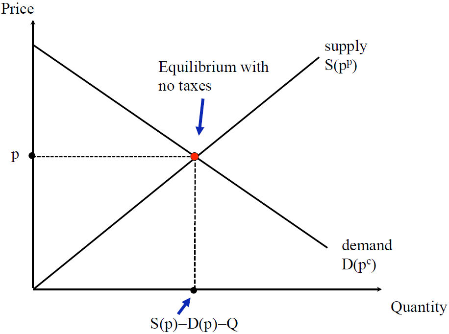
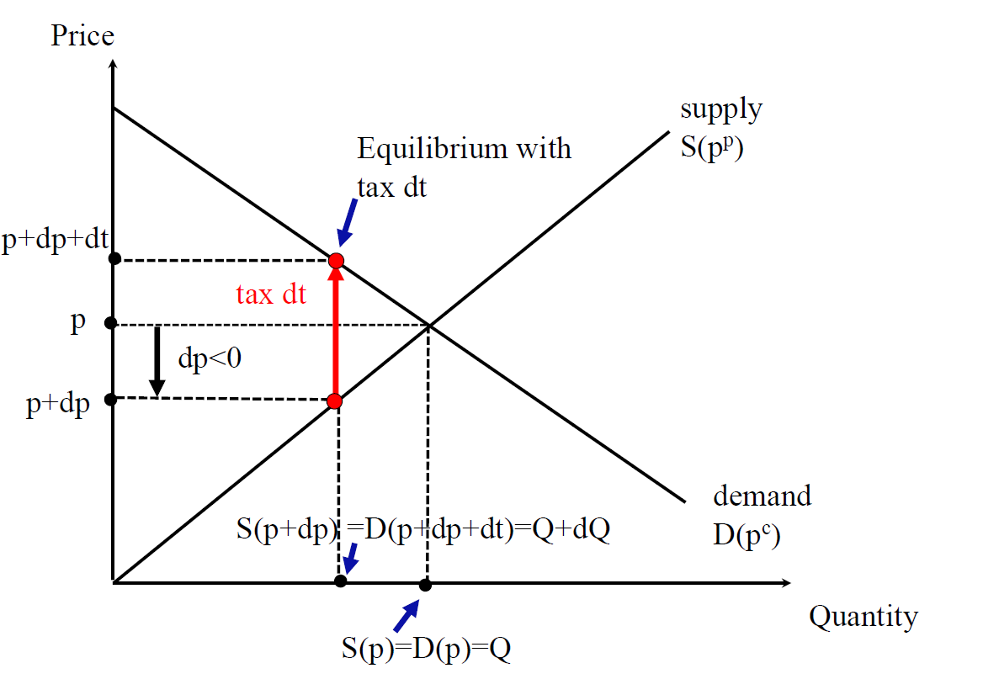
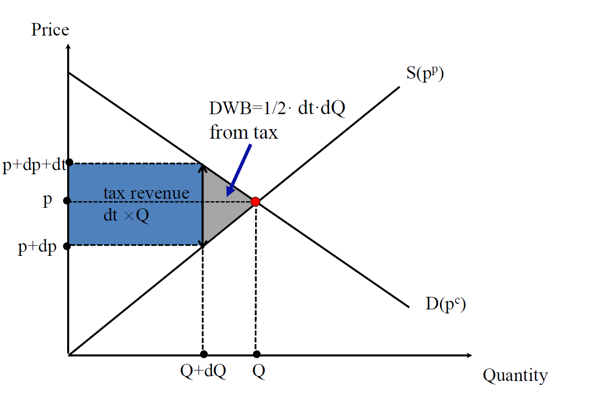
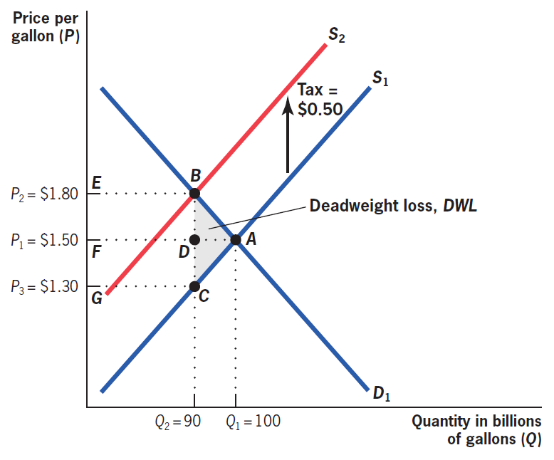
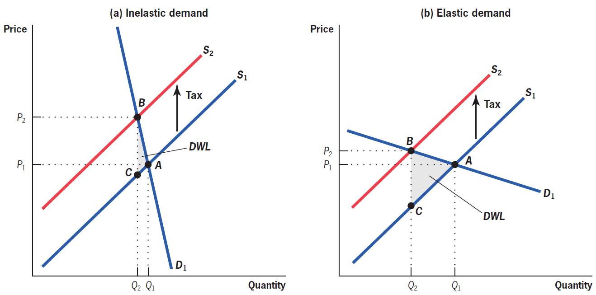
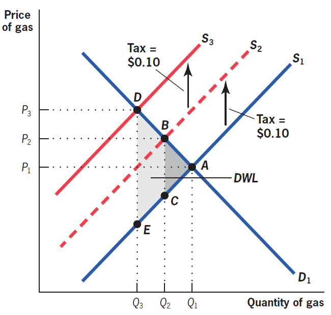
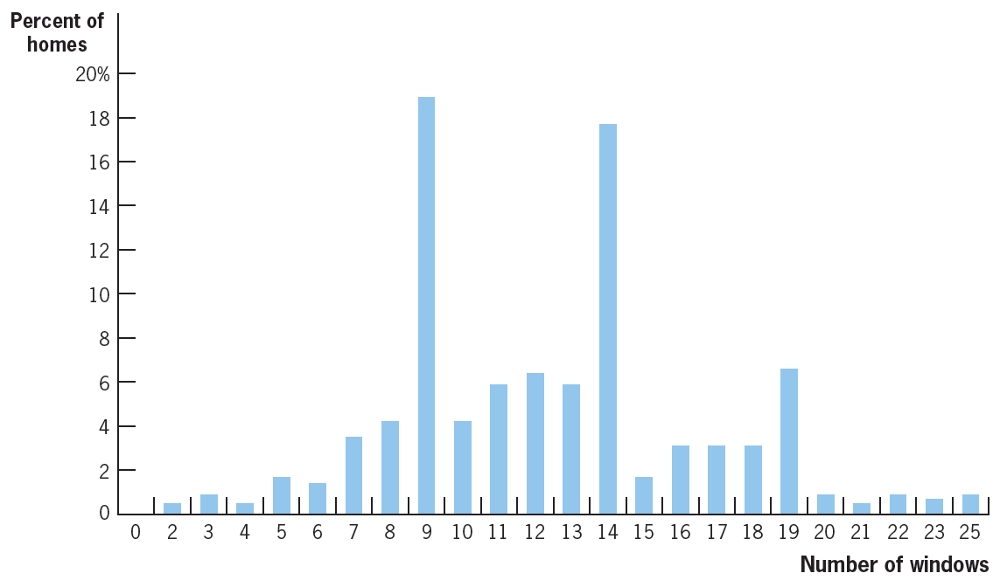
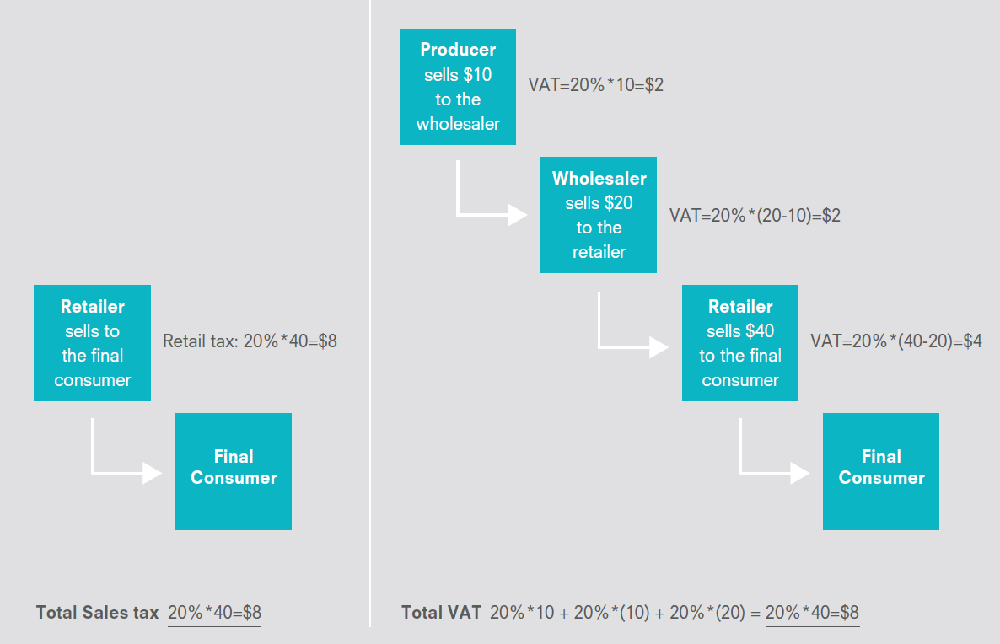

class: inverse, middle, center

```{r, load_refs, include=FALSE, cache=FALSE}
library(RefManageR)
BibOptions(check.entries = FALSE,
           bib.style = "alphabetic",
           cite.style = "alphabetic",
           style = "markdown",
           hyperlink = FALSE,
           dashed = FALSE)
myBib <- ReadBib("./esp_bib.bib", check = FALSE)
```

# Peso morto dos impostos

---
class: middle
## Efeitos comportamentais

Na aula passada, discutindo o efeito redistributivo da taxação (*incidência*) é sobre *preços*, enquanto a discussão de eficiência da taxação é sobre *quantidade*

O custo de eficiência é medido pelo **peso morto** (excess burden) gerado pela taxação

O peso morto advém do fato do imposto alterar os *preços relativos* que agentes econômicos se deparam, alterando seu comportamento &mdash; por exemplo, ao deixar o consumo mais caro relativo ao lazer (não tributável), desestimula o trabalho

---
class: middle
## Peso morto

O peso morto é definido como a perda de bem-estar (em medida monetária) gerada pelo imposto que vai além da arrecadação do imposto

É óbvio que se eu der `$`1 para o governo, eu tenho (*ceteris paribus*) uma perda de bem-estar de `$`1 &mdash; mas na verdade será maior que isso, pois transferir renda entre agentes econômicos é custoso (*leaky bucket*)

Essa diferença entre a **variação equivalente** (quanto de perda de renda teria efeito igual na utilidade do agente ao imposto) e a receita governamental é o peso-morto

---
class: middle
## Peso morto

**Importante:** o que gera peso morto é o *efeito substituição*! *Efeito renda* (por exemplo, RBU) não gera peso morto

Um jeito simples de ver isso é notar que *impostos lump-sum* também geram efeito renda

O peso morto vem da *alteração dos preços relativos*: transferências universais não alteram o preço relativo (p. ex. entre consumo e lazer)

De uma perspectiva "mais técnica", peso morto se mede pela **demanda compensada** (ou hicksiana)

---
class: middle
## Efeitos comportamentais

No fundo, a ineficiência econômica vem do fato de existir objetos econômicos relevantes que o governo não consegue observar e tributar: é uma *falha informacional*

Se o governo pudesse observar todas as idiosincracidades dos indivíduos, poderia condicionar a tributação a variáveis imutáveis ("habilidade") e redistribuir perfeitamente sem gerar alterações comportamentais

No mercado de consumo, quando o preço do consumidor e produtor não são iguais (*tax wedge*), há **trocas mutuamente benéficas** (e, sob nossas hipóteses, portanto socialmente benéficas) que não são realizadas

---
class: middle

```{r, echo=FALSE, out.width = '80%', fig.align = 'center'}

```

Um mercado em equilíbrio sem distorções &mdash; todas as *trocas mutuamente benéficas* são realizadas (Saez) 

---
class: middle

```{r, echo=FALSE, out.width = '95%'}

```

Com o imposto, há agora consumidores com disposição a pagar pelo bem maior que o custo marginal de sua produção, e ainda assim a troca não se realiza: a quantidade comercializada se reduz em $dQ$ (Saez) 

---
class: middle

```{r, echo=FALSE, out.width = '95%'}

```

A redução na quantidade comercializada cria o **triângulo de Harberger**: uma área de perda de excedentes que excede a receita do governo (Saez) 

---
class: middle
## Peso morto

O **triângulo de Harberger** é um triângulo, e sob as condições do gráfico de oferta e demanda (equilíbrio parcial, sem efeito renda) podemos calcular a sua área por simples geometria

$$\text{EB} = \frac{1}{2} dQ \times dt = \frac{1}{2} S^{\prime}(p) dp \times dt$$
Onde usamos que $Q = S(p)$ e portanto $dQ = S^{\prime}(p)dp$. Multiplicando e dividindo por $pQdt$ e lembrando da aula passada que $\frac{dp}{dt} = \frac{\epsilon_D}{\epsilon_S - \epsilon_D}$:

$$\text{EB} = \frac{1}{2} \frac{S^{\prime}(p) p}{Q} \frac{Q}{p} \frac{dp}{dt} \times (dt)^2 = \frac{1}{2}\frac{\epsilon_S \epsilon_D}{\epsilon_S - \epsilon_D} \frac{Q}{p} \times (dt)^2$$

---
class: middle

```{r, echo=FALSE, out.width = '65%'}

```

O triângulo de Harberger nesse exemplo tem área $\frac{1}{2} 10 \times 0,50 = 2,5$ bilhões `r Citep(myBib, "gruber")`

---
class: middle
## Peso morto

$$\text{EB} = \frac{1}{2}\frac{\epsilon_S \epsilon_D}{\epsilon_S - \epsilon_D} \frac{Q}{p} \times (dt)^2$$
O peso morto aumenta com o valor absoluto das elasticidades $\epsilon_S > 0$ e $- \epsilon_D > 0$ : *mais eficiente taxar bens inelásticos*


Peso morto aumenta de forma *quadrática* no imposto (*de segunda ordem*) &mdash; o peso morto por real arrecadado aumenta com a taxação:

1. É melhor taxar pouco vários bens que muito poucos bens;
2. É melhor financiar gastos extraordinários (guerras, pandemias) com dívida, paga por impostos em um longo período de tempo

---
class: middle

```{r, echo=FALSE, out.width = '85%'}

```

Quanto mais elástica a demanda e a oferta, maior o peso morto  `r Citep(myBib, "gruber")`

---
class: middle
## Peso morto

Como já citei na aula anterior, o peso morto é de segunda-ordem *quando não há distorções na economia* (triângulo)

Quando há distorções, como poder de mercado, ou taxação inicial (não partimos de $t = 0$), o peso morto se torna um trapézio &mdash; já não é desprezível no cálculo da incidência e outros efeitos

O cálculo do efeito de bem-estar de taxação pelo peso-morto vem desde Dupuit em 1844, mas o primeiro a estimar empiricamente o seu tamanho foi Harberger (1954): ele estimou o peso morto como $~3\%$ da receita, um valor bastante razoável dado o que sabemos hoje (ver `r Citep(myBib, "hines1999three")`)

---
class: middle

```{r, echo=FALSE, out.width = '50%'}

```

Quando aumentamos a taxa de um imposto já existente, o peso morto é de *primeira ordem* (trapézio), não mais de *segunda ordem* (triângulo) `r Citep(myBib, "gruber")`

---
class: middle
## Imposto sobre janelas

`r Citep(myBib, "oates")` estuda o caso do imposto sobre janelas instituído por William III na Inglaterra (1696)

Como é difícil avaliar o valor das propriedades (e era muito mais), ele decidiu usar como *proxy* o número de janelas (indicador de *capacidade de pagar*)

Isso faria sentido (**tagging**, que vimos na aula 7) se o número de janelas não fosse alterável &mdash; mas é

Também era injusto do ponto de vista de **equidade horizontal**: uma casa no campo muito mais barata que uma na cidade certamente teria bem mais janelas

---
class: middle
## Imposto sobre janelas

> "In order to reduce the window tax, every window... was built up, and all source of ventilation was thus removed. The smell in this house was overpowering, and offensive to an unbearable extent. There is no evidence that the fever was imported into this house, but it was propagated from it to other parts of town, and 52 inhabitants were killed" Carlisle, 1781, apud `r Citep(myBib, "oates")`

Pior ainda, a tributação possuía **notches**: pontos em que o imposto médio pago sobe descontinuamente, gerando distorções ainda maiores

Não havia imposto até 9 janelas, 6p/janela *no total de janelas* até 14 janelas, etc

---
class: middle

```{r, echo=FALSE, out.width = '85%'}

```

*Notches* na alíquota de taxação geram massas anômalas logo abaixo da mudança &mdash; aqui em 9, 14 e 19 janelas `r Citep(myBib, "gruber")`

---
class: middle
## Imposto sobre janelas

`r Citep(myBib, "oates")` encontram que o peso morto gerado pela taxação *em famílias localizadas "no notch"* foi terríveis 62% da receita: para cada £1 arrecadado pelo governo, elas pagavam £1,62-equivalente em perda de utilidade

Isto é, elas estariam dispostas a pagar £1,62 de transferência lump-sum por £1 arrecadado para acabar com essa taxação

Em geral, o peso morto foi 13,4% da arrecadação &mdash; ainda 3-4x maior que outros tipos de impostos

Mesmo com tudo isso, o imposto só foi retirado em 1851, quase 160 anos depois da instalação, o que demonstra que impostos muito eficientes podem durar muito tempo por motivos políticos

---
class: inverse, middle, center

# Taxação ótima de consumo

---
class: middle
## Taxação ótima de consumo

Até aqui, embora estejamos analisando efeitos de bem-estar, o estudo da incidência e peso-morto dos impostos ainda está no reino da *economia positiva*

Mas não dá para parar aí: o nosso interesse em última análise é aconselhar políticos em como desenhar sistemas de tributação melhores (que é parte da *análise normativa*)

Esse é o campo de estudo da **taxação ótima**: quais são as características de um sistema tributário que maximize o bem-estar da população, dadas as restrições informacionais (i.e., no *second-best*)

---
class: middle
## Taxação ótima de consumo

O estudo da taxação ótima de bens começou com Frank Ramsey, que fez várias descobertas relevantes em matemática, filosofia e economia antes da sua morte trágica aos 26 anos

Em 1926 Pigou propôs o problema para ele: como podemos arrecadar uma dada quantidade de receita por tributos $R$ causando o mínimo de distorções na economia?

O resultado ficou conhecido como **regra de Ramsey** (ou *regra da elasticidade inversa*): devemos taxar cada bem de forma inversamente proporcional à sua elasticidade da demanda

---
class: middle
## Regra de Ramsey

O problema de Ramsey é minimizar a soma de peso-morto dos diferentes mercados dada uma receita mínima do governo. Supondo que há apenas bens $A$ e $B$: $\min_{(t_k)_{k=1}^K} \sum_{k=1}^K EB_k$ sujeito a $\sum_{k=1}^K R_k = \bar{R}$.

Vimos ainda nessa aula que $\text{EB}_k = \frac{1}{2}\frac{\epsilon_S^k \epsilon_D^k}{\epsilon_S^k - \epsilon_D^k} \frac{Q_k}{p_k} (t_k)^2$. Portanto, temos o Lagrangiano: $$\min_{(t_k)_{k=1}^K} \sum_{k=1}^K \frac{1}{2}\frac{\epsilon_S^k \epsilon_D^k}{\epsilon_S^k - \epsilon_D^k} \frac{Q_k}{p_k} (t_k)^2 + \lambda \cdot \left( \sum_{k=1}^K Q_k t_k - \bar{R} \right)$$

---
class: middle
## Regra de Ramsey

A condição de primeira ordem para bem $k$ é:

$$[t_k]: \frac{\epsilon_S^k \epsilon_D^k}{\epsilon_S^k - \epsilon_D^k} \frac{Q_k}{p_k} t_k = - \lambda Q_k \Rightarrow t_k = \lambda \left( \frac{1}{|\epsilon_D|} + \frac{1}{|\epsilon_S|} \right)$$

Se assumirmos que $p_k = 1$. Aqui $\lambda$ é o **valor marginal dos fundos públicos** &mdash; como a taxação é distorciva, se o dinheiro com o governo não tiver valor social maior que na mão dos indivíduos privados, o imposto ótimo é zero

Fora isso, como o *peso morto é crescente nas elasticidades*, o governo deve taxar mais mercados mais inelásticos

---
class: middle
## Problemas com a regra de Ramsey

A *regra da elasticidade inversa* tem implicações distributivas cruéis: se há dois bens, arroz e caviar, como a demanda de arroz é muito mais inelástica, a regra da elasticidade inversa implica taxar muito o arroz e pouco o caviar

Isso vem da suposição implícita de que estamos preocupados apenas com *eficiência* &mdash; já vimos que qualquer decisão normativa tem que estar baseada em alguma *função de bem-estar social*, que vai levar em conta *igualdade*

Outro problema é que assume que podemos olhar cada mercado separadamente, o que sabemos que não é verdade: há efeitos importantes de *equilíbrio geral*

---
class: middle
## Problemas com a regra de Ramsey

O mais importante desses efeitos é a relação com o trabalho: como lazer não pode ser taxado, as pessoas trabalham ineficientemente pouco

**Taxar menos (ou até subsidiar) bens complementares ao trabalho** (educação, creche, transporte público, etc) pode reduzir essa distorção

Analogamente, faz sentido taxar mais bens substitutos ao trabalho, como video-games

Se nos preocupamos com redistribuição e não podemos taxar progressivamente a renda, a teoria diz que devemos redistribuir pela taxação indireta: **taxar menos bens consumidos pelos mais pobres**

---
class: middle
## Taxação homogênea

Todas as reformas em discussão no Brasil propõem taxação uniforme do consumo &mdash; quando isso é o ótimo?

O **princípio da focalização** (Atkinson & Stiglitz, 1976) diz que se podemos taxar a renda diretamente, devemos usar esse instrumento para reduzir desigualdade de renda, não a taxação de consumo

Mas isso só vale se capacidade de geração de renda for a única fonte de desigualdade. Se houver outras dimensões (por exemplo, riqueza), isso já não é mais válido

Pode também fazer sentido por motivos de *economia política*, já que evita *lobby* por redução nas taxas de setores particulares: política *third-best*

---
class: middle
## Imposto sobre insumos

Um dos resultados mais importantes de taxação ótima é o **resultado de eficiência produtiva** de Diamond-Mirrlees (1971)

Ele diz que um governo que precise arrecadar impostos em um mundo de concorrência perfeita e retornos constantes de escala *nunca taxará bens intermediários e importações*

No ótimo, o imposto deve manter a taxa marginal de substituição técnica entre insumos igual em todos os seus usos produtivos 

A intuição é que qualquer imposto sobre a produção distorce a produção *e o consumo*, então deve ser pior que um que distorce apenas o consumo


---
class: middle
## Imposto sobre valor adicionado

Impostos sobre o consumo (*indiretos*) podem ser cobrados sobre vendas, recolhendo uma taxa $t$ (proporcional ou fixa) sobre a venda *do bem final*

Mas nas últimas décadas se tornou muito mais comum o **imposto sobre valor adicionado** (IVA): com *compliance* perfeito e sem isenções, o IVA é equivalente a um imposto sobre vendas &mdash; a sua vantagem vem de dificultar a evasão fiscal

A vantagem do IVA é que cada produtor na cadeia produtiva desconta o imposto pago *upstream*, o que dá incentivo para **third-party reporting**

---
class: middle

```{r, echo=FALSE, out.width = '85%'}

```

Funcionamento de um imposto sobre vendas e um IVA de 20% `r Citep(myBib, "gerard2018value")` 

---
class: middle
## Imposto sobre valor adicionado

O IVA pode ser uma ferramenta poderosa de combater evasão fiscal em transações *business-to-business* (B2B), pois a empresa *downstream* ganha dinheiro reportando a transação ao governo

Mas isso não funciona para a transação para os consumidores! 

Foi para tentar evitar esse "buraco" no IVA que o governo de SP introduziu a Nota Fiscal Paulista (NFP)

`r Citep(myBib, "naritomi2019consumers")` encontrou que a NFP aumenta a receita de impostos do ICMS paulista em 9,3%


---
class:middle
# Referências
<small>
```{r refs, echo=FALSE, results="asis"}
PrintBibliography(myBib)
```
</small>
