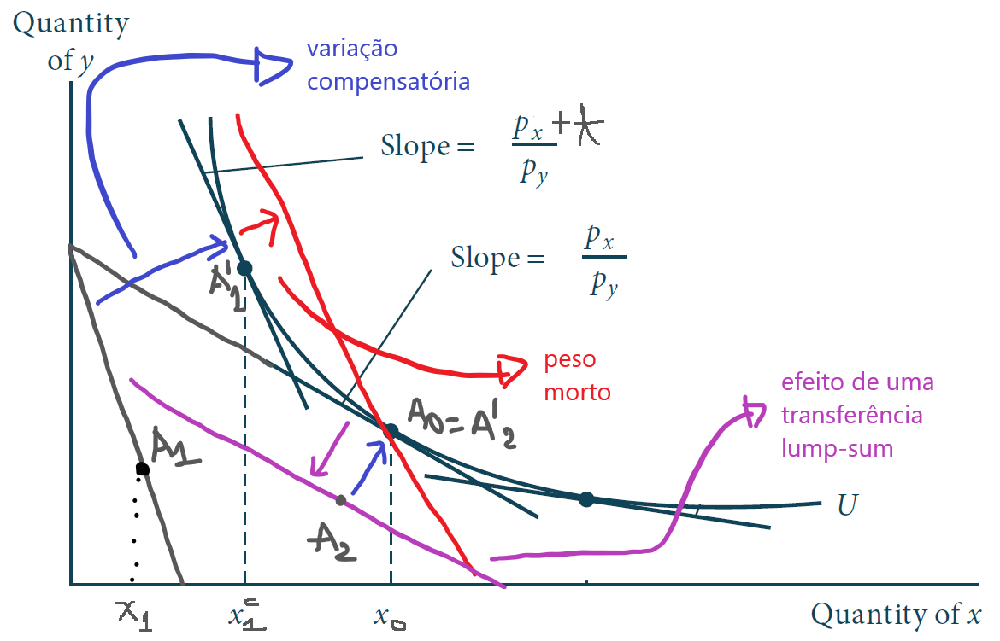
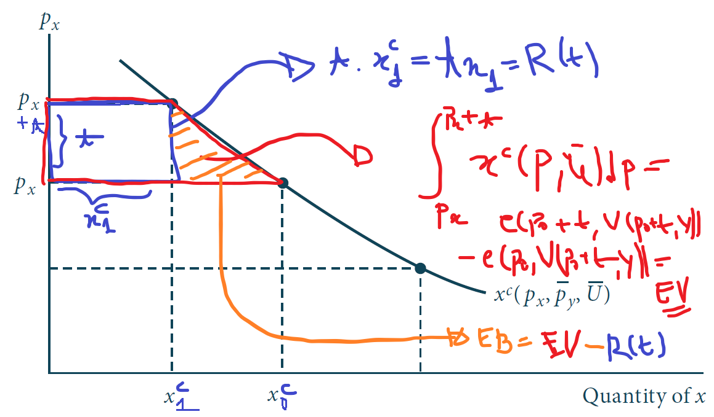
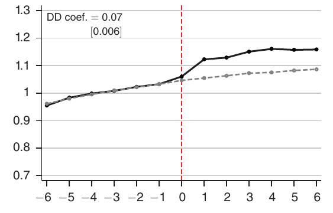
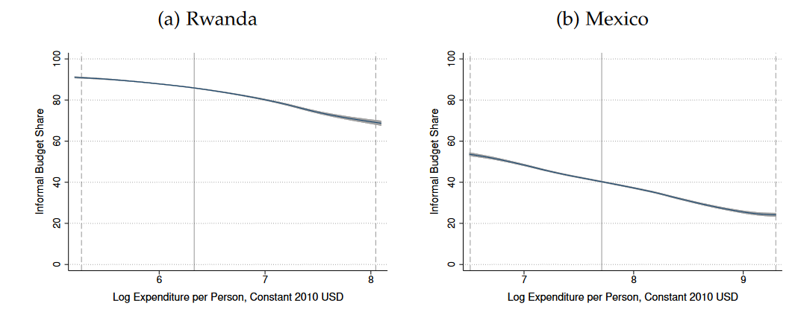

class: inverse, middle, center

```{r, load_refs, include=FALSE, cache=FALSE}
library(RefManageR)
BibOptions(check.entries = FALSE,
           bib.style = "alphabetic",
           cite.style = "alphabetic",
           style = "markdown",
           hyperlink = FALSE,
           dashed = FALSE)
myBib <- ReadBib("./esp_bib.bib", check = FALSE)
```

# Custos de eficiência da taxação

---
class: middle
## Prefácio: teoria do consumidor

Seja a utilidade $u(c_x, c_y)$ abaixo e assuma que $p_y = 1$: então, a restrição orçamentária é $Y = p_x c_x + c_y$ e portanto $c_y = Y - p_x c_x$ 

$$u(c_x, c_y) = \ln c_x + \ln c_y$$ 

Isso nos dá a CPO: $$\frac{1}{c_x} = \frac{p_x}{Y - p_x c_x} \Rightarrow Y - p_x c_x = p_x c_x \Rightarrow x(p_x, Y) \equiv c_x = \frac{Y}{2p_x}$$

$$\therefore V(p_x, Y) = \ln \left( \frac{Y}{2p_x} \right) + \ln \left( \frac{Y}{2} \right)$$ 


---
class: middle
## Prefácio: teoria do consumidor

No slide anterior, $x(p_x, Y)$ é a **demanda marshalliana** (de Alfred Marshall, em 1890) do bem $x$ e $V(p_x, Y)$ é a **função de utilidade indireta** (onde eu simplifiquei o problema por ser em 2 dimensões)

$$V(p_x, Y) = \ln \left( \frac{Y}{2p_x} \right) + \ln \left( \frac{Y}{2} \right) \equiv \bar{u}$$

$$\therefore \exp \left\{ \bar{u} \right\} = \left( \frac{Y}{2p_x} \right) \cdot \left( \frac{Y}{2} \right) \Rightarrow Y \equiv e(p_x, \bar{u}) = 2\sqrt{p_x e^{\bar{u}}}$$

Essa é a **função dispêndio** $e(p_x, \bar{u})$, que nos permite manter a utilidade $\bar{u}$ constante


---
class: middle
## Prefácio: teoria do consumidor

Nesse caso, a demanda marshalliana é negativamente inclinada, mas não precisa ser sempre o caso: se o bem é inferior, então o **efeito renda** $x(p_x, Y) \cdot \partial x(p_x, Y) / \partial Y < 0$ e pode compensar o **efeito substituição**, gerando demanda positivamente inclinada (essa é a equação de Slutsky, de 1915)

Note ainda que vale nesse exemplo (ufa!) a **identidade de Roy**: $x(p_x, Y) = - \partial_{p_x} V(p_x, Y) / \partial_Y V(p_x, Y)$

$$\frac{\partial V(p_x, Y)}{\partial p_x} = -\frac{2}{2 p_x} \text{ e } \frac{\partial V(p_x, Y)}{\partial Y} = \frac{2}{Y}$$
$$\therefore x(p_x, Y) = - \frac{\partial_{p_x} V(p_x, Y)}{\partial_Y V(p_x, Y)} = \frac{Y}{2 p_x}$$

---
class: middle
## Prefácio: teoria do consumidor

O **Lema de Shephard** (1953) diz que a **demanda compensada** (ou hicksiana, por John Hicks em 1939) por um bem é a derivada da função dispêndio em relação ao preço desse bem &mdash; assim,

$$x^c(p_x, \bar{u}) = \frac{\partial e(p_x, \bar{u})}{\partial p_x} = \sqrt{\frac{e^{\bar{u}}}{p_x}}$$

A demanda se chama assim pois representa o consumo do bem $x$ dada variações no preço do bem que são *compensadas* de forma a manter a utilidade do consumidor constante em $\bar{u}$: o que importa são apenas os preços relativos (**efeito substituição**), já que o efeito renda é compensado na utilidade


Note que aqui é válido, e **sempre** será verdade, que a demanda compensada é *negativamente inclinada*: $\partial x^c(p_x, \bar{u}) / \partial p_x < 0$

---
class: middle
## Custos de eficiência da taxação

Discutimos o efeito redistributivo da taxação: a **incidência** da taxação indireta, que é causada por alterações *no preço* dos produtos

Já o *custo de eficiência* da taxação é medido pelo **peso morto** (excess burden) gerado e é relacionado com alterações *na quantidade* comercializada

O peso morto advém do fato do imposto alterar os *preços relativos* que agentes econômicos se deparam, alterando seu comportamento &mdash; por exemplo, ao deixar o consumo mais caro relativo ao lazer (não tributável), desestimula o trabalho

---
class: middle
## Variação equivalente

Seja $e \left( p_0, V(p_0 + t, Y) \right)$ a **função dispêndio**, que mede a renda necessária para alcançar a preços iniciais $p_0$ a mesma utilidade $\bar{u}_1 = V(p_0 + t, Y)$ que o indivíduo com renda $Y$ tem após introdução de impostos $t >0$ (utilidade que é menor, já que o poder de compra caiu)

Então a **variação equivalente** é quanto de perda de renda teria efeito igual na utilidade do agente que a introdução do imposto:

$$EV = Y - e \left( p_0, V(p_0 + t, Y) \right)$$

Uma EV de 100 significa que introduzir o imposto sobre o consumo de dado bem tem efeito igual para o consumidor que tirar 100 reais de renda dele

---
class: middle
## Taxação lump-sum e peso morto

É natural que se alguém der `$`1 para o governo, ele terá uma perda de bem-estar de `$`1 &mdash; mas na verdade será maior que isso, pois transferir renda entre agentes econômicos é custoso (*leaky bucket*)

Essa diferença é **peso morto**: a perda de renda equivalente à perda de bem-estar (em medida monetária) gerada pelo imposto que é *além da arrecadação do imposto*:

$$EB = EV - R(t) = Y - e \left( p_0, V(p_0 + t, Y) \right) - t x(p_0 + t, Y)$$ 

*Taxação lump-sum* não gera peso morto &mdash; isso fica claro pela definição de variação equivalente: $$e \left(p_0, V(p_0, Y - T)\right) = Y - T \text{ e portanto } EV = T = R(t)$$

---
class: middle

```{r, echo=FALSE, out.width = '100%', fig.align = 'center'}
knitr::include_graphics("figs/eae0310-10-7b.png")
```

---
class: middle

```{r, echo=FALSE, out.width = '100%', fig.align = 'center'}

```

---
class: middle
## Peso morto é positivo

O peso morto medido pela variação equivalente (ou compensatória) sempre será bem-definido e positivo, já que a *Lei da Demanda* vale sempre para **demanda compensada**

Isso é uma aplicação direta do **Lema de Shephard**: a variação equivalente $EV = Y - e \left( p_0, V(p_1, Y) \right)$ é a integral da demanda compensada $x^{c}(p, \bar{u}_1)$ $$EV = \int_{p_0}^{p_0 + t} x^{c}(p, \bar{u}_1)dp$$ 

Enquanto a receita governamental é $t x(p_1, Y) = tx^c(p_1, V(p_1, Y))$, ou seja, $tx^c(p_1, \bar{u}_1)$ 

---
class: middle

```{r, echo=FALSE, out.width = '100%', fig.align = 'center'}

```


---
class: middle
## Peso morto e variação equivalente

Esse peso morto surge **pela diminuição da quantidade**: os agentes respondem "fugindo" do imposto, mas isso tem um custo em termos de bem-estar que não gera arrecadação (ao contrário da transferência lump-sum)

A definição de peso morto como variação equivalente é útil pois tem uma interpretação clara: é o quanto de perda  de renda *excessiva* (além da arrecadação do governo) que seria *equivalente* ao imposto implementado

Então um peso morto de 10% quer dizer que para cada R$1,00 arrecadado, os consumidores e produtores estariam dispostos a pagar em vez disso R$1,10 se fosse sem distorcer preços (transferência lump-sum)

---
class: middle
## Efeito substituição e efeito renda

É importante ter sempre em mente que **o que gera perda de bem-estar é o efeito substituição**: efeito renda não gera peso morto

De fato, transferências lump-sum também geram efeito renda, mas sem alteração nos preços relativos a variação equivalente é apenas a transferência de recursos (a perda de bem-estar do setor privado é igual à arrecadação)

O peso morto vem da **alteração dos preços relativos**: transferências universais não alteram o preço relativo (p. ex. entre consumo e lazer), e não geram um **tax wedge**

---
class: middle
## Efeitos comportamentais

No fundo, a ineficiência econômica vem do fato de existir objetos econômicos relevantes que o governo não consegue observar e tributar: é uma **falha informacional**

Se o governo pudesse observar todas as idiosincracidades dos indivíduos, poderia condicionar a tributação a variáveis imutáveis ("habilidade") e redistribuir perfeitamente sem gerar alterações comportamentais

No mercado de consumo, quando o preço do consumidor e produtor não são iguais (**tax wedge**), há *trocas mutuamente benéficas* (e no mercado competitivo então socialmente benéficas) que não são realizadas

---
class: middle

```{r, echo=FALSE, out.width = '75%', fig.align = 'center'}
knitr::include_graphics("figs/eae0310-9-1.png")
```

Um mercado em equilíbrio sem distorções &mdash; todas as *trocas mutuamente benéficas* são realizadas (Saez) 

---
class: middle

```{r, echo=FALSE, out.width = '85%'}

```

Com o imposto, há agora consumidores com disposição a pagar pelo bem maior que o custo marginal de sua produção, e ainda assim a troca não se realiza: a quantidade comercializada se reduz em $dQ$ (Saez) 

---
class: middle

```{r, echo=FALSE, out.width = '85%'}
knitr::include_graphics("figs/eae0310-10-1.png")
```

A redução na quantidade comercializada cria o **triângulo de Harberger**: uma área de perda de excedentes que excede a receita do governo (Saez) 

---
class: middle
## Triângulo de Harberger

O **triângulo de Harberger** é um triângulo, e sob as condições do gráfico de oferta e demanda (equilíbrio parcial, sem efeito renda) podemos calcular a sua área por simples geometria

$$\text{EB} = \frac{1}{2} dQ \times dt = \frac{1}{2} S^{\prime}(p) dp \times dt$$
Onde usamos que $Q = S(p)$ e portanto $dQ = S^{\prime}(p)dp$. Multiplicando e dividindo por $pQdt$ e lembrando da aula passada que $\frac{dp}{dt} = \frac{\epsilon_D}{\epsilon_S - \epsilon_D}$:

$$\text{EB} = \frac{1}{2} \frac{S^{\prime}(p) p}{Q} \frac{Q}{p} \frac{dp}{dt} \times (dt)^2 = \frac{1}{2}\frac{\epsilon_S \epsilon_D}{\epsilon_S - \epsilon_D} \frac{Q}{p} \times (dt)^2$$

---
class: middle

```{r, echo=FALSE, out.width = '65%'}
knitr::include_graphics("figs/eae0310-10-2.png")
```

O triângulo de Harberger nesse exemplo tem área $\frac{1}{2} 10 \times 0,50 = 2,5$ bilhões `r Citep(myBib, "gruber")`

---
class: middle
## A fórmula do peso morto

$$\text{EB} = \frac{1}{2}\frac{\epsilon_S \epsilon_D}{\epsilon_S - \epsilon_D} \frac{Q}{p} \times (dt)^2$$
O peso morto aumenta com o valor absoluto das elasticidades $\epsilon_S > 0$ e $- \epsilon_D > 0$ : *mais eficiente taxar bens inelásticos*


Peso morto aumenta de forma *quadrática* no imposto (*de segunda ordem*) &mdash; o peso morto por real arrecadado aumenta com a taxação:

1. É melhor taxar pouco vários bens que muito poucos bens;
2. É melhor financiar gastos extraordinários (guerras, pandemias) com dívida, paga por impostos em um longo período de tempo

---
class: middle

```{r, echo=FALSE, out.width = '85%'}

```

Quanto mais elástica a demanda e a oferta, maior o peso morto  `r Citep(myBib, "gruber")`

---
class: middle
## Peso morto

Como já citei na aula anterior, o peso morto é de segunda-ordem *quando não há distorções na economia* (triângulo)

Quando há distorções, como poder de mercado, ou taxação inicial (não partimos de $t = 0$), o peso morto se torna um trapézio &mdash; já não é desprezível no cálculo da incidência e outros efeitos

O cálculo do efeito de bem-estar de taxação pelo peso-morto vem desde Dupuit em 1844, mas o primeiro a estimar empiricamente o seu tamanho foi Harberger (1954): ele estimou o peso morto como $~3\%$ da receita, um valor bastante razoável dado o que sabemos hoje (ver `r Citep(myBib, "hines1999three")`)

---
class: middle

```{r, echo=FALSE, out.width = '50%'}
knitr::include_graphics("figs/eae0310-10-4.png")
```

Quando aumentamos a taxa de um imposto já existente, o peso morto é de *primeira ordem* (trapézio), não mais de *segunda ordem* (triângulo) &mdash; isso se dá pelas distorções pré-existentes, e vale também para qualquer outra ineficiência de mercado, como poder de monopólio `r Citep(myBib, "gruber")`

---
class: middle
## Imposto sobre janelas

`r Citep(myBib, "oates")` estuda o caso do imposto sobre janelas instituído por William III na Inglaterra (1696)

Como é difícil avaliar o valor das propriedades (e era muito mais), ele decidiu usar como *proxy* o número de janelas (indicador de *capacidade de pagar*): isso faria sentido (**tagging**) se o número de janelas não fosse alterável &mdash; mas é

Também era injusto do ponto de vista de **equidade horizontal**: uma casa no campo muito mais barata que uma na cidade certamente teria bem mais janelas

---
class: middle
## Imposto sobre janelas

> "In order to reduce the window tax, every window... was built up, and all source of ventilation was thus removed. The smell in this house was overpowering, and offensive to an unbearable extent. There is no evidence that the fever was imported into this house, but it was propagated from it to other parts of town, and 52 inhabitants were killed" Carlisle, 1781, apud `r Citep(myBib, "oates")`

Pior ainda, a tributação possuía **notches**: pontos em que o imposto médio pago sobe descontinuamente, gerando distorções ainda maiores: não havia imposto até 9 janelas, 6p/janela *no total de janelas* até 14 janelas, etc

---
class: middle

```{r, echo=FALSE, out.width = '85%'}
knitr::include_graphics("figs/eae0310-10-5.png")
```

*Notches* na alíquota de taxação geram massas anômalas logo abaixo da mudança &mdash; aqui em 9, 14 e 19 janelas `r Citep(myBib, "gruber")`

---
class: middle
## Imposto sobre janelas

`r Citep(myBib, "oates")` encontram que o peso morto gerado pela taxação *em famílias localizadas "no notch"* foi terríveis 62% da receita: para cada £1 arrecadado pelo governo, elas pagavam £1,62-equivalente em perda de utilidade

Isto é, elas estariam dispostas a pagar £1,62 de transferência lump-sum por £1 arrecadado para acabar com essa taxação &mdash; em geral, o peso morto foi 13,4% da arrecadação: ainda 3-4x maior que outros tipos de impostos

Mesmo com tudo isso, o imposto só foi retirado em 1851, quase 160 anos depois da instalação, o que demonstra que impostos muito eficientes podem durar muito tempo por motivos políticos

---
class: inverse, middle, center

# Imposto sobre consumo

---
class: middle
## Eficiência produtiva

O **teorema da eficiência produtiva** (Diamond & Mirrlees, 1971) diz que sem externalidades e poder de mercado, impostos não devem distorcer a escolha produtiva da firma 

Isso implica que não há distorção de preços relativos dos insumos, apenas no bem final &mdash; a intuição é que qualquer imposto sobre a produção distorce a produção **e** o consumo, então deve ser pior que distorcer apenas o consumo

Em geral esse é um argumento forte *contra a taxação de bens intermediários*, e a razão principal pela qual sistemas tributários tendem a taxar apenas a *venda final dos bens* (mas taxam fatores de produção)

---
class: middle
## Imposto sobre valor adicionado

Taxação de consumo (impostos indiretos) podem ser cobrados sobre vendas, recolhendo uma taxa $t$ (proporcional ou fixa) sobre a venda *do bem final*

Mas nas últimas décadas se tornou muito mais comum o **imposto sobre valor adicionado** (IVA, ou VAT em inglês): cada produtor paga uma taxa sobre a sua receita de vendas, mas **desconta** o imposto pago *upstream*

É por isso que é um imposto sobre **valor adicionado**, sua base é a receita menos o custo dos insumos &mdash; com *compliance* perfeito e sem isenções, o IVA é equivalente a um imposto sobre vendas

---
class: middle

```{r, echo=FALSE, out.width = '80%'}
knitr::include_graphics("figs/eae0310-8-1.png")
```

Funcionamento de um imposto sobre vendas e um IVA de 20% `r Citep(myBib, "gerard2018value")` 

---
class: middle
## Imposto sobre valor adicionado

A sua vantagem vem de dificultar a evasão fiscal: cada produtor na cadeia produtiva desconta o imposto pago *upstream*, o que dá incentivo para **third-party reporting**

O IVA pode ser uma ferramenta poderosa de combater evasão fiscal em transações *business-to-business* (B2B), pois a empresa *downstream* ganha dinheiro reportando a transação ao governo

Mas isso não funciona para a transação para os consumidores &mdash; foi para tentar evitar esse "buraco" no IVA que o governo de SP introduziu a Nota Fiscal Paulista (NFP)

---
class: middle

```{r, echo=FALSE, out.width = '75%'}
knitr::include_graphics("figs/eae0310-10-11.png")
knitr::include_graphics("figs/eae0310-10-10.png")
```

`r Citep(myBib, "naritomi2019consumers")` estudou o efeito da introdução do programa Nota Fiscal Paulista, em 2008, comparando o comportamento antes e depois de lojas de varejo (tratamento) vs atacado (controle)

---
class: middle

```{r, echo=FALSE, out.width = '45%', fig.show="hold"}

knitr::include_graphics("figs/eae0310-10-12b.png")
```

Parte do efeito vem de reclamações dos consumidores &mdash; após uma denúncia, firmas reportam 7% mais vendas ao governo (Painel A)

O Nota Fiscal Paulista levou a um aumento de 9,3% na receita de impostos do ICMS paulista, na comparação com outros estados (Painel B)  `r Citep(myBib, "naritomi2019consumers")` 

---
class: middle
## Taxação ótima de consumo

Até aqui, embora estavamos analisando efeitos de bem-estar, o estudo da incidência e peso-morto dos impostos ainda estava no reino da *economia positiva*

Mas o nosso interesse em última análise é aconselhar políticos em como desenhar sistemas de tributação melhores, que é parte da *análise normativa*

Esse é o campo de estudo da **taxação ótima**: quais são as características de um sistema tributário que maximize o bem-estar da população, dadas as restrições informacionais (i.e., no *second-best*)

---
class: middle
## Taxação ótima de consumo

O estudo da taxação ótima de consumo começou com Frank Ramsey, que fez várias descobertas relevantes em matemática, filosofia e economia antes da sua morte trágica aos 26 anos

Em 1926 Pigou propôs o problema para ele: como podemos arrecadar uma dada quantidade de receita por tributos $\bar{R}$ causando o mínimo de distorções na economia?

O resultado ficou conhecido como **regra de Ramsey** (ou *regra da elasticidade inversa*): devemos taxar cada bem de forma inversamente proporcional à sua elasticidade da demanda

---
class: middle
## Regra de Ramsey

O problema de Ramsey é minimizar a soma de peso-morto dos diferentes mercados dada uma receita mínima do governo. Supondo que há apenas bens $A$ e $B$: 

$$\min_{(t_k)_{k=1}^K} \sum_{k=1}^K EB_k \text{ sujeito a } \sum_{k=1}^K R_k = \bar{R}$$

Vimos ainda nessa aula que $\text{EB}_k = \frac{1}{2}\frac{\epsilon_S^k \epsilon_D^k}{\epsilon_S^k - \epsilon_D^k} \frac{Q_k}{p_k} (t_k)^2$. Portanto: $$\min_{(t_k)_{k=1}^K} \sum_{k=1}^K \frac{1}{2}\frac{\epsilon_S^k \epsilon_D^k}{\epsilon_S^k - \epsilon_D^k} \frac{Q_k}{p_k} (t_k)^2 + \lambda \cdot \left( \bar{R} - \sum_{k=1}^K Q_k t_k \right)$$

---
class: middle
## Regra de Ramsey

A condição de primeira ordem para bem $k$ é:

$$[t_k]: \frac{\epsilon_S^k \epsilon_D^k}{\epsilon_S^k - \epsilon_D^k} \frac{Q_k}{p_k} t_k = \lambda Q_k  \therefore \frac{t_k}{p_k} = \lambda \left( \frac{1}{|\epsilon_D|} + \frac{1}{|\epsilon_S|} \right)$$

Aqui $\lambda$ é o **valor marginal dos fundos públicos** &mdash; como a taxação é distorciva, se o dinheiro com o governo não tiver valor social maior que na mão dos indivíduos privados, o imposto ótimo é zero

Fora isso, como o *peso morto é crescente nas elasticidades*, o governo deve taxar mais mercados mais inelásticos

---
class: middle
## Problemas com a regra de Ramsey

A **regra de Ramsey** se tornou bastante conhecida em economia, mas faz implicitamente duas suposições importantes:

1. O que importa é **apenas eficiência**: minimizar o peso morto, e não maximizar o *bem-estar social*
2. Podemos analisar mercados separadamente, ignorando como afetam um ao outro (um bem pode ter demanda inelástica mas alta elasticidade cruzada com outros bens)

Essas duas suposições infelizmente tornam o resultado pouco aplicável no mundo real, e a maior parte dos sistemas tributários hoje em dia não vai nessa direção

---
class: middle
## Imposto indireto e desigualdade

A **regra da elasticidade inversa** tem implicações distributivas cruéis: se há dois bens, arroz e caviar, como a demanda de arroz é mais inelástica, a regra da elasticidade inversa implica taxar muito o arroz e pouco o caviar

Isso minimiza o peso morto, pois há pouca redução na quantidade comercializada, mas gera uma perda enorme de excedente do consumidor, diminuindo o bem-estar social (dadas preferências sociais por **equidade**)

Se nos preocupamos com redistribuição e há restrições na progressividade da taxação de renda, devemos redistribuir pela taxação indireta: **taxar menos bens consumidos pelos mais pobres**, como alimentos


---
class: middle

```{r, echo=FALSE, out.width = '95%'}

```

**Curvas de Engel** (proporcionais) de consumo de produtos informais para Ruanda (a) e México (b) &mdash; como eles não são taxados (por definição) e seu consumo decresce na renda (*bens necessários*), isso torna taxação indireta em países em desenvolvimento mais progressivas `r Citep(myBib, "bachas2022informality")`

---
class: middle

```{r, echo=FALSE, out.width = '65%'}
knitr::include_graphics("figs/eae0310-10-9.png")
```

Em uma simulação com taxação uniforme de 10%, ter comércio informal não taxado (vermelho) deixa o imposto mais progressivo que isentar alimentos (verde), e quase suplanta os ganhos dessa política quando conjuntamente (laranja) `r Citep(myBib, "bachas2022informality")` 

---
class: middle
## Imposto indireto e desigualdade

Vimos que existe um motivo para querer redistribuir renda por meio da tributação do consumo, taxando menos bens consumidos pelos mais pobres (e vice-versa) 

O **princípio da focalização** (Atkinson & Stiglitz, 1976) diz que se podemos taxar a renda diretamente, devemos usar esse instrumento (*focalizado*) para reduzir desigualdade de renda, não a taxação de consumo (ou de poupança)

Na *restrição orçamentária* dos consumidores uma taxação de renda $p_x c_x + p_y c_y = (1-\tau_Y)Y$ é equivalente a uma taxação **uniforme** sobre o consumo $(1+\tau_C)p_x c_x + (1+\tau_C)p_y c_y = Y$ quando $1 - \tau_Y = (1 + \tau_C)^{-1}$

---
class: middle
## Imposto indireto e desigualdade

Mas isso só vale se a **habilidade** for a única fonte de desigualdade &mdash; se houver outras dimensões relevantes de heterogeneidade (p. ex., riqueza inicial ou taxa de desconto intertemporal), isso já não é mais válido

De qualquer forma, se mantém a intuição de que taxação indireta é uma forma bastante obtusa de redistribuição de renda comparada com IR e assistência social

No UK, estima-se que remover isenção no IVA e aumentar em 15% transferências *means-tested* faria os mais pobres melhor e pouparia £11bi/ano ao orçamento `r Citep(myBib, "mirrlees2010dimensions", after=", ch. 4")`

---
class: middle
## Imposto indireto e oferta de trabalho

Outro problema da **regra de Ramsey** é que assume que podemos olhar cada mercado separadamente, o que sabemos que não é verdade: há efeitos importantes de *equilíbrio geral* (elasticidades cruzadas)

O mais importante desses efeitos é a relação com o trabalho: como lazer não pode ser taxado, as pessoas trabalham ineficientemente pouco

**Taxar menos (ou até subsidiar) bens complementares ao trabalho** (educação, creche, transporte público, etc) pode reduzir essa distorção &mdash; analogamente, faz sentido taxar mais bens substitutos ao trabalho, como video-games


---
class: middle
## Taxação uniforme

Se admitirmos o **princípio da focalização** e supormos que não há bens relacionados com demanda por lazer (muito forte!), então o ideal é uma *alíquota uniforme* (quiçá zero) sobre o consumo (e redistribuição por IR)

Taxação homogênea também fazer sentido por motivos de economia política, já que evita lobby por redução nas taxas de setores particulares (**política third-best**) e simplifica o arcabouço tributário

Ela também **expande a base tributária**, evitando elisão fiscal: enquanto a taxação de renda permite **withholding**, imposto sobre consumo atinge melhor trabalhadores por conta-própria &mdash; e uma alíquota única não permite manipular categorias

---
class:middle
# Referências
<small>
```{r refs, echo=FALSE, results="asis"}
PrintBibliography(myBib, start=1, end=5)
```
</small>

---
class:middle
# Referências
<small>
```{r refs2, echo=FALSE, results="asis"}
PrintBibliography(myBib, start=6)
```
</small>
