class: inverse, middle, center

```{r, load_refs, include=FALSE, cache=FALSE}
library(RefManageR)
BibOptions(check.entries = FALSE,
           bib.style = "alphabetic",
           cite.style = "alphabetic",
           style = "markdown",
           hyperlink = FALSE,
           dashed = FALSE)
myBib <- ReadBib("./esp_bib.bib", check = FALSE)
```

# Impostos sobre a renda do trabalho

---
class: middle
## Imposto sobre a renda

Na taxação indireta (sobre bens), o governo em geral busca arrecadar receita para políticas públicas da forma menos distorciva possível

Na taxação direta (sobre renda), há um segundo motivador: *diminuir desigualdade socioeconômica* &mdash; por isso que quase todo país do mundo taxa renda de forma **progressiva** (o Brasil muito pouco)

Na aula passada tentamos abstrair de definir uma *função de bem-estar social* e olhar só eficiência(*); na taxação de renda isso é imprescindível

---
class: middle
## Impostos sobre a renda

Já vimos na primeira aula do curso que se a renda não depende do esforço (é "fixa"), e temos um objetivo social **utilitarista** com *utilidade marginal decrescente*, isso resulta no *princípio do sacríficio equimarginal*

Esse princípio diz que devemos igualar a utilidade marginal de todos os indivíduos, o que, se todos têm funções de utilidade iguais, é o mesmo que igualar a renda (pós taxação e transferências) de todos

Mas isso só seria possível com uma taxação de renda em $100\%$, o que é bastante extremo (*ma non troppo*: em 1945 a taxa marginal máxima nos EUA era $94\%$ (!), e nos países escandinavos hoje $\sim 70\%$)

---
class: middle
## Impostos sobre a renda

Mas é claro que a renda *depende sim* do esforço, e sob um imposto de 100% ninguém iria trabalhar &mdash; o que gera o já conhecido **trade-off entre eficiência e equidade**

O segundo ingrediente então para decidir o nível ótimo de taxação vai ser quantificar o tamanho desse *trade-off*: se a renda tributável for muito elástica à taxação, então mais equidade é muito custoso; se não for, é pouco

O estudo da teoria da taxação é fundamental para a redução das desigualdades, e o papel do economista é central ao dizer aos políticos qual é o tamanho do *trade-off* entre eficiência e equidade

---
class: middle

```{r, echo=FALSE, out.width = '50%'}
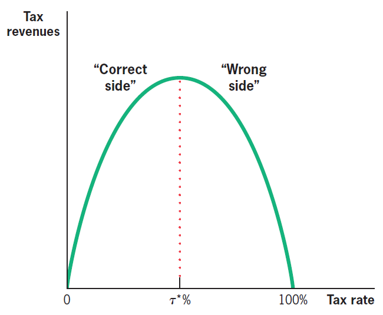
```

Exemplo de **curva de Laffer**: existe uma taxa $\tau^*$ que maximiza a receita, qualquer alíquota maior é uma piora unânime `r Citep(myBib, "gruber")`

---
class: middle
## Curva de Laffer

Um aumento na tributação de renda do trabalho tem dois efeitos contrários: 

1. Para um dado nível de oferta de trabalho, aumenta a arrecadação (o que depende da variação na taxa);
2. Reduz a arrecadação pela diminuição na oferta de trabalho (o que depende do total de taxa)

Como 1. depende da variação na taxa e 2. da tributação total, o primeiro efeito tende a dominar para $\tau$ pequeno e o segundo efeito dominar para $\tau$ alto &mdash; isso que está representado pela **curva de Laffer**

---
class: middle
## Imposto de renda da pessoa física no Brasil

Desde 2009, o IRPF no Brasil tem 5 alíquotas (até 2008 eram apenas 1, 3 e 5): 
1. 0% (isento) até R$1.903
2. 7,5% até R$2.826
3. 15% até R$3.751
4. 22,5% até R$4.664; e
5. 27,5% além disso

A variação nas alíquotas é baixa, fazendo o sistema pouco progressivo; por outro lado, a faixa de isenção é alta (comparativamente), e pouca gente paga IRPF no Brasil (mas pagam imposto sobre a folha e de consumo)

---
class: middle
## Imposto de renda da pessoa física no Brasil

O IRPF também tem várias isenções com despesas médicas e educação que reduzem a carga tributária no topo, diminuindo ainda mais a progressividade

Já vimos que a tributação média vária quase nada nos quintis 1 a 4 de renda, e sobre apenas 4p.p. no último quintil (exatamente o impacto do IRPF)

Também a base tributária brasileira tem vários "buracos", e os ricos fazem **elisão fiscal** disfarçando renda do trabalho como renda de capital ("pejotização")

---
class: middle

```{r, echo=FALSE, out.width = '70%'}
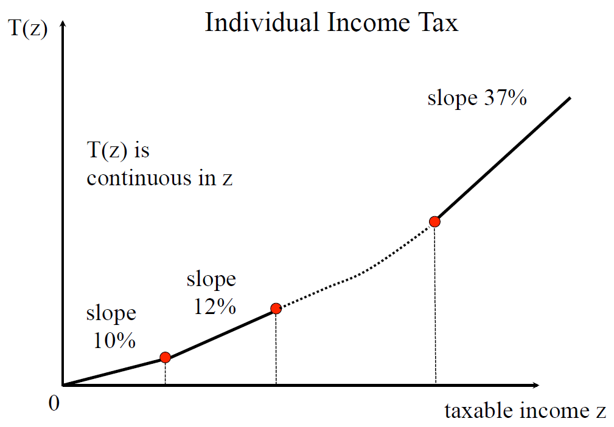
```

A taxação de renda é (geralmente) crescente na renda (*progressiva*), mas de forma contínua: cada nova alíquota se aplica apenas à renda acima do limiar (*piecewise-linear*) (Saez)

---
class: middle

```{r, echo=FALSE, out.width = '70%'}
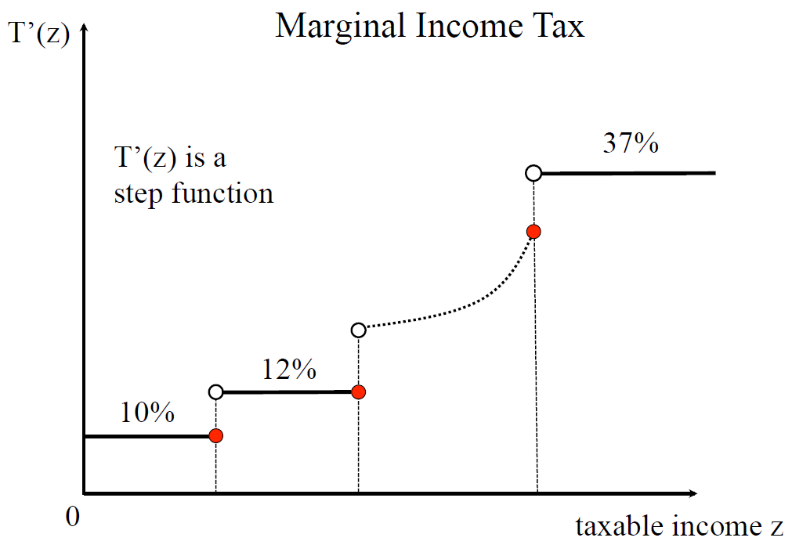
```

Já a *taxa marginal* aumenta de forma discontínua, gerando *kinks* no gráfico de taxação (*step function*) (Saez)

---
class: middle
## Conceitos importantes

Quem tem renda tributável zero recebe transferências $-T(0)$, o que gera uma **taxa de participação** $\tau_p = \left( T(z)- T(0) \right)/z$: indivíduo fica com $1-\tau_p$ quando começa a trabalhar (*margem extensiva*)

A **taxa marginal de imposto** é $T^{\prime}(z)$: indivíduo fica com $1 - T^{\prime}(z)$ para cada `$`1 extra que ganhe (*margem intensiva*)

Assistencialismo e taxação de renda geram o ponto de *break-even* $z^*$ tal que $T(z^*) = 0$

---
class: middle

```{r, echo=FALSE, out.width = '70%'}
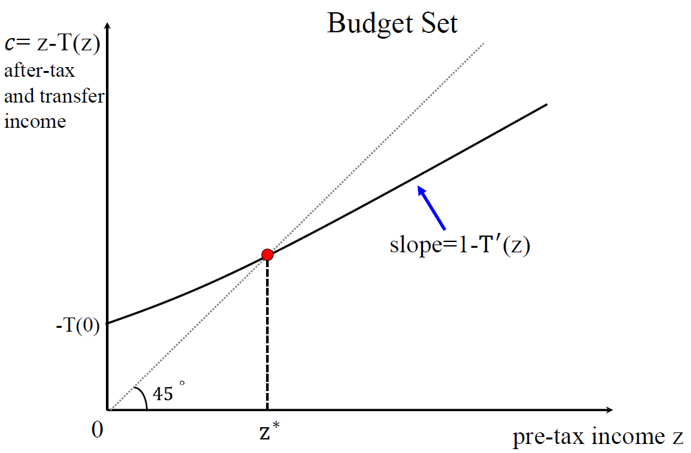
```

Uma função de taxação gera uma **restrição orçamentária**: a relação entre renda tributável e consumo (potencial), nesse exemplo para uma alíquota única $T^{\prime}(z)$ &mdash; o ponto onde a RO intercepta a linha sem taxação (45º) é de *break-even* (Saez)

---
class: middle

```{r, echo=FALSE, out.width = '70%'}
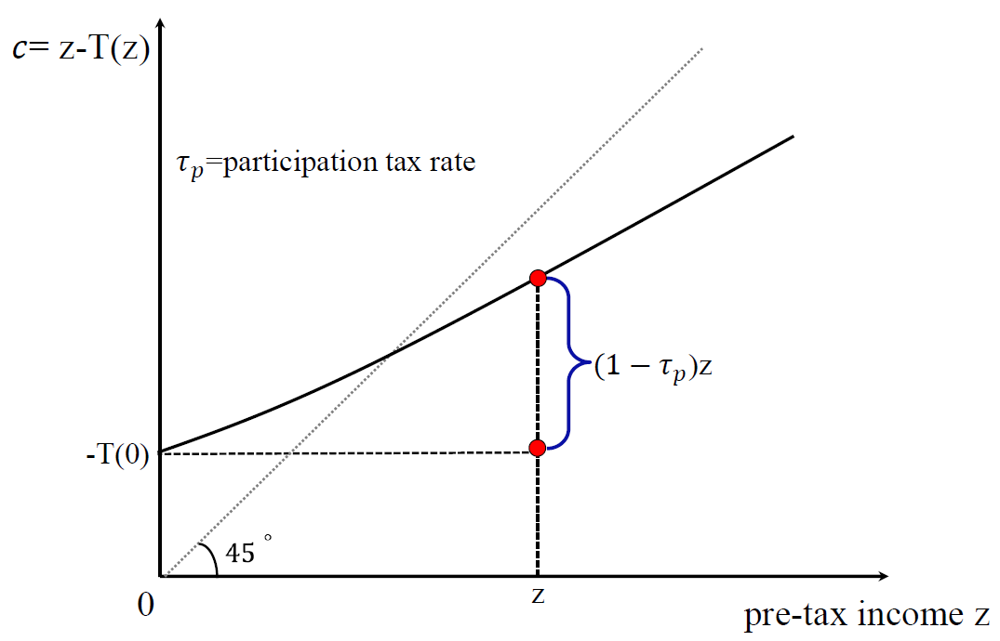
```

A diferença entre o intercepto $-T(0)$ e a renda trabalhando $z - T(z)$ é $(1 - \tau_p)z$, onde $\tau_p$ é a *taxa de participação*: é a renda extra dos indivíduos ao decidir entrar na força de trabalho (Saez)

---
class: middle
## Efeito da taxação na oferta de trabalho

Um tributo sobre renda do trabalho tem dois efeitos:

1. Ele torna o lazer mais barato relativamente ao consumo (*efeito substituição*)
2. Ele torna o trabalhador mais pobre, e mais disposto a trabalhar se o lazer for bem normal (*efeito renda*)

Essa é uma visão idealizada do mercado: na realidade, há vários tipos de **rigidez no mercado de trabalho** &mdash; trabalhadores não podem escolher livremente quantas horas ofertar

---
class: middle

```{r, echo=FALSE, out.width = '80%'}
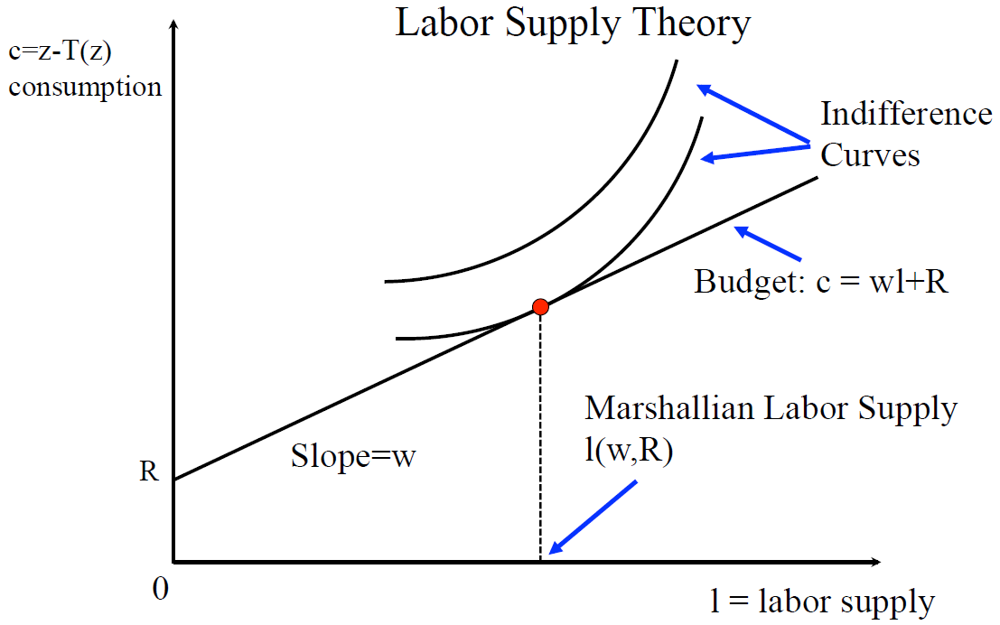
```

Escolha entre oferta de trabalho e consumo gera a **oferta marshalliana** de trabalho &mdash; aqui ainda sem impostos (Saez)

---
class: middle

```{r, echo=FALSE, out.width = '80%'}
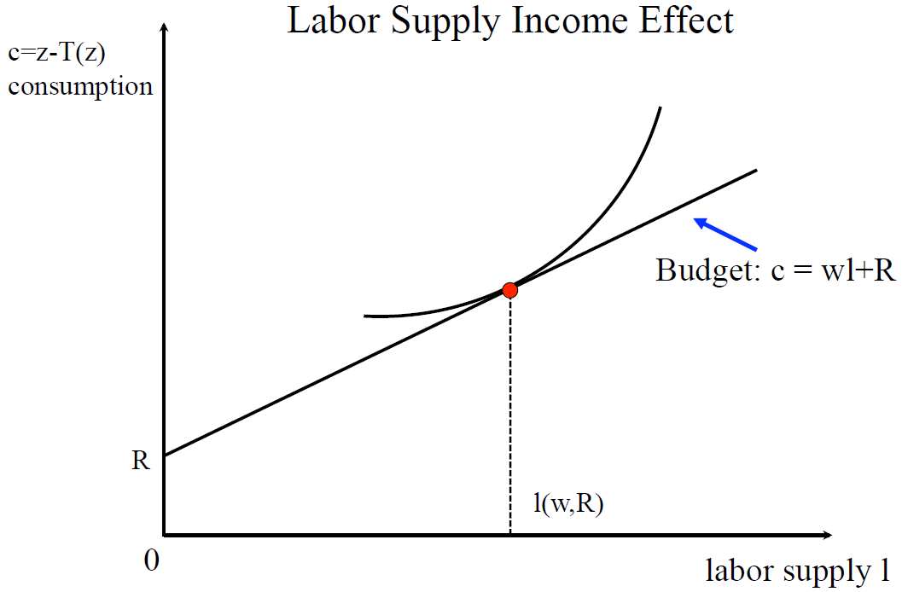
```

*Efeito renda* descola verticalmente a RO e sempre diminui oferta de trabalho se lazer for um bem normal (Saez)

---
class: middle

```{r, echo=FALSE, out.width = '80%'}
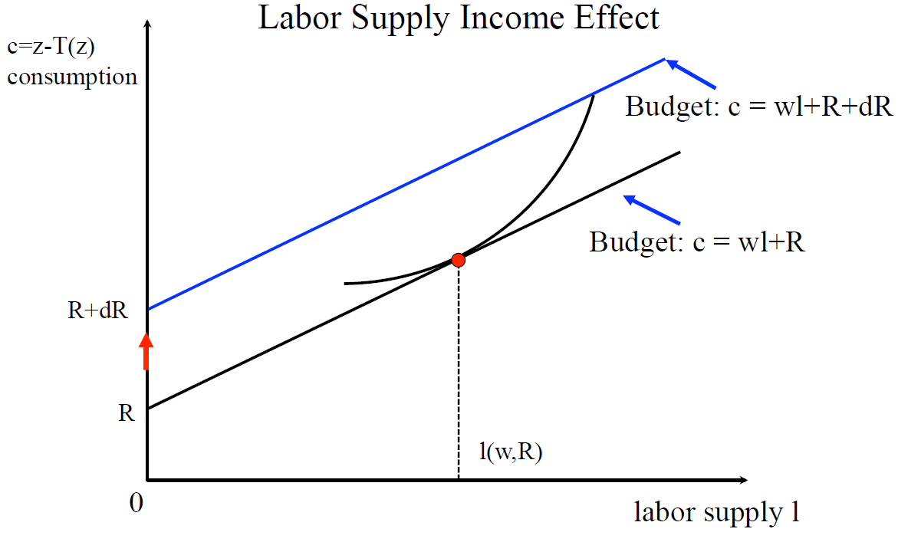
```

*Efeito renda* descola verticalmente a RO e sempre diminui oferta de trabalho se lazer for um bem normal (Saez)

---
class: middle

```{r, echo=FALSE, out.width = '80%'}
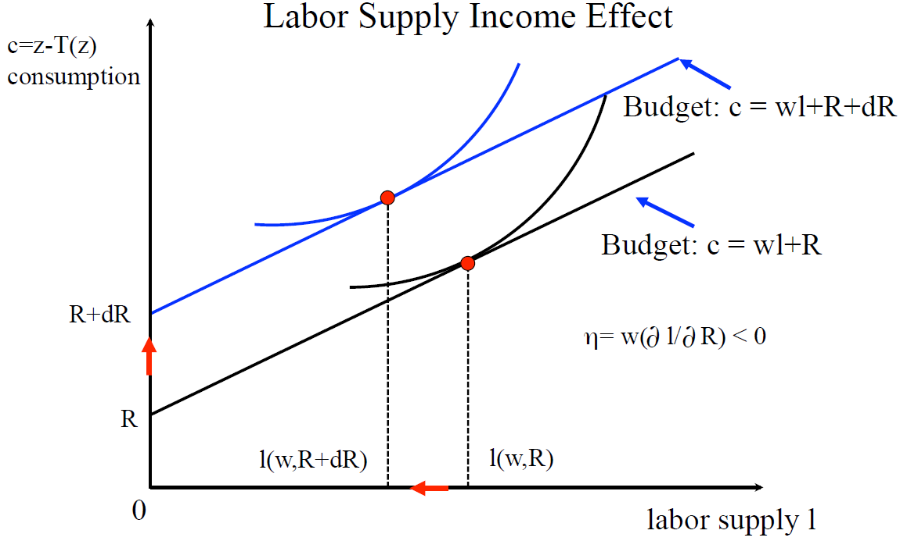
```

*Efeito renda* descola verticalmente a RO e sempre diminui oferta de trabalho se lazer for um bem normal (Saez)

---
class: middle

```{r, echo=FALSE, out.width = '80%'}
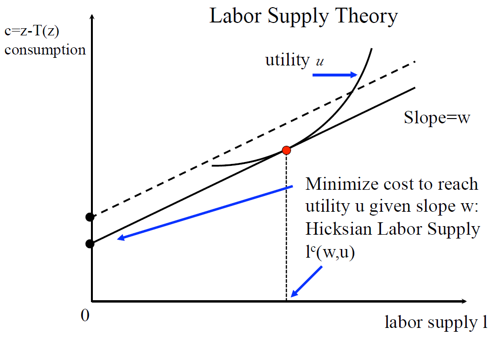
```

A **oferta compensada** de trabalho se obtém pelo *problema dual*: minimizar o custo de se alcançar nível de utilidade $u$ &mdash; no ótimo, a oferta compensada é igual à marshalliana (Saez)

---
class: middle

```{r, echo=FALSE, out.width = '80%'}
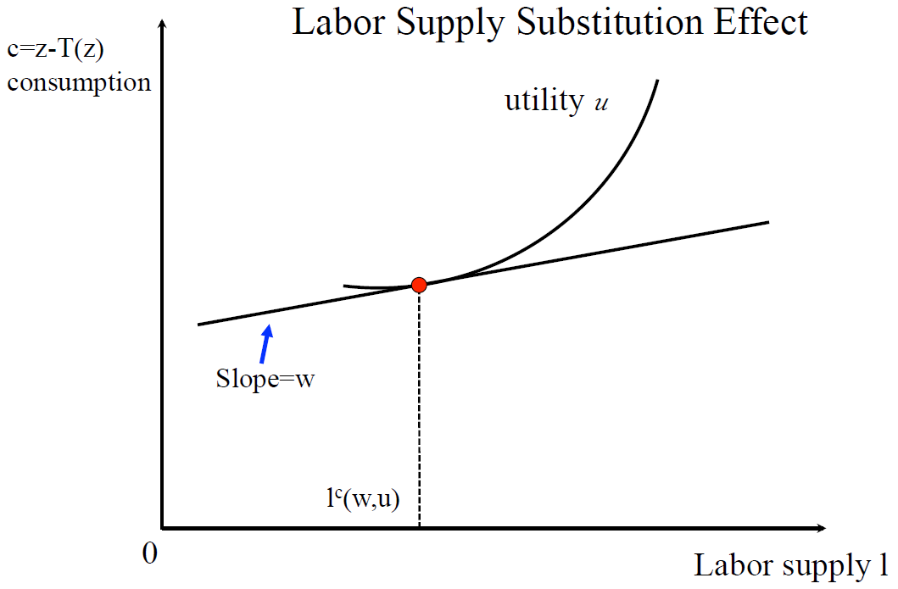
```

O *efeito substituição* se obtém pela *oferta compensada*: analisamos a alteração nos preços relativos mantendo a utilidade constante (Saez)

---
class: middle

```{r, echo=FALSE, out.width = '80%'}
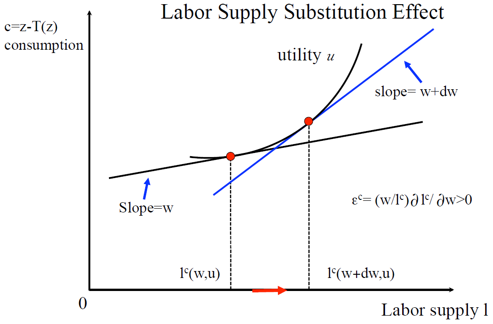
```

O *efeito substituição* se obtém pela *oferta compensada*: analisamos a alteração nos preços relativos mantendo a utilidade constante (Saez)

---
class: middle

```{r, echo=FALSE, out.width = '80%'}
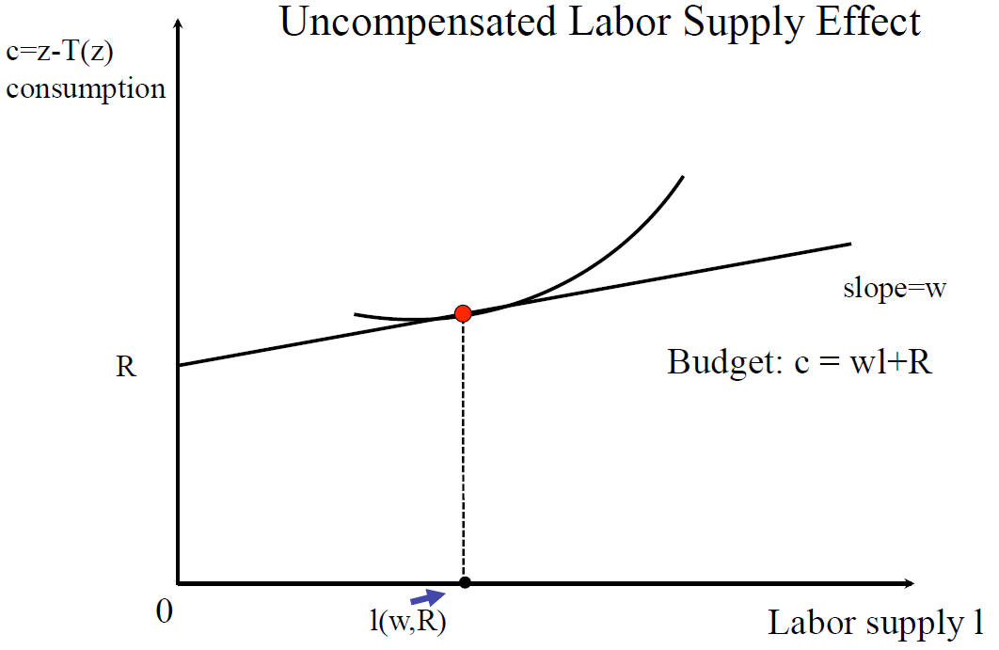
```

O efeito total de uma mudança no salário é a soma do *efeito renda* e *efeito substituição*: o primeiro diminui e o segundo aumenta a oferta de trabalho (Saez)

---
class: middle

```{r, echo=FALSE, out.width = '80%'}
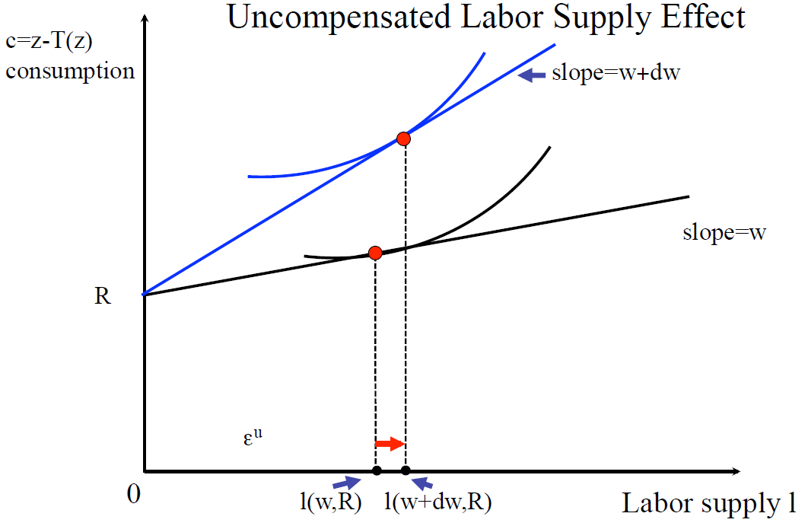
```

O efeito total de uma mudança no salário é a soma do *efeito renda* e *efeito substituição*: o primeiro diminui e o segundo aumenta a oferta de trabalho (Saez)

---
class: middle

```{r, echo=FALSE, out.width = '80%'}
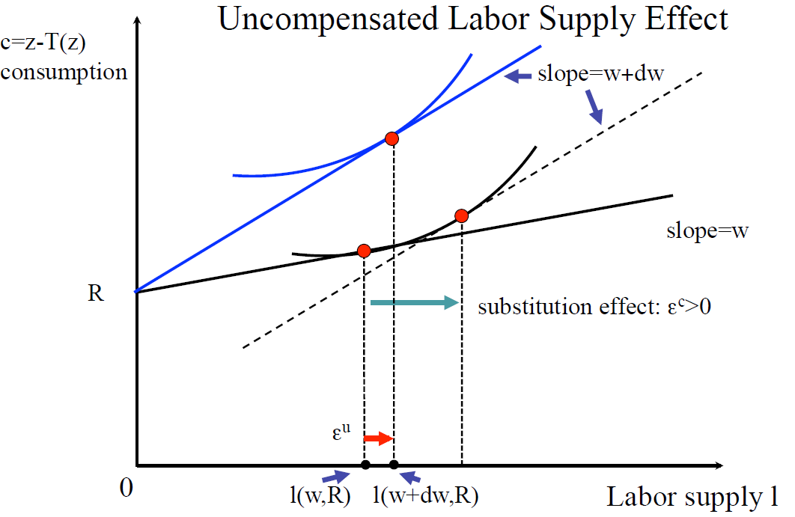
```

O efeito total de uma mudança no salário é a soma do *efeito renda* e *efeito substituição*: o primeiro diminui e o segundo aumenta a oferta de trabalho (Saez)

---
class: middle

```{r, echo=FALSE, out.width = '80%'}
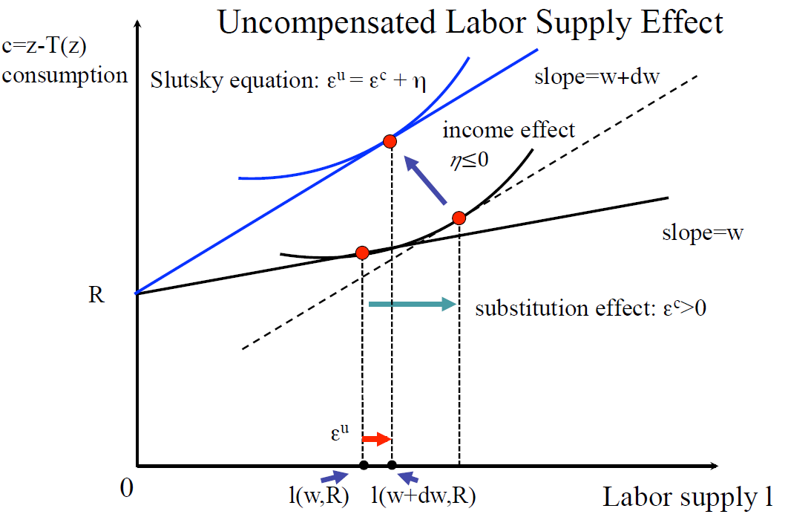
```

O efeito total de uma mudança no salário é a soma do *efeito renda* e *efeito substituição*: o primeiro diminui e o segundo aumenta a oferta de trabalho (Saez)

---
class: middle
## Efeito da taxação na oferta de trabalho

Os efeitos da taxação são:
1. $T^{\prime}(z) > 0$ reduz o salário líquido e reduz oferta de trabalho pelo *efeito substituição*
2. $T(z) > 0$ reduz a renda disponível e *aumenta* a oferta de trabalho pelo *efeito renda*
3. $T(z) < 0$ *aumenta* a renda disponível e reduz a oferta de trabalho pelo *efeito renda*

Impostos têm efeito ambíguo, mas assistência social (com $T^{\prime}(z) > 0$ e $T(z) < 0$ *sempre* diminuem oferta de trabalho)

---
class: middle

```{r, echo=FALSE, out.width = '80%'}
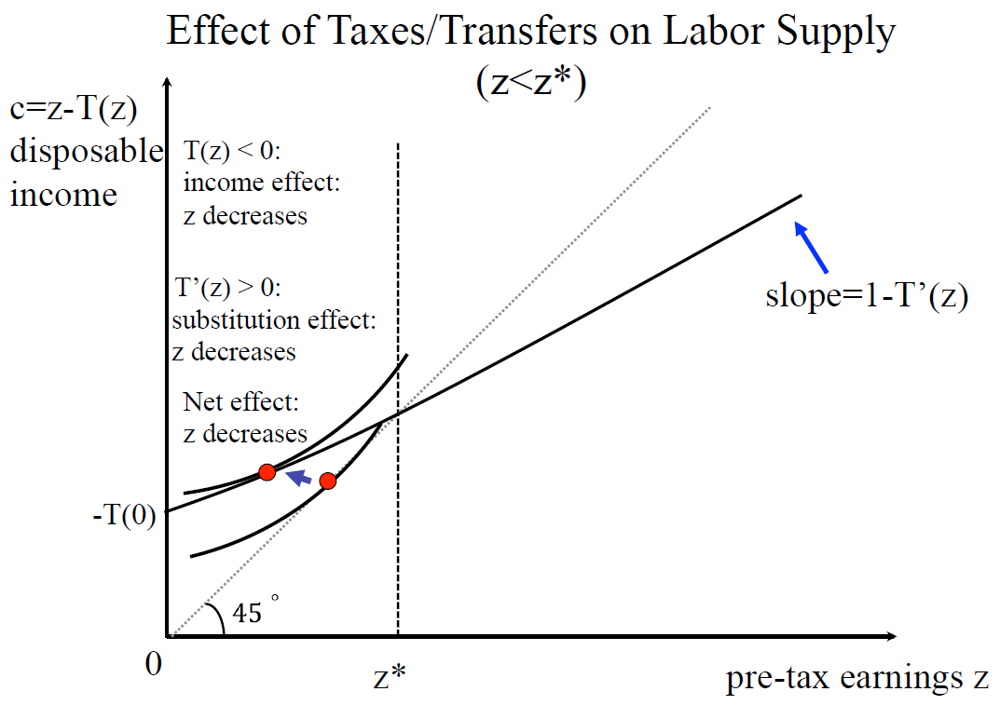
```

Enquanto o efeito da taxação da renda do trabalho é ambíguo, o efeito da assistência social é sempre de diminuir a oferta de trabalho (Saez)

---
class: middle

```{r, echo=FALSE, out.width = '80%'}
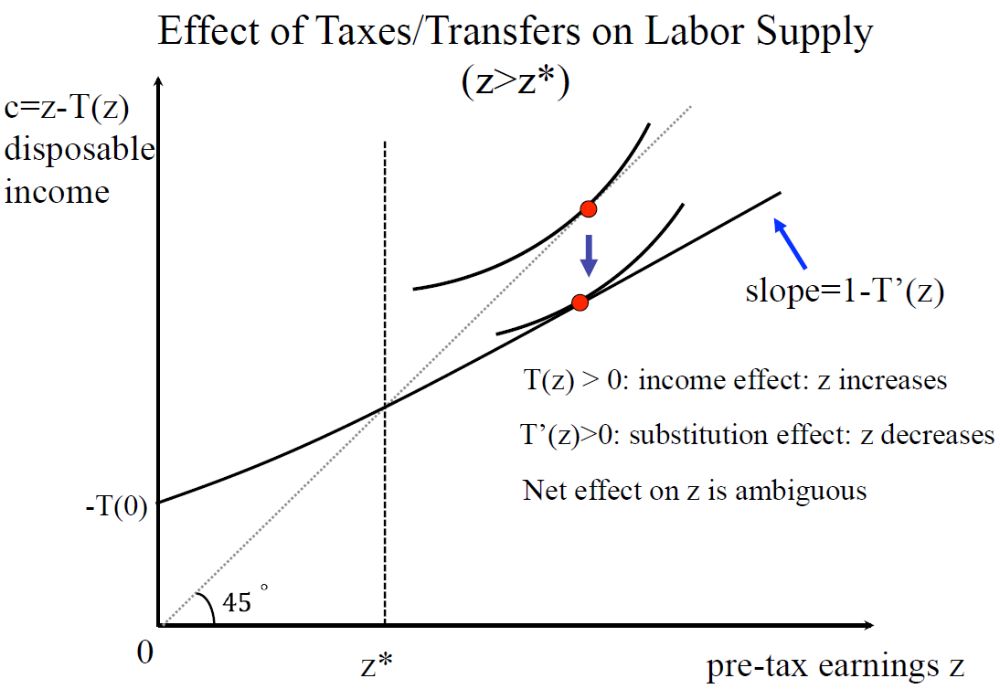
```

Enquanto o efeito da taxação da renda do trabalho é ambíguo, o efeito da assistência social é sempre de diminuir a oferta de trabalho (Saez)

---
class: middle
## Taxação linear rawlsiana

Sem imposto, consumo é igual à renda tributável, $c = z$. Com taxação, $c = z - T(z)$ (consumo $=$ renda tributável $-$ impostos líquidos)

O cálculo mais simples é de uma taxa linear que maximize a receita ("topo" da *curva de Laffer*)

Como $R(\tau^*) = \tau^* Z$, a taxa que maximiza a receita resolve (a CPO) $R^{\prime}(\tau^*) = 0$, e portanto:

$$0 = R^{\prime}(\tau^*) = Z - \tau^* \frac{dZ}{d(1 - \tau^*)}$$

---
class: middle
## Taxação linear rawlsiana

Multiplicando e dividindo por $(1 - \tau^*)$ e dividindo por $Z$, temos: $$1 - \frac{\tau^*}{1 - \tau^*} \frac{1 - \tau^*}{Z}\frac{dZ}{d(1 - \tau^*)} = 0 \Rightarrow \tau^* = \frac{1}{1 + e},$$

onde $e \equiv (1 - \tau^*)/Z \cdot dZ/d(1 - \tau^*)$ é a **elasticidade da renda tributável** em relação à *net-of-tax rate*

A taxa que maximiza a receita é a taxação ótima dada uma *função de bem-estar social Rawliana*: é o máximo de redistribuição que não piora a situação de todos ("lado errado" da curva de Laffer)

---
class: middle
## Alíquota máxima rawlsiana

Na prática, o imposto de renda tem alíquotas progressivas, e uma pergunta importante é qual deveria ser a alíquota máxima

Considere então um limiar $z^*$ e uma alíquota marginal máxima $\tau$ acima desse limiar, e seja $z$ a renda média das pessoas na alíquota superior (no Brasil, quem tem renda acima de R$4.664: 10% mais ricos; nos EUA os 1% mais ricos)

Consideremos novamente a alíquota que maximiza a arrecadação (o que nesse caso é até mais plausível, pois a utilidade marginal da renda para a alíquota máxima deve ser baixa)

---
class: middle
## Alíquota máxima rawlsiana

Então qualquer alteração infinitesimal $d\tau$ (acima de $z^*$) no ótimo deve ter efeito zero sobre arrecadação

Há um **efeito mecânico** (positivo), por arrecadar mais para uma quantidade fixa de trabalho, e um **efeito comportamental** (negativo), pela redução na oferta de trabalho

O efeito mecânico é $dM = \left( z - z^* \right) d\tau$, e o efeito comportamental é:

$$dB = \tau dz = - \tau \frac{dz}{d(1-\tau)}d\tau = -\frac{\tau}{1-\tau}e z \ d\tau$$

---
class: middle

```{r, echo=FALSE, out.width = '80%'}
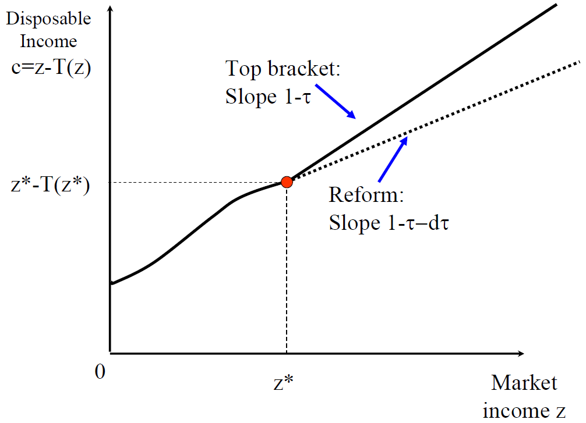
```

Um aumento de $d\tau$ na alíquota para rendas acima de $z^*$ rotaciona para baixo a RO dos trabalhadores `r Citep(myBib, "diamond2011case")`

---
class: middle

```{r, echo=FALSE, out.width = '80%'}
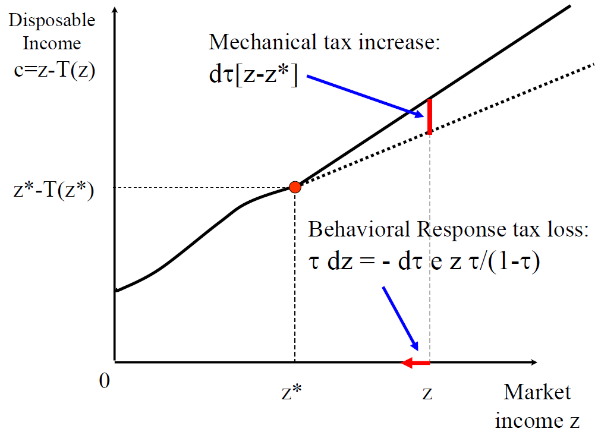
```

Esse aumento tem efeito mecânico de aumento da arrecadação, mas que é contrabalanceado pela redução na renda tributável $z$ `r Citep(myBib, "diamond2011case")`

---
class: middle
## Alíquota máxima rawlsiana

Como o efeito na receita de $d\tau$ tem que ser zero, $dM + dB = 0$, e portanto: $$\left[ \left( z - z^* \right) -\frac{\tau}{1-\tau}e \cdot z \right] d\tau = 0$$

Definindo $a = z/ (z - z^*)$, temos $$\frac{\tau^*}{1 - \tau^*} = \frac{1}{a \cdot e} \Rightarrow \tau^* = \frac{1}{1 + a \cdot e}$$

---
class: middle
## Alíquota máxima rawlsiana

$$\tau^* = \frac{1}{1 + a \cdot e}$$
A alíquota no topo que maximiza a arrecadação é decrescente em $e$ (custo de eficiência) e em $a$, que mede quão "fina" é a cauda da distribuição (se $z^* = 0$, então $a = 1$, e temos a mesma fórmula de antes)

Isso porque um aumento na alíquota máxima apenas arrecada sobre a renda maior que $z^*$, mas reduções na oferta de trabalho reduzem a arrecadação "em todas as alíquotas"

$a$ é fácil de estimar empiricamente (nos EUA $\sim 1.5$): se $e = 0.1$, $\tau^* = 87\%$ (!), se $e = 0.3$, $\tau^*$ é ainda altos $68\%$

---
class: middle
## Alíquota ótima

No caso mais geral, em que a sociedade seja *utilitarista* mas não rawlsiana, a taxação marginal ótima se torna: $$T^{\prime}(z)^* = \frac{1 - G(z)}{1 - G(z) + a(z) \cdot e(z)}$$

A grande diferença aqui é que temos o termo $G(z)$, que é o **peso na função de bem-estar social** de indivíduos com renda $z$, ou seja, a importância que a socidedade dá ao seu bem-estar

É plausível que a sociedade dê menos valor à utilidade dos mais ricos, se a sociedade tiver preferências sociais redistributivas ("gostar de igualdade")

Mas mesmo que não seja o caso, $G(z)$ tenderá a ser decrescente pela *utilidade marginal decrescente*: no limite, quando $z \rightarrow \infty$, $u^{\prime}(z) = 0 \Rightarrow G(z) = 0$ e a alíquota ótima utilitarista maximiza a receita

---
class: middle
## Elasticidade da oferta de trabalho

Como vimos, a taxação ótima depende fundamentalmente do valor da **elasticidade da oferta de trabalho** (pergunta empírica!)

Décadas de literatura investigam isso, em geral as conclusões para os EUA são `r Citep(myBib, "keane2011labor")`:

1. A elasticidade para *primary earners* é muito pequena: $\sim 0.1$, isto é, uma redução de $10\%$ no salário após-impostos diminui as horas ofertadas em $1\%$
2. A elasticidade para *secondary earners* é muito maior, $0.5-1.0$, principalmente vindo de redução na **participação na força de trabalho**

---
class: middle
## Elasticidade da oferta de trabalho

A elasticidade depende das alternativas para o trabalho formal: nos EUA são muito baixas para os *primary earners*, que precisam trabalhar para sustentar a família

Em países em desenvolvimento, com possibilidade de atuação no mercado informal não tributado, ela deve ser maior

A elasticidade para *secondary earners* é alta pois eles (geralmente elas) têm uma alternativa clara (e não taxada!) para o trabalho formal: cuidar das crianças &mdash; provavelmente com creche pública essa elasticidade seja menor

---
class: middle
## Renda tributável

O principal problema com medir o efeito da taxação pelas horas trabalhadas é que ignora várias outras dimensões pelas quais ela pode afetar a economia

Trabalhadores podem responder a uma maior taxação se esforçando menos, se educando menos, tomando menos riscos, buscando menos promoções, etc

Economistas abordaram esse problema estudando a **elasticidade da renda tributável**: a redução proporcional na renda pré-impostos dado um aumento proporcional na tributação

---
class: middle
## Renda tributável

Potencial problema: mudanças na renda tributável podem se dar por aumento da evasão fiscal, o que intuitivamente não deveria ser levado em conta

Feldstein (1995, 1999) argumentou que evasão fiscal gera custos sociais (horas advocatícias, criar bancos em paraísos fiscais, contadores) que no equilíbrio devem se igualar com o benefício marginal da evasão

Assim, se $1 de taxação reduz 1 hora de trabalho do indivíduo ou faz ele usar 1 hora mais de trabalho disperdiçado de contador para evadir impostos, o custo social é igual

---
class: middle
## Renda tributável

Esse raciocínio, somado a estimativas iniciais de que a elasticidade da renda tributável seria considerável (~1), foi influente por sugerir que os EUA estariam no "lado errado" da curva de Laffer

Estimativas mais recentes e confiáveis colocam a elasticidade entre 0,1-0,5 (digamos, 0,3): maior que a da oferta de trabalho, mas não enorme `r Citep(myBib, "saez2012elasticity")`

Literatura também apontou que se o custo esperado da evasão for transferências a outros agentes (esp. multas ao governo), isso não entra no cálculo da taxação ótima

---
class: middle
## Taxação dos mais ricos

Um dos pontos centrais do debate de taxação é quanto taxar os mais ricos: como o consumo deles é basicamente saciado, a utilidade marginal deve ser próxima de zero, e é razoável taxar até o topo da curva de Laffer

O argumento então se divide entre aqueles que defendem um custo econômico alto (*supply-side economics* ou *trickle-down economics*)...

... e quem acredita que o aumento da proporção do 1% mais rico na renda veio às custas dos outros 99% (**rent-seeking**) &mdash; e que, portanto, uma redução na alíquota máxima apenas aumentaria essa extração de renda

---
class: middle

```{r, echo=FALSE, out.width = '85%'}
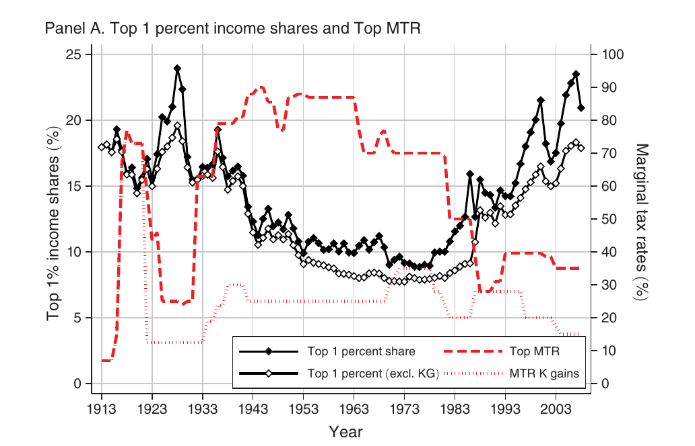
```

A redução drástica na taxa marginal máxima de imposto nos EUA no "Reagonomics" foi acompanhada de crescimento expressivo na proporção do 1% mais rico na renda... `r Citep(myBib, "piketty2014optimal")`

---
class: middle

```{r, echo=FALSE, out.width = '85%'}
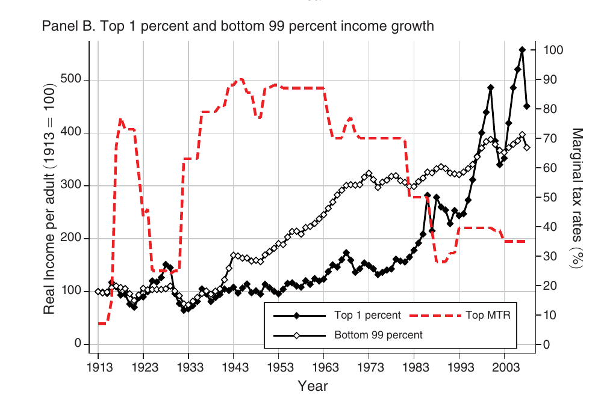
```

... mas não parece ter tido nenhum efeito no crescimento da renda dos outros 99% (se algo, o efeito é negativo): ou seja, há pouco efeito econômico real de maior taxação `r Citep(myBib, "piketty2014optimal")` 

---
class: middle

```{r, echo=FALSE, out.width = '80%'}
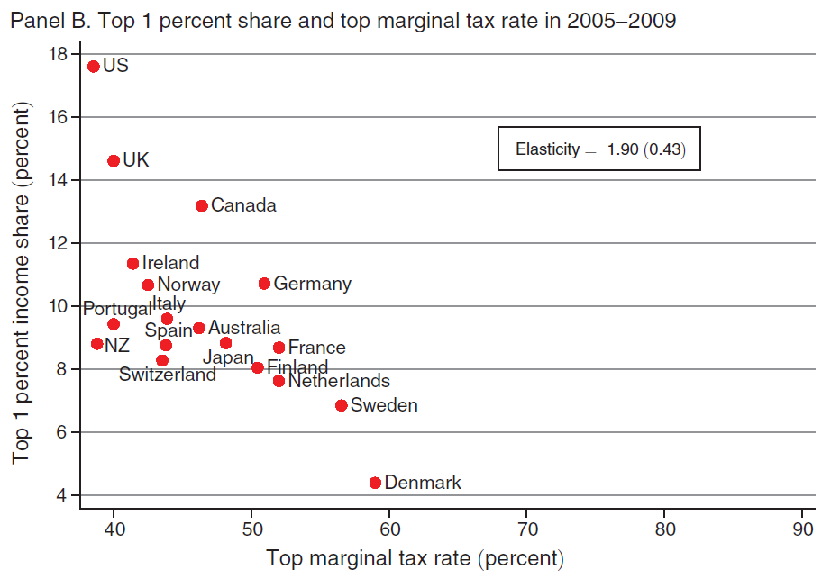
```

Em evidência *cross-country* vemos o mesmo: maior taxação no topo é fortemente (negativamente) correlacionada com menor proporção dos 1% mais ricos na renda... `r Citep(myBib, "piketty2014optimal")` 

---
class: middle

```{r, echo=FALSE, out.width = '80%'}
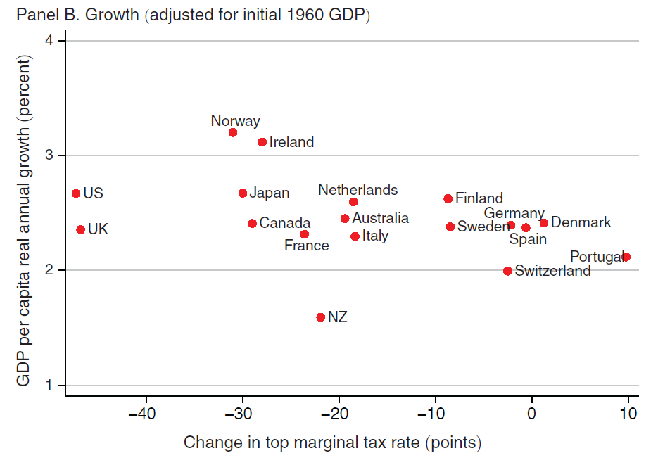
```

... e tem zero correlação com crescimento do PIB *per capita* `r Citep(myBib, "piketty2014optimal")` 

---
class: middle

```{r, echo=FALSE, out.width = '80%'}
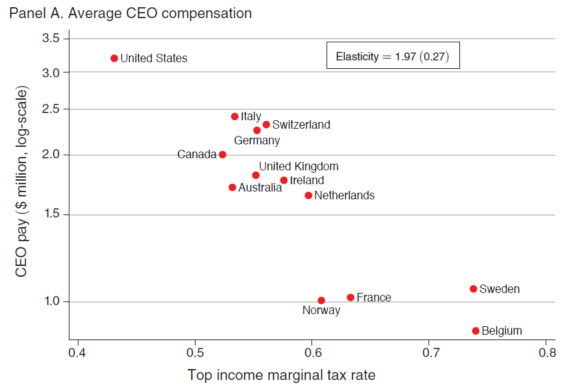
```

Maior taxação no topo está associada a menor salário dos CEOs *antes do imposto*: evidência de que taxação diminui o **rent-seeking** `r Citep(myBib, "piketty2014optimal")` 

---
class: middle
## Taxação no topo e migração

Um efeito potencial da taxação, especialmente no topo, é a emigração: se uma alíquota máxima elevada "expulsar" os maiores inventores e agentes mais produtivos, o custo econômico pode ser alto

A elasticidade da emigração em relação à taxação é bastante alta para jogadores de futebol europeus (Kleven et al 2013)

Para inventores *super-stars*, ela é alta para estrangeiros, mas baixa para os nacionais (Akcigit et al 2016)

Como a emigração é de **soma zero**, há necessidade de **coordenação tributária** para evitar políticas *beggar-thy-neighbor*

---
class: middle

```{r, echo=FALSE, out.width = '75%'}
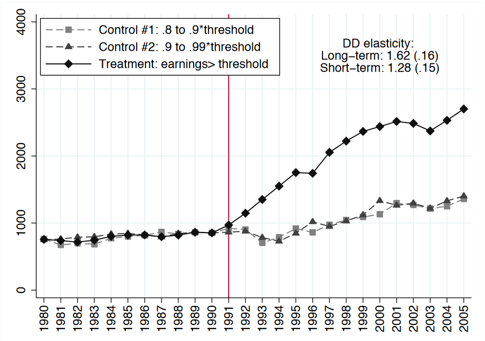
```

Redução por 3 anos dos impostos para imigrantes altamente qualificados em 1991 dobrou o seu número na Dinamarca em comparação com controles `r Citep(myBib, "kleven2014migration")` 

---
class:middle
# Referências
<small>
```{r refs, echo=FALSE, results="asis"}
PrintBibliography(myBib)
```
</small>
