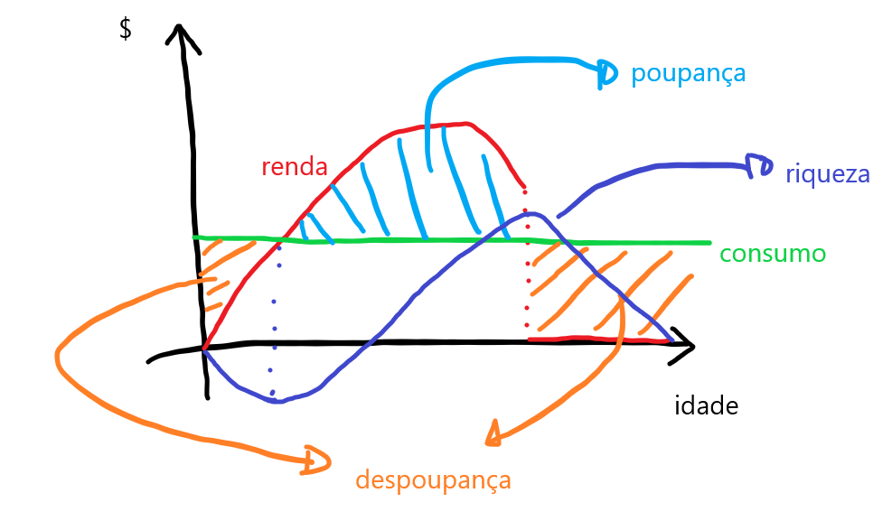
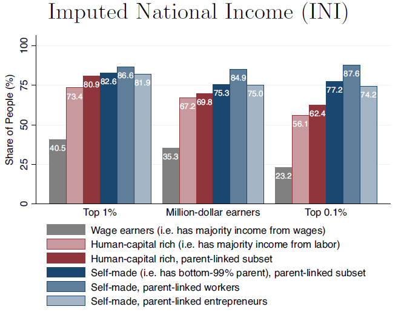
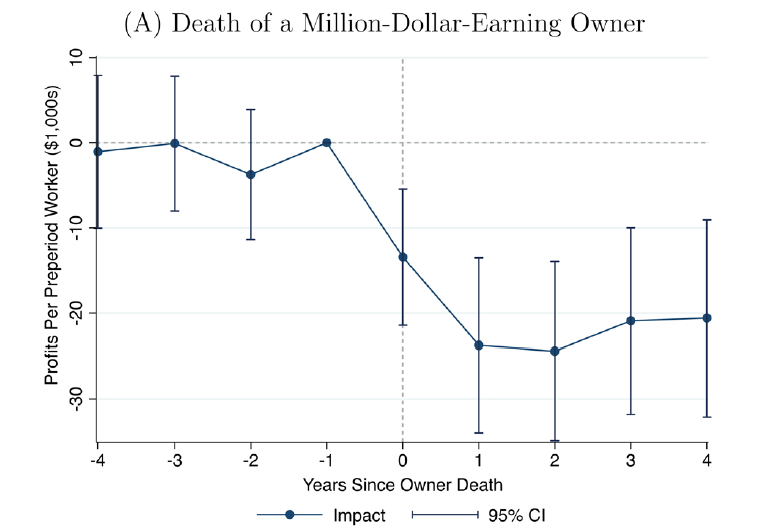

class: inverse, middle, center

```{r, load_refs, include=FALSE, cache=FALSE}
library(RefManageR)
BibOptions(check.entries = FALSE,
           bib.style = "alphabetic",
           cite.style = "alphabetic",
           style = "markdown",
           hyperlink = FALSE,
           dashed = FALSE)
myBib <- ReadBib("./esp_bib.bib", check = FALSE)
```

# Taxação de poupança

---
class: middle

```{r, echo=FALSE, out.width = '50%', fig.align='center'}
knitr::include_graphics("figs/musk.jpg")
```

@4TaxFairness

---
class: middle
## Desigualdade de renda do capital

A principal forma de redução das desigualdades socioeconômicas é o sistema de tributação progressiva da renda do trabalho e transferências, já que renda do trabalho responde por ao redor de 3/4 do produto nacional

Mas o 1% mais rico, e especialmente o 0,1% mais rico, é muito pouco afetado pela tributação da renda do trabalho, já que a maior parte da renda deles vêm do capital (ou pelo menos é facilmente transformada em renda do capital)

Como vimos, pelo **princípio da focalização**, se a única heterogeneidade é *habilidade*, devemos taxar apenas o trabalho &mdash; mas se poupança ou taxa de retorno é desigual, então a taxação do capital se torna importante

---
class: middle

```{r, echo=FALSE, out.width = '60%'}
knitr::include_graphics("figs/eae0310-12-3.png")
```

Em 1850, a participação do capital na renda nacional era de quase 50%, mas tem caído desde então, e hoje responde por apenas 25-30% do PIB, sendo o complementar a participação do trabalho `r Citep(myBib, "piketty2014capital")`

---
class: middle

```{r, echo=FALSE, out.width = '70%'}
knitr::include_graphics("figs/eae0310-12-5.png")
```

A riqueza brasileira é distribuída de forma extremamente desigual (mesmo na comparação internacional): os 10% mais ricos têm por volta de 3/4 da riqueza brasileira, e o 1% mais rico metade &mdash; como é comum internacionalmente, os 50% mais pobres possuem riqueza zero [(WID)](https://wid.world/country/brazil/)

---
class: middle

```{r, echo=FALSE, out.width = '85%'}
knitr::include_graphics("figs/eae0310-12-1.jpg")
```

O Brasil está entre apenas 6 países no mundo em que os 80% mais pobres têm menos riqueza que o 0,001% mais rico (1/100.000), ou seja, 2.000 pessoas (o tamanho do corpo discente da FEA) têm mais riqueza que 160 milhões de brasileiros juntos [(WID e @rubenbmathisen)](https://twitter.com/rubenbmathisen/status/1508148771225485316)

---
class: middle

```{r, echo=FALSE, out.width = '60%'}
knitr::include_graphics("figs/eae0310-12-6.png")
```

Nos EUA a desigualde de riqueza é apenas um pouco melhor: os 5% mais ricos detêm 2/3 da riqueza, e o 1% mais rico 40% [(Inequality.org)](https://inequality.org/facts/wealth-inequality/)

---
class: middle

```{r, echo=FALSE, out.width = '80%'}
knitr::include_graphics("figs/eae0310-12-7.png")
```

Nos EUA, a riqueza dos 90% cresceu até a década de 80 com incentivos para a casa própria, mas caiu (relativamente) desde então, por causa da desigualdade de renda e de poupança, além de reduções nos impostos &mdash; e esse movimento foi espelhado por um crescimento de 100% na proporção do 0.1% mais rico, que tem hoje 20% da riqueza daquele país `r Citep(myBib, "piketty2018distributional")`

---
class: middle

```{r, echo=FALSE, out.width = '75%'}
knitr::include_graphics("figs/eae0310-12-8.png")
```

Outra forma de ver a desigualdade de riqueza é a lista dos 400 mais ricos da Forbes: desde 1982 a riqueza deles triplicou, ultrapassando 3% da riqueza total americana &mdash; 3% da riqueza para (quase) 1-em-1-milhão (Saez)


---
class: middle

```{r, echo=FALSE, out.width = '50%'}
knitr::include_graphics("figs/eae0310-13-10.png")
knitr::include_graphics("figs/eae0310-13-10b.png")
```

Existe também uma **desigualdade racial de riqueza**: nos EUA, em 1860, na Emancipation, a riqueza dos brancos era 56x maior que a dos negros: houve uma melhora acentuada nas décadas seguintes, diminuindo a velocidade no século XX &mdash; até que desde os anos 2000 essa desigualdade *aumentou*, voltando ao nível do Civil Rights Movement na década de 60 (5-7x maior) `r Citep(myBib, "derenoncourt2022wealth")`

---
class: middle

```{r, echo=FALSE, out.width = '70%'}

```

Enquanto apenas 10% da renda para 90% da população é advinda do capital, 60% da renda dos 1% mais ricos e 70% dos 0,1% vêm desse fator de produção (ou pelo menos é reportada como): taxar trabalho tem capacidade limitada de redistribuição nesses grupos `r Citep(myBib, "piketty2018distributional")`

---
class: middle
## Dinâmica da riqueza

Se a riqueza em $t$ é $W_t$ e a taxa de retorno $r_t$, então a renda do capital é $r_t W_{t-1}$ e: $$W_t = (1 + r_t) W_{t-1} + S_t + I_t$$

A riqueza em $t$ vai ser a riqueza em $t-1$ mais a renda do capital, a poupança $S_t$ e eventual herança $I_t$: pessoas têm riqueza desigual por causa de:

1. Idades diferentes (**riqueza do ciclo-de-vida**)
2. Diferenças na quantidade poupada no passado $S_t$, potencialmente por renda do trabalho $Y_t$ diferente, já que $S_t = Y_t - C_t$
3. Diferenças em heranças recebidas $I_t$ (**riqueza herdada**)
4. Diferentes taxas de retorno $r_t$

---
class: middle
## Formas de taxação do capital

Há várias formas de taxação do capital:

(i) **Imposto de renda corporativa:** no Brasil, há o IRPJ de 15% sobre o lucro real (25% acima de 240 mil/ano) e Contribuição Social sobre Lucro Líquido (CSLL) de 9% (20% para instituições financeiras)(*)

(ii) **Imposto de renda do capital na pessoa física:** no Brasil, dividendos são *rendimentos isentos*, e ganhos de capital taxados em 15% (até 5mi, subindo progressivamente até 22,5% acima de 30mi), mas dedutíveis do IRPJ e CSLL


(*) Mas não é bem assim, pois tem o Simples (taxas progressivas partindo de 4-6% do faturamento, para até 4,8mi/ano) e também lucro presumido (faturamento até 78mi/ano)

---
class: middle
## Formas de taxação do capital

(iii) **Taxação de heranças:** nos EUA, há taxação de 40% em heranças acima $11mi, no Brasil o imposto é estadual com alíquota máxima de 8%

(iv) **Imposto sobre propriedade:** Aqui entra o IPVA, imposto estadual com alíquota (SP) de 4% do carro (2% outros) e IPTU, que é um imposto municipal que em São Paulo varia de 0-1,6% do valor do imóvel (alíquota progressiva)

(v) **Imposto sobre riqueza:** cobrado sobre o patrimônio líquido total das pessoas; existe em apenas alguns países (no Brasil não)

Este final da disciplina vamos focar inteiramente na taxação do capital: nessa semana vamos estudar (ii), na semana seguinte (iii)-(v), e no último tópico (i)


---
class: middle
## Modelo de ciclo-da-vida

Indivíduos vivem 2 períodos, trabalham $l$ no primeiro período e nada no segundo (aposentadoria) e consomem $c_1$ no primeiro e $c_2$ no segundo: $$U(c_1, c_2, l) = u(c_1, l) + \beta u(c_2)$$

Então a poupança (sempre no período 1) é $s = wl - c_1$, e o consumo em $t=2$ será $c_2 = (1 + r)s$, onde $rs$ é a renda do capital

Isso gera uma **restrição orçamentária intertemporal**: $$c_1 + \frac{c_2}{1 + r} = wl$$

---
class: middle
## Modelo de ciclo-da-vida

Substituindo na função de utilidade, os indivíduos resolvem: $$\max_{l, c_2} u \left( wl - \frac{c_2}{1 + r}, l \right) + \beta u(c_2)$$

As condições de primeira ordem para oferta de trabalho e poupança, resp., então são:

$$[l]: w\frac{\partial u}{\partial c_1} + \frac{\partial u}{\partial l} = 0$$
$$[c_2]: - \frac{1}{1 + r} \frac{\partial u}{\partial c_1} + \beta \frac{\partial u}{\partial c_2} = 0 \Rightarrow \frac{\partial u}{\partial c_1} = \beta (1 + r) \frac{\partial u}{\partial c_2}$$

---
class: middle
## Hipótese do ciclo-da-vida

Se $\beta = 1/(1 + r)$ (o que vai ocorrer em equilíbrio em mercados completos e sem fricções), então os indivíduos *suavizam o consumo perfeitamente* ao longo do ciclo de vida (**life-cycle hypothesis**)

Essa é uma hipótese: (i) desmentida nos dados; e (ii) bastante importante em macro, pois é condição necessária para teorias importantes, como a *equivalência ricardiana*

No mundo real, quando 50% da riqueza está com o 1% mais rico, é difícil acreditar que bilionários estão poupando e investindo para suavizar consumo &mdash; mas vale provavelmente de forma aproximada para os 90% "da base"

---
class: middle

```{r, echo=FALSE, out.width = '90%', fig.align='center'}

```

A suavização de consumo com um perfil hiperbólico de renda ao longo da vida implica um **ciclo-da-vida** na acumulação de riqueza: com poupança positiva na idade ativa e acúmulo de riqueza, que depois é gasta inteiramente na aposentadoria

---
class: middle

```{r, echo=FALSE, fig.show="hold", out.width="50%"}
knitr::include_graphics("figs/eae0310-12-14.png")
knitr::include_graphics("figs/eae0310-12-14b.png")
```

Na Dinamarca, observamos um perfil de riqueza mais ou menos compatível com a **hipótese do ciclo-da-vida** na população com riqueza positiva em geral (a), com riqueza crescendo nos anos ativos e caindo na aposentadoria (mas menos do que deveria) &mdash; mas o mesmo movimento não ocorre entre os mais ricos, cuja riqueza cresce até o fim da vida (b) `r Citep(myBib, "jakobsen2020wealth")` 

---
class: middle

```{r, echo=FALSE, out.width = '80%'}
knitr::include_graphics("figs/eae0310-12-13.png")
```

Nos Estados Unidos, a riqueza dos mais ricos também cresce de forma contínua até a morte, contrariando a hipótese do ciclo-da-vida, que implicaria uma queda na riqueza na aposentadoria (**suavização do consumo**) &mdash; esse comportamento condiz mais com riqueza na função de utilidade `r Citep(myBib, "kopczuk2007bequest")`

---
class: middle

```{r, echo=FALSE, out.width = '95%'}
knitr::include_graphics("figs/feapub8.png")
```

Taxa de poupança por classe de riqueza (Zucman)


---
class: middle
## Equivalência entre taxação de consumo e renda

Considere agora um imposto sobre consumo $\tau_C$. A restrição orçamentária se torna $(1 + \tau_C) \left( c_1 + \frac{c_2}{1 + r} \right) = wl$

Se ao invés disso aplicarmos um imposto sobre a renda (do trabalho) $\tau_L$, a RO agora é $c_1 + \frac{c_2}{1 + r} = (1 - \tau_L)wl$

Se $(1 + \tau_C) = 1/(1 - \tau_L)$, os impostos são equivalentes: já vimos que essa equivalência vale estaticamente &mdash; esse é um exemplo simplificado da equivalência de impostos (lineares) sobre a renda e sobre o consumo **e heranças** ao longo do ciclo-da-vida (em steady-state)

---
class: middle
## Taxação no modelo de ciclo-da-vida

$$\max_{l, c_2} u \left( (1 - \tau_L)wl - \frac{c_2}{1 + r}, l \right) + \beta u(c_2)$$

$$[l]: (1 - \tau_L)w\frac{\partial u}{\partial c_1} = - \frac{\partial u}{\partial l}$$
$$[c_2]: \frac{\partial u}{\partial c_1} = \beta (1 + r) \frac{\partial u}{\partial c_2}$$
Considere um **imposto de renda**: a renda do trabalho diminui, há um *efeito renda*, além disso o preço relativo do trabalho e do lazer se altera (*efeito substituição*) &mdash; mas não há distorção da *escolha de consumo intertemporal* (apenas efeito renda)

---
class: middle
## Taxação no modelo de ciclo-da-vida

Com um imposto sobre capital $\tau_K$, $c_2 = (1 + r(1 - \tau_K))s$ e a RO se torna: $c_1 + \frac{c_2}{1 + r(1 - \tau_K)} = wl$

$$\max_{l, c_2} u \left( wl - \frac{c_2}{1 + r(1 - \tau_K)}, l \right) + \beta u(c_2)$$

$$[l]: w\frac{\partial u}{\partial c_1} = - \frac{\partial u}{\partial l}$$
$$[c_2]: \frac{\partial u}{\partial c_1} = \beta (1 + r(1 - \tau_K)) \frac{\partial u}{\partial c_2}$$
Aqui é oposto, o preço relativo do trabalho e lazer *não* se altera, mas do consumo intertemporal sim

---
class: middle
## Taxação no modelo de ciclo da vida

Assim como na taxação do trabalho, a **taxação de capital** (poupança) envolve efeito renda e substituição:

1. *Efeito substituição:* o imposto torna o consumo no período 2 mais caro relativo ao consumo no período 1: poupança cai
2. *Efeito renda:* o imposto torna os indivíduos mais pobres, que consomem menos em $t=1$ *e* em $t=2$, mas como $s = wl - c_1$, $c_1$ menor implica que a poupança sobe

Assim, o efeito *sobre a poupança* é teoricamente **ambíguo**! Na verdade, se a utilidade é log no consumo, os dois efeitos se anulam e o impacto do imposto na poupança vai ser exatamente zero

---
class: middle

```{r, echo=FALSE, out.width = '74%'}
knitr::include_graphics("figs/eae0310-12-10.png")
```

Agentes escolhem entre o consumo nos períodos 1 e 2, com restrição orçamentária de inclinação $- (1 + r)$, abscissa em zero $w$ (supondo $l=1$), e $w - c_1 = s$ é a quantidade poupada (Saez)

---
class: middle

```{r, echo=FALSE, out.width = '76%'}

```

Um tributo sobre o retorno do capital deixa o consumo no período 2 mais caro: **rotaciona** a RO para inclinação $- (1 + r(1 - \tau_K))$ (Saez)

---
class: middle

```{r, echo=FALSE, out.width = '80%'}

```

O **efeito substituição**, mantendo a utilidade constante, aumenta $c_1$, diminui $s$ e $c_2$, já o **efeito renda** diminui $c_2$ e $c_1$, mas (por causa disso) aumenta $s$ &mdash; aqui, o efeito renda é mais forte, e a taxação de capital aumenta a poupança (Saez)

---
class: middle
## Efeito da taxação na poupança

Do mesmo modo que na taxação de trabalho, a resposta da teoria é ambígua: o efeito da taxação de capital na poupança é *uma pergunta empírica*!

Infelizmente, ao contrário da aula anterior, a evidência nesse caso é muito menos confiável: não há unanimidade entre economistas nem se tal taxação diminui, não afeta, *ou até aumenta* a poupança

Estimar *efeito comportamental* na poupança é muito mais difícil que na oferta de trabalho: há a dificuldade de identificar efeito de composição da poupança, além de efeitos dinâmicos e menor observabilidade

---
class: middle
## Imposto ótimo no modelo de ciclo da vida

Imagine que o governo pode taxar renda progressivamente com um tributo $T(z)$ e taxar o capital a uma taxa $\tau_K$, e o único motivo de desigualdade de riqueza é diferenças na poupança pela desigualdade de renda (**motivo 2**)

Então pelo **princípio da focalização**, a taxação do capital deveria ser zero: o governo pode atingir os seus objetivos de redistribuição puramente pela taxação de renda do trabalho

Nesse caso, taxar o capital distorceria a decisão de poupança sem necessidade, já que redistribuir renda também resolveria a desigualdade de riqueza

---
class: middle
## Imposto ótimo no modelo de ciclo da vida

Mas desigualdade em renda do capital também vem de diferenças em heranças, paciência e taxas de retorno: taxação da renda do trabalho não é suficiente para redistribuir riqueza, e há espaço para taxação de capital

Frequentemente é difícil distinguir renda do trabalho e do capital (p. ex., o dono da firma que também é CEO, "pejotização") &mdash; taxar capital é importante para aumentar a base tributária e reduzir elisão/evasão fiscal

Taxas de retorno variam bastante entre indivíduos e ao longo do tempo, e são correlacionadas com renda: subir do 10º ao 90º percentil de patrimônio líquido aumenta taxa de retorno dos investimentos em 10p.p. `r Citep(myBib, "fagereng2020heterogeneity")`

---
class: middle

```{r, echo=FALSE, out.width = '70%'}

```

Algo não levado em conta nos modelos vistos, mas que é um fato estilizado importante, é que pessoas mais ricas têm não apenas riqueza maior, mas uma taxa de retorno da riqueza também maior, o que tende a aumentar a desigualdade de riqueza ao longo do tempo `r Citep(myBib, "fagereng2020heterogeneity")`

---
class: middle
## Outras teorias de poupança

Com mercados incompletos, as pessoas precisam poupar dinheiro não apenas para suavizar consumo ao longo do tempo, mas também entre diferentes estados da natureza (**modelo precaucionário de poupança**)

Às vezes indivíduos gostariam de poupar mais, mas têm dificuldades de **auto-controle**: experimentos mostram que *nudges* ou *mecanismos de comprometimento* podem aumentar poupança

É comum indivíduos terem ao mesmo tempo poupança pouco líquida com baixa taxa de retorno (p. ex. previdência privada ou moradia) e endividamento com alta taxa de juros

---
class: middle

```{r, echo=FALSE, fig.show="hold", out.width="50%"}
knitr::include_graphics("figs/eae0310-12-18.png")
knitr::include_graphics("figs/eae0310-12-18b.png")
```

Como vimos na aula passada, a participação do 1% mais rico na renda dos EUA mais que duplicou desde os anos 80, chegando a 20% &mdash; isso se deu pela triplicação do salário e pelo crescimento da renda corporativa, boa parte também potencialmente remuneração de trabalho `r Citep(myBib, "smith2019capitalists")`

---
class: middle

```{r, echo=FALSE, out.width = '50%', fig.align='center'}

```

Se nós calcularmos (pela análise anterior) que 75% da renda desse tipo de negócio é fator trabalho, a proporção do 0.1% que recebe a maior parte da renda por salário cresce de 23% para mais da metade, e do 1% para 80% `r Citep(myBib, "smith2019capitalists")`

---
class: middle

```{r, echo=FALSE, fig.show="hold", out.width="50%"}

knitr::include_graphics("figs/eae0310-12-16b.png")
```

`r Citep(myBib, "smith2019capitalists")` argumentam que parte da renda do capital na verdade *vem do trabalho de administração das firmas* pelo empreendedor, mesmo para empresas médias &mdash; isso se mostraria pelo fato delas perderem boa parte de seu valor de mercado quando o dono morre ou se aposenta

---
class: middle
## Incentivos fiscais à poupança

A baixa taxa de poupança no Brasil (15% em 2020) e baixa poupança para aposentadoria leva governos a instituírem vários programas de subsídio à poupança

No Brasil, empresas podem deduzir contribuições para previdência privada dos empregados do IRPJ e CSLL &mdash; há também a "tabela regressiva", com alíquotas menores para maturidades mais longas de poupança (até 10%)

Outro incentivo fiscal é **pagamento deferido** no IRPF: pagar a mesma taxa de imposto só no fim da maturidade tem custo fiscal menor que em cada período, pois o indivíduo fica com os juros do imposto devido

---
class: middle
## Incentivos fiscais à poupança

O problema é que mesmo se aumentar poupança valha o subsídio, como vimos a teoria é ambígua sobre os efeitos desses incentivos fiscais em realmente aumentar a poupança: podem até *diminuir* ela

No mundo real, a maior parte dos subsídios tem um teto: nesse caso, para poupadores acima do teto, o efeito não é ambíguo: ele *sempre* diminui a poupança (!)

Isso acontece pois acima do teto não há mais efeito substituição (que tende a aumentar poupança), mas ainda há efeito renda (que tende a diminuir)

---
class: middle

```{r, echo=FALSE, fig.show="hold", out.width="50%"}


```

Um subsídio à poupança até $2,000 rotaciona a RO para fora até esse ponto, gerando efeito substituição (inclinação maior) e efeito renda (o orçamento aumenta): para quem ganha em A menos que $2,000 o efeito é ambíguo (B ou C) em (a), mas em (b) quem poupa mais de $2,000 sempre diminui a poupança (só há efeito renda) `r Citep(myBib, "gruber")` 

---
class: middle
## Evidência empírica

Evidência de falta de atenção (**racionalidade limitada**): mudar um plano de aposentadoria opcional de *opt-in* (default sem) para *opt-out* (default com) aumentou *take-up* de 50% para 90% dos contratados de uma firma `r Citep(myBib, "madrian2001power")`

Efeito especialmente alto para pessoas com baixa educação: de 13% para 80%!

`r Citep(myBib, "chetty2014active")` encontram que na Dinamarca 85% dos agentes são "poupadores passivos", que não respondem a incentivos (mas sim a *nudges*!)

Enquanto para os outros 15% subsídios tem efeitos comportamentais grandes, mas são apenas de composição da poupança (*crowding out*) &mdash; para cada $1 de subsídio, a poupança total aumenta em apenas ¢1 

---
class: middle

```{r, echo=FALSE, out.width = '80%'}

```

Em 1999 a Dinamarca cortou subsídios para previdência privada dos ricos (azul), mas não da classe média (vermelho): a contribuição a esse tipo de previdência caiu fortemente no tratamento comparado ao controle &mdash; mas apenas substituição para outros tipos de poupança `r Citep(myBib, "gruber")` apud `r Citep(myBib, "chetty2014active")`

---
class:middle
# Referências
<small>
```{r refs, echo=FALSE, results="asis"}
PrintBibliography(myBib, start=1, end=5)
```
</small>

---
class:middle
# Referências
<small>
```{r refs2, echo=FALSE, results="asis"}
PrintBibliography(myBib, start=6)
```
</small>


<!-- --- -->
<!-- class: middle -->
<!-- ## Relação entre taxação de renda e consumo -->

<!-- Como vimos, ao longo da vida, taxação de renda é equivalente à taxação de consumo + taxação de heranças &mdash; a proposta (por conservadores) de trocar taxação de renda por consumo é chamada de **fundamental tax reform** -->

<!-- Essa mudança geraria uma taxação "uma vez só" na riqueza, já que ela compraria menos no futuro (assim como inflação não esperada); também é taxação dupla da geração que sofre a mudança -->

<!-- O problema principal entretanto é outro: taxação de consumo não é progressiva, e na verdade é regressiva, já que ricos consomem proporção menor da renda -->
