class: inverse, middle, center

```{r, load_refs, include=FALSE, cache=FALSE}
library(RefManageR)
BibOptions(check.entries = FALSE,
           bib.style = "alphabetic",
           cite.style = "alphabetic",
           style = "markdown",
           hyperlink = FALSE,
           dashed = FALSE)
myBib <- ReadBib("./esp_bib.bib", check = FALSE)
```

# Impostos sobre riqueza


---
class: middle
## Motivos para a taxação do capital

Na definição da taxação do capital, há uma distinção importante entre **riqueza de ciclo-de-vida**, que os indivíduos podem afetar e é potencialmente "merecida", e a **riqueza herdada**, que é o contrário

Piketty no seu livro argumentou que quando a taxa de retorno do capital é maior que o crescimento da economia (i.e., $r > g$), a riqueza herdada cresce e também a desigualdade de riqueza

Na *belle époque* a riqueza herdada era a grande maior parte da riqueza (~70%), essa proporção caiu no pós-guerra, mas está crescendo novamente &mdash; ainda assim a maior parte do debate foca na decisão de poupança

---
class: middle

```{r, echo=FALSE, out.width = '80%'}
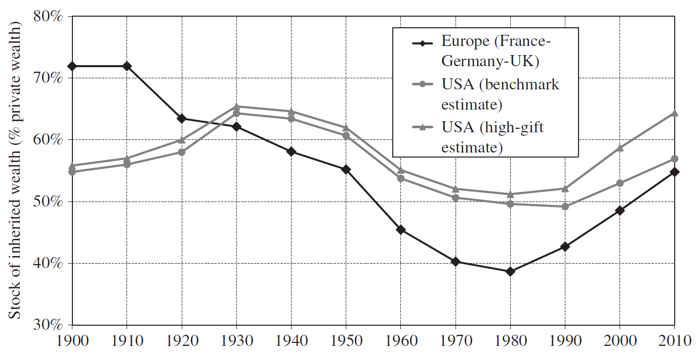
```

Ao contrário de uma percepção pública do "self-made man", a maior parte da riqueza mundial ainda hoje é herdada, nos EUA até mais que na Europa, e essa proporção tem crescido desde 1980 `r Citep(myBib, "alvaredo2017share")`


---
class: middle
## Motivo de economia política

A taxação de riqueza vai além da redução de desigualdades econômicas, envolve também a redução de **desigualdade política** (e isso justificaria potencialmente taxação até além do máximo da curva de Laffer)

O 1% mais rico pode comprar empresas de mídia, fazer contribuições de campanha, lobby; e quanto maior a concentração de riqueza, maior o descontentamento popular e a instabilidade política

Por outro lado, quanto maior essa desigualdade, mais importante se torna o controle rígido do poder político pela elite para evitar confiscação dessa riqueza: a elite *tem mais a perder* &mdash; o que gera enfraquecimento institucional e ruptura democrática

---
class: middle
## Imposto sobre riqueza

Há três tipos de impostos sobre o capital que incidem sobre o **estoque** de capital e não o **fluxo** de renda: impostos sobre heranças, sobre propriedade e sobre riqueza geral (patrimônio líquido)

Outra forma de taxação de renda do capital que tem algumas semelhanças com taxação de estoque é a tributação sobre o ganho de capital

O estoque de capital de uma economia mede todos os bens de capital, máquinas, moradias e terra que geram fluxos de renda aos seus controladores

---
class: middle

```{r, echo=FALSE, out.width = '75%'}
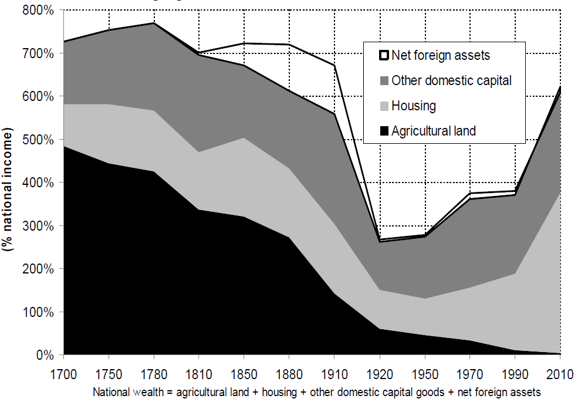
```

O estoque de capital nas economias desenvolvidas é de 600% do PIB, com a maior parte sendo moradia (urbana) &mdash; que substituiu a importância histórica das propriedades rurais (França) `r Citep(myBib, "piketty2014capital")`

---
class: middle

```{r, echo=FALSE, out.width = '70%'}
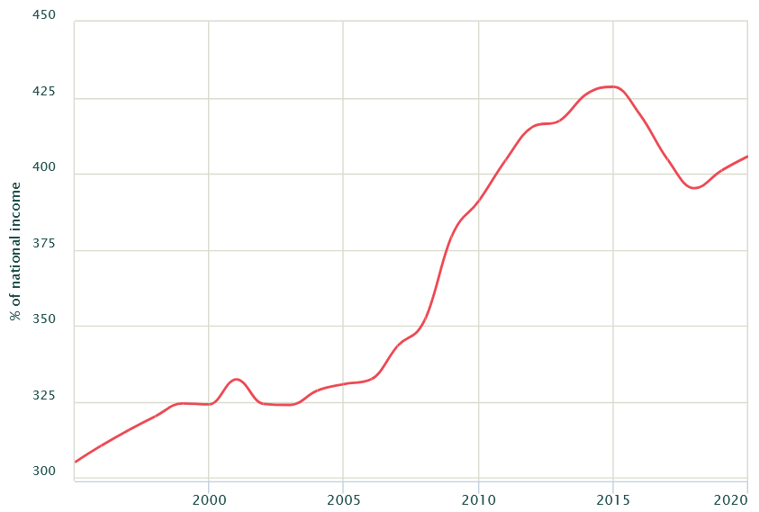
```

Já no Brasil estima-se que o montante de capital (riqueza) é por volta de 400% do PIB [(WID)](https://wid.world/country/brazil/)

---
class: middle
## Impostos e tomada de risco

Vamos começar investigando como a taxação de riqueza e de capital afeta a **tomada de risco**

Em geral se assume que é melhor aumentar a tomada de risco, por ser importante para o crescimento: inovação, empreendedorismo, educação são todas atividades arriscadas e que plausivelmente gostaríamos de estimular

Mas em alguns casos pode ser o contrário: pagamento variável para executivos pode gerar "curto-prazismo" e *rent-seeking*, e excesso de tomada de risco e no setor financeiro pode gerar apostas arriscadas, instabilidade e crises financeiras

---
class: middle
## Taxação de riqueza e tomada de risco

Considere um mercado com um ativo livre de risco com retorno líquido $r$ e um ativo arriscado com retorno (aleatório) $x$, tal que $\min{x} < r < \mathbb{E}x$ 

O agente escolhe então a proporção no ativo arriscado $a$ tal que resolva: $$\max_{a} \mathbb{E} \left\{ u \left( (1 - \tau_W)W \left[ 1 + (ax + (1 - a)r) \right]  \right)  \right\}$$

onde $\tau_W$ é o imposto sobre riqueza. Chamando a riqueza no fim do investimento de $W_{1}$, temos que a CPO é: $$\mathbb{E} \left\{ u^{\prime}(W_1) (1 - \tau_W) W (x - r) \right\} = 0 = \mathbb{E} \left\{ u^{\prime}(W_1)(x - r) \right\}$$

---
class: middle
## Taxação de riqueza e tomada de risco

Ou seja, o imposto $\tau_W$ sai da CPO: ele não distorce o valor relativo dos investimentos, há apenas efeito renda, pois reduz $W_1$, já que: $$W_1 = (1 - \tau_W)W \left[ 1 + (ax + (1 - a)r) \right]$$

Isso vai depender de como uma riqueza menor afeta a concavidade da utilidade: se a aversão ao risco *absoluta* for decrescente, então os agentes se tornarem mais pobres diminui a **quantidade** do ativo arriscado

Mas para garantir que a **proporção** do ativo arriscado caia com a taxação da riqueza, precisaríamos de aversão ao risco *relativa* decrescente, o que é discutível empiricamente &mdash; a maioria dos modelos assume RRA constante: nesse caso, a $\tau_W$ não afeta $a$

---
class: middle
## Taxação do ativo arriscado e tomada de risco

Agora considere uma taxação diretamente sobre o retorno do ativo arriscado: $$\max_{a} \mathbb{E} \left\{ u \left( W \left[ 1 + (ax(1 - \tau_A) + (1 - a)r) \right]  \right)  \right\}$$

Domar e Musgrave já em 1944 perceberam que sob algumas hipóteses taxação de ativos arriscados $\tau_A$ *aumenta* a tomada de risco

Pense que o ativo $x$ custe `$`100 e pague `$`120 no cenário positivo e `$`80 no cenário negativo (50% de chance cada) e que $r$ seja dinheiro sem inflação &mdash; então uma taxação de 50% no retorno do ativo com **compensação de perdas** vai fazer o ativo pagar `$`110 no cenário positivo e `$`90 no cenário negativo

---
class: middle
## Taxação do ativo arriscado e tomada de risco

É como se o governo entrasse como acionista na empresa (**risk-sharing**), e os investidores podem refazer a carteira inicial duplicando $a$ (aumentando a tomada de risco)

No mundo real, entretanto, quase nunca **compensação de perdas** é completa, pois abre espaço para elisão/sonegação fiscal, e envolve possivelmente o Estado pagar o indivíduo, o que é politicamente difícil &mdash; e se a taxação é *progressiva*, então indivíduos podem trocar de alíquota quando ganham em relação a quando perdem

Sem compensação completa de perdas, o efeito da taxação na tomada de risco é ambíguo, já que diminui o valor esperado do ativo

---
class: middle
## Ganhos de capital

Uma forma importante de renda do capital se dá não por rendimentos monetários, mas pela valorização dos ativos (imóveis, ações, moedas) que a pessoa possui: os **ganhos de capital**

Ganhos de capital geram dois problemas para sistemas tributários:

1. Se eles são tributados a taxa menor que dividendos, firmas podem transformar dividendos em ganhos de capital pela **recompra de ações**
2. Como ganhos de capital geralmente são cobrados na *realização* (venda) e juros no *auferimento* (anualmente), existe um *benefício fiscal implícito* para ganhos de capital

---
class: middle
## Taxação de ganhos de capital

O problema 2 é difícil (mas não impossível!) de eliminar, pois vários ativos sem liquidez não têm preços definidos no mercado fora do momento da alienação do ativo (mas ações públicas e similares têm)

Outro problema é que o dono do ativo pode não ter dinheiro disponível para pagar o imposto sem vender o ativo (imagine um aposentado com um imóvel de $1mi que dobrou de valor, e uma taxa de 20% sobre ganhos de capital)

Nos EUA (e no Brasil para imóveis comprados até 1996) o ganho de capital é isento em caso de morte (herança), portanto boa parte dos ganhos do 0,1% mais rico nunca será taxado

---
class: middle
## Taxação de ganhos de capital

Por outro lado, como ganhos de capital são avaliados *nominalmente*, há sobretributação por causa da inflação (mas isso não é particular desse tipo de taxação do capital)

Taxação de ganhos de capital é uma taxação de ativos de risco (principalmente capital corporativo), o que poderia a princípio diminuir atitudes arriscadas benéficas à sociedade, como o empreendedorismo

Mas como vimos esse efeito é *ambíguo teoricamente*, e há pouca evidência empírica que indique um impacto relevante nesse sentido

---
class: middle
## Ganhos de capital e desigualdade

Taxação de ganhos de capital é bastante **progressiva**: nos EUA, se ganhos de capital formam menos de 10% da renda de pessoas com renda até $500 mil, é metade da renda daqueles com renda maior de 10 mi (o 0,1% mais rico)

Em 2010, as 400 famílias mais ricas nos EUA pagaram 16% de todo o imposto sobre ganhos de capital `r Citep(myBib, "gruber")`

Outro motivo para essa taxação é ampliar a base tributária: além do ponto 1 anterior, o benefício tributário para ganhos de capital incentiva o pagamento de executivos com ações e não salários, distorcendo incentivos &mdash; um exemplo é o *[carried interest](https://www.taxpolicycenter.org/briefing-book/what-carried-interest-and-how-it-taxed)* no mercado financeiro

---
class: middle

```{r, echo=FALSE, out.width = '80%'}
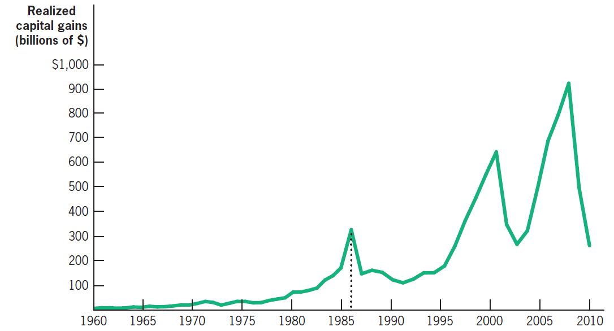
```

Realização de ganhos de capital deu um salto em 1986, como antecipação a um aumento do imposto em 1987 &mdash; mas logo depois retornou ao seu nível original, indicando que esse efeito comportamental alto é apenas no curto-prazo como adiantamento da realização de ganhos `r Citep(myBib, "gruber")`

---
class: middle
## Impostos sobre herança

Em São Paulo, cobramos 4% do valor da herança (com algumas isenções); nos EUA, é de 40% com isenção até ~11mi &mdash; e embora só incida sobre os 0,1% com maior riqueza, arrecada 0,6% do orçamento do governo

Taxar herança traz um dilema normativo: por um lado, desigualdade em herança gera desigualdade econômica sem "merecimento" pelos indivíduos &mdash; por outro lado, parece injusto taxar pais que trabalharam duro e pagaram imposto na renda novamente quando morrem

Geralmente quem é a favor enfatiza 1 (ponto de vista do recipiente) e quem é contra 2 (ponto de vista do doador)

---
class: middle
## Efeitos comportamentais

Há várias dimensões de potenciais efeitos comportamentais da taxação de herança:

1. Reduz o trabalho *dos pais* por diminuir a utilidade marginal do dinheiro (por efeito substituição e efeito renda)
2. Reduz a acumulação de capital pelos pais (aumenta o consumo) e diminui a base tributária desse imposto
3. Aumenta o trabalho *dos filhos* por efeito renda

Kopczuk (2013) estima que a elasticidade de heranças reportadas em relação a taxa livre de imposto de 0,1-0,2 (relativamente baixa) &mdash; importante entender *por que* as pessoas deixam heranças

---
class: middle
## Teoria da herança acidental

A **teoria de herança acidental** é a ideia de que as pessoas morrem ricas por "amor à riqueza" ou motivo precaução pela incerteza da data da morte: nesse caso não há efeito comportamental sobre os pais (1 e 2), apenas sobre os filhos (3, positivo) &mdash; a taxação de herança deveria ser a maior possível

Em pesquisas, pessoas não indicam deixar heranças como principal motivo para acumular riqueza; também é um motivo (plausivelmente) necessário para observarmos multimilionários sem filhos

Kindermann et al (2020) estimam que na Alemanha, cada €1 arrecadado com taxação de herança arrecada ¢9 *a mais* por maior oferta de trabalho dos herdeiros (efeito renda) 

---
class: middle
## Teoria de herança altruísta

No caso da **teoria de herança altruísta**, então temos efeitos 1-3, e a teoria é ambígua: mas alguma taxação de herança geralmente é desejável

Vimos que pelo *princípio da focalização* se a única fonte de heterogeneidade é renda, então devemos taxar apenas a renda para redistribuição, mas heranças geram outra fonte de heterogeneidade, então precisamos de dois instrumentos: taxação de renda e taxação de heranças

Notem que mesmo que heranças monetárias fossem inteiramente taxadas, isso não implicaria **igualdade de oportunidades**, pois há outras formas de transferência intergeneracional de renda: educação, redes de conexões, etc

---
class: middle

```{r, echo=FALSE, out.width = '80%'}
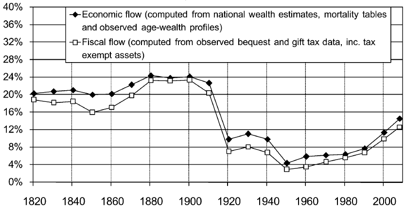
```

O fluxo anual de heranças como proporção do PIB na França era de 20% durante a Revolução Industrial, chegou a 1/4 na *belle époque*, desabou para 8% na 1GM e 4% no pós-guerra, mas tem voltado a subir `r Citep(myBib, "piketty2011long")`


---
class: middle

```{r, echo=FALSE, out.width = '95%'}
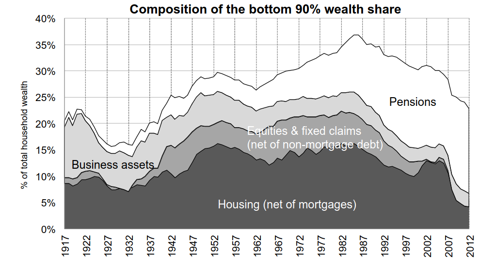
```

A riqueza dos 90% "mais pobres" tem uma composição muito diferente da dos 10% mais ricos, sendo quase inteiramente composta por riqueza previdenciária e propriedade imobiliária `r Citep(myBib, "saez2016wealth")` 


---
class: middle
## Imposto sobre propriedade

A única razão para a taxação de propriedade (imóveis, carros, etc) é que ela é mais simples de aplicar que tributos sobre outras formas de patrimônio, mas os efeitos dela dependem da sua **incidência**

Uma visão é a de *benefits tax view*, o **modelo de Tiebout**: o imposto (local) sobre moradia é usado para pagar bens públicos locais, então é apenas um preço pago pelas amenidades do município &mdash; ele não redistribui renda

A ideia é que no modelo de Tiebout as pessoas "votam com os pés", e por isso as cidades têm que manter o imposto local igual ao benefício de se morar lá

---
class: middle
## Evidência empírica

Nos EUA de 1980-2006, a elasticidade da realização de ganhos em relação à tributação esteve entre -0,5 e -0,3, negando o argumento que cortes no imposto "se pagariam": a taxação que maximiza receita é entre 38-47% `r Citep(myBib, "agersnap2021tax")`

As elasticidades da riqueza tributável em relação a taxação de heranças parecem ainda mais baixas empiricamente: 0,27 e 0,1 em `r Citep(myBib, "goupille2018behavioral")` e `r Citep(myBib, "glogowsky2021behavioral")`, respectivamente

`r Citep(myBib, "kopczuk2007bequest")` compara a herança deixada por mortes "de repente" com pessoas com doença terminal longa, e acha riqueza reportada 10-18% menor para doenças longas (meses ou anos) e 5-10% para doenças curtas (dias ou semanas) 

---
class: middle
## Riqueza em paraísos fiscais

**Paraísos fiscais** são países que combinam confidencialidade bancária com baixa (ou nenhuma) taxação de lucros

`r Citep(myBib, "alstadsaeter2019tax")` comparou dados dos vazamentos "Panama Papers" e "Swiss Leaks" com dados administrativos escandinavos e estima que o 0,01% mais rico *evade* ~25% dos impostos devidos (!) com contas em paraísos fiscais (contra ~5% da população em geral)

Eles estimam que 1,6% da riqueza total escandinava, e 3,3% da mundial, está escondida em paraísos fiscais &mdash; e essa riqueza é extremamente concentrada: enquanto 0,01% mais rico tem 5% da riqueza total, tem metade da riqueza em paraísos fiscais 

---
class: middle

```{r, echo=FALSE, fig.show="hold", out.width = '50%'}
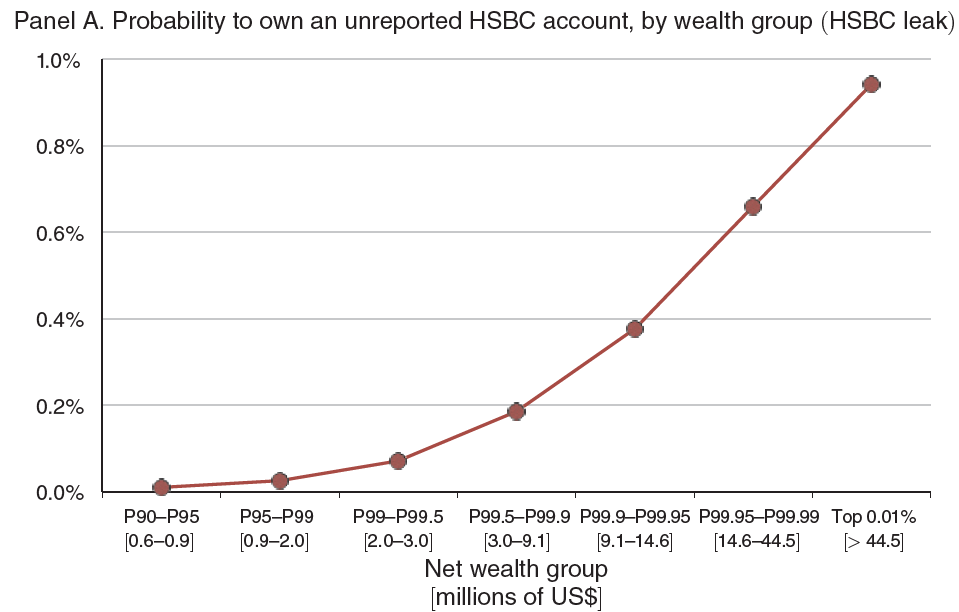
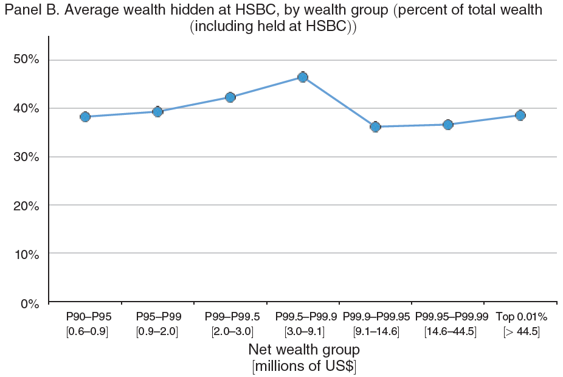
```

Enquanto o 99% (até $2mi de patrimônio líquido) têm probabilidade quase zero de ter uma conta no HSBC não reportada, essa probabilidade sobe para quase 1% no 0.01% mais rico (> $40mi) &mdash; mas condicional na existência da conta, todos sonegam por volta de 40% da sua riqueza total `r Citep(myBib, "alstadsaeter2019tax")`

---
class: middle

```{r, echo=FALSE, fig.show="hold", out.width = '50%'}
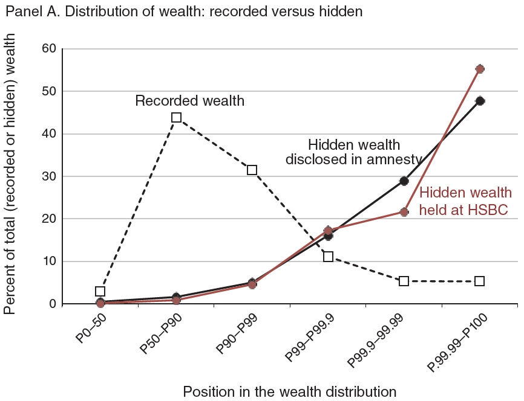
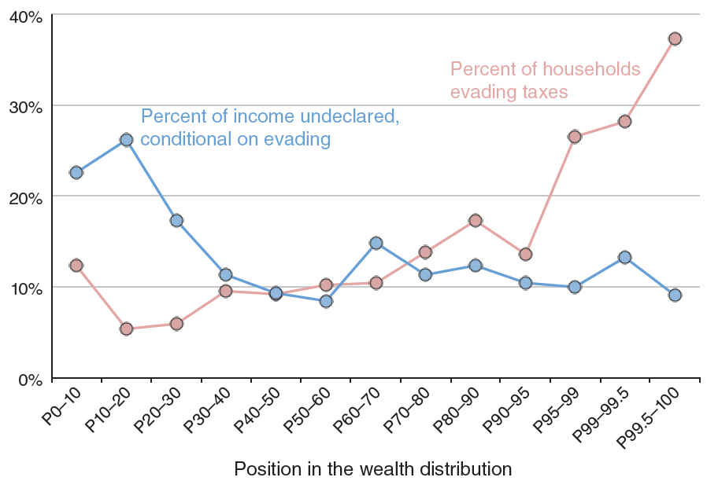
```

Isso gera uma desigualdade de riqueza sonegada gigantesca: enquanto o 0.01% mais rico têm 5% da riqueza dinamarquesa, eles representam metade da riqueza em paraísos fiscais &mdash; ademais, condicional em sonegar renda, domicílios sonegam todos por volta de 10%, mas a proporção sonegando dá um salto nos 5% e 0.5% mais ricos `r Citep(myBib, "alstadsaeter2019tax")`

---
class: inverse, middle, center

# Scheuer & Slemrod (2021). "Taxing Our Wealth"


---
class: middle

```{r, echo=FALSE, out.width = '70%'}
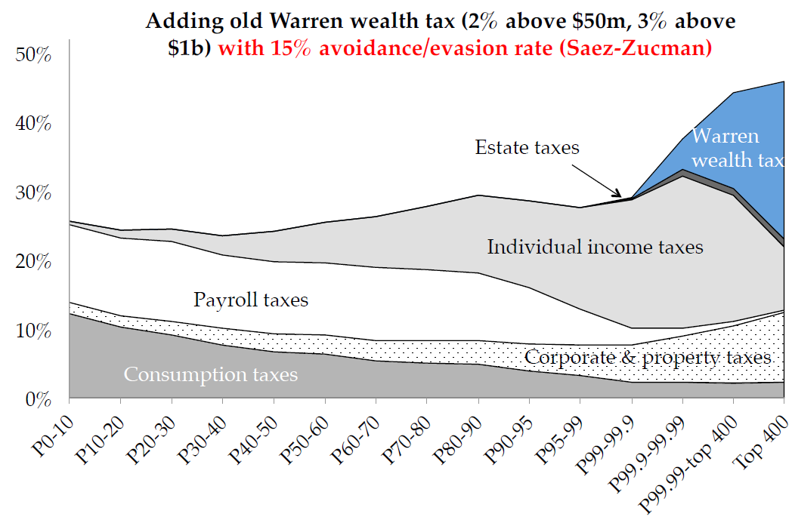
```

A motivação da **taxação de riqueza** é que outras formas de tributação, mesmo de capital e heranças, têm alcance limitado sobre o 0.01% mais rico, tornando o sistema regressivo no *extremo* topo da distribuição &mdash; algo que defensores desse imposto dizem que ele resolveria (Saez)

---
class: middle
## Imposto sobre riqueza

O imposto sobre riqueza (no Brasil, *imposto sobre grandes fortunas*) é um imposto sobre o **patrimônio líquido**: o valor dos ativos menos os passivos possuídos por cada domicílio

Um imposto sobre **estoque** de capital é (economicamente) equivalente a um imposto sobre **fluxo**! Se a taxa normal de lucro é $5\%$, então um imposto sobre capital de $1\%$ é equivalente a um imposto sobre lucro de $20\%$

Quanto menor a taxa normal de lucro, maior é o efeito de um imposto sobre capital: se ao invés de $5\%$ for $2\%$, então o imposto de $1\%$ se torna uma taxa de $50\%$ sobre o lucro

---
class: middle

```{r, echo=FALSE, out.width = '70%', fig.align='center'}

```

---
class: middle
## Imposto sobre riqueza


Há uma diferença importante: taxação de riqueza é um imposto sobre a **taxa normal** de lucro &mdash; *lucros anormais não são taxados*

E vice-versa: se eu deixar toda a minha riqueza em títulos que pagam 0% a.a. (bonds americanos até pouco tempo), eu não pago nada de taxação de renda do capital, mas ainda pago o mesmo em imposto sobre riqueza

Isso tem tanto consequências positivas, ao não taxar lucros inframarginais advindos de inovação e maior produtividade, quanto negativas, ao não taxar lucros econômicos por poder de mercado

---
class: middle
## Imposto sobre riqueza

Note que a teoria microeconômica diz que *devemos taxar em 100% lucro econômico*, pois ele não gera efeito comportamental, e o imposto de riqueza taxa em 0%

Há também as duas dificuldades já discutidas anteriormente: é difícil estimar anualmente o valor de patrimônio sem liquidez; e a quantidade de riqueza nem sempre tem relação com a renda disponível em um dado ano

Esse imposto teria potencial efeito significativo na desigualdade de riqueza, já que tributos que diminuem a taxa de retorno se acumulam no tempo, tendo efeito considerável no longo prazo

---
class: middle

```{r, echo=FALSE, out.width = '75%'}
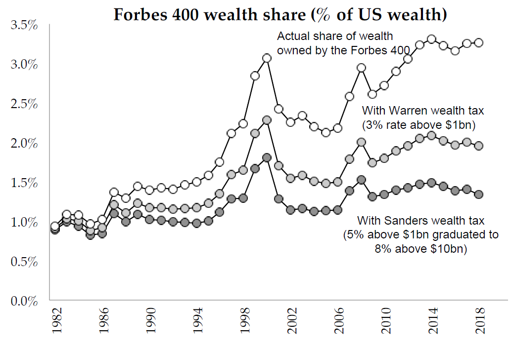
```

Uma taxa de imposto sobre capital de 5-8%, como proposta pelo Sanders nos EUA, pode parecer confiscatória (já que corresponde a uma taxação dos lucros de até 100% ou mais), mas na verdade apenas controlaria o crescimento da proporção na renda do Forbes 400 nos últimos 40 anos (Saez)

---
class: middle
## Imposto sobre riqueza

Embora hoje apenas alguns poucos países tenham imposto sobre riqueza, esse imposto não seria de forma alguma uma invenção (ou "jabuticaba"): Finlândia, Suécia e Suíça já tiveram taxas sobre riqueza de até 4%, e hoje partes da Espanha chegam a 3,75%

A maioria desses países abandonou essa política nas últimas décadas, o que pode apontar dificuldades práticas (ou ser uma questão de economia política)

Propostas recentes nos EUA têm taxas marginais bem maiores (até 8%), e atingem muito menos pessoas (só 75.000 domicílios no plano de Warren, com 600 famílias na alíquota máxima)

---
class: middle

```{r, echo=FALSE, out.width = '85%'}
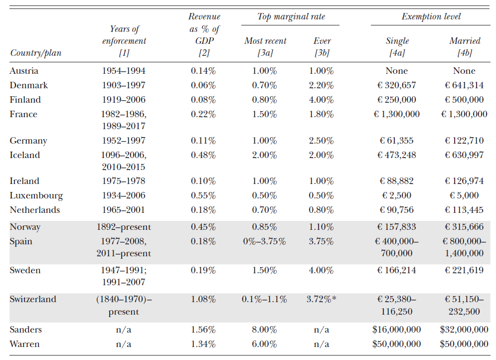
```

Vários países europeus já implementaram por muitas décadas imposto sobre riqueza &mdash; mas experiências com esse imposto sempre geraram receita pequena e tiveram alíquotas menores que propostas mais recentes `r Citep(myBib, "scheuer")`

---
class: middle
## Taxação de riqueza e propriedade

Como vimos, a **taxação de propriedade** é uma forma de imposto sobre riqueza, mas com algumas particularidades negativas

A taxação de propriedade não permite dedução de dívida: uma casa inteiramente financiada com dívida representa um patrimônio líquido zero, mas ainda assim paga IPTU

Ademais, ela fere a **equidade horizontal** ao taxar um tipo de ativo mas não outros &mdash; e pior, não é um ativo especialmente detido pelos mais ricos: enquanto moradia representa 62% do ativo bruto dos 3 quintis do meio, apenas 8% do patrimônio do 1% mais rico é imobiliário

---
class: middle
## Taxação de riqueza e heranças

Outra forma de taxação do *estoque* de capital é a taxação de heranças: esse é mais similar ao imposto sobre riqueza, mas é cobrado apenas uma vez na morte da pessoa

Isso facilita a **evasão fiscal**: é mais fácil fazer planejamento tributário para um evento que ocorre uma única vez por geração que uma cobrança anual de impostos

Por outro lado, reduz os custos administrativos do imposto, que não envolve um cálculo (frequentemente difícil) do patrimônio líquido do contribuinte todo ano fiscal

---
class: middle
## Evidência empírica

Na Suíça, uma redução de 1p.p. (bastante!) no imposto aumentou a riqueza reportada em 43%: 25% do efeito viria de mobilidade, 20% da **capitalização** dos imóveis, e o efeito na taxa de poupança é muito pequeno

Na Dinamarca, uma redução de 1p.p. aumentou riqueza reportada em 21% em 8 anos &mdash; metade do efeito é *mecânico*, já que uma taxa maior reduz a riqueza mesmo sem alteração comportamental

A evidência para outros países é de efeitos menores: nos Países Baixos uma redução de 1p.p. aumentou a riqueza reportada em 14%, e na Suécia houve um efeito quase nulo de 0.1-0.27%

---
class: middle
## Efeitos reais

Um efeito possível da taxação de riqueza é reduzir o empreendedorismo (69% do Forbes 400 são fundadores de suas companhias) &mdash; mas como o sucesso no empreendedorismo é altamente assimétrico, a utilidade marginal no caso de sucesso é bastante pequena

Entretanto, se esse imposto reduzir a acumulação de capital, no longo prazo pode reduzir a taxa de salários

Taxação de riqueza também pode incentivar emigração: a evidência é que esse efeito é significativo, mas ela vem de onde o imposto é regional (e na Espanha o efeito veio inteiramente de declaração fraudulenta)

---
class: middle

```{r, echo=FALSE, out.width = '70%'}
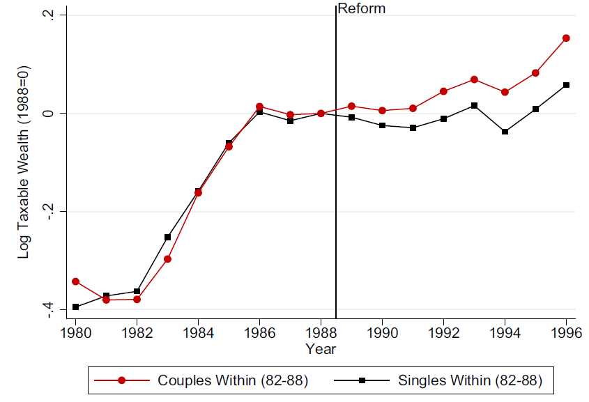
```

Uma redução do imposto de riqueza de 2,2% para 1% para casais, na Dinamarca em 1989, aumentou sua riqueza em 18% vs solteiros depois de 8 anos, com 11% sendo *efeito mecânico* &mdash; o efeito dobra entre ultra-ricos e em 30 anos: elasticidade de longo prazo é 0,7 para os ricos e 1,15 para os ultra-ricos `r Citep(myBib, "jakobsen2020wealth")`

---
class: middle
## Elisão e evasão fiscal

Quando a Espanha deu isenção do imposto sobre riqueza para algumas formas de sociedades fechadas (e não para outras), sua proporção subiu de 15% para 77% das empresas de capital fechado

Essa forma de elisão fiscal pode gerar significativas distorções econômicas, na medida que firmas tentem esconder o patrimônio de seus donos mantendo o capital fechado, mesmo quando abrir fosse eficiente

A implementação desse imposto também poderia plausivelmente intensificar a sonegação fiscal de riqueza em paraísos fiscais, que já representam 3-8% da riqueza mundial

---
class: middle

```{r, echo=FALSE, out.width = '75%'}
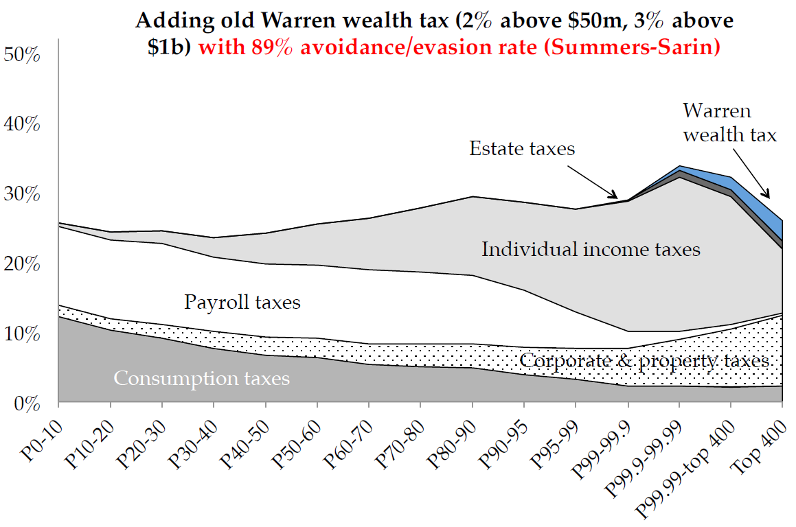
```

Não há consenso sobre o nível de evasão de um potencial imposto sobre riqueza &mdash; e uma evasão elevada prejudicaria bastante a progressividade do imposto, enquanto aumentaria o seu custo de eficiência (Saez)

---
class: middle
## Imposto lump-sum sobre riqueza

A princípio, desigualdade de riqueza poderia ser aliviada por uma taxação de riqueza única e inesperada, que é efetivamente **lump-sum**

Por ser *única e inesperada*, ela não distorce comportamento &mdash; de fato, lucro sobre capital já investido é **lucro puro**, e taxação de lucro econômico não é distorciva

Essa política, entretanto, só funciona se for de fato única (e os agentes acreditarem que será única): na prática, frequentemente se tornam políticas de longo-prazo ou acontecem repetidamente, inviabilizando esse argumento


---
class:middle
# Referências
<small>
```{r refs, echo=FALSE, results="asis"}
PrintBibliography(myBib, start=1, end=5)
```
</small>

---
class:middle
# Referências
<small>
```{r refs2, echo=FALSE, results="asis"}
PrintBibliography(myBib, start=6)
```
</small>
