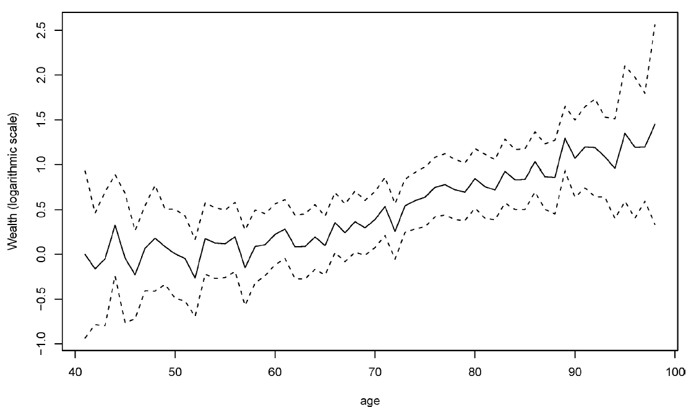
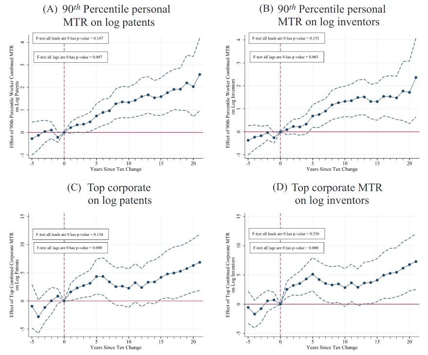

class: inverse, middle, center

```{r, load_refs, include=FALSE, cache=FALSE}
library(RefManageR)
BibOptions(check.entries = FALSE,
           bib.style = "alphabetic",
           cite.style = "alphabetic",
           style = "markdown",
           hyperlink = FALSE,
           dashed = FALSE)
myBib <- ReadBib("./esp_bib.bib", check = FALSE)
```

# Impostos sobre riqueza

---
class: middle
## Imposto sobre riqueza

Há três tipos de impostos sobre o capital que incidem sobre o *estoque* de capital e não o *fluxo de renda*: impostos sobre heranças, sobre propriedade e sobre riqueza (patrimônio líquido)

Mas vamos começar com uma forma de taxação de renda (do capital) que tem algumas semelhanças com taxação de estoque: o ganho de capital

A razão pela qual queremos taxar capital é por ser mais progressivo, especialmente bem no pico da distribuição: enquanto o 1% mais rico nos EUA tem 24% da renda nacional, tem 40% da riqueza total

---
class: middle

```{r, echo=FALSE, out.width = '75%'}
knitr::include_graphics("figs/eae0310-13-1.png")
```

Progressividade do sistema tributário por tipo de imposto nos EUA, com simulações para imposto sobre riqueza: é difícil alcançar os mais ricos com outras formas de taxação (Saez)

---
class: middle
## Impostos e tomada de risco

Vamos começar investigando como a taxação afeta a *tomada de risco*

Em geral se assume que é melhor aumentar a tomada de risco, por ser importante para o crescimento: inovação, empreendedorismo, educação são todas atividades arriscadas

Mas em alguns casos pode ser o contrário: pagamento variável para executivos pode gerar "curto-prazismo" e excesso de riscos e no setor financeiro pode gerar apostas arriscadas, instabilidade e crises

---
class: middle
## Impostos e tomada de risco

Considere um mercado financeiro com um ativo livre de risco com retorno $r$ e um ativo arriscado com retorno (aleatório) $x$, tal que $\min{x} < r < \mathbb{E}x$

O agente escolhe a proporção no ativo arriscado $a$ tal que resolva: $$\max_{a} \mathbb{E} \left\{ u \left( (1 - \tau)W \left[ 1 + (ax + (1 - a)r)(1 - t) \right]  \right)  \right\}$$

onde $\tau$ é o imposto sobre riqueza e $t$ sobre o ativo arriscado. Chamando a riqueza no fim do investimento de $W_{\text{ex-post}}$, temos que a CPO é: $$\mathbb{E} \left\{ u^{\prime}(W_{\text{ex-post}}) (1 - \tau)W(1-t) (x - r) \right\} = 0 = \mathbb{E} \left\{ u^{\prime}(W_{\text{ex-post}})(x - r) \right\}$$

---
class: middle
## Impostos e tomada de risco

$$\mathbb{E} \left\{ u^{\prime}(W_{\text{ex-post}})(x - r) \right\} = 0$$
O imposto sobre riqueza $\tau$ só entra na decisão do agente por $W_{\text{ex-post}}$: se a aversão absoluta ao risco for decrescente, o que é quase unânime empiricamente, então taxação de riqueza diminui a *quantidade* do ativo arriscado **REVER**

Mas para garantir que a *proporção* do ativo arriscado cai com taxação de riqueza, precisaríamos de aversão relativa ao risco decrescente, o que é mais discutível empiricamente (a maioria dos modelos assume RRA constante)

---
class: middle
## Impostos e tomada de risco

Domar e Musgrave em 1944 perceberam que sob algumas hipóteses taxação de ativos arriscados $t$ *aumenta* a tomada de risco

Pense que o ativo $x$ custe `$`100 e pague `$`120 no cenário positivo e `$`80 no cenário negativo (50% de chance cada) e que $r$ seja dinheiro sem inflação

Então uma taxação de 50% no retorno do ativo com **compensação de perdas** vai fazer o ativo pagar `$`110 no cenário positivo e `$`90 no cenário negativo

É como se o governo entrasse como acionista na empresa, e os investidores podem refazer a carteira inicial duplicando $a$ (aumentando a tomada de risco)

---
class: middle
## Impostos e tomada de risco

No mundo real, entretanto, quase nunca *compensação de perdas* é completa, pois isso abre enorme espaço para elisão/sonegação fiscal, e envolve possivelmente o Estado pagar o indivíduo, o que é politicamente difícil

Além disso, se a taxação é *progressiva*, então isso diminui a compensação de perdas, pois os indivíduos podem trocar de alíquota quando ganham em relação a quando perdem

Sem compensação completa de perdas, o efeito da taxação na tomada de risco é ambíguo

---
class: middle
## Impostos e educação

Uma atividade arriscada é a educação: ela implica gastos (pelo menos em custos de oportunidade) presentes para retornos incertos no futuro

Se o gasto em educação é de graça ou dedutível, como imposto só é cobrado sobre renda recebida, os custos de oportunidade também são dedutíveis

Então tributação aumentaria busca por educação &mdash; mas na prática tributação é progressiva, então torna a *compensação de perdas* não completa, e portanto o efeito é ambíguo

---
class: middle
## Ganhos de capital

Uma forma importante de renda se dá não por rendimentos monetários, mas pela valorização dos ativos (imóveis, ações, moedas) que dada pessoa possui: os **ganhos de capital**

Ganhos de capital gera dois problemas para sistemas tributários:

1. Se eles são tributados a taxa menor que dividendos, firmas podem transformar dividendos em ganhos de capital pela *recompra de ações*
2. Como ganhos de capital geralmente são cobrados na *realização* (venda) e juros no *auferimento* (anualmente), existe um benefício fiscal implícito para ganhos de capital (vide aula anterior)

---
class: middle
## Ganhos de capital

(2) é difícil de eliminar, pois vários ativos não líquidos não têm preços definidos em mercado fora da hora da alienação do ativo (mas ações têm)

Outro problema é que o dono do ativo pode não ter dinheiro disponível para pagar o imposto sem vendê-lo (imagine um imóvel de $1mi que dobrou de valor, com imposto de 20% sobre ganhos de capital)

Nos EUA (e no Brasil para imóveis comprados até 1996) o ganho de capital é isento em caso de morte (herança) &mdash; portanto, boa parte dos ganhos do 0,1% nunca será taxado

---
class: middle
## Taxação de ganhos de capital

Por outro lado, como ganhos de capital são avaliados *nominalmente*, há sobretributação por causa da inflação (mas isso não é particular desse tipo de taxação do capital)

Taxação de ganhos de capital é uma taxação na tomada de risco, o que pode diminuir atitudes arriscadas benéficas à sociedade, como empreendedorismo (mas nem todas são benéficas!) 

Embora como vimos o efeito teórico seja ambíguo, e haja pouca evidência empírica nesse sentido

---
class: middle
## Taxação de ganhos de capital

Taxação de ganhos de capital é bastante progressiva: nos EUA, se ganhos de capital formam menos de 10% da renda de pessoas com renda até $500 mil, é metade da renda daqaueles com renda maior de 10 mi (0,1%)

Em 2010, as 400 famílias mais ricas nos EUA pagaram 16% de todo o imposto sobre ganhos de capital `r Citep(myBib, "gruber")`

Outro motivo para essa taxação é ampliar a base tributária: além de (1) supracitado, benefício tributário para ganhos de capital incentiva pagamento de executivos com ações e não salários, distorcendo incentivos &mdash; um exemplo é *carried interest* no mercado financeiro

---
class: middle

```{r, echo=FALSE, out.width = '80%'}
knitr::include_graphics("figs/eae0310-13-2.png")
```

Realização de ganhos de capital deu um salto em 1986, como antecipação a um aumento do imposto em 1987 &mdash; mas logo depois retornou ao seu nível original, indicando que esse efeito comportamental alto é apenas no curto-prazo `r Citep(myBib, "gruber")`

---
class: middle
## Impostos sobre herança

Em São Paulo, cobramos 4% do valor da herança (com algumas isenções). Nos EUA, é de 40% com isenção até ~11mi &mdash; e embora só incida sobre os 1-em-1000 mais ricos, arrecada 0,6% do orçamento do governo

Taxar herança traz um difícil dilema normativo:

1. Por um lado, desigualdade em herança gera desigualdade econômica sem "merecimento" pelos indivíduos
2. Por outro lado, parece injusto taxar pais que trabalharam duro e pagaram imposto na renda novamente quando morrem

Geralmente quem é a favor enfatiza 1 (ponto de vista do recipiente) e quem é contra 2 (ponto de vista do doador)

---
class: middle
## Efeitos comportamentais

Há várias dimensões de potenciais efeitos comportamentais da taxação de herança:

1. Reduz o trabalho dos pais por diminuir por diminuir a utilidade marginal do dinheiro
2. Reduz a acumulação de capital pelos pais e diminui a base tributária
3. Aumenta o trabalho dos filhos por efeito renda

Kopczuk (2013) estima que a elasticidade de heranças reportadas em relação a taxa livre de imposto de 0,1-0,2 (relativamente baixa) &mdash; importante entender *por que* as pessoas deixam heranças

---
class: middle
## Herança acidental

A **herança acidental** é a ideia de que as pessoas morrem ricas por "amor à riqueza" ou motivo precaução pela incerteza da data da morte

Nesse caso não há efeito comportamental sobre os pais (1 e 2), apenas sobre os filhos (3, positivo): taxação de herança deveria ser a maior possível

Em pesquisas pessoas não indicam deixar heranças como principal motivo para acumular riqueza; também necessário para observarmos bilionários sem filhos

Kindermann et al (2020) estimam que na Alemanha, cada €1 arrecadado com taxação de herança arrecada ¢9 a mais por maior oferta de trabalho dos herdeiros 

---
class: middle
## Herança altruísta

No caso de **herança altruísta**, então temos efeitos 1-3, e a teoria é ambígua: mas alguma taxação de herança deve ter

Vimos que pelo **princípio da focalização** se a única fonte de heterogeneidade é renda, então devemos taxar apenas a renda para redistribuição

Mas heranças geram outra fonte de heterogeneidade, agora há 2: renda e herança, então precisamos de dois instrumentos, taxação de renda e taxação de heranças

Além disso, heranças monetárias são taxadas, mas não heranças em serviços: educação, redes de conexões, etc

---
class: middle

```{r, echo=FALSE, out.width = '80%'}
knitr::include_graphics("figs/eae0310-13-9.png")
```

`r Citep(myBib, "piketty2011long")`

---
class: middle
## Imposto sobre propriedade

A única razão para a taxação de patrimônio é que ele é mais simples de aplicar que sobre outras formas de patrimônio &mdash; os efeitos dependem da **incidência**: em última instância quem paga o imposto

Uma visão é a de *benefits tax view*, o **modelo de Tiebout**: o imposto (local) sobre moradia é usado para pagar bens públicos locais, então é apenas um preço pago pelas amenidades do município

A ideia é que as pessoas "votam com os pés" e isso tem que manter o imposto local igual ao benefício de se morar lá

---
class: middle
## Efeitos comportamentais

Agersnap e Zidar (2021) estimam a elasticidade da receita em relação à taxa sobre ganhos de capital em entre -0,5 e -0,3, negando o argumento comum que cortes no imposto "se pagariam": a taxação que maximiza receita é entre 38-47%

Goupille-Lebret e Infante (2018) e Glogowsky (2021) estimam elasticidades da riqueza tributável em relação a taxação de heranças baixas: 0,27 e 0,1, respectivamente

`r Citep(myBib, "kopczuk2007bequest")` compara a herança deixada por mortes "de repente" com pessoas com doença terminal longa, e acha riqueza reportada 10-18% menor para doenças longas (meses ou anos) e 5-10% para doenças curtas (dias ou semanas) 

---
class: middle

```{r, echo=FALSE, out.width = '80%'}

```

A riqueza reportada dos ricos americanos cresce até os 100 anos de idade: parece haver custos de se evadir por muito tempo a riqueza, e eles "procrastinam" até a última hora o planejamento sucessório `r Citep(myBib, "kopczuk2007bequest")`

---
class: middle

```{r, echo=FALSE, out.width = '70%'}

```

Maior taxação estadual de renda física e corporativa ambos reduzem produção de inovação (elasticidade de 0,8 a 1,8 e 1,3 a 2,8, respectivamente) &mdash; mas o efeito da taxação corporativa vem quase inteiramente da mobilidade estadual `r Citep(myBib, "akcigit2022taxation")`

---
class: middle
## Riqueza em paraísos fiscais

**Paraísos fiscais** são países que combinam confidencialidade bancária com baixa (ou nenhuma) taxação de lucros

`r Citep(myBib, "alstadsaeter2019tax")` comparou dados dos vazamentos "Panama papers" e "Swiss leaks" com dados administrativos escandinavos e estima que o 0,01% mais rico *evade* ~25% dos impostos devidos com contas em paraísos fiscais (contra ~5% da população em geral)

Eles estimam que 1,6% da riqueza total escandinava, e 3,3% da mundial, está escondida em paraísos fiscais &mdash; e essa riqueza é extremamente concentrada: enquanto 0,01% mais rico tem 5% da riqueza total, tem metade da riqueza em paraísos fiscais 

---
class: middle

```{r, echo=FALSE, fig.show="hold", out.width = '50%'}
knitr::include_graphics("figs/eae0310-13-7.png")
knitr::include_graphics("figs/eae0310-13-7b.png")
```

Probabilidade de ter uma conta não-reportada no HSBC e proporção da riqueza naquela conta (condicional a ter uma), por renda entre os mais ricos `r Citep(myBib, "alstadsaeter2019tax")`

---
class: middle

```{r, echo=FALSE, fig.show="hold", out.width = '50%'}
knitr::include_graphics("figs/eae0310-13-8.png")
knitr::include_graphics("figs/eae0310-13-8b.png")
```

A evasão fiscal, de riqueza e consequentemente de renda, é altamente crescente ao longo da distribuição, tornando os sistemas tributários bem menos progressivos que pela escolha social `r Citep(myBib, "alstadsaeter2019tax")`

---
class: inverse, middle, center

# Scheuer & Slemrod (2021). "Taxing Our Wealth"

---
class: middle
## Imposto sobre riqueza

Taxação de riqueza é um imposto sobre o *patrimônio líquido total*: o valor dos ativos menos os passivos possuídos por cada domicílio

Há duas dificuldades práticas com um imposto sobre riqueza:

1. É difícil estimar anualmente o valor de propriedades não comercializadas em mercado (firmas fechadas, propriedades que não estão a venda, etc)
2. A quantidade de riqueza nem sempre tem relação com a renda disponível em um dado ano (por exemplo, investimentos não líquidos)

---
class: middle

```{r, echo=FALSE, out.width = '70%', fig.align='center'}
knitr::include_graphics("figs/iq-meme.jpg")
```


---
class: middle
## Imposto sobre riqueza

Um imposto sobre *estoque* de capital é (economicamente) equivalente a um imposto sobre *fluxo*! Se a taxa normal de lucro é $5\%$, então um imposto sobre capital de $1\%$ é equivalente a um imposto sobre lucro de $20\%$

Quanto menor a taxa normal de lucro, maior é o efeito de um imposto sobre capital: se ao invés de $5\%$ for $2\%$, então o imposto se torna uma taxa de $50\%$ sobre o lucro

Há uma diferença importante: taxação de riqueza é um imposto sobre a taxa *normal* de lucro &mdash; *lucros anormais não são taxados*

---
class: middle
## Imposto sobre riqueza

Por exemplo, se eu deixar toda a minha riqueza em títulos que pagam 0%a.a., eu não pago nada de imposto de renda, mas pago ainda o mesmo em taxa sobre riqueza

Isso tem vantagens e desvantagens: por um lado, recompensa bom investimento e empreendedores bem-sucedidos; por outro lado, a teoria microeconômica diz que devemos taxar em 100% lucro econômico, e esse imposto taxa em 0%

Impostos que diminuem a taxa de retorno se acumulam no tempo, e mesmo impostos pequenos podem ter efeito enorme na renda

---
class: middle

```{r, echo=FALSE, out.width = '75%'}
knitr::include_graphics("figs/eae0310-13-3.png")
```

Uma taxa de imposto sobre capital de 3-8%, como proposta nos EUA, pode parecer confiscatória, mas na verdade apenas controlaria o crescimento da proporção na renda do Forbes 400 (Saez)

---
class: middle
## Imposto sobre riqueza

Embora hoje apenas poucos países tenham imposto sobre riqueza, isso não é de forma alguma uma invenção: Finlândia, Suécia e Suíça já tiveram taxas sobre riqueza de até 4%, e hoje partes da Espanha chegam a 3,75%

A maior parte desses países abandonou essa política nas últimas décadas, o que pode apontar dificuldades práticas (ou ser uma questão de economia política)

Propostas nos EUA têm taxas marginais são bem maiores (até 8%), e atingem muito menos pessoas (só 75.000 domicílios no plano de Warren, com 600 famílias na alíquota máxima) 

---
class: middle

```{r, echo=FALSE, out.width = '90%'}
knitr::include_graphics("figs/eae0310-13-4.png")
```

Experiências europeias com taxação de riqueza `r Citep(myBib, "scheuer")`

---
class: middle
## Relação com outros impostos

Como vimos, a *taxação de propriedade* é uma forma de imposto sobre riqueza, mas com particularidades: primeiro, taxação de propriedade não permite dedução de dívida

Se eu tomo um empréstimo e compro uma casa, eu pago IPTU sobre o seu valor total, mesmo que meu patrimônio líquido seja zero

Mais importante, por causa de idiossincrasias na composição de carteira de ativos, não é um imposto que atinge os mais ricos: enquanto moradia representa 62% do ativo bruto dos 3 quintis do meio, apenas 8% do 1% mais rico

---
class: middle
## Efeitos comportamentais

Nas Suíça, uma redução de 1p.p. no imposto sobre taxação (mas note que isso é uma redução significativa!) aumentou a riqueza reportada em 43%: 1/4 do efeito viria de mobilidade, 1/5 da *capitalização dos imóveis*, e o efeito de poupança é muito pequeno

Na Dinamarca, uma redução de 1p.p. aumentou riqueza reportada em 21% em 8 anos &mdash; metade do efeito é *mecânico*, já que uma taxa maior reduz a riqueza mesmo sem alteração comportamental

A reintrodução surpresa de um imposto desse tipo na Califórnia reduziu riqueza tributável em 32% em 4 anos, quase inteiramente por elisão fiscal

---
class: middle
## Efeitos reais

Um efeito possível da taxação de riqueza é reduzir o empreendedorismo (69% do Forbes 400 são fundadores de suas companhias)

Mas como o sucesso no empreendedorismo é altamente assimétrico, a utilidade marginal no caso de sucesso é bastante pequena, e é difícil acreditar que o imposto afete muito a decisão de empreender

Taxação de riqueza também pode incentivar emigração &mdash; em várias evidências que vimos esse efeito é significativo, mas em todos eles o imposto era local (e na Espanha esse efeito veio inteiramente de declaração fraudulenta)

---
class: middle

```{r, echo=FALSE, out.width = '80%'}
knitr::include_graphics("figs/eae0310-13-6.png")
```

Uma redução do imposto de riqueza de 2,2% para 1% para casais, na Dinamarca em 1989, aumentou sua riqueza em 18% vs solteiros depois de 8 anos, com 11% sendo *efeito mecânico* &mdash; o efeito dobra entre ultra-ricos e em 30 anos: elasticidade de longo prazo é 0,7 para os ricos e 1,15 para os ultra-ricos `r Citep(myBib, "jakobsen2020wealth")`

---
class: middle
## Elisão e evasão fiscal

Quando a Espanha deu isenção do imposto sobre riqueza para algumas formas de sociedades fechadas, sua proporção subiu de 15% para 77% das empresas de capital fechado

Isso pode gerar significativas distorções econômicas, na medida que firmas tentem esconder o patrimônio de seus donos mantendo o capital fechado, mesmo quando abrir fosse eficiente

Mas uma vantagem do imposto sobre riqueza em relação à taxação de herança é que o 2o só precisa evadir um ano, enquanto o 1o envolve desenvolver todo um caminho plausível de fluxo de renda e riqueza

---
class: middle

```{r, echo=FALSE, out.width = '75%'}
knitr::include_graphics("figs/eae0310-13-5.png")
```

Não há consenso sobre o nível de evasão de um potencial imposto sobre riqueza &mdash; e uma taxa elevada de evasão prejudicaria significativamente a progressividade do imposto (Saez)

---
class: middle
## Imposto lump-sum sobre riqueza

A princípio, desigualdade de riqueza poderia ser aliviada por uma taxação de riqueza única e inesperada, que é efetivamente *lump-sum*

Por ser *única e inesperada*, ela não distorce comportamento &mdash; de fato, lucro sobre capital já investido é **lucro econômico**, e taxação de lucro econômico não é distorciva

Essa política, entretanto, só funciona se for de fato única: na prática, frequentemente se tornam políticas de longo-prazo ou acontecem repetidamente

---
class: middle
## Economia política

O argumento para taxação de riqueza vai além da redução de desigualdades econômicas: envolve também a redução de **desigualdade política** &mdash; e isso justificaria taxação até além do máximo da curva de Laffer

O 1% mais rico pode comprar empresas de mídia, fazer contribuições de campanha etc

Quanto maior a concentração de riqueza, maior o descontentamento popular e instabilidade política

Por outro lado, mais importante se torna o controle rígido do poder político pela elite para evitar confiscação dessa riqueza: enfraquecimento institucional e ruptura democrática

---
class:middle
# Referências
<small>
```{r refs, echo=FALSE, results="asis"}
PrintBibliography(myBib)
```
</small>
