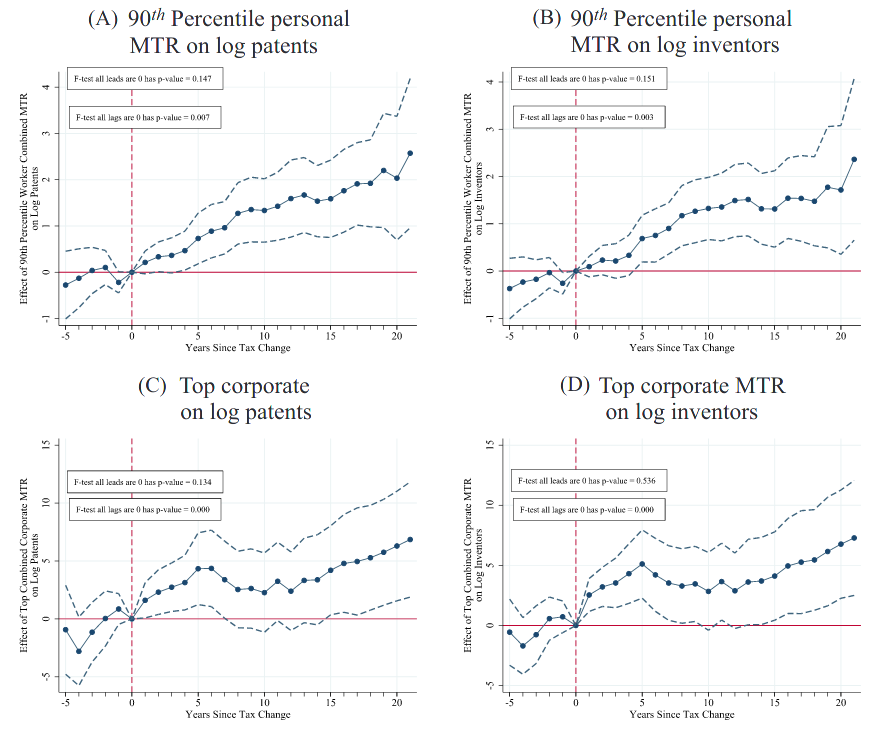

class: inverse, middle, center

```{r, load_refs, include=FALSE, cache=FALSE}
library(RefManageR)
BibOptions(check.entries = FALSE,
           bib.style = "alphabetic",
           cite.style = "alphabetic",
           style = "markdown",
           hyperlink = FALSE,
           dashed = FALSE)
myBib <- ReadBib("./esp_bib.bib", check = FALSE)
```

# Impostos corporativos


---
class: middle

```{r, echo=FALSE, out.width = '50%', fig.align='center'}
knitr::include_graphics("figs/eae0310-12-19.png")
```

O Brasil tem taxação corporativa [comparativamente alta](https://taxsummaries.pwc.com/quick-charts/corporate-income-tax-cit-rates), chegando a 34% (ver slide aula 12); por outro lado, não tributa a distribuição de dividendos &mdash; note que alguns países têm taxas corporativas regionais (nos EUA por volta de 4% e no Canadá chegando a 15%), enquanto o Brasil só cobra impostos corporativos ao nível federal `r Citep(myBib, "brealey2006corporate")`

---
class: middle
## Corporações

**Corporações** são entidades com fins lucrativos possuídas por acionistas com *responsabilidade limitada*: se a corporação fale, o acionista perde o valor da sua participação, mas não é responsável por dívidas não pagas

Corporações são "pessoas jurídicas", mas isso obviamente não existe: empresas não pagam impostos, *apenas pessoas pagam* &mdash; e para entender impostos sobre corporações temos que entender a sua **incidência**

De forma análoga ao setor público, firmas de capital aberto e pouco concentrado têm um **problema de agência**, pela separação entre *propriedade e controle*: o dono da firma são os acionistas, mas os controladores os CEOs

---
class: middle
## Corporações

Enquanto **proprietários** estariam interessados na maximização do seu lucro, **controladores** se interessam em maiores salários, visibilidade, e poder

Recentemente economistas têm questionado se proprietários realmente só se interessam na maximização de seu lucro `r Citep(myBib, "hart2017companies")` &mdash; e notam que apenas sob condições extremamente fortes a maximização dos lucros dos acionistas pelas corporações seria o melhor pra sociedade [[A Doutrina Friedman]](https://www.promarket.org/2020/10/13/milton-friedman-legacy-doctrine-theorem/)

Vários países como a Alemanha têm uma estrutura de direito empresarial focada nos interesses dos *stakeholders*: todos impactados pela atuação da empresa, como os trabalhadores, os consumidores e a comunidade local

---
class: middle
## Finanças corporativas

Empresas financiam investimentos produtivos por 3  mecanismos: *dívida* (debt), *participação* (equity) e *lucros retidos* (retained earnings)

O financiamento por **dívida** promete um pagamento fixo para qualquer realização econômica da firma (fora o *default*) &mdash; isso não gera *risco moral*, pois o empreendedor ainda é **residual claimant** do sucesso da empresa

Mas gera um problema de *seleção adversa*, já que empreendedores têm maior conhecimento sobre o retorno esperado de um investimento que investidores externos, e vão escolher dívida quando a qualidade do investimento é ruim (por causa da **responsabilidade limitada**)

---
class: middle
## Finanças corporativas

A empresa também pode vender **participação**, que paga uma proporção do retorno do empreendimento ao investidor externo

Agora a *seleção adversa* é menos importante, mas equity gera um problema de *risco moral*, já que diminui os incentivos ao empreendedor: os custos de esforço no sucesso do projeto permanecem iguais, mas agora ele recebe apenas uma parte menor dos benefícios (a sua participação na firma) 

Por causa disso, acionistas geralmente têm maior influência interna (e.g., poder de voto) no funcionamento da firma (insiders) que credores (outsiders), enquanto credoes têm prioridade na alienação dos bens em caso de falência

---
class: middle

```{r, echo=FALSE, out.width = '90%'}
knitr::include_graphics("figs/eae0310-14-4.png")
```

Há três formas de financiamento da firma que podem ser afetadas pela taxação: lucros retidos ou captar dinheiro por meio de equity (fontes internas em azul) e debt (fonte externa em laranja) &mdash; esta última paga juros, enquanto participação pode ser remunerada por dividendos ou ganhos de capital `r Citep(myBib, "gruber")`

---
class: middle

```{r, echo=FALSE, out.width = '60%'}

```

A *taxação corporativa* $\tau_c$ incide sobre a receita com dedução para custos de insumos, salários, **juros** e depreciação do capital; e o *lucro operacional* (EBIT) é distribuído e sofre taxação de renda com alíquotas (potencialmente diferentes) para juros, dividendos e ganhos de capital `r Citep(myBib, "gruber")`

---
class: middle
## Taxação corporativa

Quando tributamos uma corporação, taxamos as **pessoas** que possuem os fatores de produção envolvidos na atividade empresarial: trabalhadores, capitalistas e donos da terra

Mas a *incidência econômica* do imposto também pode ser **forward shifted** para os consumidores ou **backward shifted** para produtores de insumos (e daí incidir sobre os fatores de produção daquela indústria)

Mas então por que tributar empresas e não os fatores diretamente? Um motivo prático é que é *mais fácil de arrecadar*: corporações são grandes, bastante visíveis, e possuem contabilidade detalhada

---
class: middle
## Taxação de lucros econômicos

Do ponto de vista teórico a taxação de lucros também é desejável: se uma firma ganha **lucro puro**, gostaríamos de taxá-los inteiramente, já que essa taxação não distorce comportamento (são *rendas econômicas*)

Como $\Pi = p F(k, l) - wl - rk$, um imposto sobre o lucro puro $\tau_L$ gera a função objetivo: $$(1 - \tau_L)\Pi = (1 - \tau_L)p F(k, l) - wl - rk + \tau_L(wl + rk)$$

Ou seja, é equivalente a um imposto sobre a receita com deduções para os custos com fatores de produção &mdash; e em ambos os casos $\{k,l\}$ maximizadores do lucro $\Pi$ são os mesmos de $(1 - \tau_L)\Pi$: *não há distorção produtiva*

---
class: middle
## Motivos para a taxação de renda corporativa

Agora note que isso só vale se taxarmos o *lucro econômico* levando em conta o **custo de oportunidade** dos fatores, enquanto a taxação corporativa é sobre o *lucro contábil*, que leva em conta preços

Um motivo para tributar renda corportativa é que sem ela **lucros retidos** poderiam se acumular livres de impostos eternamente dentro da firma, sendo distribuídos no futuro com tributação apenas no auferimento

Ao taxar outras formas de renda do capital (dividendos, juros, ganhos de capital) mas não lucros retidos isso gera um subsídio implícito para a *renda corporativa* em relação a outras formas de poupança (e.g. ações)

---
class: middle
## Motivos para a taxação de renda corporativa

Ademais, se taxarmos apenas renda do capital, donos de empresas podem maquiar o seu consumo pessoal como gastos da empresa ou usar a sua riqueza corporativa como colateral, nunca realizando a renda e portanto nunca sendo taxado

A taxação corporativa também aumenta a **base tributária**, diminuindo a evasão fiscal com, p. ex., a realização dos lucros em contas em paraísos fiscais

E de fato a evidência parece apontar lucros retidos como a principal fonte de financiamento das firmas, implicando que não cobrar impostos corporativo poderia gerar distorções relevantes

---
class: middle

```{r, echo=FALSE, out.width = '75%'}
knitr::include_graphics("figs/eae0310-14-1.png")
```

A concorrência internacional e lobby das grandes empresas reduziu drasticamente a taxação corporativa no final do século passado nos EUA (gráfico) e na maioria das economias centrais (Saez)

---
class: middle

```{r, echo=FALSE, out.width = '70%'}

```

E essa redução está associada a uma diminuição na progressividade do sistema tributário, já que renda corporativa é parcela considerável no topo da distribuição de renda (Saez)


---
class: middle
## Regras de depreciação

A taxação sobre o lucros econômico deve descontar os gastos com todos os fatores: trabalho, insumos, terra, e também capital &mdash; o custo do capital é a sua **depreciação econômica**, a perda de valor desse capital entre $t$ e $t+1$

O problema é que ativos possuem diferentes maturidades, e a perda de valor é pouco observável, pela falta de mercados de máquinas usadas, e a mesma máquina em diferentes usos terá *depreciação física* diferente

Por isso o governo trabalha com **regras de depreciação**: linear, acelerada, ou imediata (*expensing investments*) &mdash; o importante é lembrar que *quanto mais rápida a dedutibilidade da depreciação, maior o benefício fiscal*

---
class: middle

```{r, echo=FALSE, fig.show="hold", out.width = '50%'}
knitr::include_graphics("figs/eae0310-14-5.png")

```

Efeitos de uma taxação corporativa sem (a) e com (b) dedução para depreciação do capital: no 1o caso, ela diminui o produto marginal do capital, reduzindo o investimento; no 2o, o abatimento de gastos com *depreciação econômica* $\delta$ diminue o custo de financiamento $\delta + \rho$, onde $\rho$ é o *dividend yield*, com efeito ambíguo `r Citep(myBib, "gruber")`

---
class: middle
## Taxação corporativa efetiva

Um imposto corporativo com política de depreciação gera uma **taxação corporativa efetiva**: o aumento percentual na taxa de retorno antes de impostos para cobrir a taxação, que vai ser menor que a estatutária

Por exemplo, se o custo de capital for de 20%, e a taxa corporativa de 35%, sem deduções para depreciação, então o investimento precisa de uma taxa interna de retorno de $0.2/(1 - 0.35) = 30.7\%$ para valer a pena

E daí a taxa corporativa efetiva é dada por: $$ETR = \frac{r_{\text{com imposto}} - r_{\text{sem imposto}}}{r_{\text{com imposto}}}$$

---
class: middle
## Incidência da taxação corporativa

Se quisermos taxar capital *estrangeiro* (investido no país), a taxação corporativa é a única forma: não podemos taxar a sua renda (recebida no exterior), mas podemos taxar seu capital na firma em território nacional

Por isso, taxação na firma e no indivíduo geram diferentes efeitos nas *finanças internacionais*: (i) cobra de investidores internacionais em empresas locais, enquanto a (ii) de investidores locais de empresas internacionais

Como isso vai afetar a *incidência* do imposto depende das nossas suposições sobre a mobilidade local e internacional do capital (e portanto da elasticidade da oferta de capital)

---
class: middle
## Incidência internacional

Se o capital tem **mobilidade internacional perfeita** e considerarmos o caso de uma **economia pequena** (como o Brasil), então a taxação nacional não afeta a taxa de lucro internacional, que tem que ser homogênea: $r^{\text{BR}} = r^*$

E após a taxação igualmente $(1-\tau_c) r^{\text{BR}} = r^*$ &mdash; ou seja, há fuga de capital até a taxa de retorno retornar à taxa internacional (oferta infinitamente elástica): essa fuga diminui a produtividade marginal do trabalho e seu salário em mercado competitivo: **a incidência é toda no trabalho**

Já a taxação de dividendos incide nesse caso inteiramente no capitalista nacional, já que a tributação não afeta a taxa de retorno internacional

---
class: middle
## Concorrência internacional

Países portanto sofrem pressão para reduzir os seus tributos corporativos em uma **race to the bottom**, já que impostos menores atraem o capital internacional de outros países num jogo de soma zero

Essa característica da taxação corporativa gera o potencial de concorrência internacional e políticas de **beggar-thy-neighbor**

Isso gera a necessidade de *organismos internacionais* para cooperação &mdash; há um movimento real nessa direção: em 2021, 141 países concordaram em estruturar um imposto corporativo mínimo global de 15% (mas ainda é pouco)

---
class: middle
## Incidência em economia fechada

Se o capital não é móvel internacionalmente (*economia fechada*), então a taxa de lucro no setor corporativo deve igualar a do *setor não corporativo* &mdash; com livre mobilidade entre os dois, o setor corporativo perde capital e o salário cai

No mundo real, entretanto, por causa de barreiras à entrada (capital não perfeitamente móvel), plausivelmente o setor corporativo tem lucros anormais: nesse caso, o capital corporativo absorve toda a taxação

Se a taxação incidir sobre todas as firmas (i.e., sem setor não corporativo), então se torna uma taxação usual sobre o capital, como tributo sobre dividendos

---
class: middle

```{r, echo=FALSE, out.width = '60%'}
knitr::include_graphics("figs/eae0310-14-20.png")
```

`r Citep(myBib, "suarez2016benefits")` acham que trabalhadores de fato absorvem parte de cortes na taxação corporativa (30-35%), e 25-30% para donos de terra (apenas 40% para capitalistas) em taxação **estadual** nos EUA &mdash; oferta de capital é bastante elástica e responde a cortes de impostos com crescimento no tamanho da firma

---
class: middle

```{r, echo=FALSE, out.width = '100%'}
knitr::include_graphics("figs/eae0310-14-7.png")
```

Nos EUA, redução de 1p.p. na alíquota corporativa efetiva para empresas com produção doméstica (azul) aumentou investimento em 4,7% do capital instalado e diminui dívida em 5,3%, em comparação com empresas com pouca produção doméstica (pontilhado) `r Citep(myBib, "ohrn2018effect")`

---
class: middle

```{r, echo=FALSE, out.width = '70%'}
knitr::include_graphics("figs/eae0310-14-8.png")
```

Na Alemanha, aumentos na taxação corporativa são associados a significativas reduções nos salários reais: trabalhadores absorvem por volta de metade da incidência do imposto (especialmente trabalhadores novos e menos qualificados) `r Citep(myBib, "fuest2018higher")`


---
class: middle
## Tributação e finanças corporativas

Um resultado clássico de finanças corporativas é o **teorema de Modigliani-Miller:** sem taxação, falência ou informação assimétria, para o valor da firma é irrelevante a *estrutura de capital* (i.e., tanto faz *debt* ou *equity*)

Mas como os juros de dívidas são quase sempre dedutíveis do imposto, e pagamentos de dividendos não é, isso gera uma **preferência fiscal pelo financiamento por dívida**

Isso gera um paradoxo: por que firmas captam dinheiro por participação?  Respostas possíveis envolvem diminuir o risco de falência e mitigar o *conflito de interesses entre acionistas e detentores de dívida*

---
class: middle
## Tributação e finanças corporativas

Aumentos no imposto corporativo estadual nos EUA de na média 13% levaram a crescimento de 4,5% na proporção de dívida na estrutura de capital das empresas `r Citep(myBib, "heider2015certain")` &mdash; corroborando a preferência fiscal por dívida

Outro mistério é que firmas paguem dividendos (**dividend paradox**), quando poderiam reinvestir o dinheiro e aumentar o valor da firma, remunerando dessa forma os investidores por ganhos de capital menos tributado

A visão dominante é que novamente é um **problema de agência**: como os acionistas não conseguem controlar perfeitamente os administradores, preferem "tirar o dinheiro das mãos deles"

---
class: middle
## Taxação de dividendos

Os efeitos da taxação de dividendos *dependem da forma de financiamento da empresa*: se ela se financia emitindo ações, os tributos diminuem o preço da ação e tornam o financiamento do investimento mais caro (uma dada participação capta menos dinheiro)

Se, por outro lado, a empresa financia o investimento com lucros retidos ou dívida, os dividendos não afetam a sua escolha

Já a taxação do lucro, se for sobre lucro econômico, então não há efeito comportamental da taxação, e a incidência se dá toda sobre os acionistas no curto prazo &mdash; mas no longo prazo depende da mobilidade do capital

---
class: middle
## Taxação de dividendos

A visão antiga sobre taxação de dividendos é de que ao encarecer o financiamento por *equity*, esse tributo diminuiria o investimento

Mas essa visão decorre de um modelo que não explica por que dividendos existem em primeiro lugar: no modelo de agência, taxar divendos **aumentaria** o investimento

A visão moderna é que investimento das empresas se dá majoritariamente por *lucros retidos*: assim, taxação de dividendos tem pouco efeito no nível de investimento [[Artigo no Jornal da USP]](https://jornal.usp.br/artigos/afinal-a-taxacao-de-dividendos-reduz-o-investimento/)

---
class: middle

```{r, echo=FALSE, out.width = '80%'}

```

Fontes de financiamento das empresas (não-financeiras) americanas (% do total) &mdash; quase todo o financiamento do investimento na prática vem de lucros retidos e fundos para depreciação: assim, taxação de dividendos tem pouco efeito sobre o custo de financiamento das firmas `r Citep(myBib, "brealey2006corporate")`

---
class: middle

```{r, echo=FALSE, out.width = '70%'}
knitr::include_graphics("figs/eae0310-14-3.png")
```

Nos EUA, o único efeito do corte de 23p.p. na taxação de dividendos em 2003 foi maior pagamento de dividendos a acionistas, comparando um grupo de empresas afetada (C-corps) com empresas não afetadas (S-corps) `r Citep(myBib, "yagan2015capital")`

---
class: middle
## Simples Nacional

Em quase todos os países, empresas pequenas têm um regime tributário benéfico &mdash; no Brasil, é o Simples Nacional, que substitui quase todos os tributos das empresas por uma taxação única sobre o faturamento

`r Citep(myBib, "monteiro2012coming")` estima efeito do Simples de 13p.p. (quase 50%) na formalização de lojas de varejo, mas nenhum efeito em outros setores

Como há um teto para a participação no Simples, o programa pode gerar "achatamento" do tamanho das firmas, gerando ineficiências econômicas

---
class: middle
## Impostos sobre a folha

Uma forma de taxação híbrida entre imposto de renda e tributo corporativo são impostos sobre a folha &mdash; no modelo são equivalentes a um imposto de renda, mas na prática a incidência tende a variar

Em 2011, o governo aprovou a desoneração temporária na folha, que substitui a tributação na folha por imposto sobre faturamento para vários setores, na prática dando benefícios tributários da ordem de 0,5% do PIB para eles

`r Citep(myBib, "leandro2021payroll")` (entre outros) apontam efeito desprezível em emprego e salários, mas ainda assim a desoneração se mantém até 2023 (pelo menos)

---
class: middle

```{r, echo=FALSE, out.width = '70%'}
knitr::include_graphics("figs/eae0310-14-9.png")
```

Mas reduções *específicas* no imposto sobre a folha podem funcionar para estimular o emprego em subgrupos onde o desemprego é maior: um corte no imposto na folha para jovens na Suécia (2007-2009) diminuiu a taxa de desemprego nesse grupo em 5 p.p. (33%) `r Citep(myBib, "saez2019payroll")`

---
class: middle

```{r, echo=FALSE, out.width = '75%'}

```

Firmas com mais jovens receberam um *tax windfall* e aumentaram seu emprego em 4.6%, além vendas e lucros após a reforma, comparando com firmas pouco afetadas (grupo de controle) `r Citep(myBib, "saez2019payroll")`

---
class: middle

```{r, echo=FALSE, out.width = '75%'}
knitr::include_graphics("figs/eae0310-14-11.png")
```

Esse aumento das firmas aumentou o salário líquido em 1.9-2.6%, mas o salário bruto continuou o mesmo por causa da redução do imposto sobre a folha, indicando que a incidência se deu inteiramente no trabalho `r Citep(myBib, "saez2019payroll")`

---
class: middle

```{r, echo=FALSE, out.width = '70%'}

```

Taxação corporativa também afeta a inovação: maior taxação estadual de renda física e corporativa ambos reduzem número de patentes (elasticidade de 0.8-1.8 e 1.3-2.8, respectivamente) e induzem mobilidade estadual dos investidores `r Citep(myBib, "akcigit2022taxation")`

---
class: inverse, middle, center

# Gabriel Zucman (2014). "Taxing across Borders: Tracking Personal Wealth and Corporate Profits"

---
class: middle
## Paraísos fiscais

Vimos como os "ultra-ricos" usam de **paraísos fiscais** para sonegar impostos sobre o capital e riqueza, mas talvez ainda mais relevante seja o seu uso por corporações multinacionais

`r Citep(myBib, "torslov2018missing")` estimam que 14% da receita da taxação corporativa no Brasil seja evadida por uso de paraísos fiscais (23% nos EUA) [[World missing profits database]](https://missingprofits.world/)

18% de todo lucro realizado por empresas americanas (dentro ou fora dos EUA) é hoje realizado em paraísos fiscais, e paga quase nenhum imposto (em média 3%) [[Nosso artigo no Valor]](https://www.pedroforquesato.com/files/paraisos.jpeg)

---
class: middle
## Taxação corporativa internacional

Taxação corporativa é "simples" em uma economia fechada, mas muito mais complexo em um contexto internacional &mdash; Bruins et al (1923) propuseram 3 princípios para a **tributação corporativa internacional**:

1. Taxação corporativa deve ser paga no país de atividade da empresa (**source-based taxation**) ao invés de baseado na residência da firma
2. Em relações comerciais (internacionais) intrafirma, as corporações devem usar **arms-length pricing**: "comercializar" entre si os bens como se "a preço de mercado(*)" e calcular seu lucro separadamente
3. Taxação internacional, ao contrário de comércio internacional, seria tratado por *acordos bilaterais*, e não multilateralmente

---
class: middle

```{r, echo=FALSE, out.width = '80%'}
knitr::include_graphics("figs/eae0310-14-12.png")
```

Se até o começo da década de 70 a proporção de lucros de empresas americanas realizada fora dos EUA era pequena, ela aumentou significativamente nas últimas décadas (*globalização*), chegando a 35% em 2010 &mdash; mas 2/3 dessa proporção é realizada em paraísos fiscais `r Citep(myBib, "zucman")`

---
class: middle
## Taxação corporativa internacional

Essa multitude de acordos bilaterais gerou um queijo suíço de *loopholes* que as gigantes multinacionais utilizam para evitar impostos (como o "sanduíche holandês-duplo irlandês")

Outra prática comum é transferir ativos intangíveis (patentes e marcas) para paraísos fiscais e cobrar royalties de lá para o seu uso nos países de atividade econômica

Multinacionais também podem manipular a realização dos seus lucros usando empréstimos entre subsidiárias e *transfer pricing*, já que os preços dos insumos comercializados intrafirma raramente existem em mercado

---
class: middle

```{r, echo=FALSE, out.width = '90%'}

```

Embora a alíquota nominal de taxação corporativa nos EUA seja de 35%, por causa de elisão fiscal para paraísos fiscais e outros *loopholes*, a alíquota efetiva é de 20%, com apenas 16% paga ao governo americano `r Citep(myBib, "zucman")`

---
class: middle

```{r, echo=FALSE, out.width = '80%'}

```

A proporção dos ativos americanos com dono registrado em paraísos fiscais (hedge funds, mutual funds, shell companies) subiu de 2% até a década de 80 para 9% em 2010 `r Citep(myBib, "zucman")`

---
class: middle

```{r, echo=FALSE, out.width = '80%'}
knitr::include_graphics("figs/eae0310-14-19.png")
```

Frequentemente países dão benefícios fiscais para a repatriação de recursos em paraísos fiscais: um desses, em 2005 nos EUA, fez com que a proporção dos lucros mantidos em paraísos fiscais despencasse, mas isso não gerou emprego, investimento ou R&D nacional, e logo após a proporção mantida *offshore* continuou a crescer `r Citep(myBib, "zucman")`

---
class: middle

```{r, echo=FALSE, out.width = '80%'}

```

Em países em desenvolvimento a situação é ainda pior: Zucman estima que na América Latina 22% da riqueza é mantida em contas *offshore* em paraísos fiscais, e em países como a Rússia e do Oriente Médio chega a mais da metade `r Citep(myBib, "zucman")`

---
class: middle
## Evasão e elisão fiscal

Não apenas essa elisão fiscal torna o sistema tributário menos progressivo, mas gera enormes ineficiências: multinacionais gastam bilhões (com benefício marginal social nulo) manipulando o sistema para evitar o pagamento impostos

A arrecadação do imposto corporativo se manteve historicamente por volta de 3% do PIB nos EUA mesmo com a queda na taxa efetiva, pois a proporção do lucro corporativo no PIB subiu de 9% em 1980 para 14% em 2010

Se os EUA resolvessem o problema de evasão fiscal por paraísos fiscais, isso aumentaria a carga tributária do 0,1% mais rico em 18%

---
class: middle
## Reformas

Em 2021 foi aprovado um plano, com assinatura de 141 países, de estabelecer um imposto corporativo mínimo global de 15% &mdash; ainda bem abaixo do Brasil e da maioria das grandes economias, mas bem acima de paraísos fiscais

Isso vem com o enfraquecimento da *source-based taxation* e *arms-length pricing*: novas propostas de pagamento dos impostos corporativos com base em alguma fórmula das vendas, emprego e capital

O problema óbvio é que diferentes fórmulas beneficiam diferentes países, o que gera interesses divergentes &mdash; mas de qualquer forma, a solução para esse problema tem que ser global

---
class:middle
# Referências
<small>
```{r refs, echo=FALSE, results="asis"}
PrintBibliography(myBib, start=1, end=5)
```
</small>

---
class:middle
# Referências
<small>
```{r refs2, echo=FALSE, results="asis"}
PrintBibliography(myBib, start=6, end=10)
```
</small>

---
class:middle
# Referências
<small>
```{r refs3, echo=FALSE, results="asis"}
PrintBibliography(myBib, start=11)
```
</small>

<!-- --- -->
<!-- class: middle -->

<!-- ```{r, echo=FALSE, out.width = '100%'} -->
<!-- knitr::include_graphics("figs/eae0310-14-17.png") -->
<!-- ``` -->

<!-- Quanto maior a proporção de dívida no financiamento da firma, maior o **conflito de interesses** entre detentores de dívida e acionistas &mdash; como acionistas "têm pouco a perder", eles aceitam investimentos de má qualidade; em expectativa disso, credores só estariam dispostas a financiar firmas com pouco capital acionário a taxas de juros elevadas `r Citep(myBib, "gruber")` -->
