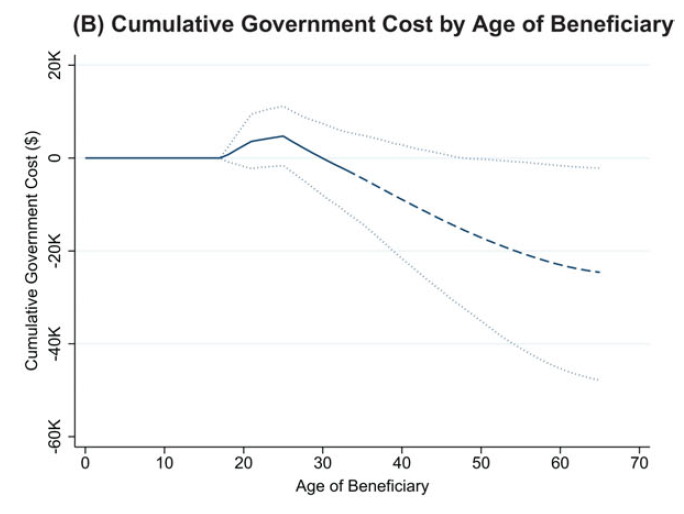

class: inverse, middle, center

```{r, load_refs, include=FALSE, cache=FALSE}
library(RefManageR)
BibOptions(check.entries = FALSE,
           bib.style = "alphabetic",
           cite.style = "alphabetic",
           style = "markdown",
           hyperlink = FALSE,
           dashed = FALSE)
myBib <- ReadBib("./esp_bib.bib", check = FALSE)
```

# Análise de custo-benefício
---
class: middle
## Análise normativa aplicada

Na aula passada vimos uma discussão mais conceitual de **análise normativa**, que na economia é focada em *funções de bem-estar social*

Mas essa teoria não é diretamente aplicável: gestores geralmente não maximizam explicitamente funções de bem-estar social para decidirem políticas públicas (embora acadêmicos frequentemente sim!)

A necessidade de auxiliar gestores nas decisões práticas de políticas gerou métodos mais aplicados de análise normativa &mdash; mas o entendimento conceitual é importante para entender as suas limitações

---
class: middle
## Análise de custo-benefício

Digamos que o governador de São Paulo queira criar uma estação do metrô na USP. Como nós economistas podemos informar a discussão sobre se essa é uma boa ideia?

Esse tipo de pergunta (*normativa!*) motivou economistas a criarem uma teoria da **análise de custo-benefício** das políticas públicas

No setor privado, precisamos "apenas" calcular o VPL do projeto. No setor público é mais complicado &mdash; enquanto a firma se importa apenas com maximização de lucro (monetário), o público se importa com a maximização do *bem-estar social*

---
class: middle
## Análise de custo-benefício

Escolhas de políticas públicas envolvem precificar coisas que geralmente não consideramos ter preço, como o tempo das pessoas (e.g. de translado) e a própria vida delas (ex. aumentar velocidade máxima nas marginais)

Outra diferença é que, fora *incidência* (que é importante!), o que importa para a sociedade é o **custo marginal social** (e não o privado)

O custo marginal social de qualquer insumo é seu **custo de oportunidade**, ou seja, seu valor no melhor uso seguinte

---
class: middle
## Custo de oportunidade

Se um bem (incl. trabalho) é comercializado num mercado *perfeitamente competitivo*, então o seu custo de oportunidade é o seu preço

Mas suponha que o setor público pague R$2.000 e o setor privado apenas 1.200 (diferencial público-privado)? O custo de oportunidade é apenas 1.200!

Precisamos sempre diferenciar entre **custos econômicos** e **transferência de rendas econômicas**

O *custo econômico* do trabalho é R$1.200, mas também estamos transferindo 800 de rendas para esses trabalhadores

---
class: middle
## Custo de oportunidade

Ao contrário da firma, o público considera o bem-estar de *todos* na economia (e não só o orçamento do governo!), então transferências de renda não entram como custo

Gastos futuros (por exemplo, manutenção de prédios) deve ser trazida a *valor presente* (MatFin)

Aqui a dificuldade "econômica" é escolher a **taxa de desconto social** correta

O custo de oportunidade de usar a poupança social para um projeto governamental é a taxa de retorno dessa poupança no setor privado *antes dos impostos* (ou financiamento da dívida se financiado com aumento dela)

---
class: middle
## Valor do tempo

Uma estação de metro na USP reduziria o tempo de deslocamento de boa parte dos alunos e funcionários. Mas como calculamos o valor disso?

**Se** o mercado de trabalho for perfeitamente competitivo e **se** o trabalhador escolhe livremente as horas trabalhadas *e* o trabalho não é (particularmente) desagradável, então ele vai escolher trabalhar até igualar o salário à sua diposição a pagar pelo lazer

Uma solução mais simples seria meramente perguntar às pessoas quanto pagariam por mais tempo livre, mas isso também gera problemas &mdash; alterando ordem, redação, etc, das perguntas altera substanciamente o resultado

---
class: middle
## Valor do tempo

A solução natural para quem estudou microeconomia é usar a **preferência revelada**

Por exemplo, estimar empiricamente a disposição a pagar (refletida no preço de mercado) por morar mais perto ou mais longe do trabalho

Comparando a fila em postos de gasolina com teto de preço e sem, Deacon & Sonstelie (1985) estimam que americanos estão dispostos a esperar 15 minutos por $5, o que é próximo do salário de 20 dólares por hora no país

---
class: middle
## Valor da vida

É questionável (moralmente) a sociedade julgar o valor monetário de uma vida *particular*, mas frequentemente decisões de políticas públicas envolvem salvar (ou deixar de salvar) vidas "estatísticas"

Por exemplo, aumentar o limite de velocidade nas marginais custa vidas &mdash; mas se as preferências sociais fossem lexicográficas em relação à perda de vidas, então a velocidade máxima seria 5km/h

Não apenas em políticas públicas, mas no dia a dia fazemos trade-offs entre maior probabilidade de morte e tempo, dinheiro ou bem-estar

---
class: middle
## Valor da vida

Um método *baseado em mercados* é considerar o valor presente dos salários futuros (teríamos que multiplicar por 5-10x para levar em conta que a pessoa só passa de 10-20% da vida trabalhando)

Também podemos usar questionários e *preferência revelada*, como antes

Se um air-bag custa $350 e tem 1/10.000 chance de salvar a vida de alguém, então se alguém compra air-bags (e é completamente informado e racional!), ele dá um valor de *pelo menos* 3,5 milhões para a sua vida

É importante notar que esses métodos **sempre vão dar mais valor à vida de alguém mais rico** (mas podem ser úteis na média)

---
class: middle
## Ética da disposição a pagar

Esse ponto é exemplificado no famoso *Summers memo*, de quando Larry Summers era economista-chefe do Banco Mundial:

>  The measurements of the costs of health impairing pollution depends on the foregone earnings from increased morbidity and mortality. From this point of view a given amount of health impairing pollution should be done in the country with the lowest cost, which will be the country with the lowest wages. I think the economic logic behind dumping a load of toxic waste in the lowest wage country is impeccable and we should face up to that. 

Também há companhias que vendem "lugares na fila", colocando pessoas pobres para esperar no lugar de pessoas ricas por dinheiro: eficiente!

---
class: middle
## Desconto intertemporal

Como em MatFin, fluxos de renda/utilidade futuros devem ser descontados a valor presente

Um problema é que quando falamos de benefícios/malefícios muito no futuro, como aquecimento global, diferenças pequenas na taxa de desconto tem efeito enorme na análise normativa

Por exemplo, cada $1 de custo do aquecimento global daqui 100 anos vale hoje ¢14 se a taxa de desconto for 2% a.a., ¢5 se 3% e ¢2 se 4%

Outro problema: custo daqui 100 anos não vai atingir as mesmas pessoas que decidem hoje, mas sim seus netos ou bisnetos

---
class: middle

```{r, echo=FALSE, out.width = '100%'}
knitr::include_graphics("figs/eae0310-4-1.png")
```
`r Citep(myBib, "gruber")`

---
class: middle
## Geração de empregos

Na análise de custo-benefício, emprego sempre entra como custo. Ainda assim, no debate público geralmente se fala em gerar empregos como algo benéfico

No fim do dia, o trabalho é um *custo de oportunidade* para a sociedade &mdash; o ponto é que se o objetivo ajudar alguém em dificuldades, transferência direta é mais eficiente

Mas com desemprego estrutural, o *custo de oportunidade* não é o salário de mercado, é a desutilidade do trabalho (o mínimo que o trabalhador estaria disposto a receber)


---
class: middle
## Efeitos distributivos

Geralmente, políticas públicas terão *ganhadores e perdedores*. Em teoria, se o benefício líquido é positivo, poderíamos recompensar os perdedores

Essa é a ideia por trás do **critério de Kaldor-Hicks**: uma política é desejável se os ganhadores pudessem *hipotéticamente* recompensar os perdedores &mdash; a análise de custo-benefício encontra políticas eficientes desse tipo

Um problema é que sofre também da *falácia do 2o TBE*: recompensar perdedores (geralmente) envolve peso-morto!

`r Citep(myBib, "sen1999ethics")` (p.33): o critério é ou *não-convincente* (se não há a recompensa) ou *redudante* (se há a recompensa, já que então é simplesmente uma *melhoria de Pareto*)

---
class: inverse, middle, center

# Finkelstein and Hendren (2020). "Welfare Analysis Meets Causal Inference"

---
class: middle
## Da avaliação para formulação de políticas públicas

Um tópico bastante na moda em economia (com razão!) é a avaliação (causal) do efeito de políticas públicas

Mas avaliações de impacto não são suficientes para guiar políticas públicas!

Como saímos de afirmações do tipo, "A elasticidade-emprego do salário mínimo é -0,3" para respostas a perguntas do tipo, "Aumentar o salário mínimo é uma boa ideia?"

`r Citep(myBib, "finkelstein")` propõem o cálculo do **valor marginal dos fundos públicos** (MVPF)

---
class: middle
## Valor marginal dos fundos públicos

O MVPF mede quanto de benefício (em valor monetário) se consegue com $1 investido em dada política pública

$$\text{MVPF} = \frac{\text{Disposição a Pagar dos Beneficiários}}{\text{Custo Líquido ao Governo}}$$

MVPF de 1,5 indica que cada `$`1 gasto em dada política pública gera benefício de `$`1,5 para os recepientes

Como exemplo, vamos calcular o MVPF de um aumento de $1 no Programa Bolsa Família (PBF)

---
class: middle
## Disposição a pagar dos beneficiários

Para muitas políticas, estimar a **disposição a pagar dos beneficiários** (o benefício gerado pela política) é mais difícil que o custo líquido ao governo &mdash; como calcular o valor do tempo dos usuários no exemplo do metrô na USP

Aqui é útil dividir em duas classes de indivíduos, *infra-marginais* e *marginais*: indivíduos **infra-marginais** são aqueles cujo comportamento não se altera com a mudança (*infinitesimal*) na política pública

Nesse nosso exemplo calcular a disposição a pagar é mais simples: de fato, para quem já recebia o PBF (os indivíduos infra-marginais) a disposição a pagar por `$`1 é simplesmente `$`1

---
class: middle
## Disposição a pagar dos beneficiários

Já os indivíduos **marginais** alteram o seu comportamento em resposta à política pública: no caso do PBF, são pessoas que antes trabalhavam, mas deixaram de trabalhar pela alteração nos preços relativos (*efeito substituição*)

Agora, para eles, a disposição a pagar é $0! (*teorema do envelope*)

Isso acontece pois o indivíduo otimizador *marginal* está indiferente entre trabalhar ou não. Uma política pública (de pequena escala) que faça com que ele trabalhe mantém essa indiferença

Logo, a disposição a pagar para aumentar o PBF em $x$ (pequeno) é $xI$

---
class: middle
## Custo líquido ao governo

E qual é o **custo líquido ao governo** de aumentar em $1 o PBF?

Esse custo tem duas partes: o **efeito mecânico** e a **externalidade fiscal** (efeito comportamental)

O efeito mecânico é simples: se $I$ indivíduos já recebem o PBF (os indivíduos *infra-marginais*), então aumentar o PBF em $x$ reais tem custo mecânico de $Ix$

Podemos calcular o efeito mecânico do custo líquido de projetos mais complexos tomando os cuidados que vimos na análise de custo-benefício

---
class: middle
## Custo líquido ao governo

A **externalidade fiscal** captura o **efeito comportamental** da política pública *na receita do governo*

Se aumentamos o PBF, alguns *indivíduos marginais* vão deixar de trabalhar, e assim deixar de pagar impostos sobre o trabalho, gerando uma externalidade

Outros exemplos de externalidade fiscal: imposto sobre cigarro diminui gastos com o SUS, mas aumenta gastos com aposentadoria

Note que o importante é o efeito sobre a *receita tributária*: o indivíduo deixar de trabalhar por si só não é um problema &mdash; como na margem ele está indiferente, isso não tem efeito na utilidade dele (*teorema do envelope*)

---
class: middle
## Valor marginal dos fundos públicos

Logo, o valor marginal dos fundos públicos de aumentar o PBF em $1 é:

$$\text{MVPF}^{\$ 1} = \frac{1}{1 + \text{FE}}$$

Onde FE é a externalidade fiscal &mdash; acima, a menor arrecadação pois recipientes marginais deixam de trabalhar e pagar impostos

Note que FE pode ser positiva *ou negativa*! Se por exemplo o PBF aumenta o acesso à educação que aumenta a renda futura, ou então aumenta nutrição que diminui gastos com saúde

Estimar a externalidade fiscal (FE) se torna então o papel do economista

---
class: middle
## Aplicando o MVPF

Digamos que estimamos empiricamente a externalidade fiscal do PBF, colocamos na equação do slide anterior e temos um MVPF de 1,3 

E agora, como usar o MVPF para formular políticas públicas? Isso quer dizer que $1 gasto pelo governo gera 1,30 reais de benefício aos recipientes. Mas 1,3 é alto? E 0,8, é alto?

O caso mais simples é quando o benefício é positivo e o custo líquido negativo. Então temos o *valor marginal dos fundos públicos "infinito"*. (Na verdade, é negativo.) Nesse caso, o programa paga a si mesmo!

---
class: middle
## MVPF infinito

Exemplo clássico é quando diminuição de impostos aumenta a arrecadação &mdash; i.e., quando estamos no lado "errado" da Curva de Laffer

Mas `r Citep(myBib, "hendren2020unified")` também acham "MVPF infinito" para algumas políticas de investimento na primeira infância 

Para cada $1 gasto em expandir seguro de saúde para crianças, elas retornam 1,78 dólares ao governo no longo prazo em impostos advindos de maiores rendimentos

Investimentos em creche não têm MVPF infinito, mas quase: análises de intervenções desse tipo mostram que elas "se pagaram" de 78% a 92% dos seus custos com aumento futuro da arrecadação

---
class: middle
## Trade-offs e julgamentos de valor

O MVPF é útil para comparar políticas que afetem o mesmo grupo de indivíduos (nesse caso, maior é sempre melhor)

É melhor aumentar o PBF ou dar ajuda em espécie? É melhor extender o seguro desemprego ou oferecer formação profissional grátis aos desempregados? É só escolher o MVPF maior!

Mas isso é raro: em geral, política públicas afetam grupos diferentes de indivíduos, e daí novamente precisamos de *julgamentos de valor* &mdash; ainda assim, o MVPF é parte da resposta, já que explicita o *trade-off* envolvido

---
class: middle
## Trade-offs e julgamentos de valor

Se a ZF de Manaus tiver MVPF de 0,3 e o PBF de 1,2, a sociedade gastará $1 marginal na ZFM *se e somente se* a importância que damos ao empresário amazonense for 4x maior que às famílias em situação de pobreza

Frequentemente é difícil saber quem se beneficia (e quanto) com as políticas públicas &mdash; por exemplo, financiamento estudantil beneficia alunos pobres, mas também os donos das faculdades privadas

Nesse caso, se torna essencial a qualquer análise normativa calcular a **incidência econômica** da política (no exemplo, o efeito do financiamento no preço do ensino superior)

<!-- --- -->
<!-- class: middle -->
<!-- ## Custo marginal dos fundos públicos  -->

<!-- Outro método comum de análise de custo-benefício de políticas públicas é calcular os benefícios de uma política e comparar com os custos diretos dela mais o custo marginal dos fundos públicos -->

<!-- O custo marginal dos fundos públicos representa o fato (verdadeiro!) de que não é de graça arrecadar dinheiro para o governo -->

<!-- Qualquer imposto (não *lump-sum*) gera **peso morto**: a sociedade perde parte do dinheiro arrecadado por alterações comportamentais -->

<!-- Estima-se o MCPF em 0,3 a 0,5 (conservador). Então uma política pública "vale a pena" se seu benefício marginal é maior que 1,3 a 1,5 -->

<!-- **Problema:** há várias formas de se financiar um gasto, *não existe um único MCPF!* -->

---
class: middle
## Aplicação: educação superior

`r Citep(myBib, "hendren2020unified")` estimam o MVPF de um estudante extra na Univ. Int. da Flórida (FIU) &mdash; vamos calcular o *custo líquido ao governo* dessa universidade pública

O aluno custa `$`11.403 ao estado, mas ele paga `$`3,184 em tuition. Também temos que descontar `$`5.601 porque boa parte deles sem a faculdade iria para um community college: **efeito mecânico** é `$`2.617 por aluno

Ademais, o aluno perde `$`10.942 de renda nos primeiros 7 anos, gerando **externalidade fiscal** (negativa) de `$`2.035 (impostos $\approx 18.6\%$ não pagos no período). Mas a faculdade gera ganhos de renda em VP (taxa de desconto de 3%) de `$`153.699, com *externalidade fiscal* (positiva) de `$`29.097

Conclusão: o custo líquido da política é `$`-24.445: a política se paga!


---
class: middle

```{r, echo=FALSE, out.width = '70%'}

```

Um estudante extra na universidade pública na Flórida se paga em 14 anos, e no final da vida de trabalho já gerou receita extra ao governo (em VP) de o dobro do custo inicial ao Estado `r Citep(myBib, "hendren2020unified")`

---
class: middle
## Aplicação: SNAP (food stamps)

Food stamps são tranferências *in-kind*: ao invés de dinheiro, são restritas a compra de comida

Vamos calcular o *custo líquido ao governo*. O **efeito mecânico** do SNAP no custo é `$`2.904 por recipiente: o benefício médio pago pelo governo aos beneficiários

E o **efeito comportamental**? A evidência empírica diz que o programa está associado a diminuição de `$`3.650 na renda do trabalho, gerando uma *externalidade fiscal* de `$`471 por redução na arrecadação tributária &mdash; por volta de ¢16 por cada `$`1 dado de benefício

---
class: middle
## Aplicação: SNAP (food stamps)

Mas esse não é o único efeito comportamental! Pesquisas acadêmicas também mostraram que a renda futura das crianças aumenta 7,1% com 6 anos exposição ao programa entre os 0 a 5 anos

`r Citep(myBib, "hendren2020unified")` calcula que isso gera *externalidade fiscal* positiva de ¢24 por cada `$`1 dado de benefício para essas famílias

Precisamos multiplicar isso por 35% (proporção das famílias com filhos nessa idade) e 1.32 (número médio de filhos dessas famílias), chegando à **externalidade fiscal** de ¢11 por dólar de food stamps

Juntando ambos (¢16 - ¢11), cada `$`1 de benefício custa ao governo `$`1,05, ou um **custo líquido** de `$`3.049


---
class: middle
## Aplicação: SNAP (food stamps)

Resta calcular a **disposição a pagar** pelas food stamps. Aqui, é importante saber que o programa tem uma taxa de redução do benefício de 30% do salário

Então se o recipiente médio diminui a oferta de trabalho em `$`3.650, ele aumenta com isso o benefício dele em `$`1.095 

Como o indivíduo está maximizando (*teorema do envelope*), na margem ele está indiferente entre reduzir a oferta de trabalho e receber SNAP ou receber salário maior: a disposição a pagar por esse `$`1.095 é `$`0! 

---
class: middle
## Aplicação: SNAP (food stamps)

Já o valor não devido a alterações comportamentais é `$`2904 - `$`1095 = `$`1.809, que o recipiente tem disposição a pagar: o valor do programa ao beneficiário é ¢62 por `$`1 gasto 

Compatível com a nossa estimativa *baseada em mercados*, nos EUA food stamps são comercializados (ilegalmente) a 65% do valor de face

Temos que adicionar na *disposição a pagar* o efeito benéfico na renda futura das crianças de melhor saúde na infância

---
class: middle
## Aplicação: SNAP (food stamps)

Outro efeito positivo das food stamps é uma redução da mortalidade infantil e melhorias na saúde que aumentam a longevidade

Para adicionar isso no cálculo do a *disposição a pagar* pela redução em mortalidade infantil, com um **valor da vida estatística** de `$`1mi e aumento da longevidade com valor de `$`20mil por ano extra ajustado por qualidade. 

Ainda assim, `r Citep(myBib, "hendren2020unified")` estima uma WTP baixa, o que junto com a externalidade fiscal negativa faz com que o programa tenha *valor marginal dos fundos públicos* baixo: $1.04$

---
class:middle
# Referências
<small>
```{r refs, echo=FALSE, results="asis"}
PrintBibliography(myBib)
```
</small>
