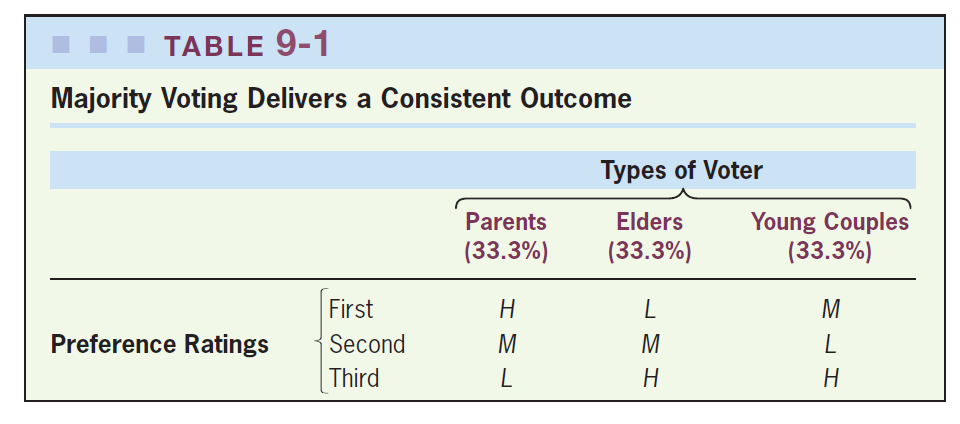
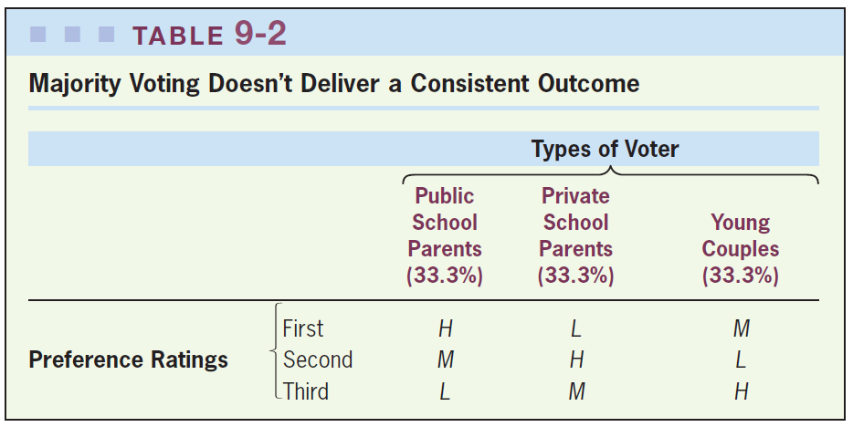
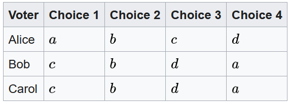
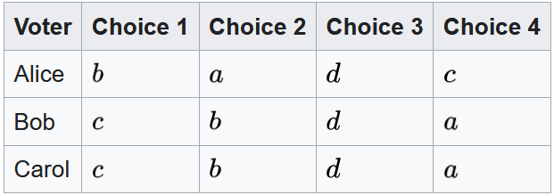
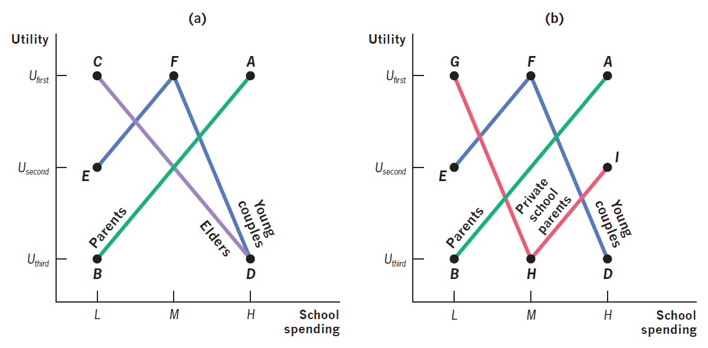
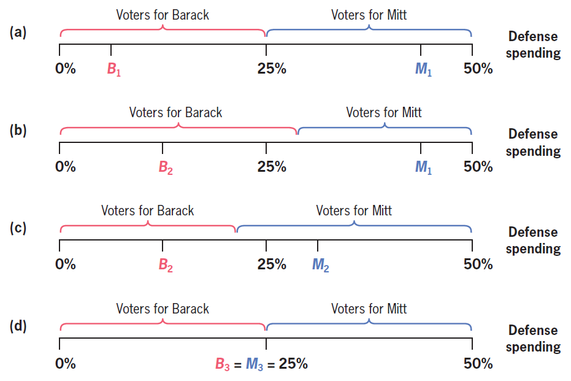

class: inverse, middle, center

```{r, load_refs, include=FALSE, cache=FALSE}
library(RefManageR)
BibOptions(check.entries = FALSE,
           bib.style = "alphabetic",
           cite.style = "alphabetic",
           style = "markdown",
           hyperlink = FALSE,
           dashed = FALSE)
myBib <- ReadBib("./esp_bib.bib", check = FALSE)
```

# Teoria da Escolha Social

---
class: middle
## Teoria da escolha social

Vimos na 1a semana que críticas à **comparabilidade interpessoal de utilidade** levaram à esperança que possamos definir uma *função de bem-estar social* partindo da *agregação de preferências* dos indivíduos, da mesma forma que definimos uma função de utilidade a partir das preferências individuais

(Já adiantei que não dá &mdash; *no caso geral* comparar utilidades é inevitável)

A **teoria da escolha social** aborda esse problema central da economia política de como escolher políticas públicas que reflitam de forma razoável as preferências dos indivíduos em uma sociedade

---
class: middle
## Agregando preferências

Se $u$ é uma função de utilidade, então para qualquer $f$ estritamente crescente, $f \circ u$ também é uma função de utilidade para as mesmas preferências

Ou seja, na decisão individual a função de utilidade é supérflua, o que importa são as preferências (ou equivalentemente as curvas de indiferença): o problema de decisão (sem risco!) dos indivíduos é um problema *ordinal*, não *cardinal*

Se tivermos $u^i$ para cada pessoa $i$ da sociedade, gostaríamos de dizer o mesmo sobre a função de bem-estar social $W = W(u^1, ..., u^I)$: que qualquer $\widetilde{W} = (f^1 \circ u^1, ..., f^I \circ u^I)$ representa a mesma função de bem-estar social

---
class: middle
## Agregando preferências

Podemos criar uma teoria de bem-estar que não dependa dos valores de utilidade (minha utilidade de comer uma maçã é $10$ ou $100$), mas apenas das preferências (prefiro maçã que pera)?

Uma forma de interpretar o *teorema da impossibilidade de Arrow* (ver, e.g., `r Citep(myBib, "roemer1998theories")`, cap. 1) é que ele diz: **Não!**

Para construirmos uma função de bem-estar social (isto é, fazer análise normativa utilitarista), precisamos de mais informação sobre como as utilidades dos diferentes indivíduos se comparam entre si **ou** restrições no conjunto admissível de preferências

---
class: middle
## Comparação interpessoal de utilidade

Mas quão pouco razoável é comparar utilidade entre pessoas, afinal?

Uma visão estrita da impossibilidade de CIU diria que não podemos afirmar que Nero queimar Roma é ruim, pois não podemos comparar o ganho de utilidade dele com a perda de utilidade de todos os romanos

De forma mais banal, cotidianamente comparamos utilidade dos outros, para decidir, por exemplo, para quem dar um chocolate

Na prática, em funções de bem-estar social economistas "se escondem" dessas dificuldades filosóficas assumindo funções de utilidade iguais para todos

---
class: middle
## Paradoxo de Condorcet

O método mais simples de eleição é o **voto majoritário** dois-a-dois &mdash; mas embora ele satisfaça propriedades 1-3, ele não é um ordenamento completo

Há formatos de preferências para as quais não há vencedor único do voto majoritário: a sociedade não consegue escolher entre políticas ou candidatos $x$ e $y$ &mdash; esse é o **paradoxo de Condorcet** (1785)

Uma alocação que vence todas as outras alocações em um voto majoritário dois-a-dois é chamada de **vencedor de Condorcet** &mdash; vamos mostrar que não é sempre que existe um vencedor de Condorcet (mas ele é sempre uma boa escolha quando existe)

---
class: middle

```{r, echo=FALSE, out.width = '90%'}

```

O voto majoritário (quando funciona) &mdash; $M$ é um **vencedor de Condorcet** `r Citep(myBib, "gruber")`

---
class: middle

```{r, echo=FALSE, out.width = '85%'}

```

Mas às vezes não funciona... (o **paradoxo de Condorcet**) `r Citep(myBib, "gruber")`

---
class: middle
## Condorcet e Arrow

O *paradoxo de Condorcet* é um paradoxo pois se esperaria que a transitividade das preferências individuais geraria preferências sociais transitivas (o que é em si uma *falácia de composição*)

O *Teorema da Impossibilidade de Arrow* é apenas uma generalização do paradoxo de Condorcet: *ciclos* desse tipo aparecem para **qualquer** regra de escolha social "razoável", não apenas para o voto majoritário

O TIA também é um balde de água fria no estudo de agregação de preferências (eleições): dadas condições bastante razoáveis para um processo eleitoral, não existe nenhum sistema que seja inteiramente satisfatório

---
class: middle
## Teorema da impossibilidade de Arrow

Considere as seguintes 4 propriedades (plausivelmente) desejáveis em uma *regra de escolha social*:

1. **Unanimidade:** [ou Propriedade de Pareto] se todo indivíduo prefere política $x$ à política $y$, então a sociedade também prefere $x$ a $y$
2. **Independência das alternativas irrelevantes:** as prefererências *sociais* entre $x$ e $y$ devem depender apenas das preferências *individuais* sobre $x$ e $y$ (e não, digamos, $z$)
3. **Domínio irrestrito:** os indivíduos podem ter quaisquer preferências sobre as políticas públicas
4. **Ordenação completa:** para todas as políticas $x$ e $y$, a sociedade ou prefere $x$ a $y$ ou $y$ a $x$

---
class: middle
## Teorema da impossibilidade de Arrow

**Teorema da impossibilidade de Arrow:** Suponha que há pelo menos 3 opções de políticas. Qualquer *regra de escolha social* que satisfaça 1-4 é ditadorial, ou seja, existe algum indivíduo que a preferência social vai ser sempre o que ele preferir

Note que a ditadura funciona *precisamente* porque nesse caso não é necessário comparar utilidades (o que importa é apenas a do ditador)

Podemos "evitar" essa conclusão pessimista do TIA restringindo que tipo de funções de utilidade as pessoas podem ter

---
class: middle
## Teorema de Gibbard-Satterthwaite

Até aqui assumimos que as pessoas revelam suas preferências de forma sincera (e já estava difícil!)

Mas no mundo real, temos uma dificuldade extra: em geral as pessoas vão ter incentivos para reportar preferências diferentes (o "voto útil", ou escolher um candidato para o 2o turno com maior chance)

Será que é possível desenhar sistemas eleitorais que garantam que as pessoas vão *votar sinceramente*?

Não! &mdash; **Teorema de Gibbard-Satterthwaite:** Se uma regra de votação com três ou mais alternativas não é ditadorial, então ela permite *voto estratégico* (é manipulável) 

---
class: middle

```{r, echo=FALSE, out.width="50%"}


```

Considere uma eleição por lista, em que a alternativa favorita ganha 3 pontos, a segunda 2, a terceira 1 ponto e a quarta zero (*contagem de Borda*)

Então o resultado com *voto sincero* é: $(a:3, b:6, c:7, d:2)$. Mas Alice tem incentivos de mentir e *votar estrategicamente* como no 2o painel, quando os pontos são $(a:2, b:7, c:6, d:3)$ &mdash; assim, o resultado é $b$, que Alice prefere ao resultado com voto sincero $c$: a contagem de Borda é **manipulável** [(Wiki)](https://en.wikipedia.org/wiki/Gibbard%E2%80%93Satterthwaite_theorem)

---
class: inverse, middle, center

# Economia Política

---
class: middle
## O paradoxo do voto

De um ponto de vista do processo eleitoral, ir votar só traz algum ganho se o indivíduo for **pivotal** para a eleição, isto é, se o voto dele alterar o resultado 

Em uma eleição majoritária, isso ocorre se e somente se a diferença de votos entre os candidatos for no máximo 1! Problema: na medida que o número de eleitores aumenta, a probabilidade de ser pivotal diminui exponencialmente

`r Citep(myBib, "myerson2000large")` calcula que em uma eleição com 5 milhões de eleitores, e uma probabilidade esperada de vitória de 50,1% (vs 49,9%), a probabilidade de um eleitor ser pivotal é de $8 \times 10^{-9}$


---
class: middle
## O paradoxo do voto

Isto implica que se o custo de votar é mero 1 centavo, então o benefício de seu candidato ganhar teria que ser ao menos R$ 85 milhões para valer a pena ir votar

Mas ainda assim as pessoas votam! Esse é o **paradoxo do voto**: se fossem racionais, as pessoas deveriam saber que a chance do seu voto afetar o resultado é basicamente nula, e portanto não deveriam querer ir votar

Várias teorias foram avançadas para tentar explicar esse comportamento "ilógico": dever cívico ou utilidade do voto, pressão social, e mobilização de grupos `r Citep(myBib, "feddersen2004rational")`

---
class: middle
## Teorema do eleitor mediano

Daqui em diante vamos restringir nossa atenção a casos em que existe *vencedor de Condorcet* e tentar dizer algo sobre qual será. A restrição mais comum sobre as preferências dos eleitores é de **single-peaked preferences**

Preferências single-peaked são aquelas que: (i) todo eleitor tem uma política preferida $x^*$; e (ii) se $y$ é mais próximo de $x^*$ que $z$, então o eleitor prefere $y$ a $z$ 

O **teorema do eleitor mediano** diz que se as preferências dos eleitores forem single-peaked, então existe um *vencedor de Condorcet*, e ele será o ponto ótimo para o eleitor com política preferida na mediana da distribuição $x^*_m$ (o **eleitor mediano**)

---
class: middle

```{r, echo=FALSE, out.width = '90%'}

```

Em (b), as preferências em vermelho não são single-peaked: não há vencedor de Condorcet `r Citep(myBib, "gruber")`

---
class: middle
## Democracia representativa

Até aqui, analisamos voto sobre políticas públicas diretamente, mas no mundo real eleitores votam em representantes

Downs (1957) dá uma predição muito forte sobre como se dará a eleição: ambos os candidatos oferecerão a política desejada pelo eleitor mediano e vencerão metade das vezes &mdash; nenhuma outra estratégia é um *equilíbrio de Nash*!

Mas isso só vale com 2 candidatos e quando a política pública é unidimensional &mdash; no mundo real o resultado não se aplica diretamente, mas vale a intuição de que candidatos *deveriam* tender a convergir para o centro

---
class: middle

```{r, echo=FALSE, out.width = '75%'}

```

Imagine que eleitores se distribuem uniformemente com política preferida entre 0% e 50% de gastos militares. Então o único equilíbrio de Nash é com os dois candidatos prometendo a política favorita do mediano: 25% `r Citep(myBib, "gruber")`

---
class: middle

```{r, echo=FALSE, out.width = '85%'}
knitr::include_graphics("figs/eae0310-5-4.png")
```

Há épocas em que o *eleitor mediano* explica bem a política, mas recentemente a polarização tem aumentado `r Citep(myBib, "gruber")`

---
class: middle

```{r, echo=FALSE, out.width = '85%'}
knitr::include_graphics("figs/eae0310-3-18.png")
```

Tradicionalmente, o teorema do eleitor mediano é aplicado na escala direita-esquerda, e principalmente com base na renda: o gráfico mostra que pessoas mais ricas sempre votaram mais para partidos de direita &mdash; no passado, isso também era verdade para pessoas mais educadas, mas recentemente isso se inverteu `r Citep(myBib, "gethin2022brahmin")`

---
class: middle

```{r, echo=FALSE, out.width = '50%', fig.show='hold'}
knitr::include_graphics("figs/eae0310-3-19a.png")
knitr::include_graphics("figs/eae0310-3-19b.png")
```

Isso leva `r Citep(myBib, "gethin2022brahmin")` a propor uma escala *bidimensional* de conflito político: uma dimensão de "conflito de classes", direita vs esquerda (baseada na renda), e uma dimensão sociocultural, de "cosmopolita vs nativista" (baseada em educação), e dois tipos de elites: a "direita mercantil" e a "esquerda Brahmin"


---
class: middle
## Lobbying

Lobbying é o gasto de recursos por **grupos de interesse** para influenciar políticos

Ele não é de todo ruim: lobbies conhecem bastante sobre um assunto e podem ajudar a informar políticos sobre assuntos que estes não conheçam tão bem

Também há lobbies (plausivelmente) positivos: Todos pela Educação, SOS Mata Atlântica, etc

Mas lobbies recompensam políticos que apoiam suas visões, especialmente com contribuições de campanha, e nisso o lobby transforma *poder econômico* em *poder político*

---
class: middle
## Lobbying

O **teorema do valor mediano** ignora intensidade das preferências &mdash; se 49% da população dá um valor de `$`1000 para uma política com custo `$`200, mas 51% dá valor `$`0, então ela não é implementada, mesmo que eficiente

Lobby então pode ser uma forma dos eleitores com valor alto demonstrarem a intensidade das suas preferências, e aumentar eficiência. Porém:

> As Vilfredo Pareto pointed out, in a famous passage, if "a certain measure A is the case of the loss of one franc to each of a thousand  persons,  and of a thousand franc gain to one  individual, the latter will expend a great  deal of energy, whereas the former will resist  weakly; and it is likely that, in the end, the person who is attempting to secure the thousand francs via A will be successful.

---
class: middle
## Corrupção

A economia política estuda também situações quando o governo não quer (ou não consegue) agir no interesse público, que chamamos de **falhas de governo**

Talvez a principal dessas falhas de governo seja *corrupção* &mdash; mas note que se a corrupção é apenas transferência de rendas econômicas para políticos e outros agentes, ela não gera ineficiências

Considere dois cenários: (i) o salário de político A é `$`30, mas ele recebe `$`10 por superfaturamento de combustível; e (ii) o salário do político A é `$`40

Ou mesmo: (i) monopolista B faz obra com custo econômico `$`800, recebe do governo `$`1000 e paga `$`200 a acionistas; ou (ii) ela paga ao contrário `$`200 de propina

---
class: middle
## Corrupção

Na prática, corrupção (quase) nunca é pura transferência de rendas: atividades ilegais geralmente envolvem gerar peso morto para a sua ocultação

Corrupção também está frequentemente ligada a escolha de políticas públicas que favorecem *special interests* contra o bem comum &mdash; além disso, estimula investimentos com baixo custo-benefício que sejam fáceis de corromper

Outro custo econômico da corrupção é que ela incentiva maior burocracia (*red tape*) no serviço público: se abrir uma firma demora 90 dias, há um espaço para pedir propina para fazer isso em 10

---
class: middle
## Corrupção

No mundo real, a corrupção tem efeitos negativos relevantes: `r Citep(myBib, "ferraz2012corrupting")` encontram que nos municípios brasileiros em que corrupção foi encontrada em auditorias, notas são 0,35 std menores e taxas de abandono são maiores 

Ainda assim, é importante dimensionar corretamente a importância da corrupção para a produtividade do setor público

`r Citep(myBib, "bandiera2009active")` mostram que na Itália disperdício *ativo* (corrupção) representa apenas 17% do disperdício geral do setor público, o resto sendo disperdício *passivo* (falta de esforço, incompetência, falta de autonomia, evitar reclamações ou investigações)

---
class: middle
## Corrupção

Uma forma de manter em cheque a corrupção é **accountability eleitoral**: se políticos querem manter seus mandatos, eles vão evitar se corromper caso isso lhes custe votos

Analisando auditorias aleatórias da CGU, `r Citep(myBib, "ferraz2008exposing")` mostra que de fato informação sobre corrupção diminui drasticamente as chances de reeleição

Ademais, políticos com incentivos eleitorais (que podem se reeleger) roubam 27% a menos que aqueles que não podem `r Citep(myBib, "ferraz2011electoral")`

`r Citep(myBib, "campante2014isolated")` mostram que, nos EUA, estados com capitais distantes dos grandes centros urbanos (menos *accountability*) têm mais casos de corrupção

---
class: inverse, middle, center

# Acemoglu & Robinson (2013). "Economics versus Politics: Pitfalls of Policy Advice"

---
class: middle
## Third-best

Vimos que a alocação do 2o Teorema do Bem-estar é chamado de **first-best**. No mundo real, não possuímos *transferências lump-sum* (por assimetrias informacionais), então em geral temos que nos contentar com o **second-best** 

A literatura de economia política introduz uma nova complicação: alocações econômicas podem ser restritas em relação ao melhor possível não apenas por diferenças informacionais, mas também por *restrições políticas*

Chamamos as alocações que maximizam o bem-estar social dados os instrumentos disponíveis e as possibilidades políticas de **third-best** 

---
class: middle
## Boa economia pode ser má política

`r Citep(myBib, "acemoglu")` argumentam que sugestões de política pública que ignorem as suas consequências políticas podem gerar mais malefícios que ganhos, mesmo que levem a ganhos de eficiência econômica

Na presença de considerações de economia política, *análise de custo-benefício* não é suficiente!

Ao desenvolver políticas públicas devemos identificar situações em que economia e política entram em conflito

Não levar isso em conta é boa parte da razão do insucesso das prescrições de políticas para o desenvolvimento na segunda metade do século 20

---
class: middle
## Boa economia pode ser má política

Pense num administrador ("benevolente") tomando decisão de política pública em dois períodos

Se não há conexão entre os períodos, então ele apenas vai escolher em cada momento a política que maximize o bem-estar social instantâneo

Mas em geral decisões no primeiro período vão alterar a **correlação de forças** no segundo período

Então devemos levar em conta que: (i) poder econômico e político está conectado; e (ii) muita concentração de poder político em um grupo pode ter efeitos deletérios 

---
class: middle
## Boa economia pode ser má política

Nesse sentido, devemos evitar políticas públicas que dêem mais poder aos grupos já dominantes ou enfraqueçam grupos que contrabalanceam estes

Exemplo: a quebra de monopólios sindicais pode aumentar a eficiência ao reduzir falhas de mercado(*), mas enfraquece sindicatos que contrabalanceiam politicamente o poder dos mais ricos

Outro perigo é que remover falhas de mercado que geram renda econômica a certos grupos pode alterar as **restrições de compatibilidade de incentivos políticas** &mdash; a falta de renda para distribuir a grupos de suporte enfraquece o governo e gera instabilidade institucional

---
class: middle
## Rendas econômicas e organização política

*Rendas econômicas* geram incentivos para organização política (geralmente chamado pejorativamente de **comportamento rent-seeking**)

Do ponto de vista negativo, rent-seeking faz empresas e indivíduos direcionarem recursos de investimentos econômicos para o *lobby político* 

Mas nem sempre essa organização política é negativa para a sociedade: economistas devem levar em conta quando formulando políticas públicas como políticas econômicas afetam os incentivos para organização política de diferentes grupos

---
class: middle
## Rendas econômicas e organização política

> Because elites know that violence will reduce their own rents, they have incentives not to fight. Furthermore, each elite understands that other elites face similar incentives. In this way, the political system of a natural state manipulates the economic system to produce rents that then secure political order.

> [T]he appropriate counterfactual from eliminating rents is not a competitive market economy... but a society in disorder and violence.

`r Citep(myBib, "north2013shadow")` apud `r Citep(myBib, "acemoglu")`

---
class: middle
## Sindicatos

O propósito (econômico) de sindicatos é criar poder de monopólio na oferta de trabalho e assim gerar *rendas econômicas* para os seus membros (potencialmente a custo de maior desemprego)

Sindicatos também podem gerar outras distorções, como impedir avanços tecnológicos (e.g. cobrador ou frentista): por isso, uma recomendação usual de política por muito tempo foi restringir poder dos sindicatos

Mais recentemente se tem dado valor ao seu papel de contrabalancear **poder de monopsônio** dos empregadores e como redistribuição de renda (*falácia do 2o TBE*)

---
class: middle
## Sindicatos

Mas sindicatos não apenas barganham por maiores salários, mas também são ativos politicamente &mdash; contrabalanceando (apenas em parte!) o poder político disproporcional de **grupos de interesses** empresariais

Por exemplo, sindicatos têm sido extremamente importantes historicamente (e ainda hoje) no estabelecimento e consolidação das democracias ocidentais

Como sindicatos são formas de organização institucional dos trabalhadores, eles facilitam a **ação coletiva** e evitam comportamento *free rider* na política

---
class: middle
## Sindicatos

> I think we can’t separate economic and political factors... The (...) struggle was over wages, but in struggling for wages, the working class won a political victory (Lula em Keck, 1992, apud `r Citep(myBib, "acemoglu")`)

Nos EUA, por exemplo, políticas "anti-union" reduziram à metade a proporção de trabalhadores sindicalizados desde 1950: hoje se acredita que isso é parte essencial da explicação do aumento de desigualdade naquele país

Mais discutivelmente, pode ser parte da explicação para o aumento estratosférico na remuneração dos CEOs e na deregulamentação financeira que levou à crise de 2008

---
class: middle
## Riqueza natural

A economia política já prevê que a forma de acesso às riquezas naturais é importante: Botswana com diamantes profundos (GDP pc 15k PPP) vs Sierra Leone com diamantes fluviais (GDP pc 1.7k PPP)

Mas escolhas econômicas também importam! Diamantes fluviais geram um **problema dos comuns** (semana que vem)

Uma solução possível é atribuir *direitos exclusivos de propriedade* (Sierra Leone), outro possível é deixar pequenos mineradores se organizar em cooperativas e similares (Austrália)

---
class: middle
## Riqueza natural

Geralmente economistas favorecem a primeira opção como mais eficiente(*)

Mas isso ignora os efeitos políticos! Comunas favorecem a organização dos trabalhadores para manter e aumentar as suas *rendas econômicas* &mdash; inclusive politicamente, com a busca de **poder político de jure** (e.g. sufrágio)

Enquanto no 1o caso, o valor gigantesco dos direitos exclusivos de propriedade sobre as riquezas naturais dá incentivos aos seus donos de usar de força militar e rígido controle político (*autocracia*) para manter seu monopólio

---
class: middle
## Desigualdade

Economia política também é outra razão pela qual o 2o TBE é uma falácia &mdash; mudanças na distribuição de renda afetam a correlação de forças na sociedade, e mudam quais alocações são politicamente factíveis no futuro

Nos EUA, deregulamentação do setor financeiro no início razoável (economicamente) aumentou drasticamente o poder político do setor, que pode então influir politicamente para mudanças mais drásticas (**slippery slope**)

Entre 1980 e 2005, lucro no setor financeiro cresceu 800%, e doações de campanha subiram para $260mi (2,6x mais que o 2o maior doador, setor de saúde)

---
class: middle
## Privatização (na Russia)

A visão dominante na década de 90 era que a privatização das estatais russas não era apenas bom economicamente, mas também politicamente (*good economics is good politics*)

> [A]t least in Russia, political influence over economic life was the fundamental cause of economic inefficiency, and the principal objective of economic reform was, therefore, to depoliticize economic life... Privatization fosters depoliticization because it robs politicians of control over firms. (Boycko et al, 1995, apud `r Citep(myBib, "acemoglu")`)

Mas esse processo gerou uma classe oligárquica, o que também gerou resistência ao processo de reformas e retorno do autoritarianismo, terminando em um *state-led crony capitalism*

---
class: middle
## Restrições políticas de compatibilidade de incentivos

Políticas economicamente ineficientes podem ser importantes por sustentar possíveis coalizões políticas governantes

[Acemoglu et al (2008)](https://voxeu.org/article/central-bank-independence-failures-successes-and-seesaw-effect) argumenta que independência do Banco Central só funciona para casos "intermediários" de instituições &mdash; quando elas são boas, é supérfluo, quando são ruins, há resistência e não funciona

`r Citep(myBib, "acemoglu")` dão o exemplo de reformas do FMI em Ghana: duas semanas depois de acatadas, o presidente sofreu um golpe militar e elas foram revertidas (*seesaw effect*)

Mais polêmico, pode se argumentar algo parecido sobre a corrupção estatal no Brasil, que possibilitava uma coalizão governamental estável e democrata

---
class:middle
# Referências
<small>
```{r refs, echo=FALSE, results="asis"}
PrintBibliography(myBib, start=1, end=5)
```
</small>

---
class:middle
# Referências
<small>
```{r refs2, echo=FALSE, results="asis"}
PrintBibliography(myBib, start=6)
```
</small>

<!-- class: middle -->
<!-- ## A impossibilidade do liberal Paretiano -->

<!-- Já que estamos falando de teoremas de impossibilidade, esse é um interessante de Amartya Sen em 1970. Considere a seguinte Propriedade 5: -->

<!-- <ol start="5"> -->
<!-- <li><b>Liberalismo:</b> existe pelo menos uma escolha (um "direito individual", e.g. não ler um livro ofensivo) que se a pessoa escolhe x sobre y, então a sociedade escolhe x sobre y</li> -->
<!-- </ol> -->

<!-- **Impossibilidade do liberal Paretiano:** Não há regra de escolha social que satisfaça simultaneamente condições 1 (unanimidade), 4 (ordenação completa) e 5 (liberalismo) -->

<!-- Esse teorema mostra que podemos sempre achar preferências que coloquem em choque o princípio da *unanimidade* com os direitos individuais -->

<!-- --- -->
<!-- class: middle -->
<!-- ## A impossibilidade do liberal Paretiano -->

<!-- Pense no seguinte caso: há 2 pessoas: um libidinoso e um puritano. Eles têm que decidir o que fazer com um livro sexualmente explícito -->

<!-- O sujeito libidinoso quer ler o livro, mas prefere ainda mais que o puritano o leia (e se escandalize). O puritano não quer ler o livro, mas prefere que ele leia (sem gostar) que o libidinoso leia (e goste) -->


<!-- O paradoxo de Sen só pode surgir quando indivíduos  -->

