class: inverse, middle, center

```{r, load_refs, include=FALSE, cache=FALSE}
library(RefManageR)
BibOptions(check.entries = FALSE,
           bib.style = "alphabetic",
           cite.style = "alphabetic",
           style = "markdown",
           hyperlink = FALSE,
           dashed = FALSE)
myBib <- ReadBib("./esp_bib.bib", check = FALSE)
```

# Externalidades

---
class: middle
## Externalidades

*No mercado perfeitamente competitivo*, os interesses do produtor e da sociedade são completamente sincronizados (*mão invisível*)

> Não é da benevolência do açougueiro, do cervejeiro e do padeiro que esperamos o nosso jantar... (Smith)

O custo individual marginal de produção (CMg) é o **custo marginal social** e o benefício marginal da firma (o preço dado) é o **benefício marginal social**


---
class: middle
## Externalidades

Isso que está por trás do 1º TBE: cada agente maximizando seu problema social faz o mesmo que faria um *ditador benevolente*, pois os seus incentivos individuais são os mesmos dos sociais

Uma *falha de mercado* é qualquer tipo de "cunha" entre o custo/benefício individual e o social &mdash; o que inviabiliza o 1º TBE

Por exemplo, quando o processo produtivo de uma firma reduz o bem-estar de outros (poluição) e não os compensa por isso, ela está gerando **externalidades negativas** na produção


---
class: middle

```{r, echo=FALSE, out.width = '60%'}
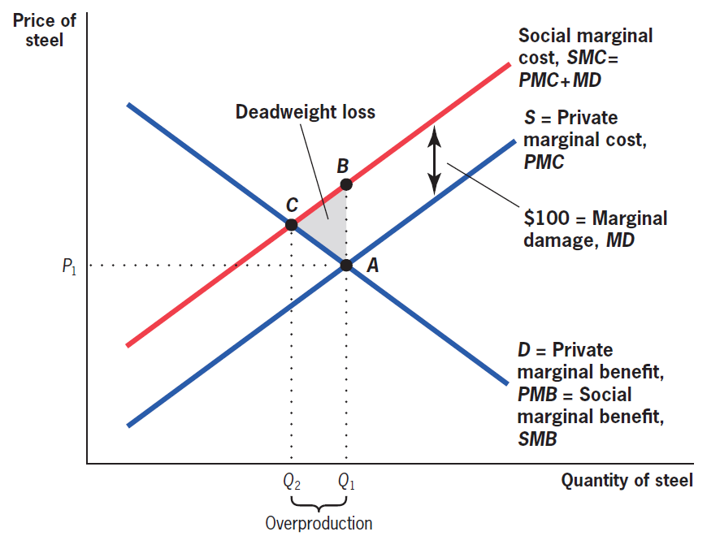
```

Externalidades negativas fazem com que o custo marginal privado seja menor que o custo marginal social, acarretando sobreprodução e peso morto &mdash; o equilíbrio de mercado não é **eficiente de Pareto** `r Citep(myBib, "gruber")`

---
class: middle
## O teorema de Coase

Externalidades são um problema de *mercados incompletos*: se pudessemos **internalizar** o efeito externo criando um mercado para ele, resolveríamos o problema

Esse é o princípio por trás do **Teorema de Coase**: se os *direitos de propriedade* forem bem definidos e não houver **custos de transação**, o mercado pode resolver a externalidade sozinho

*Segunda parte do Teorema de Coase:* o resultado da barganha de Coase independe de quem possui os direitos de propriedade (mas a incidência com certeza depende!)

---
class: middle
## Problemas com o teorema de Coase

É difícil determinar precisamente quem está gerando a externalidade (uma certa empresa produz que proporção da poluição do Tietê?), quais os danos que a externalidade gera e para quem precisamente

**Problema de holdout:** se vários indivíduos possuem o direito de propriedade, cada um deles tem o poder sobre os outros de bloquear a negociação &mdash; o último vendedor pode cobrar todo o valor do direito de propriedade

Se vários indivíduos estão do lado *sem* o direito de propriedade, então a barganha de Coase se torna um problema de contribuição privada para um bem público, gerando efeito de **free rider**

---
class: middle
## A economia do spam eletrônico

`r Citep(myBib, "rao")` estuda as externalidades geradas pelo spam eletrônico (e-mail)

Um estudo observou 347 milhões de envios de spam: 83 milhões não foram impedidos por IP black-listing (23%), dessas 4,2 milhões não caíram na caixa de spam (1,2%), que geraram 10.500 cliques na propaganda (0,003%), gerando uma compra a cada 375 cliques (28 compras)

90 bilhões de e-mails de spam foram enviados por dia em 2010: se 1,2% cai na caixa de entrada, e levam 5 segundos para lidar, se o valor do tempo é `$`25/hora, o custo é `$`14bi por ano &mdash; além de `$`6bi por ano em gastos com tecnologia anti-spam

---
class: middle

```{r, echo=FALSE, out.width = '100%'}
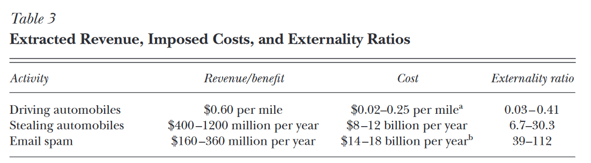
```

Estima-se que o lucro com spam seja entre `$`180-360 milhões anuais: *ineficiência gigantesca da ordem de 100-1* (!) &mdash; a razão entre a externalidade negativa gerada e os ganhos privados no mercado de spam eletrônico é 3 ordens de magnitude maior que em outras atividades econômicas `r Citep(myBib, "rao")`

---
class: middle
## Soluções governamentais

Como o governo deve intervir para solucionar externalidades?

Uma forma possível é intervindo no mecanismo de preços de forma a igualar o CMg *privado* do tomador de decisões com o CMg *social* (**taxação de Pigou**) &mdash; ou analogamente, subsidiar atividades que gerem externalidades positivas

Outra alternativa é o governo regular diretamente a quantidade de produção que gera externalidade (**quotas**) &mdash; economistas tendem a preferir a 1ª solução, por ser uma interferência "mais leve" no mecanismo de mercado

---
class: middle
## Soluções governamentais

Com várias firmas com custos diferentes, quotas não permitem que as firmas com custo menor reduzam mais a externalidade: remove o conteúdo informacional do mecanismo de preços

Mas isso pode ser resolvido impondo **quotas com tradeable permits**: o total é fixo, mas firmas mais produtivas podem comprar permissões  (que para elas são mais valiosas) das firmas menos produtivas

A grande diferença entre quotas e taxação aparece quando há **incerteza sobre o custo marginal da redução de externalidades**: nesse caso, qual é melhor vai depender de quão custoso é gerar um pouco mais externalidade do que o planejado

---
class: middle

```{r, echo=FALSE, out.width = '70%'}
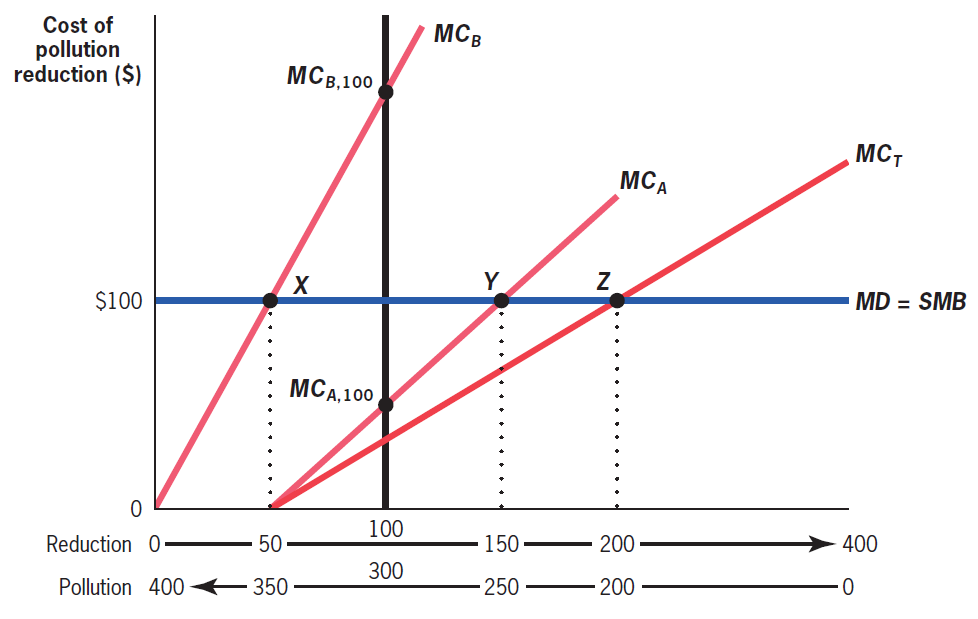
```

Se o governo quer reduzir emissão a 600 unidades, uma quota de 300 unidades por planta é ineficiente, pois o CMg dessa redução para a planta $B$ é muito maior do que para $A$ &mdash; se essa quota for comercializável, a firma $A$ vende 50 "emissões" para a planta $B$, e o eficiente é alcançado `r Citep(myBib, "gruber")`

---
class: middle

```{r, echo=FALSE, fig.show="hold", out.width = '50%'}
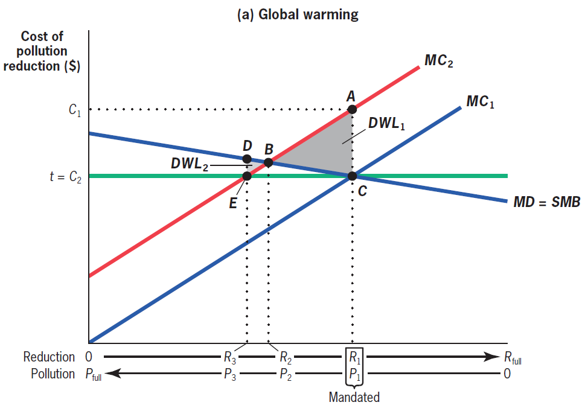
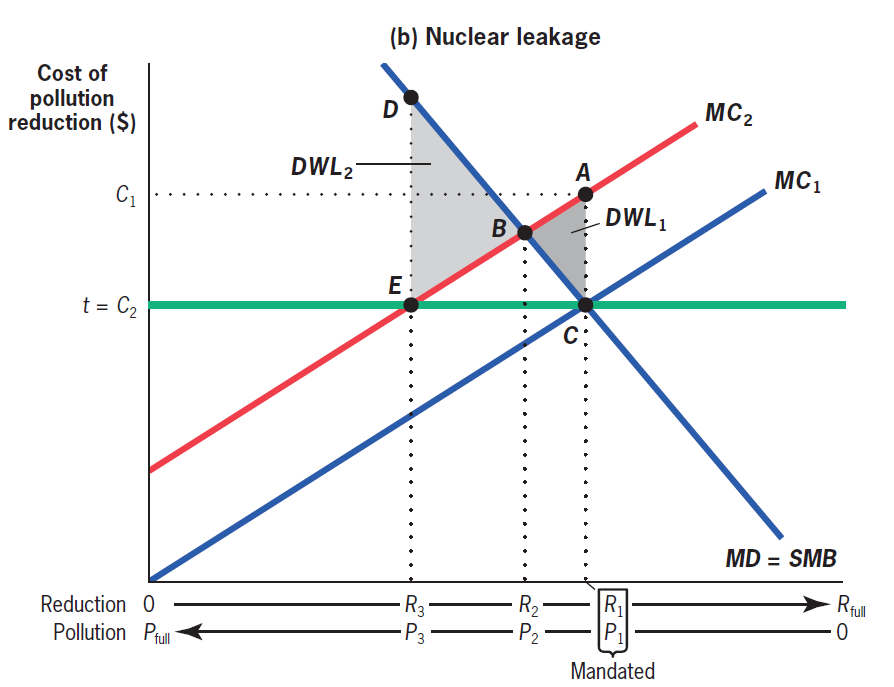
```

Comparação entre quotas e impostos quando erramos o custo marginal da redução de poluição de $MC_1$ para $MC_2$ &mdash; se o dano marginal cresce drasticamente, como vazamento nuclear em (b), o peso morto de taxação $DWL_2$ é maior; se cresce lentamente (a), o peso morto da quota $DWL_1$ é maior `r Citep(myBib, "gruber")`
 
---
class: middle
## Tabagismo

Cigarro mata mais de 8 milhões de pessoas por ano no mundo, sendo 1,2 milhões fumantes passivos (OMC)

No Brasil são 161 mil mortes evitáveis por ano: 37 mil DPOC, 33 mil doenças cardíacas, 24 mil câncer de pulmão, 25 mil outros cânceres, 12 mil pneumonia e 10 mil AVC `r Citep(myBib, "INC")` &mdash; mas isso não é externalidade! 

Na verdade, se o fumante por morrer cedo deixar de receber aposentadoria, então isso é uma externalidade *positiva* (o Brasil tem pensão estatal por morte, o que contrabalanceia esse efeito)

---
class: middle

```{r, echo=FALSE, out.width = '75%', fig.align="center"}
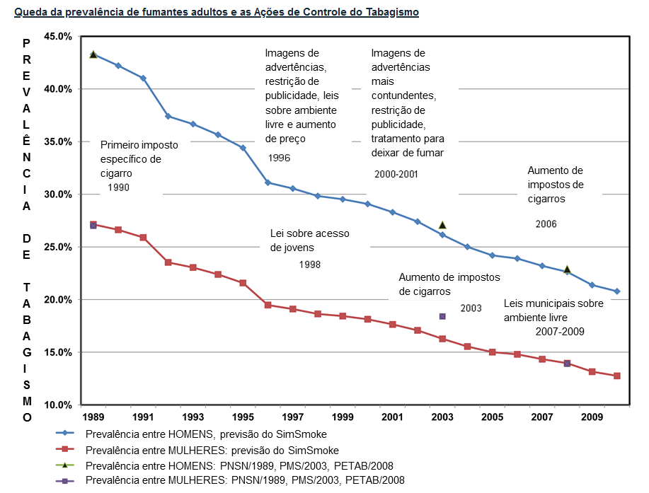
```

Em 1989, quase metade dos homens e mais de 1/4 das mulheres fumava. Desde então, esse número caiu pela metade, levado por mudanças culturais, mas também várias políticas públicas focadas no problema `r Citep(myBib, "INC")`

---
class: middle
## Quantificando externalidades

Estima-se que o tabagismo custe R`$`70 bilhões em tratamentos médicos e gere perdas de R`$`42 bilhões em anos potenciais de vida perdidos &mdash; *externalidade*?

O Brasil consumiu em 2018 106 bilhões (!!) de cigarros (IBOPE), então mesmo se apenas 50% do custo acima for externalidade, isso dá R`$`10,00 de externalidades por maço (com 20)

Ainda que no Brasil, quase 80% do preço do cigarro é imposto, que soma ICMS, IPI e uma taxa fixa $\approx$ 5 reais por maço de imposto, parece que a taxação ainda é menor que o necessário para corrigir as externalidades

---
class: middle
## Quantificando externalidades

O nosso cálculo foi "de padeiro" &mdash; estimativas mais cuidadosas existem para os EUA: `r Citep(myBib, "gruber2001tobacco")` estima que nos EUA a externalidade é de 52¢, metade do imposto de lá (ver também `r Citep(myBib, "chaloupka2000economics")`)

`r Citep(myBib, "manning1989taxes")` faz uma discussão de como calcular essas externalidades: 27¢ de externalidade *positiva* por mortes prematuras &mdash; 3¢ casas de repouso, 24¢ aposentadoria &mdash; de externalidade negativa: custos médicos 26¢, licença por doença 3¢, seguro de vida em grupo 5¢, incêndios 2¢

Como as externalidades ocorrem no futuro, precisamos levar em conta a taxa de desconto (acima, 5%)

---
class: middle
## Quantificando externalidades

Se custos de saúde pagos pelo fumante e sua morte não geram externalidades (mas talvez *internalidades*), para **fumantes passivos** (ETS) provavelmente sim

O principal afetado pelo ETS é a família: 19¢ pela mortalidade de cônjuges, 19¢ por morte de fetos, 3¢ por mortalidade infantil, familiares mortos em incêndios 9¢ &mdash; para precificar esses custos, precisamos de uma *estimativa do valor da vida humana*

Mas se o fumante leva em conta a utilidade da família na sua decisão (duvidoso), então a externalidade é *internalizada*, e no modelo econômico não deve ser levada em conta

---
class: middle

```{r, echo=FALSE, out.width = '100%'}
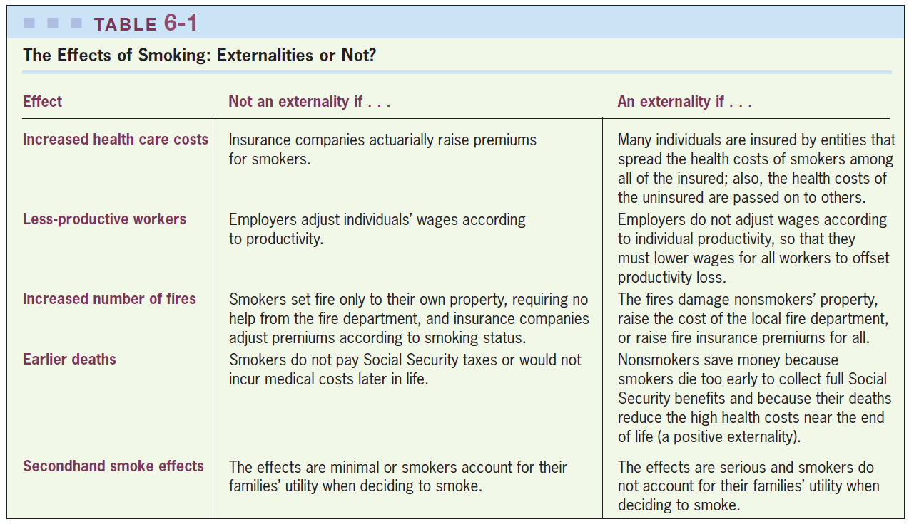
```

---
class: middle
## Taxando cigarro

Um problema é que tabagismo é bastante concentrado nos mais pobres &mdash; tributação de cigarro é bastante **regressiva**

Outro problema é **evasão fiscal**: contrabando responde por 57% dos cigarros consumidos no país (IBOPE) 

Então, por mais que demanda por cigarro seja inelástica (estima-se que por volta de $-0.4$), a elasticidade da demanda por cigarro *legal* pode ser bem alta &mdash; fazendo com que taxação seja ineficaz e cause peso morto elevado

---
class: middle
## Internalidades

Como vimos, quando consumidores são inteiramente *racionais* e sabem os efeitos do cigarro,  161 mil mortes evitáveis por ano não é argumento econômico para intervenção estatal

E ser um vício? Para um agente otimizador, isso não é um problema: ele escolheu começar a fumar numa **otimização intertemporal** sabendo que cigarro vicia (*vício racional*)

No passado, qualquer tentativa estatal de prevenir "más decisões" era considerado (pejorativamente) paternalismo. Hoje é mais popular a visão de que há um papel do Estado de corrigir erros de decisão (**internalidades**)

---
class: middle
## Internalidades

Nos EUA, de todos os adultos que fumam, 75% começam a fumar antes dos 19 anos &mdash; idade plausivelmente mais vulnerável a marketing e pressões sociais

Uma pesquisa perguntou a adolescentes fumantes se estariam fumando em 5 anos e depois checaram. Daqueles que falaram que não estariam, 74% continuaram fumando 

8 em cada 10 fumantes querem parar de fumar, e o fumante médio tenta parar uma vez a cada 8 meses &mdash; **problema de auto-controle**


---
class: middle
## Internalidades

**Desconto hiperbólico:** pessoas preferem `$`100 hoje que `$`200 em 2 anos, mas preferem `$`200 em 8 anos que `$`100 em 6 &mdash; isso gera demanda por **instrumentos de comprometimento** &mdash; por exemplo, poupança compulsória ou anuidade em academia

Se fumantes cometem erros quando jovens e gostariam de parar mas não conseguem, então o cigarro também gera uma **internalidade negativa**

`r Citep(myBib, "FRIEDSON2023104877")` encontram que um aumento de 1 dólar no imposto de cigarros entre 14-17 diminui em 8% a chance de estar fumando quando adulto e em 4% a mortalidade &mdash; um efeito da *formação de hábitos*

---
class: middle
## Internalidades

Internalidades funcionam exatamente como externalidades: o governo pode ajudar taxando o bem de forma a igualar o custo marginal *presumido* de fumar com o custo marginal *real*

Internalidades podem ser gigantescas! Se fumar custa a uma pessoa em média 6 anos a menos de vida, e se o valor dado a um ano extra de vida é 200 mil dólares, então o custo é `$`35 por maço

Então mesmo se o fumante subestima só em 10% o seu custo pessoal de fumar, isso dá um imposto 3,5x maior que é cobrado hoje!

---
class: middle

<!-- <iframe src="https://ourworldindata.org/grapher/share-of-tobacco-retail-price-that-is-tax" loading="lazy" style="width: 100%; height: 600px; border: 0px none;"></iframe> -->

```{r, echo=FALSE, out.width = '80%'}
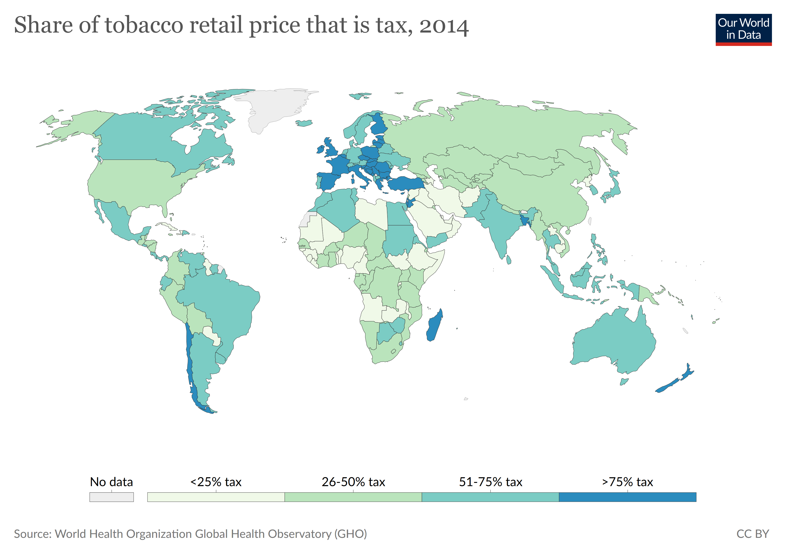
```

Por causa da taxação corretiva, em quase todo o mundo impostos formam parte importante do preço dos cigarros &mdash; em vários países, como o Brasil, é mais da metade do preço final, e na maior parte da Europa é mais de 3/4

---
class: middle

<!-- <iframe src="https://ourworldindata.org/grapher/share-of-tobacco-retail-price-that-is-tax" loading="lazy" style="width: 100%; height: 600px; border: 0px none;"></iframe> -->

```{r, echo=FALSE, out.width = '80%'}
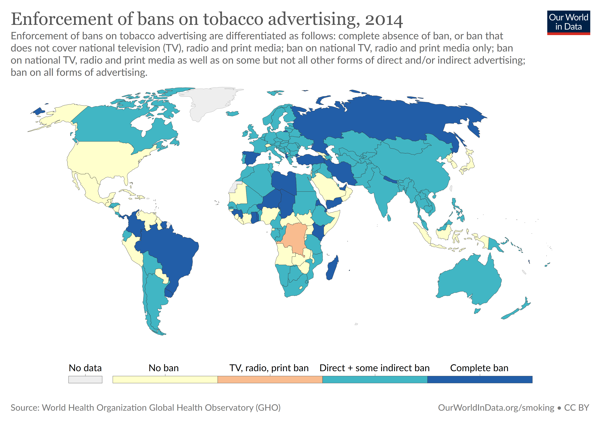
```

A visão de que *internalidades* estimulam o consumo de cigarros levou boa parte dos países (como o Brasil) a ir além do mecanismo de preços para desincentivar o consumo, com políticas como o banimento da propaganda de tabaco

---
class: middle
## Álcool

Mais de 600 mortes por ano com suspeita de embriaguez só no ESP, 42% do total (G1) &mdash; outra externalidade é a violência: o consumo de álcool está por trás de 18% dos casos de violência doméstica (OMS)

`r Citep(myBib, "manning1989taxes")` estima as externalidades para os EUA em `$`1.2 por ounce (30ml) de álcool puro &mdash; mas a teoria diz que devemos sempre taxar **precisamente a atividade que gera externalidades**

Taxação de álcool diminui muito (ineficientemente) o consumo entre quem não dirige embriagado nem é violento, mas apenas dando multas para direção alcoolizada dificilmente conseguimos dissuadir o suficiente essa prática

---
class: middle
## Evidência empírica (álcool)

Em geral gostaríamos de comparar a saúde (*potencialmente* internalidade) e comportamento indesejável (externalidade) de quem bebe álcool com quem não bebe &mdash; problema: são diferentes em várias dimensões

Aumento da idade mínima para 21 em alguns estados dos EUA (**quasi-experimento**) nos anos 1980: jovens que podiam beber aos 18 consumiram 6-17% mais álcool entre 18-21 *e* quando mais velhos (**formação de hábitos**)

Estudos encontraram também aumento de 17% em mortes na direção entre jovens e maior probabilidade de mães adolescentes dar a luz a crianças com resultados de saúde pior (peso menor e prematuros)

---
class: middle

```{r, echo=FALSE, out.width = '90%'}
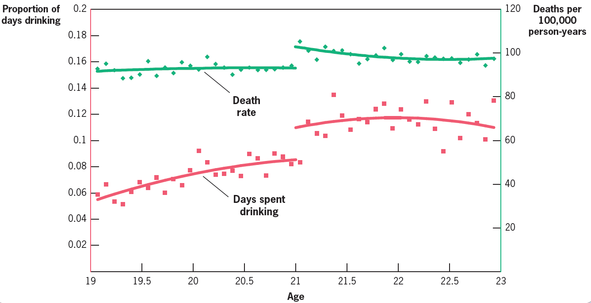
```

Jovens algumas semanas antes do 21º aniversário (idade mínima do consumo legal de álcool) nos EUA bebem 30% menos dias e tem taxa de morte 9% menor que jovens algumas semanas depois (rendimento acadêmico também cai): proibições legais são eficazes em reduzir externalidades/internalidades `r Citep(myBib, "gruber")`

---
class: inverse, middle, center

# Aquecimento global

---
class: middle

```{r, echo=FALSE, out.width = '90%'}
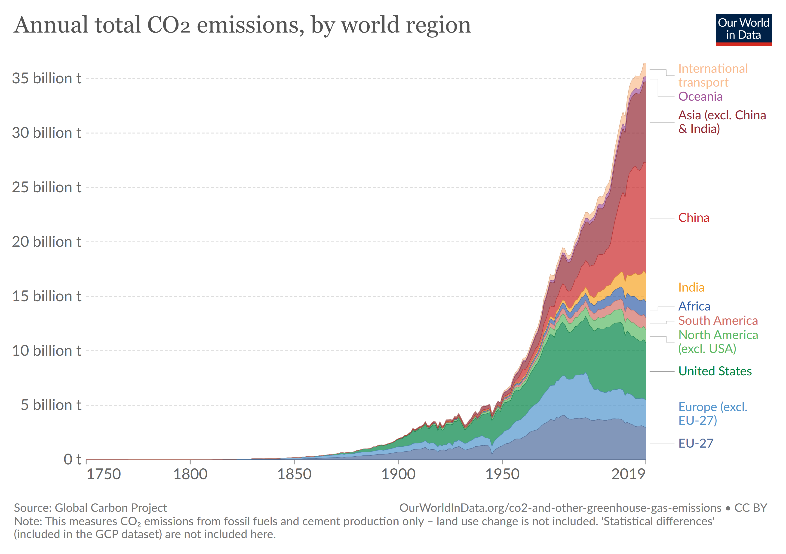
```

A emissão de poluentes cresce de forma constante e exponencial desde a Revolução Industrial, mas a fonte de emissões mudou: se até 1950 quase toda a emissão vinha da Europa e EUA, hoje mais da metade é da Ásia (esp. China)

---
class: middle

```{r, echo=FALSE, out.width = '90%'}
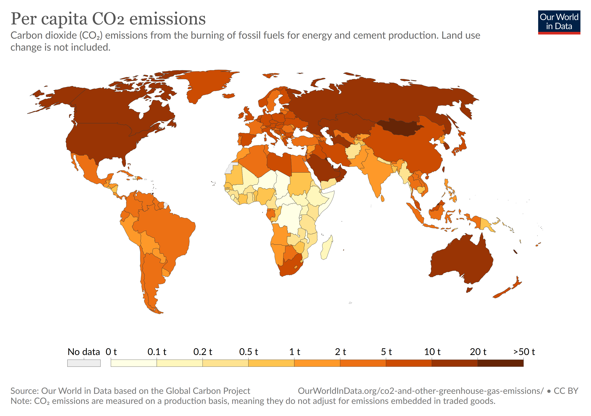
```

Ainda assim, vista por habitante, as emissões ainda são concentradas nos países ricos, especialmente os EUA, maior poluídor mundial

---
class: middle

```{r, echo=FALSE, out.width = '90%'}
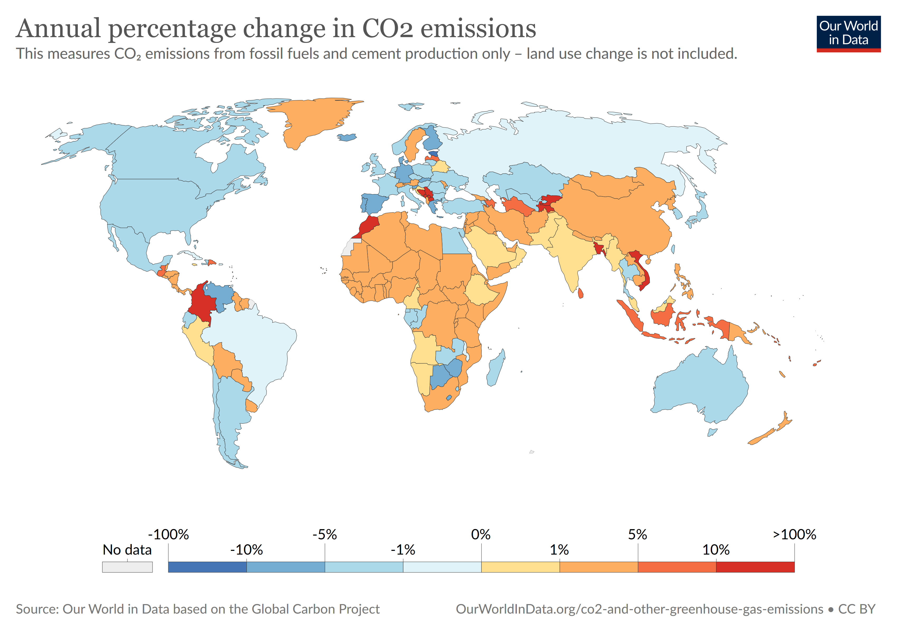
```

O problema é de primeira derivada: a maior parte dos países desenvolvidos (especialmente a Europa) têm reduzido emissões, enquanto países em desenvolvimento, e mais grave a China, continuam a aumentar

---
class: middle

```{r, echo=FALSE, out.width = '80%'}
knitr::include_graphics("figs/eae0310-2-11.png")
```

Outra forma interessante de olhar é cumulativamente: de 1750 até 2017, os EUA são responsáveis por 1/4 das emissões globais, a Europa 22% e a China 13% &mdash; embora tenha começado muito mais tarde, como as emissões crescem exponencialmente, décadas recentes são mais importantes

---
class: middle

```{r, echo=FALSE, out.width = '100%'}
#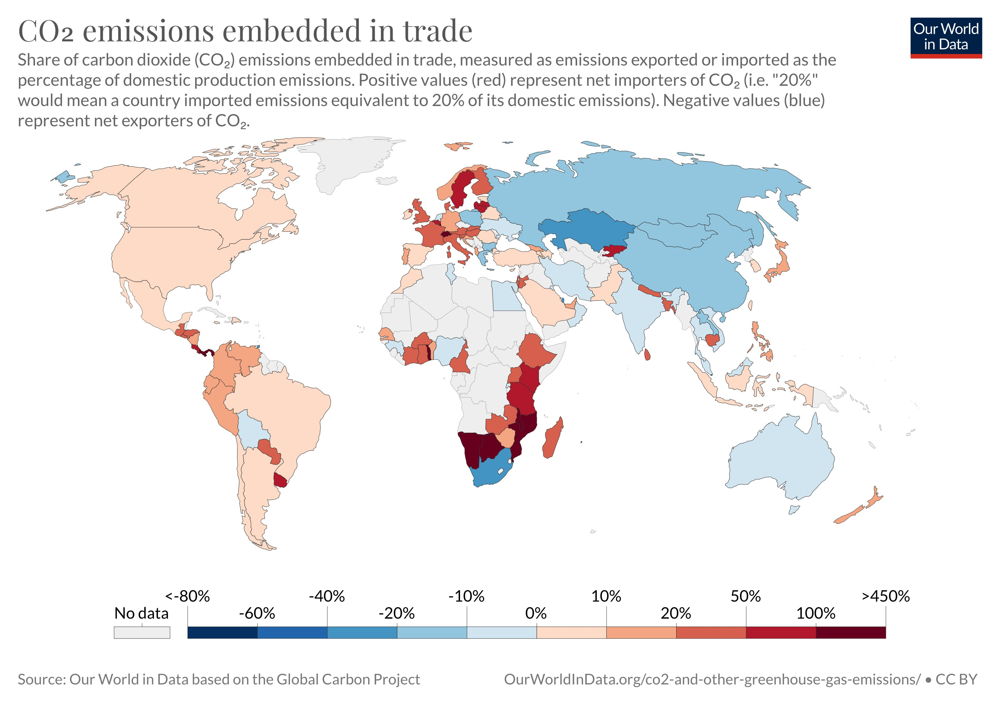
```
<iframe src="https://ourworldindata.org/grapher/share-co2-embedded-in-trade" loading="lazy" style="width: 100%; height: 500px; border: 0px none;"></iframe>

Mas o importante é a *produção* ou o *consumo*? Enquanto 10% das emissões chinesas são "exportadas" pela China, os EUA "importam" o equivalente a 7% de suas emissões, a França 33% e a Suécia 66% (!)

---
class: middle
## Reduzindo emissões de gases do efeito estufa

Como resolvemos o problema do aquecimento global? A resposta de "micro II" é simples: cobrar uma **taxação pigouviana** que iguale o custo marginal privado com o custo marginal social e deixar o livre-mercado se reorganizar

Mas no mundo real *não* vemos isso! Ao contrário, governos usam uma variedade de políticas para atacar o aquecimento global: regulação de automóveis, subsídio a energias renováveis, etc &mdash; por que?

Talvez governos tenham outros objetivos que apenas redução do aquecimento global, restrições de economia política ou preocupação com efeitos dinâmicos

---
class: middle
## Custo de diferentes políticas

`r Citep(myBib, "gillingham2018cost")` avalia o custo de diferentes intervenções para construir a **curva de custo marginal de redução de emissão**

Governo americano (Obama) estimou o **custo marginal social** de cada tonelada de CO2 em `$`46 &mdash; como queimar 1 litro de gasolina gera 2,37kg de CO2, isso implica um custo marginal de `$`0.12/litro

Engenheiros geralmente estimam os *custos diretos* da redução &mdash; O papel de economistas é levar em conta também *efeitos comportamentais*

---
class: middle
## Custo de diferentes políticas

Algumas políticas nos EUA são *lanches grátis*, como misturar 10% de bioetanol com gasolina e trocar carvão por gás natural &mdash; firmas ou consumidores não estão otimizando ou há alguma grave falha de mercado

Já outras políticas que o senso comum diz serem boas, na verdade não reduzem emissões: por exemplo, substitutir carros a combustão por elétricos em estados que produzem energia com térmicas movidas a carvão

O setor de energia possui custos fixos gigantescos e irreversíveis que demoram décadas para se pagar: potencial para **lock-in** em um tipo (no futuro) ineficiente de energia

---
class: middle

```{r, echo=FALSE, out.width = '80%'}
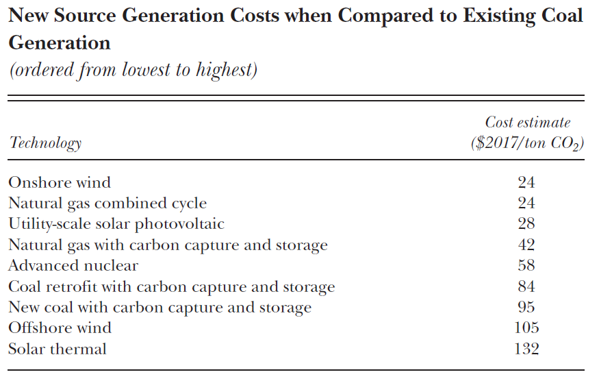
```

A maior parte das tecnologias energéticas hoje são mais baratas que novas usinas por carvão com captura de carbono, mas há muito investimento em carvão já feito (**lock-in**) `r Citep(myBib, "gillingham2018cost")`

---
class: middle

```{r, echo=FALSE, out.width = '70%'}
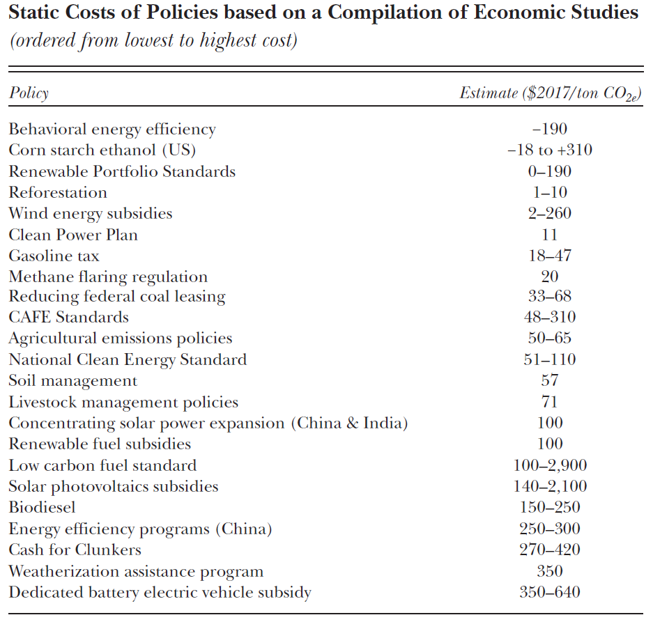
```

Custo da redução de emissão por tonelada de CO2 em estudos econômicos de avaliação de impacto `r Citep(myBib, "gillingham2018cost")` &mdash; por que as políticas mais caras são justamente as mais comuns?

---
class: middle
## Custos dinâmicos

Geralmente tecnologias de baixo custo tem potencial baixo de redução, já as *tecnologias escaláveis* são as mais caras

E a sociedade não minimiza os custos da redução de emissões *hoje*, mas sim os custos da redução *durante todo o período de ajuste*: tecnologias que não valem a pena *estaticamente* podem ser **dinamicamente eficientes**

Também há *complementariedades*: carros elétricos apenas valem a pena economicamente quando há suficientes recarregadores (**externalidades de rede**)

---
class: middle
## Custos dinâmicos

Outra *externalidade produtiva*: avanços tecnológicos são apenas parcialmente apropriáveis pela firma que os gerou &mdash; justificativa para apoio estatal a R&D, especialmente em industrias nascentes

Externalidades produtivas e complementariedades geram **economias externas de escala**: industrias podem não ser viáveis em pequena escala, mas apenas quando grandes o suficiente &mdash; espaço para políticas de *big push*

Efeitos dinâmicos também podem levar a investir *menos* em uma tecnologia se custos tendem a crescer (energia nuclear) ou podem ser ignorados se custos são constantes no tempo


---
class: middle
## Paineis solares

Nos últimos 30 anos, o custo por Watt de painéis solares caiu 90%, e a sua produção de energia aumentou em mais de 1000 vezes &mdash; estima-se que dessa queda no custo, 43% foi ganhos de escala, e o resto inovação

E o aumento na produção começou *antes* de boa parte da queda no preço, por causa de políticas governamentais, o que permitiu esse ganho de escala

Mas esse estímulo é caro: estima-se que o custo por por tonelada de CO2 seja `$`130-190 na California e €500-1300 na Alemanha &mdash; pelas externalidades produtivas, esses programas efetivamente subsidiam a energia renovável em outros países, gerando problema de *free rider*

---
class: middle

```{r, echo=FALSE, out.width = '75%'}
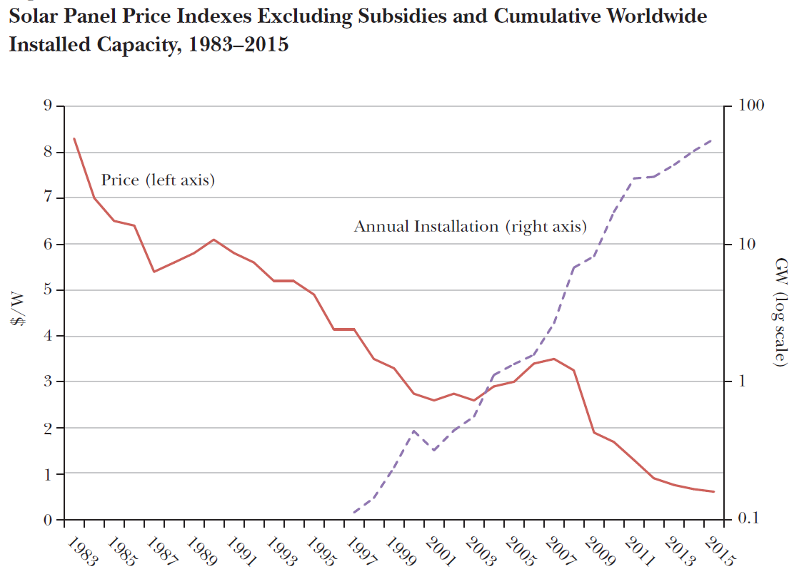
```

Boa parte da queda de preço da energia solar ocorreu *depois* do primeiro aumento no seu uso no fim da década de 90, demonstrando o papel governamental em induzir ganhos de escala, inovações tecnológicas e **learning-by-doing** `r Citep(myBib, "gillingham2018cost")`

---
class: middle
## Carros elétricos

Outro exemplo são carros elétricos: de 2009 a 2015, preço das baterias de carros elétricos caiu 75%, enquanto a sua autonomia tem aumentado

E carros elétricos reduzem mais as emissões globais quão mais limpa for a matriz energética &mdash; externalidades *se complementam*

Externalidades de rede podem gerar **equilíbrios múltiplos** &mdash; pesquisas mostram que subsídios para estações de recarga são mais eficientes para aumentar o consumo de carros elétricos que subsídios diretos a compra do veículo

---
class: middle

```{r, echo=FALSE, out.width = '80%'}
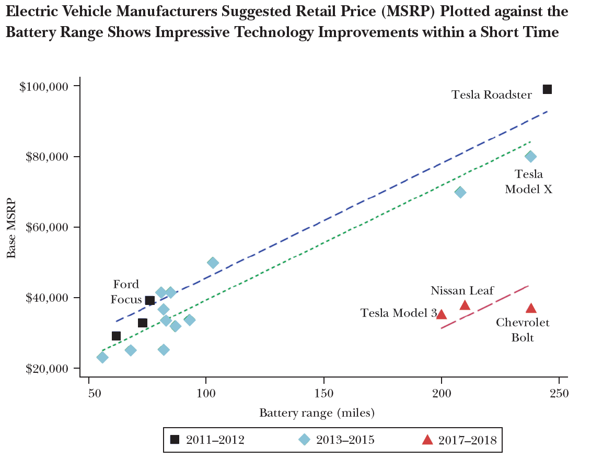
```

A fronteira de possibilidades de produção em veículos elétricos se moveu consideravelmente na última década `r Citep(myBib, "gillingham2018cost")`

---
class: middle

```{r, echo=FALSE, out.width = '85%'}
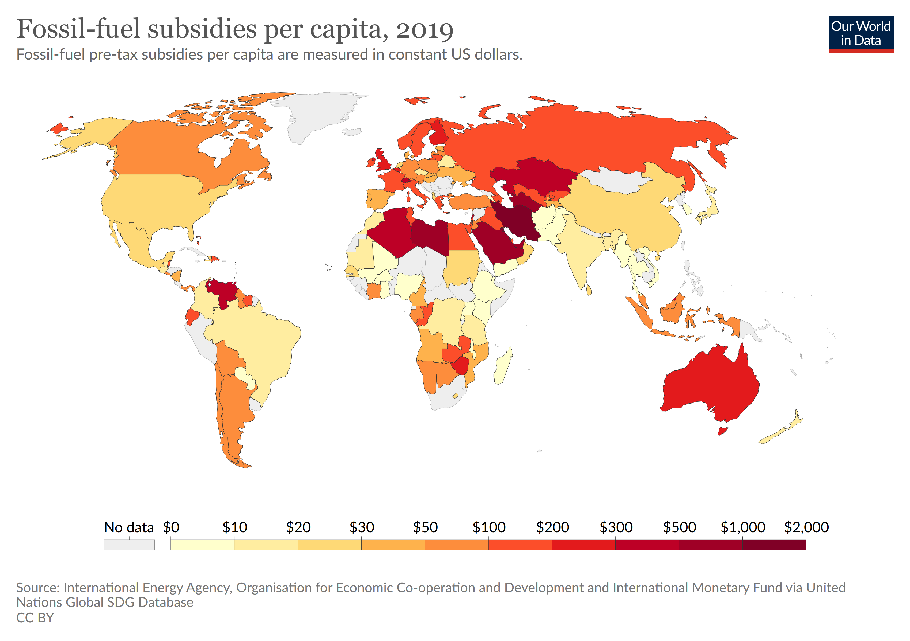
```

Não é apenas que as políticas públicas atuais são plausivelmente insuficientes para corrigir as externalidades ambientais, mas a maior parte dos governos ativamente subsidia combustíveis fósseis, gerando sobreprodução em relação ao equilíbrio de mercado sem interferência

---
class:middle
# Referências
<small>
```{r refs, echo=FALSE, results="asis"}
PrintBibliography(myBib, start=1, end=5)
```
</small>

---
class:middle
# Referências
<small>
```{r refs2, echo=FALSE, results="asis"}
PrintBibliography(myBib, start=6)
```
</small>


<!-- --- -->
<!-- class: middle -->

<!-- ```{r, echo=FALSE, out.width = '90%'} -->
<!-- 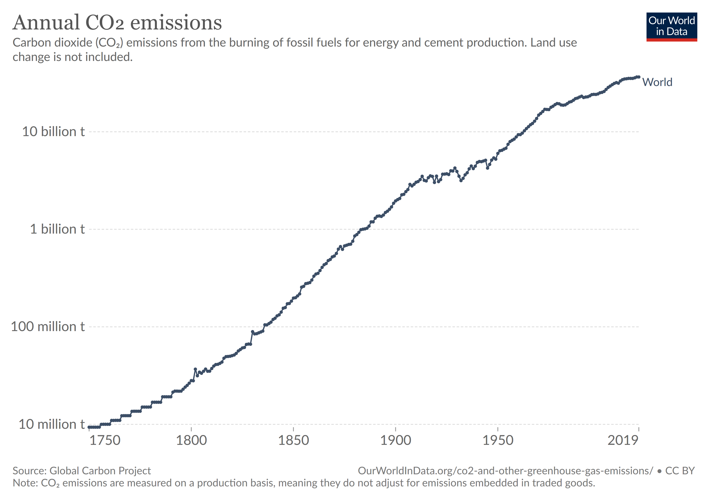 -->
<!-- ``` -->

<!-- Desde o século XVIII, com a Revolução Industrial, as emissões de CO2 crescem de forma constantemente exponencial, sendo hoje 1000x maior que há 200 anos -->

<!-- --- -->
<!-- class: middle -->

<!-- ```{r, echo=FALSE, out.width = '80%'} -->
<!-- 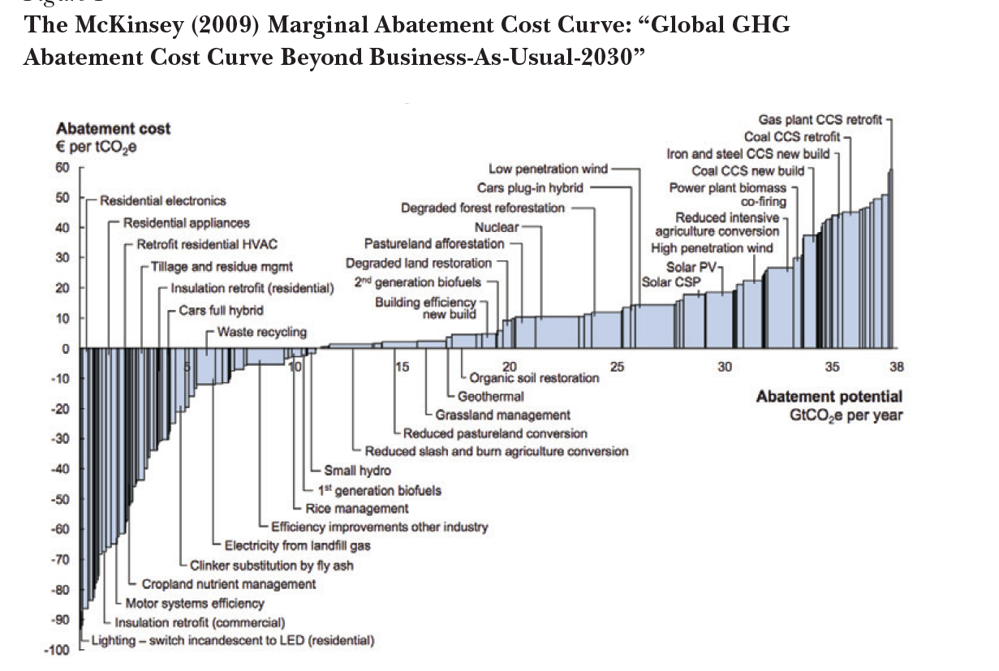 -->
<!-- ``` -->

<!-- Custo marginal (de engenharia) de redução de emissões varia bastante, e várias políticas são "lanches grátis" `r Citep(myBib, "gillingham2018cost")` -->
