class: inverse, middle, center

```{r, load_refs, include=FALSE, cache=FALSE}
library(RefManageR)
BibOptions(check.entries = FALSE,
           bib.style = "alphabetic",
           cite.style = "alphabetic",
           style = "markdown",
           hyperlink = FALSE,
           dashed = FALSE)
myBib <- ReadBib("./esp_bib.bib", check = FALSE)
```

# Bens Públicos

---
class: middle
## Bens públicos

**Bens comuns** são bens *não-excludentes*: quando é impossível (ou inviável, ou indesejável) evitar que certos indivíduos consumam o bem

Nesse caso, há incentivo para *free riders*: indivíduos não contribuírem com o financiamento (ou esgotarem o recurso) do bem comum que utilizam

Quando bens comuns também são *não-rivais*, ou seja, o consumo por um indivíduo não diminui a quantidade disponível para os outros, então chamamos o bem de **bem público puro**

---
class: middle

```{r, echo=FALSE, out.width = '70%'}
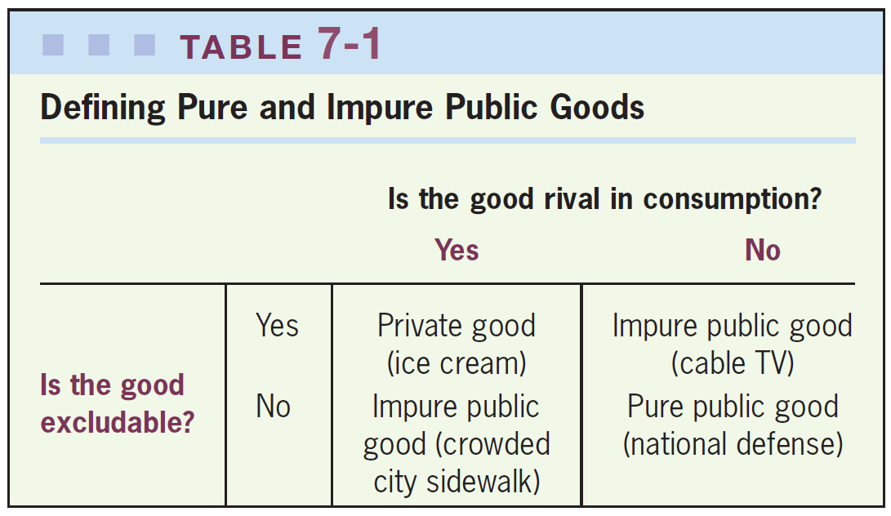
```

Um bem público *puro* é não-rival e não-excludente &mdash; bens não-rivais (externalidades) e bens não-excludentes (comuns) possuem algumas das características dos bens públicos, e podem ser chamados de *bens públicos impuros* `r Citep(myBib, "gruber")`

---
class: middle

```{r, echo=FALSE, out.width = '100%'}
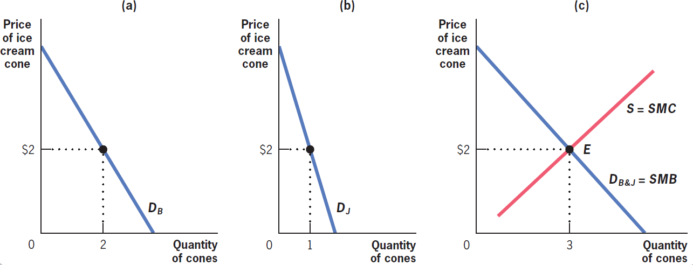
```

No mercado de bens privados, a curva de demanda é a soma *horizontal* das demandas individuais &mdash; o benefício social privado da $3\text{ª} + \epsilon$ unidade é `$`2, pois *ou* $B$, que já consome 2, *ou* $J$, que já consome 1, vão comprar o bem, e ambos dão valor de `$`2 para ele a níveis correntes de consumo `r Citep(myBib, "gruber")`

---
class: middle

```{r, echo=FALSE, fig.show="hold", out.width = '60%'}
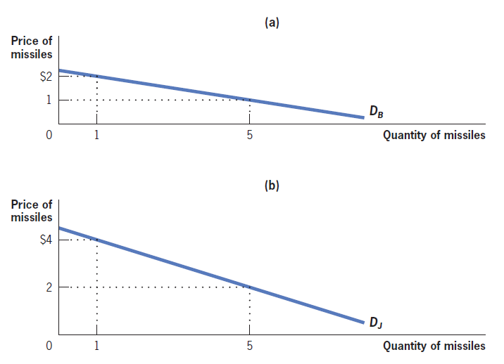
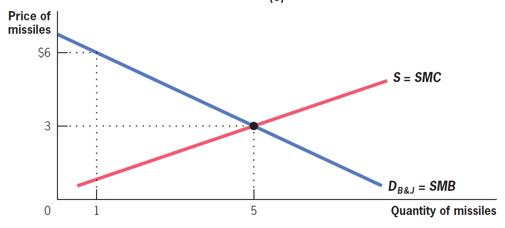
```

Já o SMB de 5 mísseis é `$`3 pois $B$ dá valor `$`2 *e* $J$ dá valor `$`1 e gastos em defesa são não-rivais (*soma vertical*) `r Citep(myBib, "gruber")`

???

- Que característica dos bens públicos faz com que a demanda seja vertical?

---
class: middle
## Bens públicos

A provisão ótima de um bem privado iguala a taxa marginal de substituição do bem em relação "ao dinheiro" (*soma horizontal* das demandas) com o custo marginal de produção daquele bem (curva de oferta)

Samuelson percebeu que a provisão ótima do bem público iguala o custo marginal de produção com a *soma das taxas marginais de substituição* entre os indivíduos (**soma vertical** das demandas individuais)

Chamamos de **regra de Samuelson** esse resultado, que vem do bem público ser *não rival*

---
class: middle
## Provisão privada

Assumindo decisão sem interação estratégica, apenas o agente com maior $TMS$ vai contribuir para o bem e o fará no seu ótimo privado: **subprovisão do bem público**

No mundo real, agentes esperam que outros vão prover parte dos bens públicos e isso reduz a sua contribuição (**free riding**): como é menos benéfico contribuir para o bem público quão maior que seja a contribuição dos outros membros, isso gera uma *curva de resposta* negativamente inclinada

A interseccção das curvas de resposta indica o ponto em que a ação de cada agente é ótima dada as ações dos outros agentes (**equilíbrio de Nash**)

---
class: middle
## Provisão privada

Considere duas famílias contribuindo privadamente para asfaltar uma rua, um bem público $F = f_1 + f_2$. Utilidade de cada indivíduo é $U_i = 2 \ln c_i + \ln F$, com restrição orçamentária $c_i + f_i = 100$. Família $1$ resolve:

$$\max_{f_1} 2 \ln (100 - f_1) + \ln (f_1 + f_2)$$

A condição de primeira ordem $dU_1/df_1 = 0$ implica: $$\frac{-2}{100 - f_1} + \frac{1}{f_1 + f_2} = 0$$

E daí temos que a *curva de resposta* é $f_1^* = (100 - 2f_2)/3$: quanto maior $f_2$, menor $f_1$!

---
class: middle
## Provisão privada

Em compensação, o valor socialmente ótimo é aquele que respeita a regra de Samuelson: $TMS_{Fc}^1 + TMS_{Fc}^2 = MC_F$

O custo marginal $dF/df_1 = 1$, resta calcular $TMS_{Fc}^1$

$$TMS_{Fc}^1 = \frac{MU_F^1}{MU_c^1} = \frac{1/F}{2/c_1} = \frac{c_1}{2F}$$
$$\Rightarrow TMS_{Fc}^1 + TMS_{Fc}^2 = \frac{c_1 + c_2}{2F} = \frac{200 - F}{2F}$$

Igualando os dois, temos $200 - F = 2F$, ou seja, $F = 200/3$ é a provisão ótima

---
class: middle

```{r, echo=FALSE, out.width = '80%'}
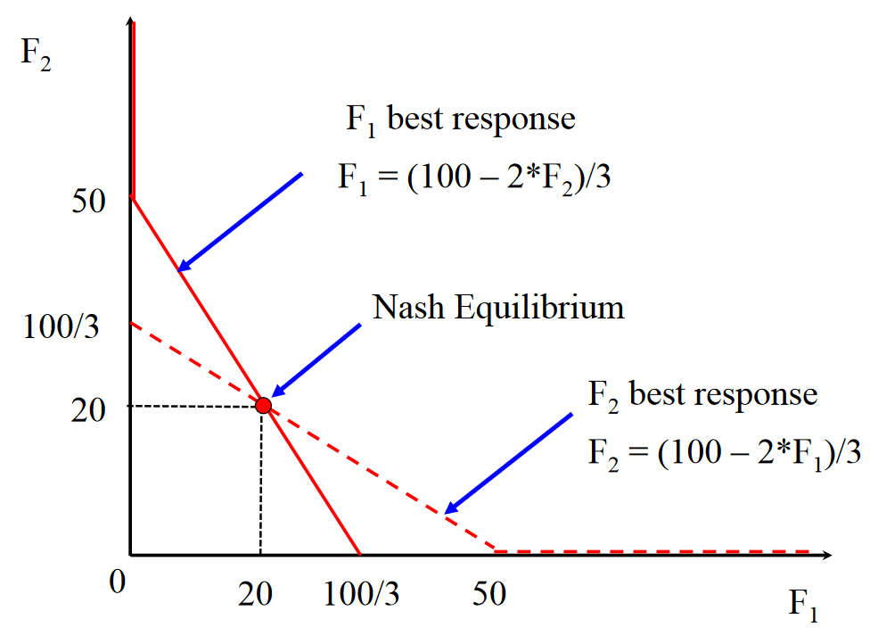
```

No equilíbrio de Nash desse jogo (encontro das curvas de resposta), a contribuição privada $2 \times 20$ é menor que o valor socialmente ótimo (*regra de Samuelson*) de $200/3$

---
class: middle
## Quando a provisão privada funciona

Há algumas situações em que bens públicos são ofertados de forma bem-sucedida sem a intervenção (direta) governamental, como quando (poucos) envolvidos podem desenhar contratos privados de provisão mínima

Ou se o benefício individual a algum agente é maior que o custo da provisão, ou os agentes conseguem se organizar em cooperativas ou associações com punição (formal ou social) a quem não contribuir, como no manejo de comuns

Quando há altruísmo (**capital social**), prestígio ou utilidade de prover o bem público, a provisão privada pode ser eficiente &mdash; por exemplo, software open source

---
class: middle
## Contribuição a bem público

Uma forma de estudar empiricamente a provisão privada de bens públicos é por **jogos de bens públicos** 

Jogadores têm uma quantidade de tokens, que decidem (privadamente) quantos contribuir para um pote comum. Todo dinheiro no pote comum é multiplicado por $\lambda > 1$ e redistribuído a todos igualmente

O cenário eficiente então é todos contribuírem todos os seus tokens, mas o único equilíbrio é zero contribuição (**free riding**) &mdash; no mundo real, entretanto, geralmente 30%-70% dos participantes contribuem (em um estudo: alunos de economia 20% dos tokens, outros alunos 49%)


---
class: middle
## Provisão pública

Quando há provisão pública e privada de um bem público, a provisão pública pode resultar em **crowding-out** (expulsão) da provisão privada &mdash; por exemplo, redistribuição de renda pode expulsar doações privadas

No mundo real, entretanto, estimativas de crowd out são pequenas (mas não desprezíveis): entre ¢13 e ¢20 por $1

Mesmo que o governo queira intervir, ele pode *conceder* (geralmente leiloar) o serviço à iniciativa privada &mdash; aqui o leilão funciona como concorrência *ex-ante*, mesmo que o concessionário seja monopolista quando ofertando o serviço

---
class: middle
## Provisão pública

Leilões competitivos são eficientes, mas pode haver conluio ou corrupção. Se há aspectos de qualidade difíceis de observar (ou pôr em contrato), pode haver piora da qualidade &mdash; por exemplo, prisões privadas nos EUA

A grande vantagem do setor privado para o público em atividades econômicas é que ele possui um **residual claimant** &mdash; o capitalista obtém todo o lucro excedente, o que mitiga problemas de *risco moral*

[Barkley (2021)](https://www.aeaweb.org/research/government-outsourcing-dredging-industry) estima que terceirizar projetos para construtoras privadas poupa até 23% do custo nos EUA, especialmente onde a concorrência é maior

---
class: middle
## Tragédia dos comuns

*Bens comuns* são bens não-excludentes que são *rivais* &mdash; pode levar à **tragédia dos comuns**: cada indivíduo tem o incentivo de consumir mais do bem do que seria socialmente ótimo, levando ao seu esgotamento

> Therein is the tragedy. Each man is locked into a system that compels him to increase his herd without limit - in a world that is limited. Ruin is the destination toward which all men rush, each pursuing his own best interest in a society that believes in the freedom of the commons. Hardin (1968) apud `r Citep(myBib, "ostrom1990governing")`

A forma mais simples de se pensar na tragédia dos comuns é como um *dilema dos prisioneiros*

---
class: middle
## Dilema dos prisioneiros

> The idea that groups tend to act in support of their group interests is supposed to follow logically from this widely accepted premise of rational, self-interested behavior. In other words, if the members of some group have a common interest or object, and if they would all be better off if that objective were achieved, it has been thought to follow logically that the individuals in that group would, if they were rational and self-interested, act to achieve that objective. Olson (1965) apud `r Citep(myBib, "ostrom1990governing")`

O **dilema dos prisioneiros** foi importante para se contrapor à visão acima, comum no começo do século XX, de que agentes racionais sempre deveriam se coordenar para evitar situações ruins para todos &mdash; o que está errado!

---
class: middle
## Governando os comuns

Na 2a metade do séc. XX acreditava-se que havia apenas duas soluções *possíveis* para a tragédia dos comuns: ou o *Leviatã* ou demarcação dos comuns em *propriedade privada* &mdash; sem espaço para comunidades auto-geridas

`r Citep(myBib, "ostrom1990governing")` notou que no mundo real, comuns existem e funcionam de forma eficiente &mdash; a aplicabilidade da tragédia dos comuns depende das circunstâncias *práticas* do ambiente analisado (*políticas públicas baseadas em metáforas*)

Ela ressalta a diferença entre *propriedade comum* e **propriedade de acesso-livre**: a primeira tem *direitos de propriedade para a comunidade* que faz com que tenham incentivo em criar *instituições* e *normas sociais* para geri-la

---
class: middle
## Bens públicos locais

O que determina quais gastos devem ser realizados ao nível federal, estadual ou municipal? (**federalismo fiscal ótimo**)

Tiebout (1956) propôs que uma vantagem da provisão local é que gera *competição* entre as localidades: cidadãos podem *votar com os pés*, se mudando para onde a oferta de bens públicos satisfaz as suas preferências

Intuitivamente, o setor público imitaria o setor privado, dando a oportunidade de moradores ("consumidores") escolherem onde "comprar" o bem público &mdash; isso revela a suas preferências reais (sem *free riding*) sobre bens públicos, levando a um resultado eficiente

---
class: middle
## Bens públicos locais

No mundo real a mobilidade espacial é limitada, mas o modelo de Tiebout dá a intuição da grande diferença entre gastos federais e locais: as pessoas podem mais facilmente trocar de municípios que de países

Deve-se descentralizar o provimento apenas de bens públicos que sejam úteis para a maior parte dos moradores do local (*tax-benefit linkages*), ao contrário de benefícios a grupos específicos, como assistência social 

Deve-se centralizar gastos que gerem significativas externalidades espaciais, já que nesse caso vão ser subprovidas ao nível local, e que tenham economias relevantes de escala

---
class: inverse, middle, center

# Educação

---
class: middle
## Educação

Quando aprendemos em micro sobre o setor público, a justificativa de sua atuação está nessas duas últimas aulas: **bens públicos** e **externalidades**

Se até o começo do século XX era verdade que a atuação governamental era quase inteiramente para provimento de bens públicos (segurança, defesa, infraestrutura), hoje em dia não é mais: apenas 5-10% do orçamento do governo brasileiro atual segue essas justificativas

Agora vamos discutir um dos principais gastos dos governos modernos, mas que **não** é um bem público: educação

---
class: middle

```{r, echo=FALSE, out.width = '70%'}
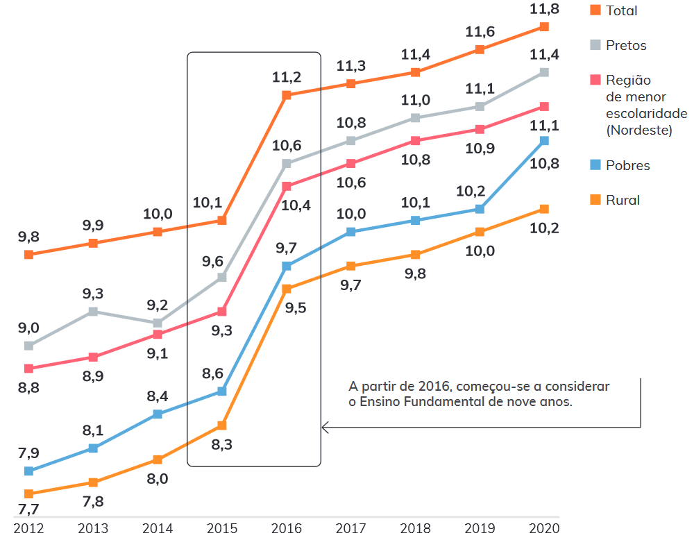
```

Anos de estudo (18-29 anos) têm aumentado no Brasil, subindo de 10 para 12 anos de estudo na última década &mdash; mas de forma bastante desigual, com pretos, nordestinos e pobres tendo educação bastante inferior (embora a diferença tenha reduzido) `r Citep(myBib, "pela2021anuario")`

---
class: middle

```{r, echo=FALSE, out.width = '90%'}
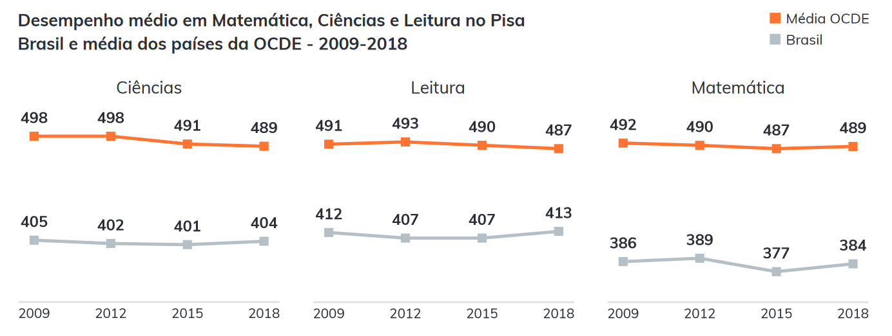
```

Mas o Brasil ainda tem desempenho muito aquém da média da OCDE no Pisa, sem convergência clara nesse período &mdash; o que sugere que essa maior *quantidade* de estudo não se converteu em melhoria **quantificável** na *qualidade* do aprendizado `r Citep(myBib, "pela2021anuario")`

---
class: middle

```{r, echo=FALSE, out.width = '90%'}
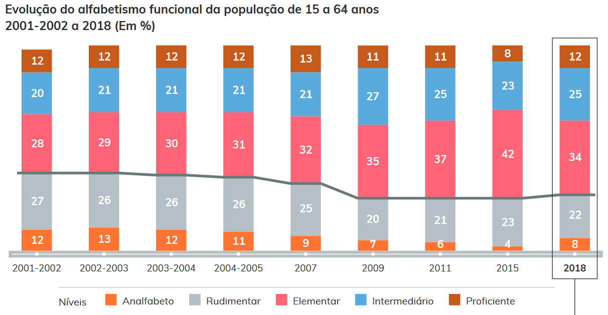
```

O Brasil quase eliminou o analfabetismo formal (4-8%), mas o analfabetismo funcional ainda é prevalente, atingindo 30% da população de 15-64 anos &mdash; apenas 12% dos brasileiros são considerados de alfabetização proeficiente (capaz de elaborar textos e interpretar gráficos e tabelas) `r Citep(myBib, "pela2021anuario")`

---
class: middle
## Educação pública

Educação é *excludente* e (na maior parte) *rival*: é um **bem privado**! Ainda assim, na maioria dos países é majoritariamente ofertada pelo governo

Educação torna os cidadãos mais produtivos, o que: (i) aumenta a produtividade dos colegas; (ii) aumenta os impostos que paga, uma **externalidade fiscal** &mdash; vários investimentos em educação "se pagam"

*Se* o trabalhador não recebe todo o seu produto marginal (por exemplo, *poder de monopsônio no mercado de trabalho*), educação também gera *externalidade positiva*

---
class: middle
## Educação pública

Outra *externalidade positiva* gerada pela educação é aumentar o *capital cívico*. Pessoas educadas (plausivelmente) votam melhor, cometem menos crimes e atitudes desonestas, etc

Educação envolve gastos presentes e retornos futuros. As pessoas vão estar dispostas a fazerem esses investimentos se o VPL (equivalente de certeza) for positivo (*e se agirem racionalmente*)

Mas se elas não tiverem capital, só vão conseguir investir com **mercados completos**. No mundo real há falhas no mercado de crédito que podem inviabilizar a educação dos mais pobres

---
class: middle
## Educação pública

Educação é uma escolha dos pais para benefício (principalmente) dos filhos &mdash; nem sempre se pode confiar na família para tomar as decisões no melhor interesse de seus filhos: é por isso que na maior parte dos países educação é **obrigatória**

Sendo educação um bem normal, famílias ricas terão sempre maior *disposição a pagar* por educação que famílias mais pobres: educação privada age como uma força contra a **mobilidade social**

Razão "menos econômica": educação é um direito humano, uma liberdade ou capacidade fundamental (Sen)

---
class: middle
## Interações entre o mercado público e privado

Educação é provida de graça pelo setor público e pode ser comprada pelo setor privado &mdash; maior investimento no setor público pode gerar **crowding out** do setor privado: no limite, poderia até piorar a educação

[Dinerstein & Smith (2021)](https://www.aeaweb.org/research/public-private-schools-funding-reform) estimam que em NYC $1,000 por aluno leva a uma queda de 6% no número de escolas privadas no bairro &mdash; 1/5 do aumento de demanda pelas escolas públicas se deu pelo fechamento das escolas privadas expulsando alunos que não queriam mudar

Uma forma de mitigar esse problema é com o uso de **vouchers educacionais**

---
class: middle

```{r, echo=FALSE, out.width = '90%'}
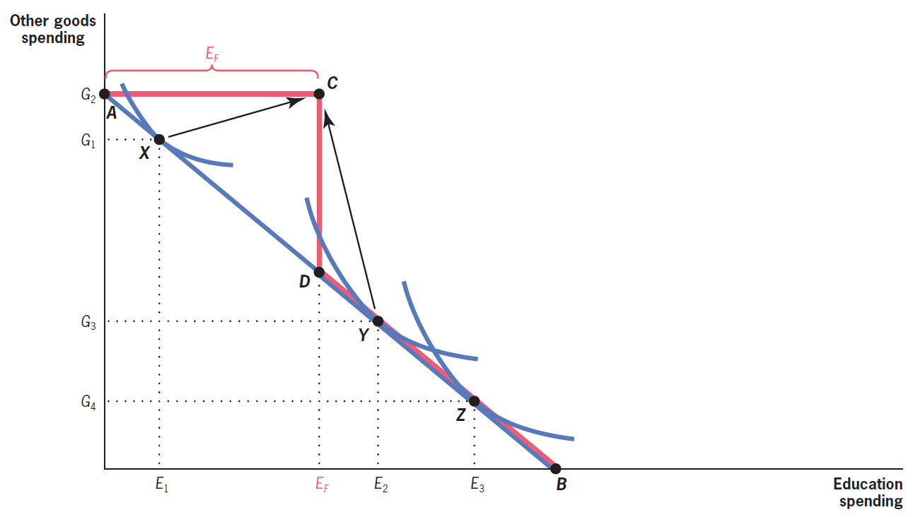
```

Entrada de um setor público na educação: família $X$ (pobre) gastava quase nada em educação e aumenta o seu gasto, família $Z$ (rica) não altera seu comportamento &mdash; mas a possibilidade de educação pública gratuíta faz a família $Y$ ("classe média") **reduzir** o gasto educacional `r Citep(myBib, "gruber")`

---
class: middle

```{r, echo=FALSE, out.width = '90%'}
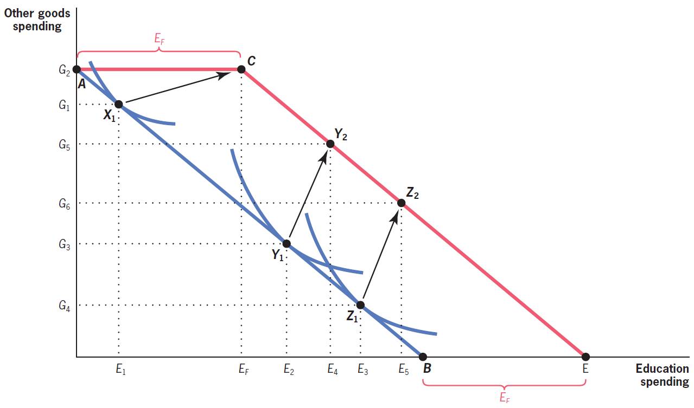
```

Já **vouchers** garantem que todas as famílias aumentam (fracamente) o consumo de educação: famílias pobres escolhem escolas públicas (gratuitas), classe média e ricas continuam nas escolas privadas, que melhoram a qualidade (e aumentam o preço) `r Citep(myBib, "gruber")`

---
class: middle
## Vouchers

Em um [painel de economistas](https://www.igmchicago.org/surveys/school-vouchers/) de 2012, 46% deles concordam que vouchers fariam "a maioria melhor"e apenas 6% discordam &mdash; pois vouchers aumentam o poder de escolha dos consumidores e geram **competição** no mercado educacional

Por outro lado, vouchers segregam alunos por renda, habilidade e motivação, deixando os alunos que ficam no sistema público com colegas piores e escolas com menos dinheiro

Vouchers também representam um subsídio para alunos ricos e escolas privadas, o que é injusto (regressivo) e ineficaz (o subsídio tem pouco efeito na demanda educacional de Z) &mdash; solução: vouchers por renda?

---
class: middle
## Vouchers

Economias de escala na produção de educação podem tornar mais eficiente que o Estado seja responsável único (ou majoritário) pela educação (**monopólio natural**) &mdash; ademais, famílias não têm boa capacidade de julgar a qualidade da educação que recebem

Vouchers geraram um debate enorme e inconcluso. Uma revisão da literatura empírica em 2017 diz:
> Our assessment is that the evidence to date is **not sufficient** to warrant recommending that vouchers be adopted on a widespread basis; however, multiple positive findings support continued exploration. `r Citep(myBib, "epple2017school")`

---
class: middle
## Quanto investir em educação?

Discutimos até agora como deve ser gasto o dinheiro público em educação, mas como decidimos *quanto* gastar?

Usamos análise de custo-benefício que vimos na aula 2 &mdash; calcular os custos é aplicação direta daquela aula, mas e os benefícios?

Isso depende da mensuração dos **retornos à educação**: é fácil ver que pessoas com maior educação ganham mais, mas ganham mais *por causa* da maior educação?

---
class: middle

```{r, echo=FALSE, out.width = '90%'}
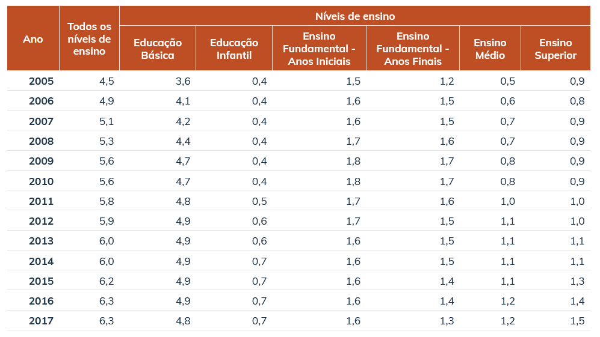
```

O gasto público em educação no Brasil como porcentagem do PIB cresceu 40% desde 2005, crescimento focado na educação infantil e especialmente ensino médio (240%) &mdash; o país gasta com ensino superior proporção do PIB menor apenas que para os anos iniciais do EF, ainda que o número de alunos seja muitas vezes menor `r Citep(myBib, "pela2021anuario")`

---
class: middle

```{r, echo=FALSE, out.width = '90%'}
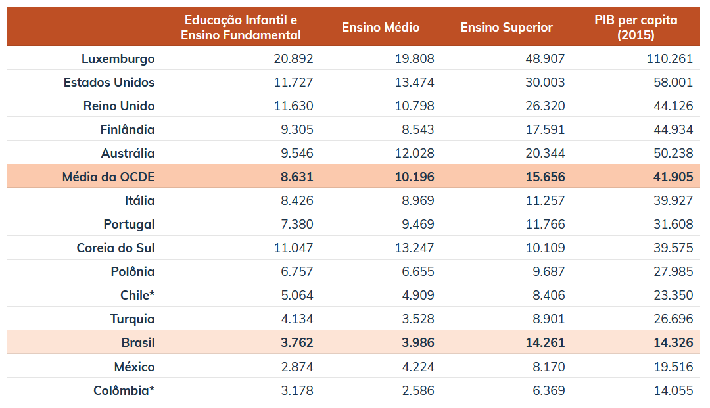
```

O Brasil gasta hoje em dia proporção do PIB considerável com educação. Ainda assim, por ser um país pobre, o gasto por aluno em US$ PPP é mais de $2\times$ menor que a média da OCDE &mdash; exceto para o ensino superior, que é no mesmo nível `r Citep(myBib, "pela2021anuario")`

---
class: middle
## O valor da educação

Duas teorias do valor da educação: (i) ela aumenta a produtividade dos indivíduos (**capital humano**); (ii) é uma forma de **sinalizar** a habilidade deles

Como é mais custoso para pessoas menos inteligentes aprender cálculo, firmas requerem cálculo na entrevista mesmo que não seja útil no trabalho, para separar (**screening**) "tipos altos" de "tipos baixos"

Também há efeitos de *equilíbrio geral*: o salário de médicos vai ser maior quanto mais raros forem eles na sociedade

---
class: middle

```{r, echo=FALSE, out.width = '85%'}
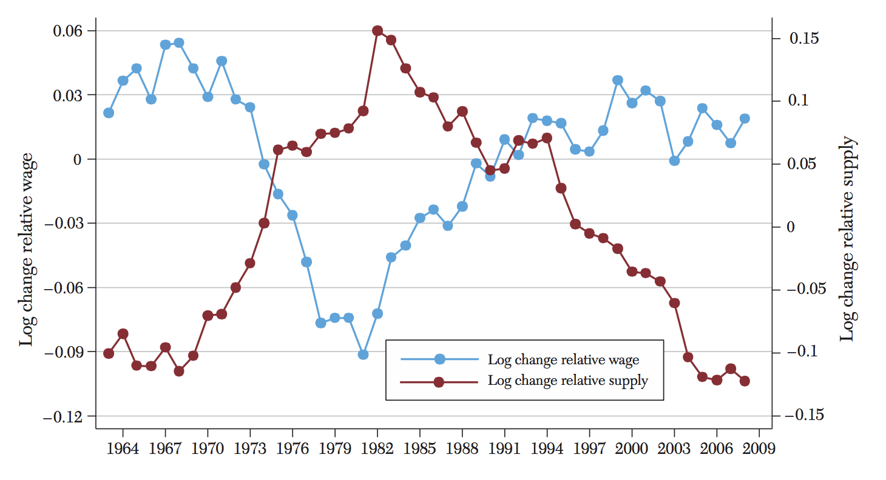
```

Aumento da oferta de trabalhadores com ensino superior em relação àqueles com ensino médio na década de 70 e 80, nos EUA, gerou uma diminuição relativa do seu salário, ocorrendo a tendência inversa nas décadas seguintes: ganhos privados da educação dependem de condições de **equilíbrio geral** (WID)


---
class: middle

```{r, echo=FALSE, out.width = '80%'}
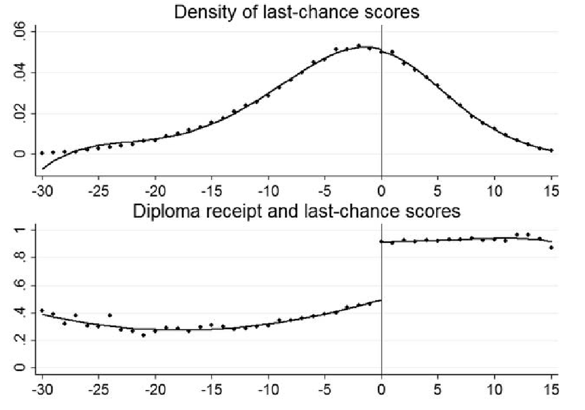
```

Nos EUA, estudantes precisam passar em um teste para se formar no ensino médio. `r Citep(myBib, "clark2014signaling")` usam ele para testar as teorias do *capital humano* e *sinalização* de valor da educação. Alunos que passaram por pouco no teste têm chance muito maior de sair da escola com o diploma...


---
class: middle

```{r, echo=FALSE, out.width = '80%'}
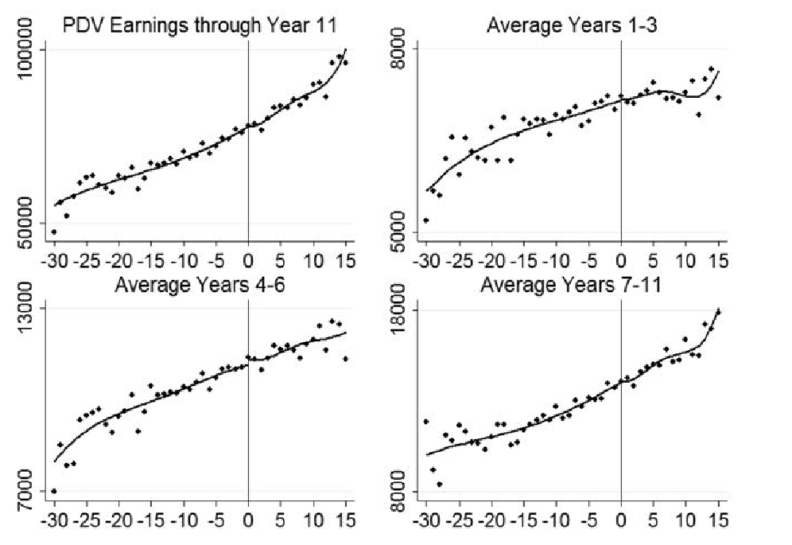
```

... mas o diploma não tem efeito nenhum na renda futura, tanto no curto quanto longo prazo, contrariando a teoria da sinalização &mdash; o ganho de renda com educação parece vir realmente dos ganhos de habilidades adquiridos `r Citep(myBib, "clark2014signaling")`

---
class: middle
## Ensino superior

O ensino básico na quase totalidade dos países é de provisão quase toda estatal &mdash; no Brasil, em SP por volta de 80%, e em outros estados ainda mais `r Citep(myBib, "pela2021anuario")`

Isso mesmo no ensino técnico, que já responde hoje no Brasil por 20% das matrículas do ensino médio

Por outro lado, o ensino superior geralmente é principalmente privado &mdash; no Brasil, em 2019, 82% dos ingressos no ES foram na rede privada, proporção maior até que nos EUA `r Citep(myBib, "da2019notas")`

---
class: middle
## Ensino superior privado

As externalidades do ES são plausivelmente menores, já que o retorno *privado* à educação superior é alto: o salário médio de quem tem ensino superior completo é mais que o dobro do salário médio nacional

Além disso, o ES não aumenta tanto o *capital cívico* quanto ensino básico (estudar economia plausivelmente até diminui). O argumento de conflitos familiares também é menos convincente, já que universitários são adultos

Mesmo sem externalidades, resta o problema de **falhas no mercado de crédito** e **justiça social**: geralmente a intervenção governamental no ensino superior vai na direção de abordar esses problemas

---
class: middle
## Intervenção governamental no Brasil

No Brasil, o governo estabelece o FIES, que **financia** curso de universidade privada a juros subsidiados (zero para famílias até 3 sm/pessoa), oferecendo por volta de 200 mil contratos por ano

Como nos EUA, a taxa de inadimplência do programa é enorme: 52% em 2021 &mdash; educação é um investimento arriscado (embora o valor presente esperado seja bem alto) e estudantes raramente têm colateral

O governo também **administra diretamente** 108 universidades (63 federais, 40 estaduais, 5 municipais) e 143 faculdades, respondendo por 559 mil ingressos por ano

---
class: middle
## Intervenção governamental no Brasil

O PROUNI oferece 140 mil **bolsas** em universidades privadas para estudantes com renda até 1,5 sm/pessoa (integral) e 3 sm/pessoa (50%) &mdash; note que o 1º limiar coloca a família nos 25% mais ricos, e o 2º nos 10% mais ricos do país 

No total, são 3,6mi de ingressantes e 1,2mi de concluintes no ensino superior brasileiro por ano, tal que o número de alunos do ES representa 48,6% da população de 18-24 anos

Mas apenas 23,8% dessa população de 18-24 está nas universidades, porcentagem que cresceu 50% nos últimos 8 anos &mdash; 50% no quartil mais rico e 13,2% do quartil mais pobre `r Citep(myBib, "pela2021anuario")`

---
class: middle

```{r, echo=FALSE, out.width="90%"}
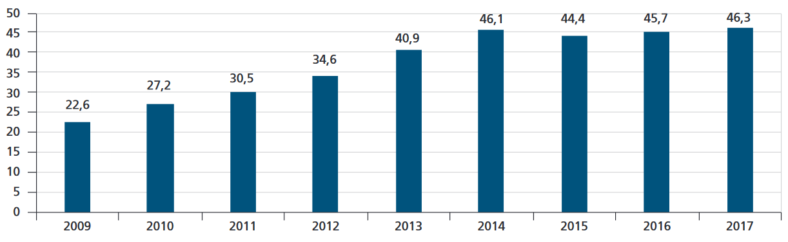
```

A proporção das matrículas privadas no ensino superior com algum tipo de bolsa ou financiamento dobrou desde 2009 para quase metade das matrículas: mesmo no ensino superior privado, a intervenção governamental é extensa (Radar IPEA/2018)

---
class: middle

```{r, echo=FALSE, out.width="90%"}
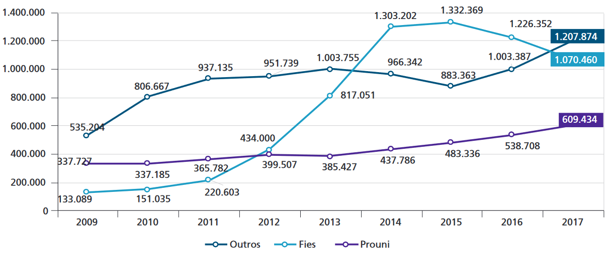
```

O PROUNI duplicou em 8 anos, mas a maior parte do aumento da proporção de matrículas com bolsa ou financiamento estudantil veio do FIES, que entre 2011-2013 saltou 6x (Radar IPEA/2018)

---
class: middle
## Cotas

Cotas raciais nas universidades foram introduzidas em 2003 na UERJ &mdash; 20% para escolas públicas, 20% para negros e indígenas, todos com limite de renda

As cotas foram se expandindo pelo país ao longo da década, chegando a 129 IES, sendo 51 com cotas raciais até 2012

O julgamento da constitucionalidade das cotas pelo STF impulsionou a Lei das Cotas, em 2012, que solidificou e expandiu essas cotas para todas as universidades federais: 50% para escolas públicas, sendo dessas 50% de baixa renda com cotas raciais

---
class: middle

```{r, echo=FALSE, out.width="90%"}
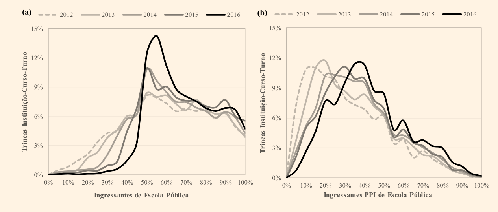
```

Proporção de alunos de escola pública (a) e PPI (b) em instituições federais de ensino superior &mdash; o efeito da implementação da Lei das Cotas, entre 2012 e 2016, é evidente em eliminar a cauda inferior da distribuição `r Citep(myBib, "senkevics2019perfil")`

---
class: middle

```{r, echo=FALSE, out.width="90%"}
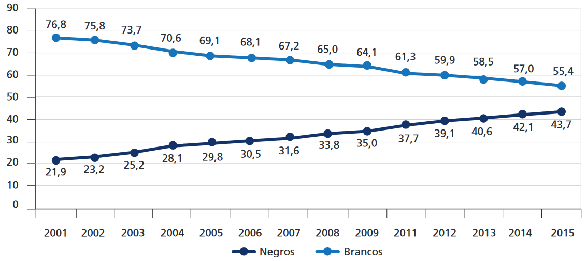
```

Em 2001, 3/4 dos graduandos eram brancos, enquanto apenas 1 em cada 5 era negro, proporção que dobrou em 14 anos, e hoje 43% dos universitários são negros (enquanto esse grupo representa 56% da população) &mdash; mas é difícil precisar quanto dessa tendência se deve às cotas (TD2569/IPEA)

---
class: middle

```{r, echo=FALSE, fig.show="hold", out.width="90%"}
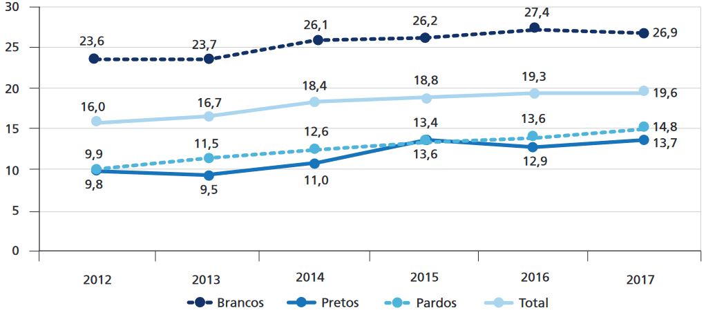
```

Embora a desigualdade racial tenha diminuído, estudantes brancos de 18-24 anos ainda cursam mais o ensino superior como proporção da população em idade adequada (TD2569/IPEA)

---
class: middle

```{r, echo=FALSE, out.width = '90%'}
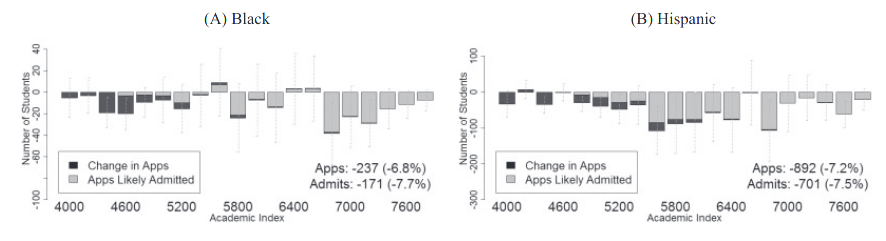
```

**Evidência empírica:** o banimento de ações afirmativas na Universidade de Califórnia em 1998 diminuiu o número de candidatos pretos e hispânicos, mesmo dentre aqueles com desempenho acadêmico tão bom que quase certamente entrariam `r Citep(myBib, "bleemer2022affirmative")`

---
class: middle

```{r, echo=FALSE, out.width = '90%'}
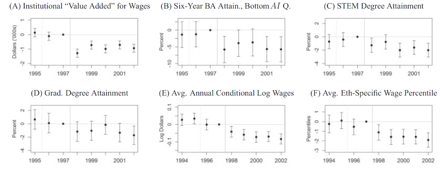
```

Indivíduos de minorias afetadas cursaram mais colégios comunitários e graduações piores, tendo perda persistente de renda futura `r Citep(myBib, "bleemer2022affirmative")` &mdash; `r Citep(myBib, "ribeiro2016affirmative")` encontra resultados parecidos para efeito de cotas na UERJ no exame da OAB

---
class:middle
# Referências
<small>
```{r refs, echo=FALSE, results="asis"}
PrintBibliography(myBib, start=1, end=5)
```
</small>

---
class:middle
# Referências
<small>
```{r refs2, echo=FALSE, results="asis"}
PrintBibliography(myBib, start=6)
```
</small>
