class: inverse, middle, center

```{r, load_refs, include=FALSE, cache=FALSE}
library(RefManageR)
BibOptions(check.entries = FALSE,
           bib.style = "alphabetic",
           cite.style = "alphabetic",
           style = "markdown",
           hyperlink = FALSE,
           dashed = FALSE)
myBib <- ReadBib("./esp_bib.bib", check = FALSE)
```

# Seguro social

---
class: middle
## Seguridade social

Discutimos já duas falhas de mercado que requerem (plausivelmente) intervenção estatal: bens não-excludentes e externalidades. Uma terceira é **restrições ao crédito**

Notem que por mais que essa 3a receba menos atenção em micro, ela representa a maior parte dos gastos do Estado! 

No Brasil, o governo federal gasta ~12% do PIB (1/3 do orçamento) em seguro social &mdash; outros ~4% do PIB são gastos públicos em saúde, outra forma de seguro público

---
class: middle
## Seguridade social

Hoje em dia, quase todos os Estados oferecem várias formas de seguro social. No Brasil, o INSS oferece:

1. Aposentadoria
2. Seguro-desemprego
3. Auxílio-doença, auxílio-acidente e auxílio-reclusão
4. Benefício a pessoa com deficiência (Benefício de Prestação Continuada, BPC)
5. Salário maternidade
6. Pensão por morte

Além destes, o SUS é uma forma de provisão pública de *seguro de saúde*

---
class: middle
## Risco e seguro

Programas de seguro social geralmente também têm *efeito redistributivo*, mas esse não é o seu objetivo central &mdash; ele é segurar cidadãos *avessos ao risco* contra choques de renda e permitir que **suavizem seu consumo**

Como *utilidade marginal da renda* é decrescente, maximizar a utilidade intertemporal equivale a igualar a utilidade marginal em diferentes períodos (ou **estados da natureza**)

Por exemplo, ou gostaria sempre de transferir renda de *mundos possíveis* em que eu não bati o carro para os mundos possíveis em que eu bati &mdash; é exatamente isso que um seguro de carro faz

---
class: middle
## Risco e seguro

Um **prêmio de seguro atuariamente justo** é aquele cujo preço é exatamente igual ao custo esperado do dano

Na prática, a seguradora pode cobrar um **prêmio de risco**, que é a diferença entre a utilidade esperada e o *equivalente de certeza*

Como os consumidores são avessos ao risco e a seguradora não é, transferir o risco do agente para a firma resulta em ganho de eficiência &mdash; há um excedente por ganhos de troca

---
class: middle
## Risco e seguro

Considere um evento adverso com probabilidade $q$ que implica um custo econômico $d$. O indivíduo com riqueza $W$ pode contratar um seguro com prêmio $p$ que paga $b$ caso o evento adverso ocorra

Então a utilidade esperada do indivíduo é: $$\mathbb{E}U = (1 - q) u(W - p) + q u(W - p + b - d)$$

O lucro esperado da seguradora (neutra ao risco) é: $\mathbb{E}\Pi = p - qb$

Se há concorrência perfeita com livre-entrada, temos que $\mathbb{E}\Pi = 0$, ou seja $p = qb \iff b = p/q$ (*prêmio atuariamente justo*)

---
class: middle

```{r, echo=FALSE, out.width = '75%'}
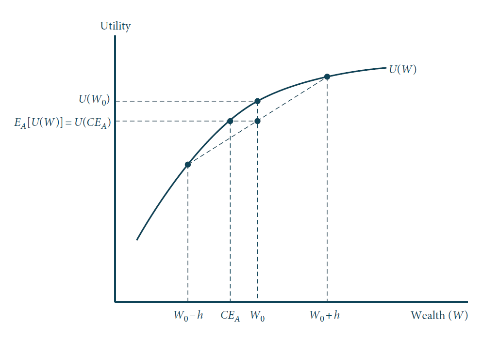
```

Utilidade de um agente avesso ao risco em uma loteria $\mathbb{E}U(W)$ é menor que com seguro total $U(W_0)$. Assim, ele está disposto a pagar $W_0 - CE_A$ para evitar o risco, onde $CE_A$ é o **equivalente de certeza**  (Nicholson & Snyder, 2016)

---
class: middle
## Risco e seguro

Sob o prêmio atuariamente justo, o problema do agente se torna $$ \max_p \mathbb{E}U = (1 - q) u\left(W - p\right) + q u\left(W - p + \frac{p}{q} - d\right)$$

Com CPO $d\mathbb{E}U/dp = 0$, ou seja $$- (1 - q) u^{\prime}\left(W - p\right) + q\left[ \frac{1}{q} - 1\right] u^{\prime} \left(W - p + \frac{p}{q} - d \right) = 0$$

Isso é, o consumidor **suaviza seu consumo** entre os estados da natureza, se protegendo inteiramente do risco: $u^{\prime}\left(W - p\right) = u^{\prime} \left(W - p + p/q - d \right)$, o que é só possível se $p/q = d$

---
class: middle

```{r, echo=FALSE, out.width = '100%'}
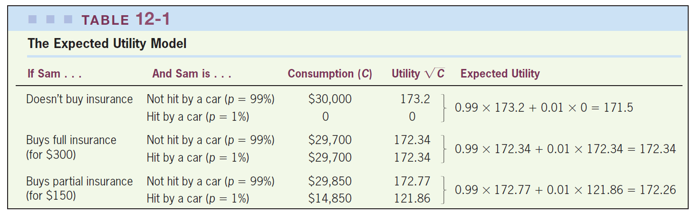
```

Imagine que Sam tem uma chance de 99% de não bater o carro, ganhando `$`30 mil, e 1% de bater, ganhando zero. Se a função de utilidade é côncava, quando o prêmio de seguro é atuariamente justo, o comportamento ótimo de um agente avesso ao risco é sempre o seguro total `r Citep(myBib, "gruber")`

---
class: middle
## Assimetria informacional no mercado de seguro

Mas a pergunta mais relevante aqui para nós não é por que as pessoas compram seguros, mas sim por que o Estado precisaria prover eles

E a resposta a isso não está na aversão ao risco, mas sim na **assimetria informacional**: consumidores em um mercado de seguro quase sempre têm maior informação sobre os seus riscos que a seguradora

Há dois tipos de assimetria informacional relevantes no mercado de seguros: **características não observáveis** (seleção adversa) e **ações não observáveis** (risco moral): vamos começar pelo primeiro

---
class: middle

```{r, echo=FALSE, out.width = '90%'}
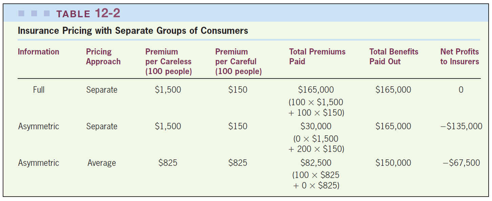
```

Imagine dois *tipos* de agentes: cuidadosos (0.5% de chance de bater o carro) e descuidados (5%), com 100 indivíduos cada. Se a seguradora consegue separar os tipos, o resultado é eficiente. Mas se há informação assimétrica, ocorre **seleção adversa**, tanto quando a firma tenta uma *política separadora* (todos compram menos) quanto *pooling* (o tipo bom é excluído do mercado) `r Citep(myBib, "gruber")`

---
class: middle
## Assimetria informacional no mercado de seguro

No limite, a **seleção adversa** de grupos de maior e maior risco pode *degringolar todo o mercado*

Como vimos, se consumidores são avessos ao risco, estão dispostos a pagar um prêmio de risco além do prêmio atuariamente justo. Se for suficientemente alto para os agentes de menor risco, pode haver um **equilíbrio pooling**

Seguradoras também podem tentar (e tentam) fazer **screening** do risco dos consumidores: oferecer um menu de prêmio-cobertura com opção que seja barata mas cubra poucos danos, e assim valha a pena apenas para agentes de menor risco (**equilíbrio separador**)

---
class: middle
## Assimetria informacional no mercado de seguro

Mas note que o equilíbrio separador *ainda é ineficiente!* Os consumidores de menor risco recebem pouca cobertura, quando o ótimo seria serem 100% cobertos

A **seleção adversa** ocorre pois indivíduos de menor risco decidem sair do mercado. Uma forma então "simples" de resolver o problema é obrigá-los a comprar o seguro

Note que no último caso na tabela, se todos comprassem, a firma teria lucro zero e o mercado seria eficiente (nesse caso os consumidores de menor risco estariam subsidiando o seguro dos de maior risco)

---
class: middle
## Seleção em mercados de seguros

Podemos analisar o mercado de seguros com seleção adversa através de um gráfico de oferta e demanda com firmas perfeitamente competitivas competindo por preço em um único contrato de seguro `r Citep(myBib, "einav")`

No caso mais simples, indivíduos são homogêneos em aversão ao risco, e portanto sua *disposição a pagar* pelo seguro é crescente no risco

Assim, a diferença do modelo com seleção do tradicional é que a curva de oferta e de demanda *não* são objetos independentes: o **tipo** de risco do agente determina tanto a sua demanda quanto o seu custo

---
class: middle

```{r, echo=FALSE, out.width = '70%'}
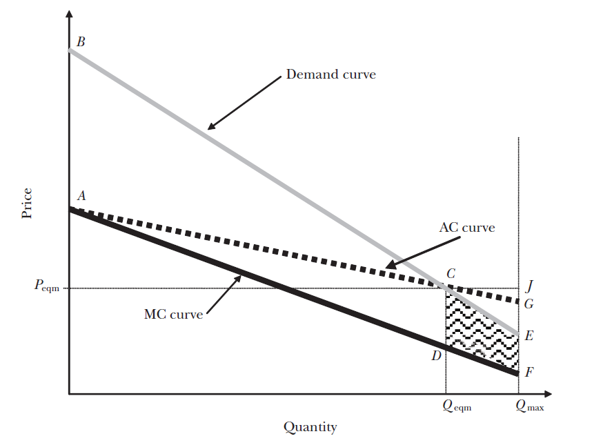
```

Modelo de oferta e demanda competitiva *com seleção adversa*: a demanda negativamente inclinada exclui do mercado consumidores de baixa disposição a pagar, o que (com seleção adversa) é ineficiente, pois a curva de custo marginal está abaixo da curva de demanda `r Citep(myBib, "einav")`

---
class: middle
## Seleção em mercados de seguros

A ineficiência do mercado com seleção vem do fato da curva de MC estar **abaixo** da curva de AC: o consumidor marginal sempre tem um custo menor que os inframarginais

Mas eles também têm uma disposição à pagar menor: produzir ao nível eficiente geraria prejuízo às operadoras &mdash; os indivíduos **de menor risco** são expulsos do mercado, ainda que valorem o seguro mais que seu custo individual: essa é a **seleção adversa**

---
class: middle

```{r, echo=FALSE, fig.show="hold", out.width="50%"}
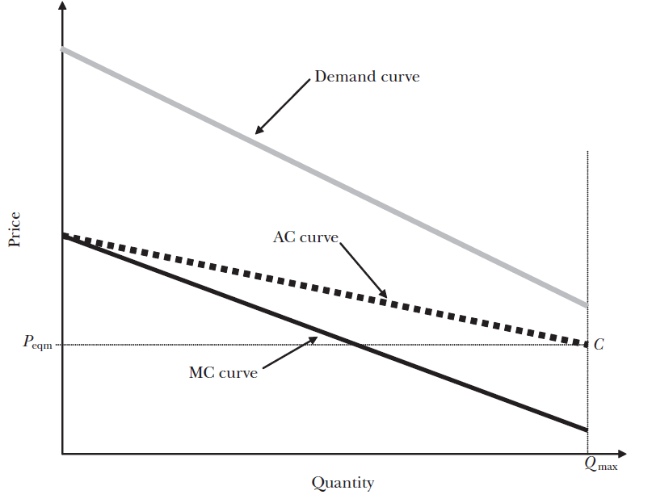
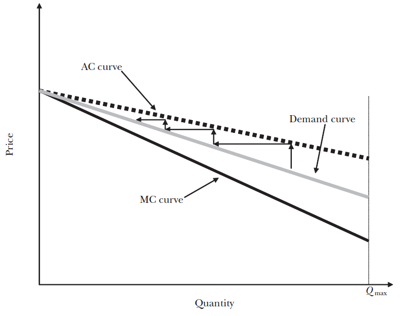
```

Casos extremos da seleção adversa: em (a) o resultado é eficiente, pois as empresas têm lucro operando em todo o mercado; em (b) o **mercado se degringola** &mdash; a cada preço potencial, o custo médio dos consumidores *dispostos a se segurar àquele preço* é maior que o dado preço `r Citep(myBib, "einav")`

---
class: middle
## Seleção em mercados de seguros

A solução canônica para a ineficiência gerada pela seleção adversa é obrigar a todos a comprar o seguro &mdash; mas note que se adicionarmos custos de administração, então não necessariamente a solução ótima envolve seguro completo

Além disso, se assumirmos *heterogeneidade de preferências*, então agentes mais avessos ao risco podem ser (i) mais cuidadosos; e (ii) dispostos a pagar mais (**seleção vantajosa**)

Com custos de administração e seleção vantajosa, temos o *oposto* do caso usual: a ineficiência é uma sobre-oferta de seguro

---
class: middle
## Razões para o seguro público

Outra razão é que se eu não tenho seguro de carro e bato em alguém, posso não ter dinheiro para cobrir seus danos, gerando uma *externalidade financeira* (por isso existe o DPVAT)

Outro motivo é que governos podem não conseguir *se comprometer crivelmente* a não intervir no estado ruim da natureza caso o agente não compre seguro (**dilema do samaritano**)

Também há o motivo redistributivo: frequentemente consumidores de maior risco também são os mais necessitados (ou são de maior risco *por serem* necessitados), e a solução eficiente de mercado envolveria eles pagar muito mais

---
class: middle
## Seguro próprio

Contratar seguro privado ou receber seguro público não são as únicas formas pelas quais os indivíduos podem se segurar em relação a choques

Existem várias formas pelas quais famílias podem *suavizar o consumo* sem seguro formal: podem usar sua poupança, aumentar o trabalho do esposo, pegar emprestado de bancos ou familiares &mdash; assim, um risco é que o seguro público faça **crowding out** no seguro próprio

Na prática, famílias frequentemente agem de *forma miópica*, dando valor demais ao presente e poupando menos que o racional &mdash; governo pode agir para corrigir *internalidades*

---
class: middle

```{r, echo=FALSE, out.width = '90%'}
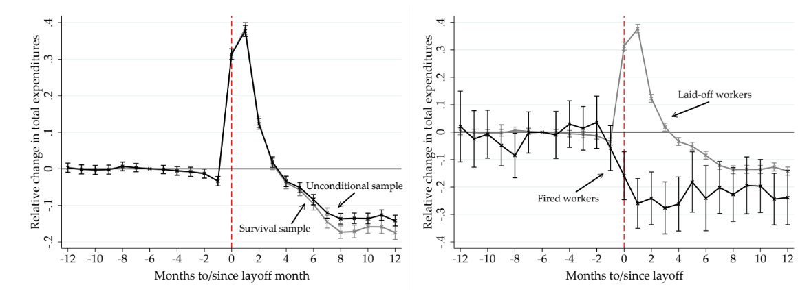
```

Evidência de comportamento miópico e falta de suavização de consumo: no Brasil, trabalhadores demitidos (*laid-off*, ao contrário de *fired* por justa-causa, no painel b) recebem o FGTS e *aumentam* seu consumo, mesmo perdendo *renda permanente* (efeito **cash in hand**) `r Citep(myBib, "gerard2021job")`

---
class: middle
## Risco moral

O outro conceito essencial de informação assimétrica é o efeito comportamental que o seguro tem na tomada de risco dos consumidores (**risco moral**)

`r Citep(myBib, "carvalho2018unintended")` estimam que 11-13% das demissões são influenciadas pela existência de seguro-desemprego

Sem risco moral o seguro ótimo seria total. Na realidade, o **nível ótimo de seguro** iguala o *benefício* de suavização do consumo com o *malefício* de gerar risco moral

---
class: middle
## Seguro-desemprego ótimo 

Consideremos o caso do seguro-desemprego: queremos suavizar o consumo de quem recebe choque negativo de emprego, mas se **taxa de reposição** for 100%, ninguém procuraria emprego(*)

Considere um indivíduo com probabilidade de estar desempregado $p$, que possui consumo $c_e = w - t$ quando empregado (onde $w$ é o salário e $t$ o imposto) e $c_u = b$ quando desempregado, com $b$ o benefício

Então a sua utilidade é: $$\mathbb{E}U = (1 - p)u(c_e) + pu(c_u) = (1 - p)u(w - t) + pu(b)$$
 
---
class: middle
## Seguro-desemprego ótimo sem risco moral

Governo tem **orçamento balanceado**: $(1 - p)\cdot t = p \cdot b$, ou $t = b \cdot p/(1-p)$

A política que maximiza o bem-estar então resolve $$\max_b \mathbb{E}U = (1 - p)u\left( w - b\frac{p}{1 - p} \right) + pu(b)$$

Sem risco moral, temos o mesmo resultado que antes, *seguro total*: $$pu^{\prime}(c_u) - (1 - p)\frac{p}{1 - p}u^{\prime}(c_e) = 0 \Rightarrow c_u = c_e$$ 
 
---
class: middle
## Seguro-desemprego ótimo com risco moral

Mas risco moral implica que $dp/db \neq 0$! Quanto maior a taxa de reposição dos salários, maior a probabilidade dos indivíduos estarem desempregados

Isso gera uma **externalidade fiscal**: quanto maior o seguro-desemprego, maior a taxação que precisaremos para financiá-lo, tanto *mecanicamente*, mas também pelo *efeito comportamental*

$$\max_b \mathbb{E}U = (1 - p)u\left( w - b\frac{p(b)}{1 - p(b)} \right) + pu(b)$$
O resultado iguala o benefício de suavização com o malefício do risco moral &mdash; seguro total não é mais ótimo: $$\frac{u^{\prime}(c_u) - u^{\prime}(c_e)}{u^{\prime}(c_e)} = \frac{1}{1 - p}\epsilon_{p,b} \text{ onde }\epsilon_{p,b} = \frac{b}{p}\frac{dp}{db}$$ 

---
class: middle

```{r, echo=FALSE, fig.show="hold", out.width="50%"}
knitr::include_graphics("figs/eae0310-6-4.png")
knitr::include_graphics("figs/eae0310-6-4b.png")
```

Diferença na duração do desemprego por valor de seguro-desemprego &mdash; quartil mais pobre (a) vs quartil mais rico (d): um menor seguro-desemprego faz os mais pobres acharem emprego mais rapidamente, mas não tem o mesmo efeito sobre os mais ricos, que plausivelmente conseguem já suavizar o consumo com poupança prévia `r Citep(myBib, "chetty2008moral")`


---
class: middle
## Aposentadoria

O sistema de previdência social cobra impostos sobre a folha de pagamentos da população ativa para transferir aos idosos &mdash; esses, não podendo trabalhar, teriam nenhuma fonte de renda, e a poupança que fizeram no **ciclo de vida** pode acabar ("risco de viver demais")

Qual a razão para intervenção governamental nesse mercado? Em princípio, o mercado financeiro pode vender *anuidades*

Mas novamente temos o problema de **seleção adversa**: só vai comprar anuidade (versus uma poupança normal) quem tem boa saúde e espera viver muito tempo

---
class: middle

```{r, echo=FALSE, out.width = '50%', fig.align="center"}

```


---
class: middle
## Aposentadoria

Como vimos, nessas situações o governo pode fazer melhor que o mercado, pois ele pode *obrigar* as pessoas a comprar, resolvendo o problema de seleção adversa

Mas na prática a principal razão para a aposentadoria é atacar *internalidades*: o fato que as pessoas em geral não poupam o quanto precisariam para ter uma vida decente na velhice

Pesquisas na Itália e Reino Unido estimam que cada $1 de previdência social reduz poupança privada (**crowding out**) em 30-40¢ &mdash; se as pessoas agissem racionalmente, elas estariam poupando o seu valor ótimo, e esse crowding out deveria ser próximo de 1

---
class: middle

```{r, echo=FALSE, out.width = '100%'}
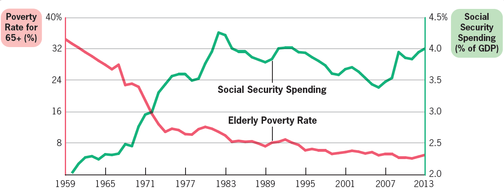
```

Aumento da previdência social nos EUA está associado com significativa redução na pobreza dentre idosos `r Citep(myBib, "gruber")` &mdash; no Brasil, apenas 2,7% dos idosos estão abaixo da linha de pobreza, contra 11,5% na média nacional (e 20,3% entre 0-4 anos) (CPS/FGV)

---
class: middle
## Reforma da previdência

Toda década volta ao debate público o problema da sustentabilidade do setor previdenciário e reformas. [A última foi em 2019](https://www.gov.br/inss/pt-br/assuntos/noticias/confira-as-principais-mudancas-da-nova-previdencia):

1. A reforma entre outras coisas aumentou a idade mínima (65/62) e requer idade e tempo de contribuição (20/15)
2. O pagamento agora é sobre a média dos salários (antes era dos 80% maiores): 60% + 2% por ano acima do tempo mínimo de contribuição
3. A alíquota do INSS agora é progressiva: 7,5% para salário mínimo, até 14% (mas só até teto do RGPS), e até 22% no RPPS

---
class: middle
## Reforma da previdência

Muito se fala em "déficit previdenciário", mas ao contrário da previdência privada, que é financiada por um fundo poupado pelo próprio trabalhador durante a vida, a previdência pública funciona *sem fundo constituído* (**regime de repartição**)

Assim, não existe diferença *econômica* real entre a contribuição para o INSS e o financiamento do governo em geral (impostos)

Problemas reais do sistema são três: *progressividade*, *sustentabilidade* e *desincentivo ao trabalho*

---
class: middle
## Incidência

Para calcular a *incidência* da aposentadoria precisamos calcular a **riqueza líquida previdenciária**: o valor presente dos benefícios *esperados* dividido pelo valor presente dos pagamentos

Aposentadoria tem efeitos de **incidência intergeracional**: as primeiras gerações são as grande ganhadoras, e as últimas (se houverem) as grandes perdedoras

Mulheres também têm SSW maior: elas pagam o mesmo mas se aposentam antes (recebem benefícios por mais tempo)

---
class: middle

```{r, echo=FALSE, out.width = '90%'}
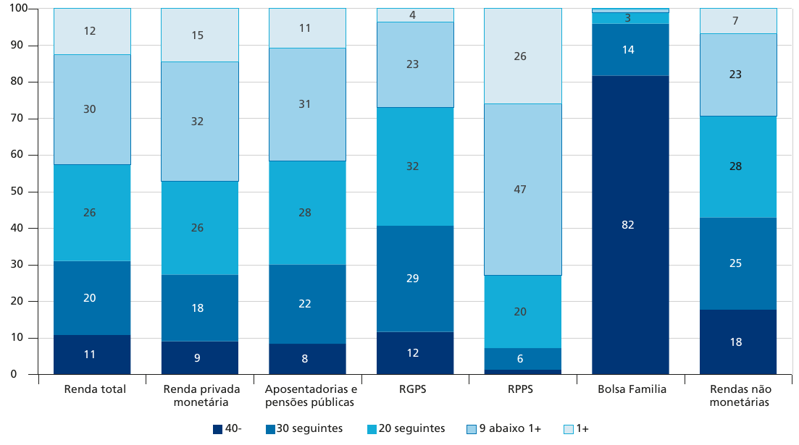
```

No Brasil, a previdência social não é progressiva: em geral, os benefícios são ainda mais concentrados que a (já extremamente desigual) distribuição de renda &mdash; essa falta de progressividade vem principalmente (mas não só) do Regime Próprio `r Citep(myBib, "silveira2020impactos")`


---
class: middle

```{r, echo=FALSE, out.width = '80%'}
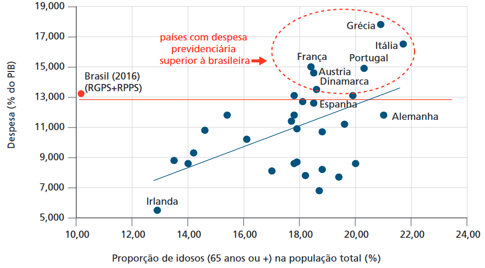
```

**Sustentabilidade:** o Brasil transfere a idosos o mesmo *em proporção do PIB* que países com uma proporção muito maior de idosos na população `r Citep(myBib, "ipea2020politicas")`

---
class: middle

```{r, echo=FALSE, out.width = '70%'}
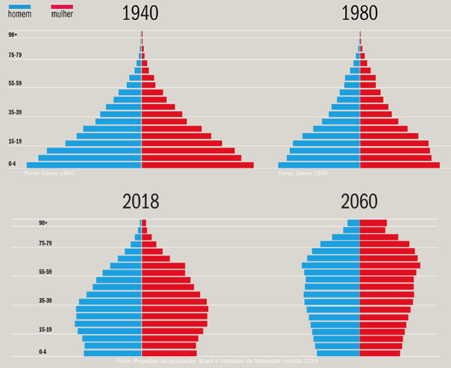
```

Transferências aos idosos se tornam insustentáveis com mudanças na pirâmide etária, que aumentam proporção de recipientes em relação a pagantes ([IBGE](https://educa.ibge.gov.br/professores/educa-atividades/20818-producao-textual-o-envelhecimento-da-populacao.html))

---
class: middle

```{r, echo=FALSE, fig.show="hold", out.width="50%"}
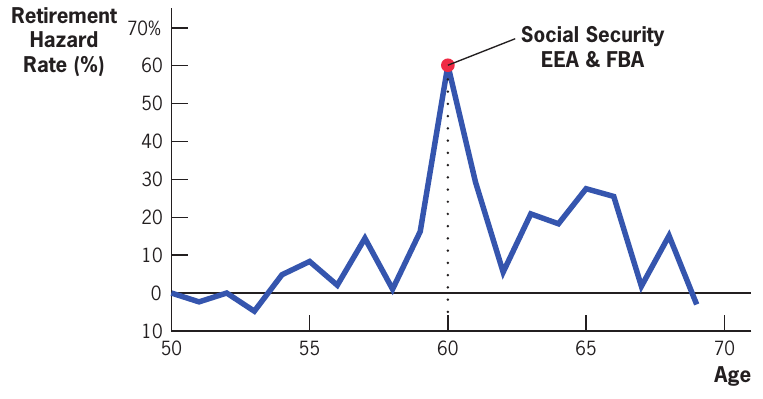
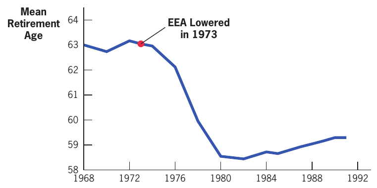
```

Na França, em (a), quase 70% dos idosos se aposentam exatamente na idade mínima, evidenciando que a aposentadoria distorce o comportamento (**desincentivo ao trabalho**). Da mesma forma, uma redução na idade mínima na Alemanha em 1973, painel (b), diminuiu a idade média de aposentadoria no país  `r Citep(myBib, "gruber")`

---
class: middle

```{r, echo=FALSE, out.width = '50%'}
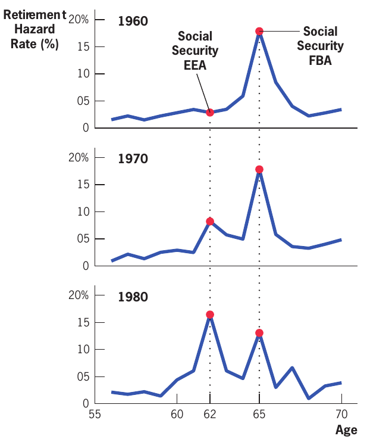
```

Nos EUA, antes da introdução de uma aposentadoria precoce (EEA) em 1962, a maioria dos trabalhadores se aposentava na idade integral (*bunching*) &mdash; mas essa massa foi se transferindo, ao longo das décadas de 70 e 80, para a idade mínima `r Citep(myBib, "gruber")`

---
class: middle

```{r, echo=FALSE, out.width = '100%'}
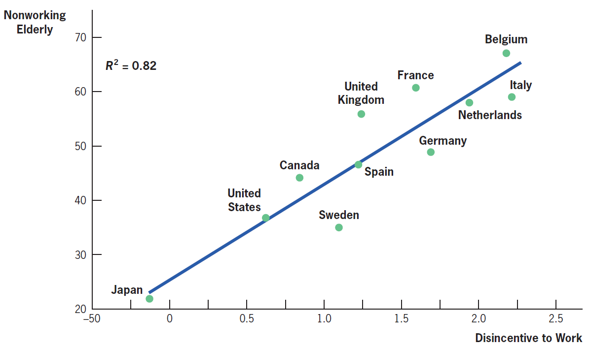
```

A previdência social gera **taxação implícita** ao trabalho dos idosos &mdash; na comparação entre países, países com uma taxação implícita maior têm menor proporção de idosos trabalhando `r Citep(myBib, "gruber")`

---
class: middle
## Seguro desemprego

Recebe seguro desemprego no Brasil *trabalhadores formais* demitidos (involutariamente) sem justa causa que trabalharam 12 meses nos últimos 18 (1a solicitação), 9/12 (2a) ou nos 6 últimos meses (3a+)

Valor é 80% (até R$ 1.968,36) a 50% (acima disso) da média dos últimos 3 meses de trabalho (**taxa de reposição**), com máximo de R$ 2.230,97 (2023), e o trabalhador recebe por 3 (até 1 ano), 4 (até 2) ou 5 meses (mais de 2 anos de trabalho)


---
class: middle

```{r, echo=FALSE, out.width = '90%'}
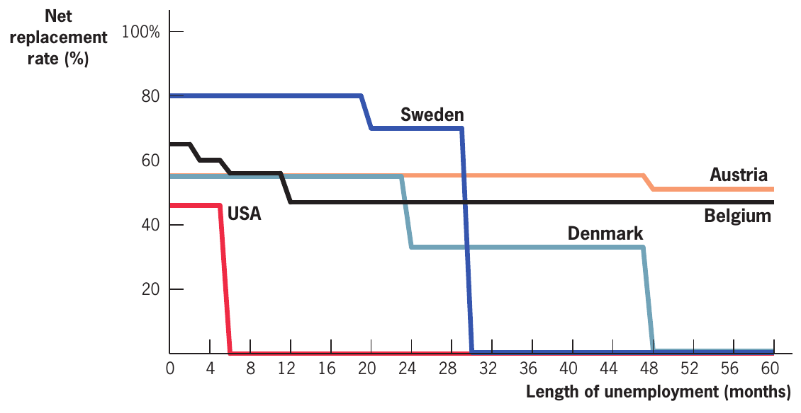
```

A duração do seguro desemprego no Brasil é muito menor que a maioria dos países desenvolvidos, mas a taxa de reposição (até o teto) é comparável `r Citep(myBib, "gruber")`

---
class: middle
## Seguro desemprego

Como discutimos, o nivel ótimo de seguro desemprego é aquele que iguala (na margem) a *suavização do consumo* (benefício) com o *risco moral* (malefício)

Meyer (1989) comparou aumentos no seguro-desemprego em estados americanos e encontrou que um aumento de 10% no benefício aumenta a duração do desemprego em 8% &mdash; mas qual o efeito normativo disso? Duração maior pode ser eficiente se gerar um **match melhor de qualidade de emprego**

Famílias também podem suavizar o consumo sem suavizar a utilidade, se tiverem que gerar renda de forma mais custosa (p.ex., bicos noturnos ou em atividades degradantes)

---
class: middle

```{r, echo=FALSE, fig.show="hold", out.width="50%"}
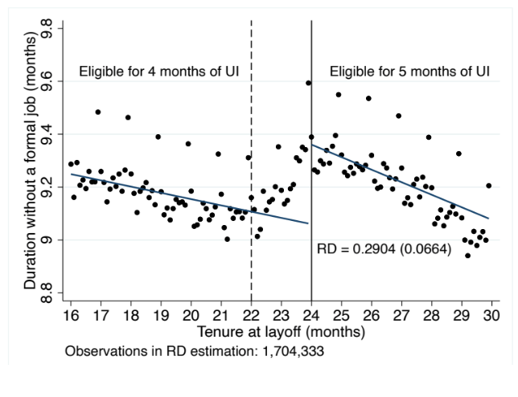
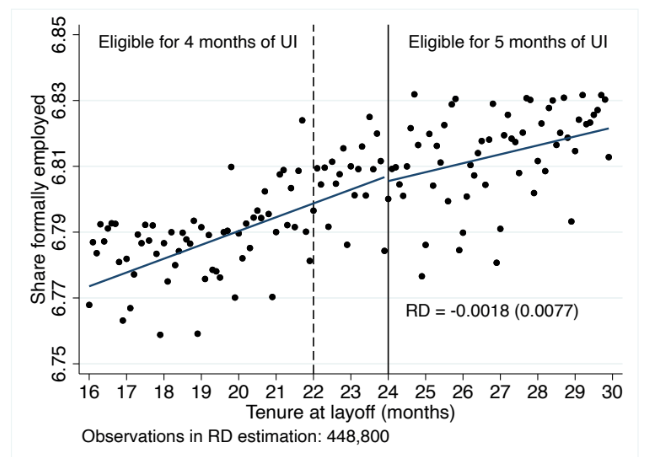
```

No Brasil, uma duração maior de seguro-desemprego faz as pessoas ficarem desempregadas por mais tempo, painel (a), mas não parece ter efeito no salário 3 anos depois, no painel (b) `r Citep(myBib, "gerard2021informal")` 
 
---
class: middle
## Seguro de saúde

Os gastos com saúde no Brasil foram 9,2% do PIB (2017), sendo 3,9% gastos públicos (SUS) e 5,4% gastos privados (27% da população é coberta pelo setor privado)

O nível de gastos como % do PIB está na média da OCDE, mas a participação do setor público é bem menor &mdash; mesmo nos EUA, $\approx 50\%$ dos gastos com saúde são públicos (Medicare e Medicaid): mais que no Brasil!

O governo pode intervir obrigando (e subsidiando) a compra de seguro de saúde (Alemanha) ou oferecendo diretamente o serviço (NHS, SUS), seja diretamente pelo governo ou por concessionários

---
class: middle

```{r, echo=FALSE, out.width = '100%'}
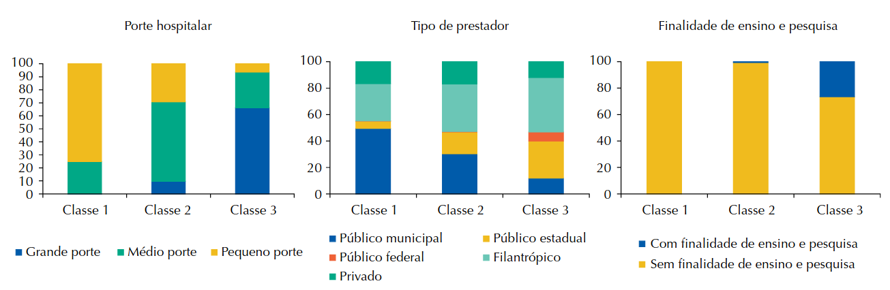
```

Por volta de 20% dos hospitais que atendem o SUS são privados e 30% filantrópicos: apenas metade são públicos &mdash; entre esses, são principalmente municipais entre os hospitais menores (C1), e estaduais e federais entre os maiores (e que fazem atendimentos de maior complexidade), Classe 3 na figura `r Citep(myBib, "botega2020perfil")`

---
class: middle

```{r, echo=FALSE, out.width = '60%'}
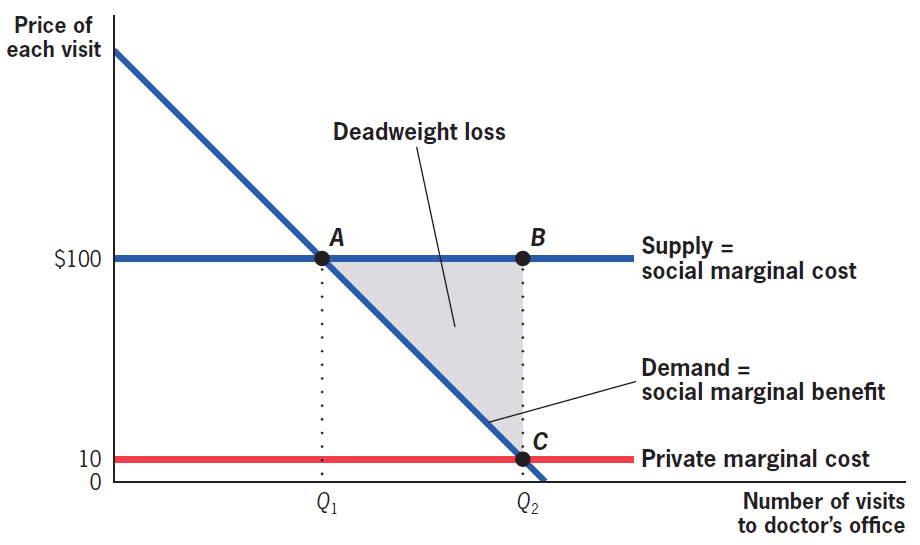
```

Se a consulta custa `$`100, o indivíduo consome Q1, mas se a *coparticipação* é de apenas `$`10, consome Q2 (**risco moral**) &mdash; mas o efeito normativo não é óbvio: se os custos refletem a disposição a pagar, então sem o seguro, pessoas pobres (baixa disposição) vão consumir poucos serviços médicos `r Citep(myBib, "gruber")`

---
class:middle
# Referências
<small>
```{r refs, echo=FALSE, results="asis"}
PrintBibliography(myBib, start=1, end=5)
```
</small>

---
class:middle
# Referências
<small>
```{r refs2, echo=FALSE, results="asis"}
PrintBibliography(myBib, start=6)
```
</small>


<!-- --- -->
<!-- class: middle -->

<!-- ```{r, echo=FALSE, fig.show="hold", out.width="50%"} -->
<!-- 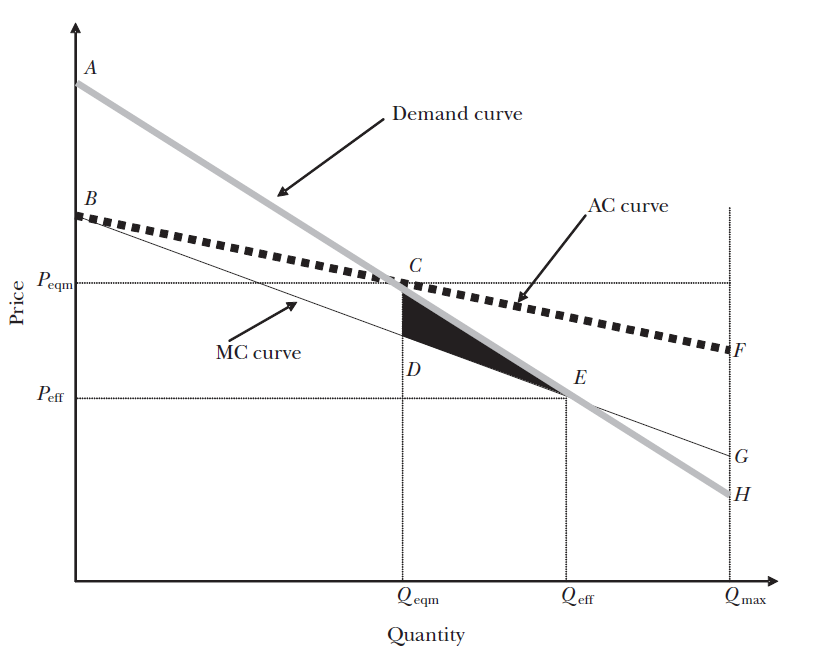 -->
<!-- 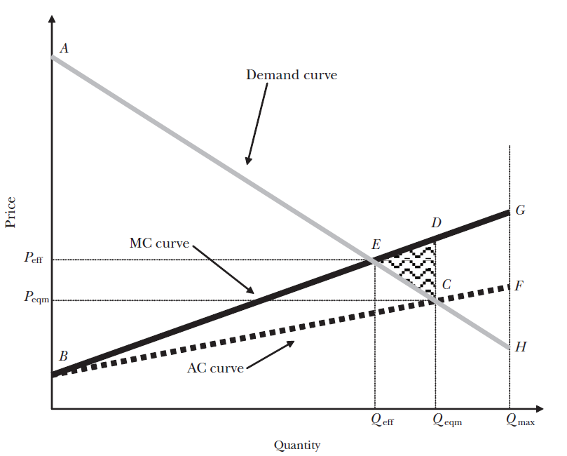 -->
<!-- ``` -->

<!-- Extensões ao "modelo de livro-texto": (a) com custo de administração provisão a todos já pode não ser eficiente; e (b) **seleção vantajosa** `r Citep(myBib, "einav")` -->