class: inverse, middle, center

```{r, load_refs, include=FALSE, cache=FALSE}
library(RefManageR)
BibOptions(check.entries = FALSE,
           bib.style = "alphabetic",
           cite.style = "alphabetic",
           style = "markdown",
           hyperlink = FALSE,
           dashed = FALSE)
myBib <- ReadBib("./esp_bib.bib", check = FALSE)
```

# Introdução à taxação

---
class: middle
## Introdução à taxação

Nessa segunda parte do curso, vamos sair do campo dos gastos para estudar as formas de arrecadação do governo

Aqui temos novamente a *metáfora do balde com furos*: podemos transferir dinheiro dos indivíduos para o governo gastar como preferir, mas perdemos parte da renda no processo

Além de financiar gastos governamentais, taxação é parte constituinte da *redistribuição de renda* &mdash; voltamos ao problema essencial no estudo da economia do setor público: o **trade-off entre eficiência e equidade**

---
class: middle
## Tipos de taxação

Do ponto de vista econômico, *todo tipo de taxação se dá sobre pessoas*: qualquer imposto corporativo ou sobre bens incide sobre as pessoas que são donas ou trabalham nessas empresas, ou sobre os consumidores desses bens

As duas formas canônicas de taxação são os **impostos diretos** (taxação de renda) e **impostos indiretos** (taxação de consumo)

O *imposto de renda* se divide pela renda dos diferentes fatores de produção: taxação da renda do capital e da renda do trabalho (salários) &mdash; essa última também é feita diretamente por *impostos sobre a folha de pagamento*

---
class: middle
## Tipos de taxação

A taxação de renda do capital toma várias formas:

1. *Taxação de lucros e dividendos* é parte do imposto de renda
2. *Imposto de renda de pessoa jurídica* é outra forma de taxar o lucro do capital (ou seja, é um imposto sobre o capitalista) &mdash; o que pode ser útil para combater a evasão/elisão fiscal
3. *Taxação de ganhos de capital* geralmente é empregada para combater elisão fiscal por recompra de ações
4. *Taxação de riqueza* também é (quase) equivalente a uma taxação sobre o lucro advindo daquela riqueza &mdash; aqui entra também imposto sobre propriedade e herança


---
class: middle
## Taxas de impostos

A **taxa marginal de imposto** é a proporção de impostos pagos num real adicional de *rendimento tributável* (em geral é a alíquota máxima que o indivíduo atinge)

O rendimento tributável menos *deduções* forma a base de cálculo do imposto, onde recai as alíquotas

Como cada nova alíquota só recai sobre renda *adicional*, a **taxa média de imposto** (alíquota efetiva) geralmente vai ser bem menor que a taxa marginal


---
class: middle

```{r, echo=FALSE, out.width = '75%'}
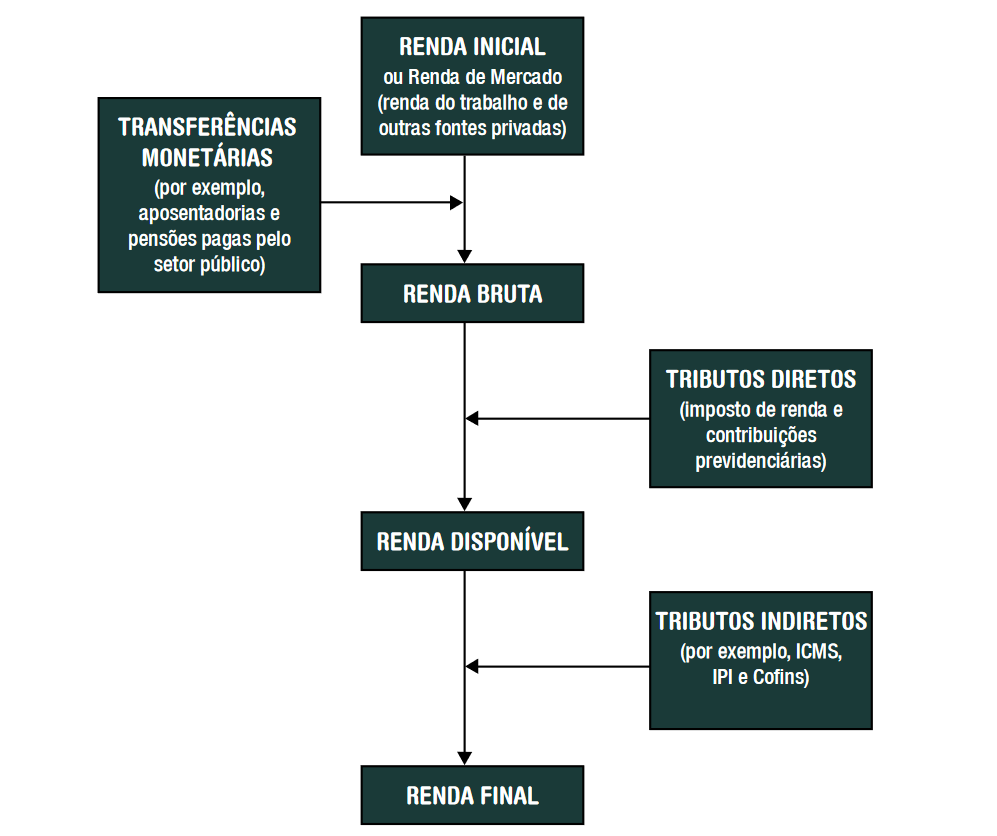
```

Definições de renda [(SEAE/2017)](https://www.gov.br/fazenda/pt-br/centrais-de-conteudos/publicacoes/boletim-de-avaliacao-de-politicas-publicas/arquivos/2017/efeito_redistributivo_12_2017.pdf) 

---
class: middle

```{r, echo=FALSE, out.width = '85%'}
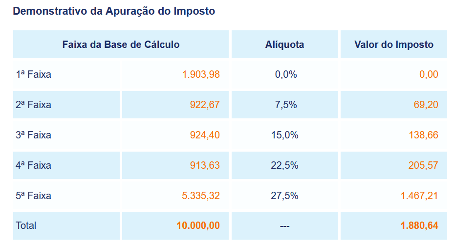
```

A *alíquota efetiva* para uma base de cálculo de R$10.000 no IRPF do Brasil é (apenas) 18,81% [(Simulação de Alíquota - Receita Federal)](http://www26.receita.fazenda.gov.br/irpfsimulaliq/private/pages/simuladoraliquota.jsf)


---
class: middle
## Princípios da taxação

Adam Smith defendeu que a taxação devia obedecer a 4 princípios: (i) justiça/equidade, (ii) clareza e certeza na forma e valor de pagamento, sem arbitrariedades, (iii) máxima conveniência ao pagador, e (iv) eficiência

> Os súditos de cada Estado devem contribuir o máximo possível para a manutenção do Governo, <mark>em proporção a suas respectivas capacidades</mark>, isto é, <mark>em proporção ao rendimento de que cada um desfruta, sob a proteção do Estado</mark>. (Smith, 1996, vol. 2, p. 282) 

Essa frase ambígua gerou duas tradições: o *princípio da capacidade de pagar* e dos *benefícios* `r Citep(myBib, "musgrave")` &mdash; o próprio Smith parecia concordar mais com a 1a, e ela se tornou dominante

---
class: middle
## Princípios da taxação

Adam Smith defendia que pessoas deveriam contribuir ao governo de acordo com a sua **capacidade de pagar**

benefícios recebidos 

---
class: middle
## Equidade vertical e horizontal

**Equidade horizontal** diz que indivíduos iguais nas dimensões relevantes devem ser tratados de forma igual

A dificuldade, é claro, está em definir *quais são essas dimensões relevantes*: cor de pele, cor de cabelo, altura, sexo, estado civil, renda &mdash; algumas dessas a sociedade julga justo diferenciar políticas públicas a respeito, outras não

Já a **equidade vertical** lida com o tratamento justo de indivíduos desiguais: indivíduos com maior renda devem pagar mais impostos (mas se essa equidade vertical resultaria em taxação proporcional ou progressiva, e quão progressiva, o princípio não é claro)

---
class: middle
## Progressividade dos impostos

Se a *taxação média* aumenta com a renda, dizemos que o imposto é **progressivo**

Se ela é igual para diferentes faixas de renda dizemos que é **proporcional**, e se a taxação média diminui com a renda, dizemos que o imposto é **regressivo**

A *equidade vertical* (capacidade de pagar) diz que pessoas mais ricas devem pagar mais impostos, mas se o sistema tributário deve ser proporcional ou progressivo (e quão progressivo), diferentes autores tiveram diferentes opiniões

---
class: middle

```{r, echo=FALSE, out.width = '75%'}
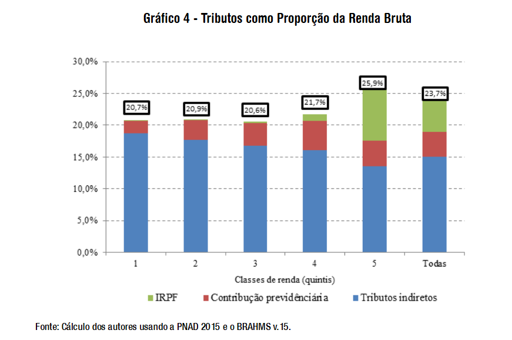
```

O sistema tributário brasileiro (excl. tributação corporativa) é muito pouco progressivo, variando de 20% da renda bruta para o quintil mais pobre (quase inteiramente impostos indiretos) a 26% no quintil mais rico, onde boa parte já é IRPF [(SEAE/2017)](https://www.gov.br/fazenda/pt-br/centrais-de-conteudos/publicacoes/boletim-de-avaliacao-de-politicas-publicas/arquivos/2017/efeito_redistributivo_12_2017.pdf)  


---
class: middle

```{r, echo=FALSE, out.width = '75%'}
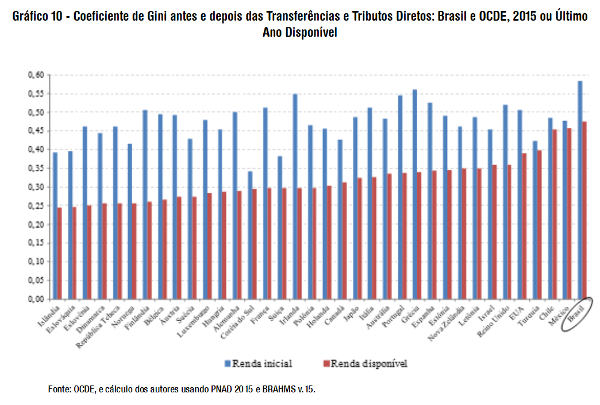
```

O Brasil tem a maior desigualdade dentre os países da OCDE tanto antes quanto depois de transferências e tributos: estes reduzem o índice de Gini em 0,1, metade da redução observada na França, por exemplo [(SEAE/2017)](https://www.gov.br/fazenda/pt-br/centrais-de-conteudos/publicacoes/boletim-de-avaliacao-de-politicas-publicas/arquivos/2017/efeito_redistributivo_12_2017.pdf)  


---
class: middle

```{r, echo=FALSE, out.width = '85%'}
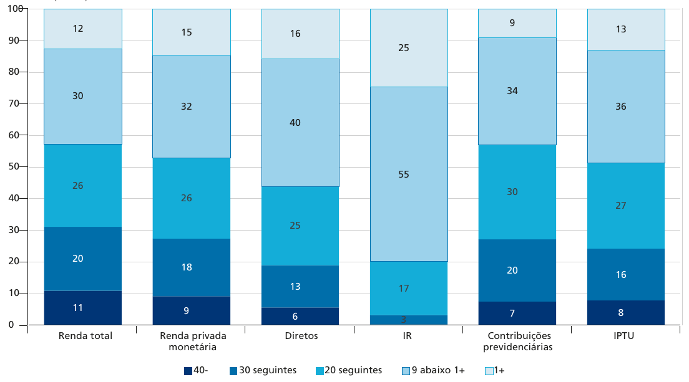
```

No Brasil, os impostos são apenas levemente progressivos em relação à renda monetária: enquanto 80% do IRPF é pago pelos 10% mais ricos, e 97% pelos 30% mais ricos, as contribuições previdenciárias são proporcionais, reduzindo a progressividade `r Citep(myBib, "silveira2020impactos")`

---
class: middle
## Definição da renda tributável

Partir de uma teoria normativa sobre pagamentos de impostos (capacidade de pagar ou bem-estar social) para um sistema factual de impostos gera várias dificuldades práticas

Se a casa de uma pessoa pega fogo e ela trabalha e compra mais para reconstruir, a sua habilidade de pagar aumentou? A sua utilidade aumentou? 

Uma tentativa de abordar isso é usar *deduções* para o que não se enquadre na **definição de renda de Haig-Simons**: a capacidade de pagar é igual ao *potencial de consumo anual*, seu consumo de fato mais aumento da riqueza 

---
class: middle
## Deduções

Um desvio usual da definição de Haig-Simons é a dedutibilidade de alguns gastos de consumo que o governo queira estimular, como educação, saúde ou doações, já que geram *crowding-out* de gastos governamentais

Se essas deduções valem a pena depende de calcular o **efeito inframarginal** (o efeito em pessoas que já doariam ou usariam educação privada mesmo sem o subsídio)...

... e comparar com o **efeito marginal**: as pessoas que deixam de usar educação pública (ou doariam menos) por causa do subsídio

---
class: middle
## Gastos tributários

Desvios da definição de Haig-Simons são chamadas de **gastos tributários**: perdas de receita do governo devidas a exclusões, isenções ou reduções especiais ou ainda taxa preferencial de imposto, crédito ou adiamento de débito

Deduções de gastos de educação e saúde privada são gastos tributários, assim como o regime tributário especial da Zona Franca de Manaus

Os gastos tributários federais representaram em 2017 4% do PIB, ou 1/5 da receita tributária federal &mdash; discutimos mais esse tipo de gasto [nesse artigo](https://www.pedroforquesato.com/files/gastos-tributarios.png).

---
class: middle

```{r, echo=FALSE, out.width = '120%'}
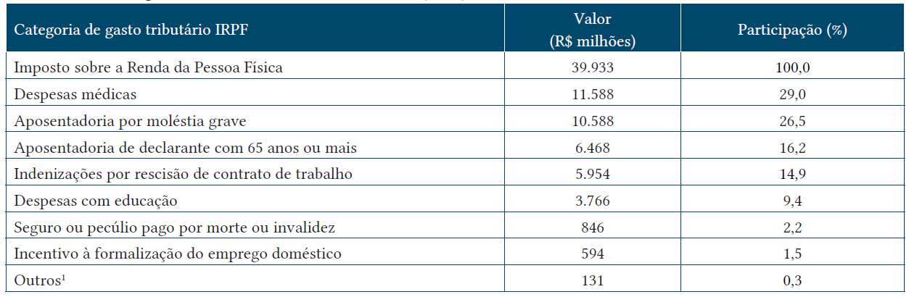
```

Gastos tributários no IRPF por tipo, 2016. No ano, gastos tributários no IRPF representaram 10% do orçamento do Ministério da Saúde `r Citep(myBib, "silveira2019beneficios")` 

---
class: middle

```{r, echo=FALSE, out.width = '100%'}
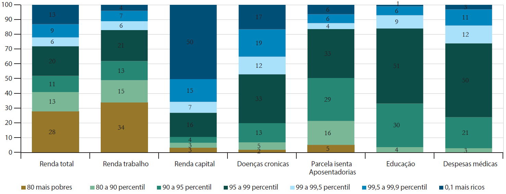
```

Distribuição por faixa de renda da renda nacional (por tipo) e dos gastos tributários no IRPF, 2008. A renda do capital (isenta no IRPF) é extremamente concentrada, assim como as principais deduções &mdash; mas deduções de educação e rendas médicas favorecem especialmente os 10-1% mais ricos `r Citep(myBib, "silveira2019beneficios")` 

---
class: middle

```{r, echo=FALSE, out.width = '90%'}
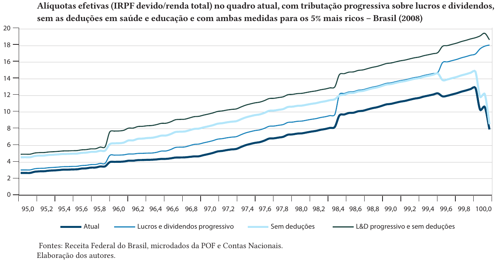
```

A isenção de lucros e dividendos faz com que o IRPF seja regressivo dentre os 0,3% mais ricos do país `r Citep(myBib, "silveira2019beneficios")` 

---
class: middle

```{r, echo=FALSE, out.width = '100%'}
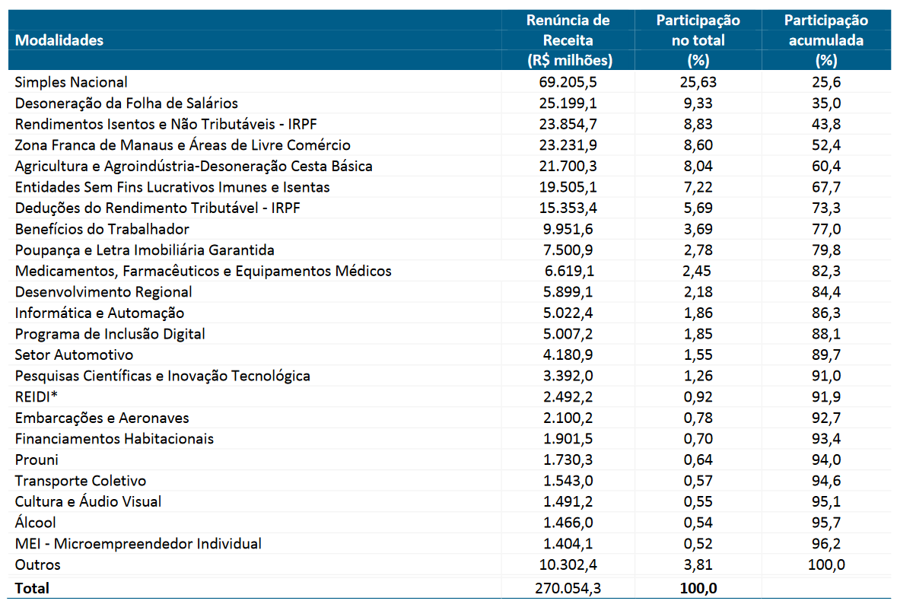
```

Gastos tributários por tipo (RAF16, IFI 2018) 

---
class: middle
## Taxação no Brasil

No Brasil, o governo federal é responsável pelos:

1. *Imposto de renda*: IRPF/IRRF, IRPJ, CSLL, que representam 7,4% do PIB 
2. Alguns *impostos sobre consumo*: IPI, Cofins, IOF, etc, que representam 5,63% do PIB; e
3. *Impostos sobre a folha de pagamentos*: contribuições sociais RGPS, RPPS, FGTS, salário educação, Sistema S, etc, somando 8,55% do PIB

Impostos sobre comércio exterior (importações) no Brasil arrecadam relativamente pouco: apenas 0,59% do PIB

---
class: middle
## Taxação no Brasil

A receita estadual é quase inteiramente ICMS (7% do PIB), mas também tem o imposto sobre heranças ITCMD (0,12% do PIB) e o IPVA (0,64%)

Já os governos municipais arrecadam poucos impostos (e os municípios pequenos quase nada), sendo os principais impostos sobre a propriedade (IPTU, ITBI), com 0,82% do PIB, e o ISS (0,94%)

A carga tributária bruta, de por volta de 32% do PIB, é mais baixa que os 34% de média da OCDE, mas maior que a maioria dos outros países em desenvolvimento

---
class: middle

```{r, echo=FALSE, out.width = '80%'}
knitr::include_graphics("figs/aula-1-grafico-1.png")
```

Até a 1ª Guerra a capacidade fiscal dos países (hoje) desenvolvidos era baixa, arrecandando menos de 10% do PIB. Em grande parte pelo esforço de guerra essa arrecadação subiu para $\approx 30\%$ no pós 2ª Guerra, e desde então divergiu entre países europeus e EUA, subindo para mais da metade do PIB em países escandinavos `r Citep(myBib, "piketty2018capital")`

---
class: middle

```{r, echo=FALSE, out.width = '90%'}
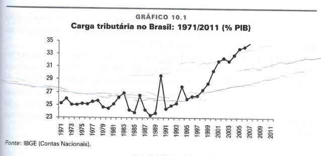
```

A carga tributária como proporção do PIB se manteve relativamente constante durante a ditadura, subindo depois da Constituição de 88 &mdash; mas o crescimento mais significativo se deu na década de 2000, convergindo com a média da OCDE (Giambiagi & Alem)

---
class: middle

```{r, echo=FALSE, out.width = '100%'}
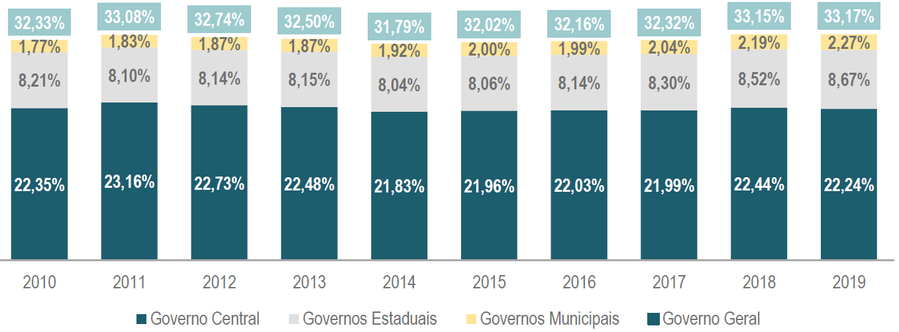
```

Desde então a carga tributária tem se mantido constante em proporção do PIB. Dos 33% arrecadados pelo governo brasileiro, 2/3 são arrecadados pelo governo federal, 25% pelo estadual e menos de 10% pelos municipais (Boletim CTB 2019) 

---
class: middle

```{r, echo=FALSE, out.width = '90%'}
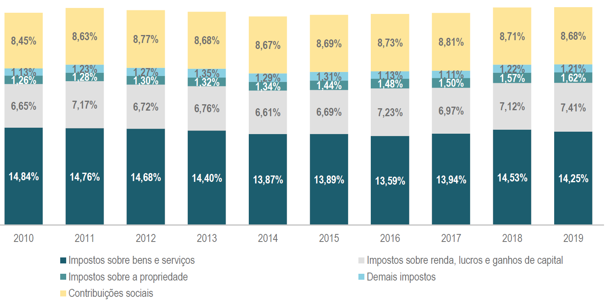
```

No Brasil a maior fonte de receita do governo são impostos indiretos (43%), seguido por contribuições sociais (26%), impostos de renda, lucros e ganhos de capital (22%) e impostos sobre a propriedade (5%) (Boletim CTB 2019) 

---
class: middle

```{r, echo=FALSE, out.width = '90%'}
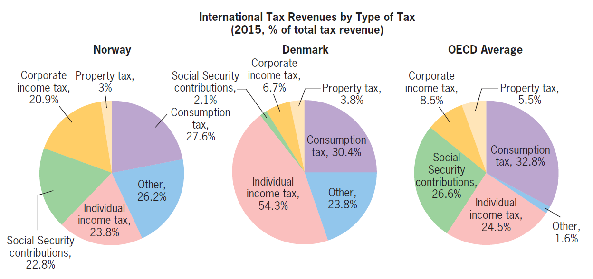
```

Países ao redor do mundo diferem bastante na forma em que arrecadam os seus impostos, mas em geral eles taxam renda e lucros mais (33% na média da OCDE vs 22% aqui) e consumo menos (33% OCDE vs 43% aqui) do que o Brasil `r Citep(myBib, "gruber")` 

---
class: inverse, middle, center

# Kleven, Henrik (2014). “How Can Scandinavians Tax so Much?”

---
class: middle
## Como os escandinavos conseguem taxar tanto?

Um visitante ingênuo pode ficar chocado ao chegar nos países escandinavos: por mais que redistribuam muita renda por taxação (distorciva), ainda assim estão dentre os países mais ricos do mundo

O **trade-off eficiência e equidade** deveria implicar que países com alta redistribuição distorciva de renda (*Okun's leaky bucket*) seriam muito ineficientes e mais pobres &mdash; mas no caso escandinavo isso não parece ocorrer, *por quê?*

---
class: middle
## Taxa de impostos de participação

`r Citep(myBib, "kleven")` apresenta duas medidas que representam quanto mais distorcivas são as taxações nos países escandinavos 

A **taxa de impostos de participação** é a proporção do aumento de renda líquida quando um indivíduo começa a trabalhar em relação ao seu salário:

$$1 - \frac{\text{Renda disponivel do trabalho} - \text{Renda disponivel inativo}}{\text{Renda inicial do trabalho}}$$

---
class: middle
## Taxa de impostos de participação

Esse aumento pode ser menor pela taxação do salário e pela perda de programas assistenciais que recebia quando desempregado &mdash; no limite, a *taxa de impostos de participação* pode ser maior que 100%, se começar a trabalhar *reduz* a renda disponível do indivíduo

Se o salário na Dinamarca for €1000 e a taxa de participação 80%, então começar a trabalhar só aumenta a renda dos indivíduos em €200 &mdash; por exemplo, se a assistência social é de €500 e a taxa média de impostos 30%

A taxa de impostos de participação mede os desincentivos para a população inativa entrar no mercado de trabalho (**margem extensiva**)

---
class: middle
## Taxa marginal no topo

Outra estatística é a **taxa marginal de impostos no topo**: quanto de $1 extra de renda os mais ricos precisam pagar em tributos

Se $T(y)$ são os impostos pagos como função da renda do indivíduo, então o imposto marginal é $\lim_{y\rightarrow \infty} T^{\prime}(y)$

Ms no mundo real geralmente sistemas tributários são *piecewise-linear*, então o imposto marginal no topo vai ser apenas a alíquota máxima do imposto de renda mais outros 

---
class: middle

```{r, echo=FALSE, out.width = '90%'}
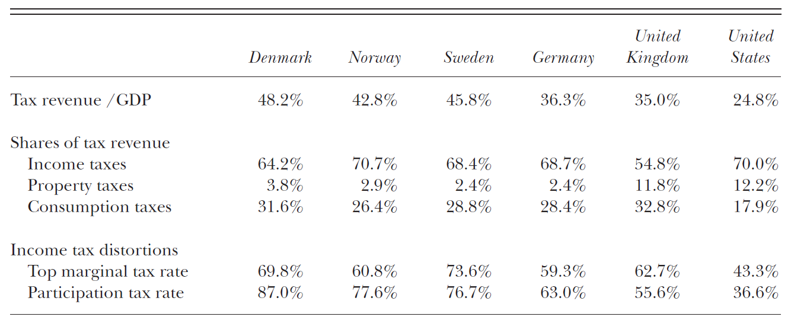
```

A taxa de participação em países escandinavos é por volta de 80%, ao contrário de 36% nos EUA, mas a taxa de participação na força de trabalho do país escandinavo é maior que a do norteamericano `r Citep(myBib, "kleven")`

---
class: middle
## Como os escandinavos conseguem taxar tanto?

Há três características do sistema tributário escandinavo que permitem isso, e países devem emular se quiserem aumentar a redistribuição

1. Bom sistema de informação e third-party reporting garantem baixa **sonegação fiscal** (aqui também é importante a proporção baixa de trabalhadores por conta própria)
2. Uma base de cobrança larga que evita **elisão fiscal**; e
3. Subsídio ou provisão pública de bens complementares ao trabalho, como pré-escola e transporte

---
class: middle
## Informações por terceiros e evasão fiscal

*Taxação depende de informação*: como os indivíduos não têm incentivos para revelar o quanto devem pagar de impostos, o sistema tributário precisa de informação sobre transações para o **enforcement fiscal**

Essa informação é adquirida mais eficazmente por **third-party reporting** &mdash; quando o sistema se constroi de forma que cada agente revele as transações tributáveis de outros agentes na economia

Firmas reportam quanto pagam de salários, empresas de cartão de crédito os gastos dos usuários, produtores pagando IVA a receita de seus fornecedores, etc, e o governo pode cruzar essa informação para evitar *evasão fiscal*

---
class: middle

```{r, echo=FALSE, out.width = '75%'}
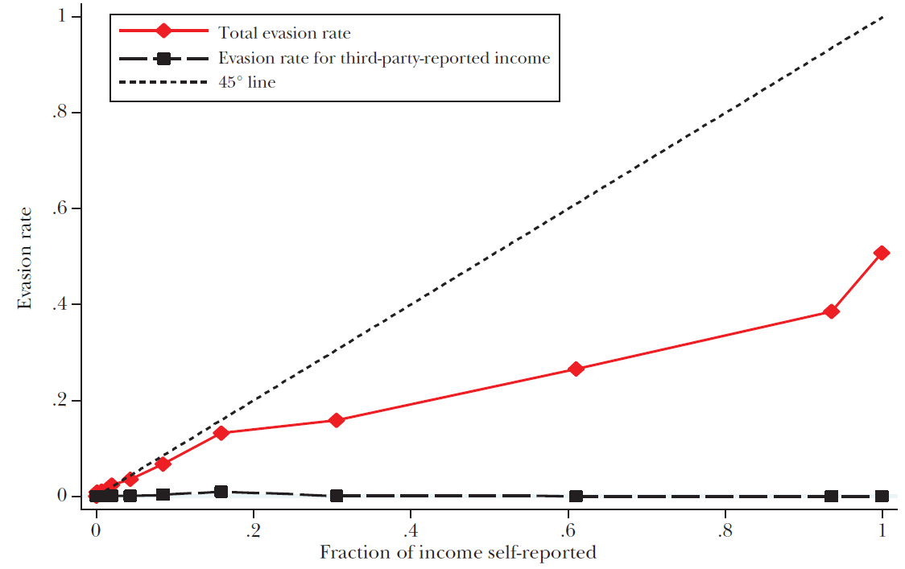
```

Na Dinamarca, quanto maior a proporção da renda autoreportada (conta própria), maior a evasão fiscal &mdash; mas essa relação só vale quando não há *third-party reporting* `r Citep(myBib, "kleven")`

---
class: middle
## Tipos de emprego e evasão fiscal

Por causa da informação dos patrões e pelo **withholding**, o trabalho assalariado formal tem quase nenhuma evasão &mdash; nos EUA, 1% dessa renda é evadida

Ao contrário, o *trabalhador por contra-própria* tem muito pouco third-party reporting, e a evasão é fácil

O trabalho informal evade impostos por definição, mas também facilita evasão pela firma. Há também o trabalho "parcialmente informal", em que a firma apenas reporta formalmente parte do salário do trabalhador


---
class: middle

```{r, echo=FALSE, out.width = '65%'}
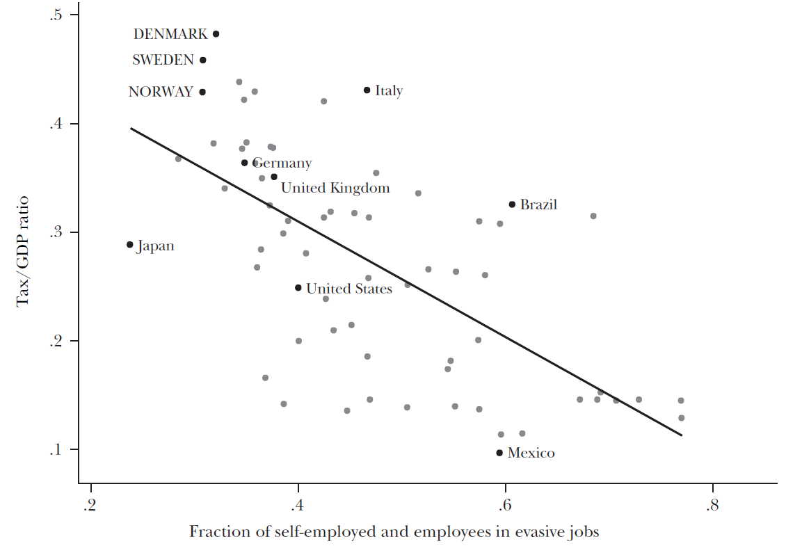
```

Países com fração menor de trabalhadores conta-própria e em funções com fácil evasão em média têm carga tributária maior &mdash; esse é um argumento razoável pelo qual o Brasil deveria ter uma carga tributária menor que a dos países da OCDE `r Citep(myBib, "kleven")`

---
class: middle
## Base de cobrança e elisão fiscal

Uma forma de reduzir a elisão fiscal, reduzindo o custo de eficiência da taxação, é *aumentar a base de cobrança*, isto é, taxar de forma homogênea tipos similares de renda

Há várias formas de metamorfosear o tipo de renda: de salário para lucro, pela "pejotização", de dividendos para ganhos de capital, deduções do IRPF, etc

Quanto mais consistente for a taxação desses vários tipos de renda, menor vai ser a possibilidade de se pagar menos impostos mudando-a de um tipo a outro

---
class: middle
## Base de cobrança e elisão fiscal

Essa maior base de cobrança implica uma menor **elasticidade da renda tributável**, que é estatística importante para calcular os custos de eficiência da taxação (mais sobre isso nas próximas aulas)

De fato, o aumento nessa base fez com que essa elasticidade tenha caído na Dinamarca de (estimados) 0.21-0.28 em 1987 para 0.05-0.15 hoje em dia, muito abaixo do que se acredita ser o valor para os EUA (0.4-0.5)

Outro motivo é novamente a baixa proporção de trabalhadores conta-própria, que a evidência empírica aponta terem elasticidade da renda tributável muito maior

---
class: middle
## Subsídios ao trabalho

A grande fonte de ineficiência advinda da taxação é que as pessoas **trabalham menos** do que trabalhariam sem distorções

Assim, o subsídio a **bens complementares ao trabalho** pode diminuir essa ineficiência e possibilitar maior redistribuição de renda

Em especial, creches, pré-escolas e asilos públicos e transporte subsidiado incentivam as pessoas a trabalhar mesmo com uma *taxa de impostos de participação* elevada

---
class: middle

```{r, echo=FALSE, out.width = '65%'}
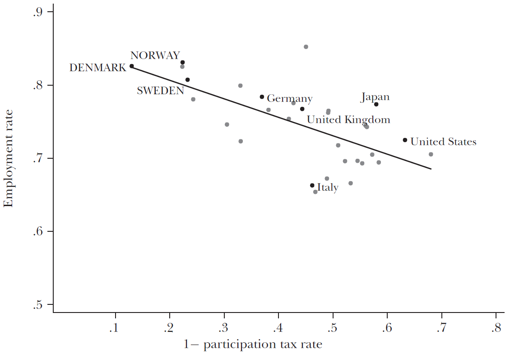
```

Maiores taxas de participação (menores proporções que ficam com o trabalhador, no gráfico) não se refletem claramente em menor participação no mercado de trabalho: na verdade, em correlações *cross-country* vemos exatamente o contrário `r Citep(myBib, "kleven")` 

---
class: middle
## Influências socio-culturais

Um outro motivo para países escandinavos arrecadarem mais impostos é porque as pessoas *estão dispostas* a pagar mais impostos

Motivações intrínsicas (moral, cultura) ou sociais (normas sociais, confiança) fazem com que elas não queiram evadir imposto, mesmo que tenham a chance: economistas chamam isso de **tax morale**

É difícil dizer se características socio-culturais afetam o pagamento de imposto ou a escolha do tamanho do Estado &mdash; países com maior *coesão social* e *capital cívico* tendem a escolher maior redistribuição


---
class: middle

```{r, echo=FALSE, out.width = '90%'}
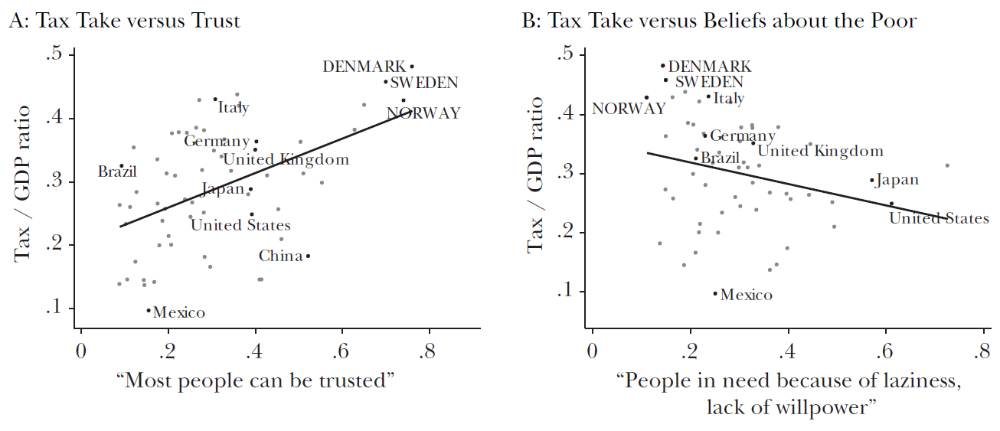
```

Países em que as pessoas confiam mais nos outros, painel (a), e que não consideram que pobreza vem da preguiça ou falta de força de vontade, no painel (b), em média têm carga tributária maior `r Citep(myBib, "kleven")` 

---
class:middle
# Referências
<small>
```{r refs, echo=FALSE, results="asis"}
PrintBibliography(myBib)
```
</small>


<!-- --- -->
<!-- class: middle -->

<!-- ```{r, echo=FALSE, out.width = '100%'} -->
<!-- 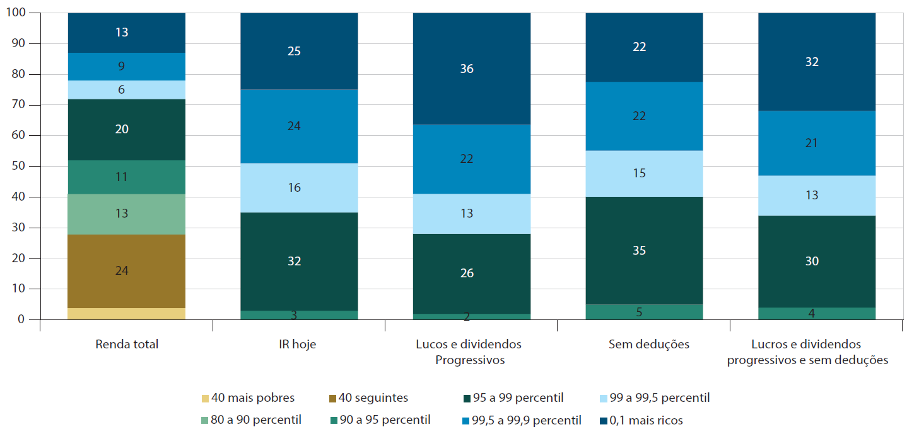 -->
<!-- ``` -->

<!-- Progressividade do IR sem e com reduções nos gastos tributários, 2008 `r Citep(myBib, "silveira2019beneficios")`  -->

