class: inverse, middle, center

```{r, load_refs, include=FALSE, cache=FALSE}
library(RefManageR)
BibOptions(check.entries = FALSE,
           bib.style = "alphabetic",
           cite.style = "alphabetic",
           style = "markdown",
           hyperlink = FALSE,
           dashed = FALSE)
myBib <- ReadBib("./esp_bib.bib", check = FALSE)
```

# Incidência de impostos

---
class: middle
## Implicações de equidade da taxação

Para entendermos se um imposto aumenta ou reduz a desigualdade, temos que entender quem *em última instância* paga por ele &mdash; esse é o estudo da **incidência dos impostos**

É claro que a lei determina quem formalmente paga a taxa, mas o mercado ajusta os preços pré-imposto e pós-impostos de acordo com a *reação comportamental* de consumidores e produtores

Assim, mesmo que um imposto sobre a folha seja pago pela empresa, se ela reduz o salário de demanda como resposta, então na verdade quem está pagando o imposto é o trabalhador

---
class: middle

```{r, echo=FALSE, out.width = '50%', fig.align='center'}

```

Podemos brincar que o autor desse meme provavelmente não estudou economia, mas a pergunta é importante: o imposto sobre propriedade de imovel é progressivo "na letra da lei", mas qual é a incidência real dele?

---
class: middle
## Implicações de equidade da taxação

Algo importante às vezes pouco salientado é que **tax shifting** se dá *pelo mercado* &mdash; não é (necessariamente) uma decisão intencional dos agentes, mas sim efeitos da mudança na curva de oferta ou demanda

Se o preço (líquido da taxa) não mudar com a introdução do imposto, então a incidência real é igual à incidência formal

Quando analisamos não apenas consumidores e produtores do bem específico, mas também de outros bens relacionados e *fatores de produção*, fazemos uma análise de **incidência em equilíbrio geral**

---
class: middle
## Incidência em equilíbrio parcial

Ainda assim, focaremos na *incidência em equilíbrio parcial*, pois é mais intuitiva e nos provê em geral uma boa aproximação

Considere uma situação inicial de imposto $t = 0$, e adicionamos um imposto fixo (infinitesimal) a ser pago pelo consumidor $dt$

Portanto, se antes a condição de equilíbrio era $S(p) = D(p)$, agora cria-se um **tax wedge**: a condição de equilíbrio se torna: $$S(p) = D(p^c) = D(p + dt)$$ 

---
class: middle

```{r, echo=FALSE, out.width = '80%', fig.align = 'center'}
knitr::include_graphics("figs/eae0310-9-1.png")
```

Incidência em equilíbrio parcial &mdash; sem imposto, $p^p = p^c = p$ (Saez) 

---
class: middle

```{r, echo=FALSE, out.width = '95%'}
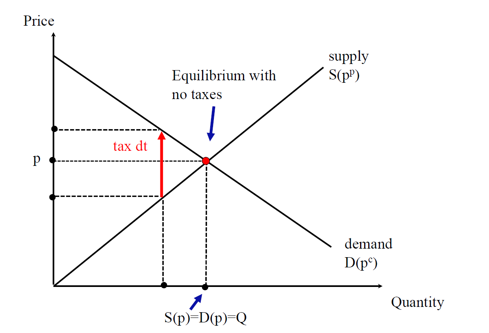
```

Já o impostro cria um *tax wedge*: agora $p^c = p + dt > p = p^p$  (Saez) 

---
class: middle

```{r, echo=FALSE, out.width = '95%'}
knitr::include_graphics("figs/eae0310-9-3.png")
```

A redução no consumo faz as firmas atuarem em região com MC menor, e eventualmente o preço do produtor cai em resposta (Saez) 

---
class: middle
## Incidência em equilíbrio parcial

Uma forma de calcular a incidência é comparar a mudança no "preço sem imposto" dada a adição de uma taxa, i.e., $dp/dt$

A condição de equilíbrio no mercado é $S(p) = D(p + dt)$. Derivando ambos os lados em relação a $t$:

$$S^{\prime}(p)\frac{dp}{dt} = D^{\prime}(p + dt)\left(1 + \frac{dp}{dt}\right)$$

$$\Rightarrow \frac{dp}{dt} \left[ S^{\prime}(p) - D^{\prime}(p + dt)  \right] = D^{\prime}(p + dt)$$
$$\therefore \ \frac{dp}{dt} = \frac{D^{\prime}(p + dt)}{S^{\prime}(p) - D^{\prime}(p + dt)}$$
---
class: middle
## Incidência em equilíbrio parcial

Elasticidades são muito úteis em economia do setor público, pois geralmente são *estatísticas suficientes* para o comportamento dos produtores e consumidores (em mercados competitivos)

Lembrem-se que $\epsilon_D = \frac{p + dt}{D(p + dt)} D^{\prime}(p + dt)$ e $\epsilon_S = \frac{p}{S(p)} S^{\prime}(p)$

Como $dt$ é pequeno, podemos multiplicar "embaixo e em cima" por $p/Q$: 
$$\frac{dp}{dt} = \frac{D^{\prime}(p + dt) p/D(p)}{S^{\prime}(p)p/S(p) - D^{\prime}(p + dt)p/D(p)} = \frac{\epsilon_D}{\epsilon_S - \epsilon_D}$$

---
class: middle
## Incidência em equilíbrio parcial

Note que dado $\frac{dp}{dt} = \frac{\epsilon_D}{\epsilon_S - \epsilon_D}$ e $p^p = p$, temos que: $$-1 \leq \frac{dp^p}{dt} \leq 0 \text{ e  } \frac{dp^c}{dt} = \frac{d(p + dt)}{dt} = 1 + \frac{dp}{dt} \in [0, 1]$$

Consumidores arcam com toda a incidência do imposto quando $dp/dt = 0$ e portanto $dp^c/dt = 1$, o que acontece se $\epsilon_D = 0$ e/ou $\epsilon_S = \infty$

Produtores arcam com toda a incidência do imposto quando $dp^p/dt = -1$, isto é, se $\epsilon_D = - \infty$ e/ou $\epsilon_S = 0$

Regra geral: **o lado mais inelástico do mercado arca com maior parte dos impostos**

---
class: middle
## Incidência em equilíbrio parcial

A mudança no preço ao consumidor pelo imposto, $\rho \equiv dp^c/dt = 1 + dp/dt$ é chamada de **pass-through** do imposto

Acredita-se que no longo prazo boa parte das indústrias opere com custo marginal constante (por retornos constantes de escala)

Isso implica uma curva de oferta (quase) infinitamente elástica e um pass-through próximo de 1 &mdash; impostos sobre consumo seriam arcados quase inteiramente pelos consumidores

A evidência empírica é consistente com pass-throughs entre 0.8-1.0 para impostos sobre bens de consumo e serviços

---
class: middle

```{r, echo=FALSE, fig.show="hold", out.width="45%"}
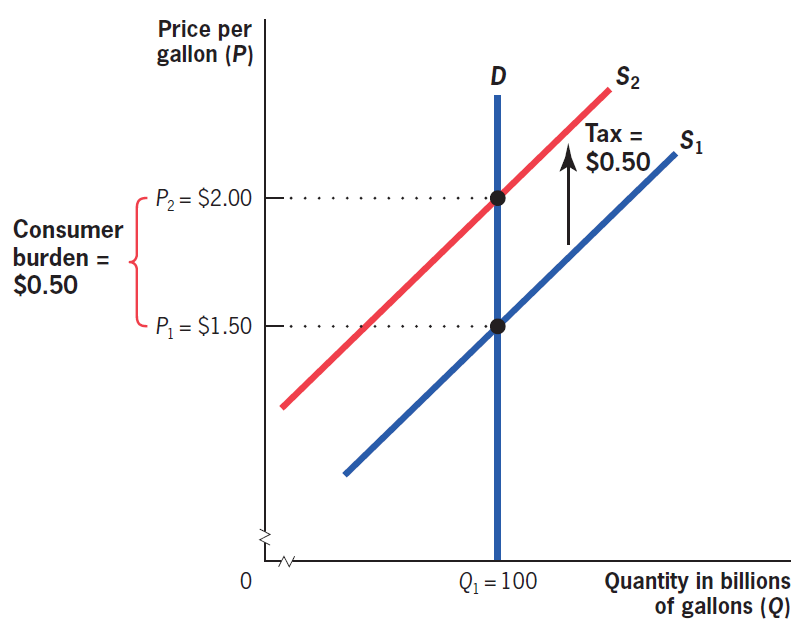
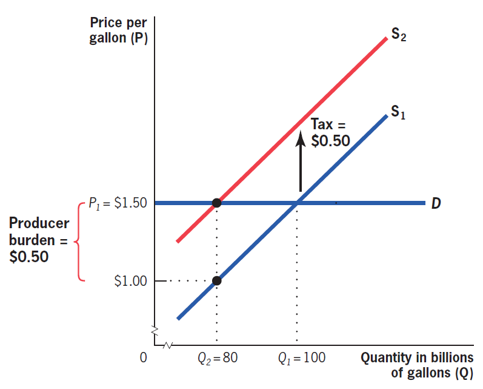
```

Quando a demanda é infinitamente inelástica, o pass-through $dp^c/dt$ é 1 (**full shifting**). Quando é infinitamente elástica, a incidência se dá toda sobre o produtor `r Citep(myBib, "gruber")` 

---
class: middle

```{r, echo=FALSE, out.width = '85%'}
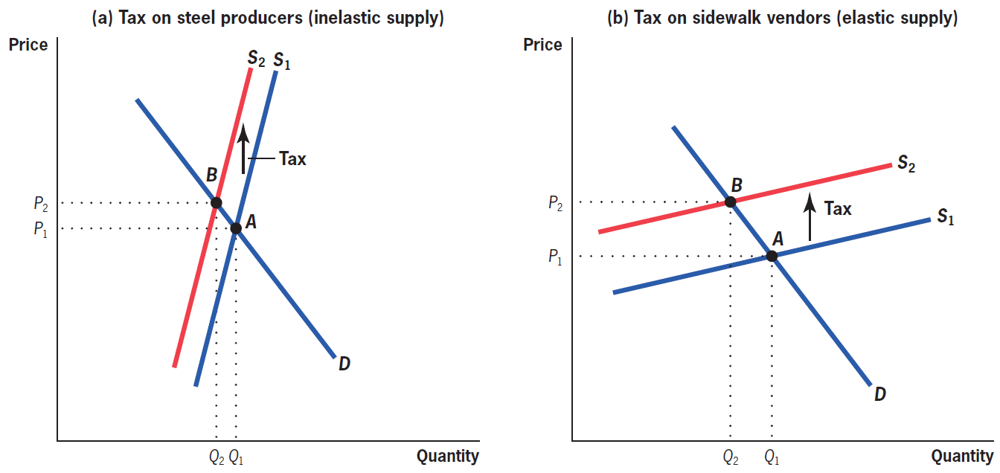
```

E o inverso ocorre com a curva de oferta: quanto mais elástica, maior o pass-through `r Citep(myBib, "gruber")` 

---
class: middle
## Incidência em mercados de fatores

Essa análise vale também para mercados de fatores de produção: impostos sobre a folha, sobre oferta de trabalho, sobre capital

A diferença é que a firma agora *demanda* esses fatores, cujos ofertantes são os domicílios

Outra diferença é que mercados de fatores têm mais rigidez (como salário mínimo), o que pode afetar o equilíbrio de mercado: que parte paga oficialmente o imposto pode importar!

---
class: middle

```{r, echo=FALSE, out.width = '85%'}
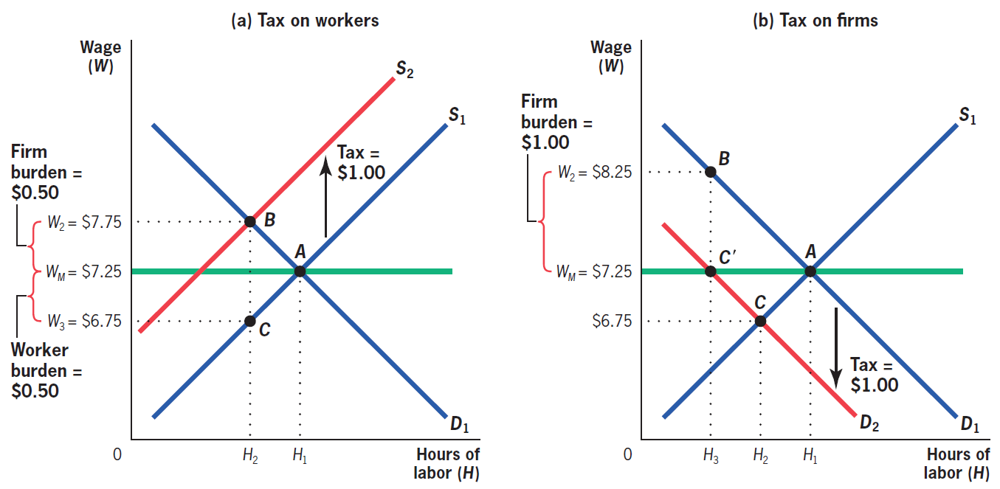
```

Com salário mínimo, a incidência legal do imposto pode importar &mdash; quando as firmas pagam o imposto, parcela maior dele recai sobre elas `r Citep(myBib, "gruber")` 

---
class: middle
## Incidência em monopólio

Incidência em mercados não-competitivos é mais complicado. Mantém-se o resultado, entretanto, que não importa para a incidência econômica quem formalmente paga o imposto

Dizemos que o peso-morto $D$ é **de segunda-ordem** quando $\lim_{dt\rightarrow 0} \frac{D}{dt} = 0$

Como veremos na aula que vem, em *mercados competitivos* o peso-morto é de segunda ordem (negligenciável) &mdash; assim, a perda de excedente do consumidor, $\rho Qdt$ (o **pass-through**), e a perda do produtor, $(1 - \rho)Qdt$, somam a receita do governo $R(dt) = Qdt$

---
class: middle
## Incidência em monopólio

Quando há alguma imperfeição no mercado (no caso, poder de mercado), *o peso-morto não é mais de segunda-ordem*: então a perda de excedente do consumidor e do produtor somam *mais que* a receita

De fato, a incidência no consumidor continua sendo $\rho$, pois é o aumento do preço que ele paga, $dp^c/dt$

Mas agora a incidência no produtor é $1$: o monopolista absorve *toda* a taxação

Importante: *quanto maior o excedente, mais espaço há para o imposto incidir sobre esse lado do mercado*

---
class: middle
## Incidência em equilíbrio geral

Se a análise de equilíbrio parcial nos dá uma boa intuição para a incidência da taxação, ela pode ser enganativa se não considerarmos os *efeitos de equilíbrio geral* da taxação

Um imposto sobre a venda de cerveja afeta os preços não apenas da cerveja, mas também de álcools substitutos, e do capital e trabalho empregado no setor

Imagine um imposto municipal sobre restaurantes: se a demanda for infinitamente elástica, os restaurantes pagam todo o imposto &mdash; mas restaurantes não podem pagar imposto! *Apenas pessoas pagam impostos*

---
class: middle
## Incidência em equilíbrio geral

Quando dizemos que "restaurantes arcam com imposto", na verdade queremos dizer que *os fatores de produção* empregados na produção por restaurantes arcam com os impostos

Se a oferta de trabalho para restaurantes for infinitamente elástica, e o capital no curto prazo infinitamente inelástico (pois o capital investido não é convertível), então a incidência se dá toda nos donos do restaurante

Se temos vários bens, a incidência também vai depender de quão *intensivo* é o uso de cada fator na produção do bem taxado

---
class: middle

```{r, echo=FALSE, out.width = '50%', fig.align='center'}
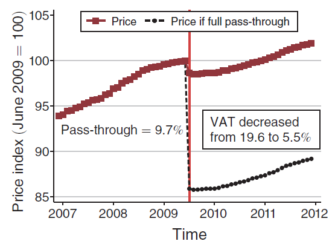
```

`r Citep(myBib, "benzarti2019really")` analisa o efeito de um corte no IVA na França de 14 p.p., encontrando **pass-through** de 9.7% (*incidência assimétrica*)

---
class: middle

```{r, echo=FALSE, out.width = '85%'}
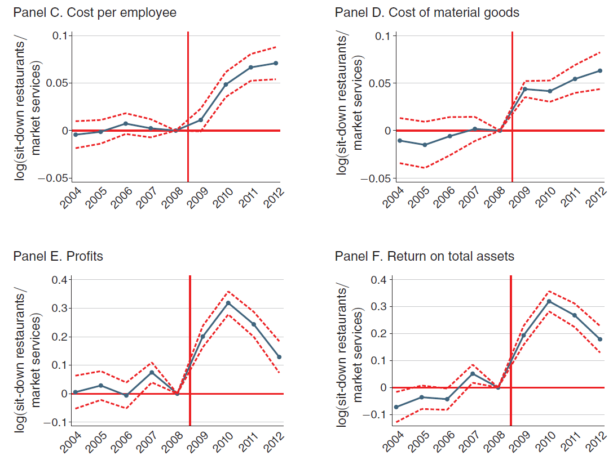
```

Eles encontram uma incidência de 19% nos salários, 60% no lucro, 13% no custo das matérias primas e apenas 8% foi revertido em redução nos preços ao consumidor `r Citep(myBib, "benzarti2019really")` 

---
class: middle

```{r, echo=FALSE, out.width = '90%'}
knitr::include_graphics("figs/eae0310-4-2.png")
```

No mundo real, frequentemente a incidência econômica *depende sim* da incidência formal, por **racionalidade limitada**: nos EUA geralmente impostos "aparecem" só no caixa &mdash; em um experimento, `r Citep(myBib, "chetty2009salience")` encontram que comparado com aparecer na tarjeta, o imposto "no caixa" só tem 35% de **saliência**

---
class: inverse, middle, center

# Allcott, Lockwood, and Taubinsky (2019). “Should We Tax Sugar-Sweetened Beverages? An Overview of Theory and Evidence”

---
class: middle
## Sin taxes

**Sin taxes** são impostos com o objetivo (principal) não de arrecadar recursos, mas sim desincorajar comportamentos nocivos ao indivíduo e sociedade, como fumar ou beber álcool

Uma sin tax em grande discussão na atualidade é a taxação de bebidas com açucar adicionado (SSB). Nos últimos anos 39 países ao redor do mundo implementaram essas taxas

Problema: como SSBs são mais consumidos pelos mais pobres, essa taxação é regressiva (**incidência**)

---
class: middle
## Sin taxes

> "A tax on soda and juice drinks would disproportionately increase taxes on low-income families in Philadelphia." Bernie Sanders, 2016 em `r Citep(myBib, "allcott2019regressive")`

Questão importante: o americano médio consome 6,9% do seu consumo total de energia por SSBs (154cal/dia)

Também respondem por 23% do consumo de açucar do americano médio

Por volta de metade dos americanos consome pelo menos uma bebida com açucar adicionado por dia &mdash; no Brasil, são 60 litros por ano em média

---
class: middle

```{r, echo=FALSE, out.width = '85%'}
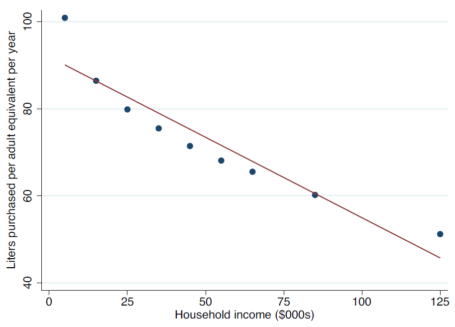
```

O consumo de SSBs cai significantemente com o aumento da renda: tanto por *heterogeneidade de preferências*, quanto por maior conhecimento dos malefícios dos SSBs `r Citep(myBib, "allcott2019regressive")`

---
class: middle
## Sin taxes

SSBs fazem mal à saúde por três canais (principais): obesidade, diabetes e doenças cardiovasculares

Uma dose extra por dia de SSBs é associado a aumento de meio kg no peso a cada 4 anos, 13% maior risco de desenvolver diabetes tipo 2 e 17% maior de doenças coronárias

SSBs estão associados a custos de R$2,9bi/ano no SUS e uma taxa de ¢1/oz pouparia 17bi de dólares nos EUA

---
class: middle
## Razões econômicas para a taxação de SSBs

SSBs são associadas a **externalidades fiscais**: nem todo o custo da má saúde recai sobre o indivíduo, devido a seguro de saúde ou provisão pública de saúde (Medicare, SUS)

Há também externalidades fiscais *positivas*: um exemplo (trágico) é como obesidade faz as pessoas morrerem mais cedo, reduzindo custos em seguridade social

Como nesse caso as externalidades e internalidaes são **heterogêneas**, temos que analisar se elas ocorrem mais em indivíduos mais ou menos elásticos ao preço 

---
class: middle
## Internalidades

Mas o principal motivo para taxar SSBs é mesmo abordar **internalidades**

Note que os danos supracitados à saúde *NÃO* são motivo para taxar SSBs &mdash; taxação não é para maximizar a saúde das pessoas (se não proibiríamos um monte de coisa!), e sim para resolver *falhas de racionalidade*

Geralmente, as duas falhas mais evocadas são **falhas informacionais** e **inconsistência intertemporal** e falhas de auto-controle

---
class: middle

```{r, echo=FALSE, out.width = '85%'}
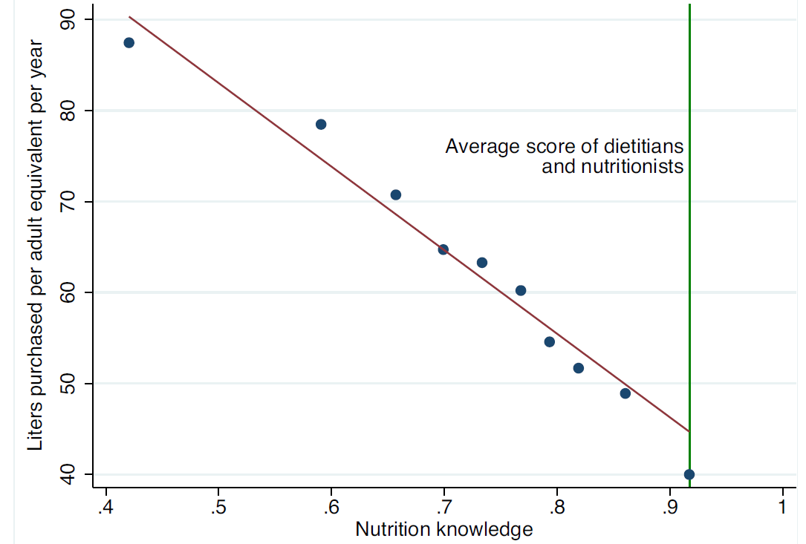
```

Evidência de *falhas informacionais*: "nota" num questionário sobre nutrição é inversamente correlacionado com consumo de SSBs `r Citep(myBib, "allcott2019regressive")`

---
class: middle

```{r, echo=FALSE, out.width = '85%'}
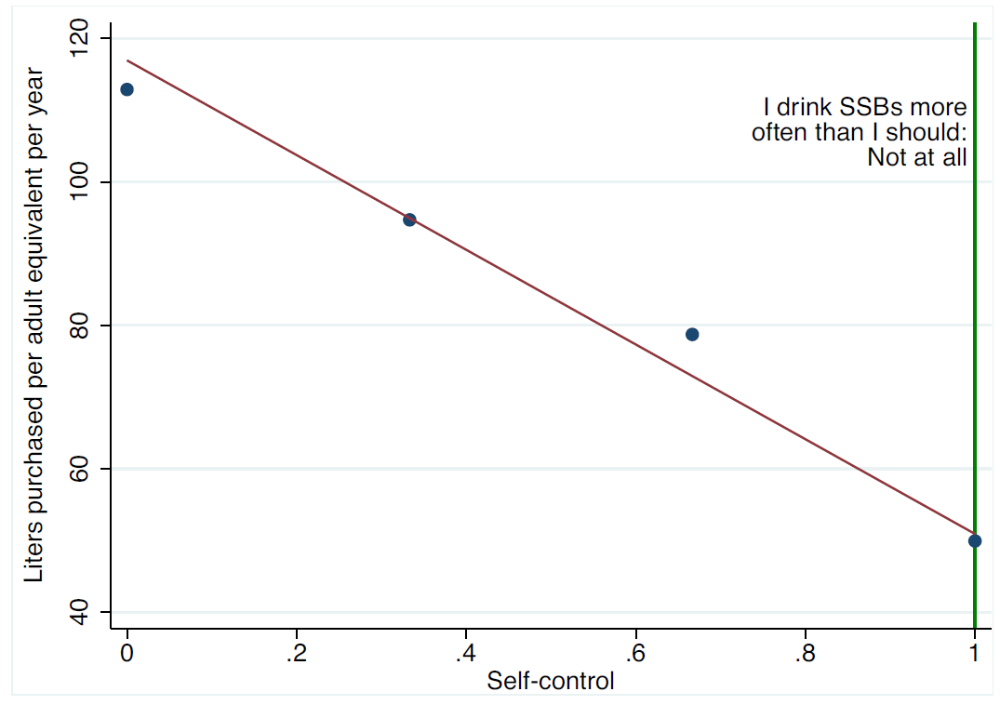
```

E encontramos o mesmo resultado para uma medida de *falhas de auto-controle* `r Citep(myBib, "allcott2019regressive")`

---
class: middle
## Internalidades

Internalidades (ao contrário de externalidades) *impactam o próprio consumidor*: se damos mais valor ao bem-estar dos mais pobres, devemos levar em conta que proporção das internalidades recaem sobre eles

Como de fato internalidades são maiores entre os mais pobres, *a correção das internalidades é progressiva*; assim, não é *a priori* óbvio que taxar SSBs é pior para os mais pobres

Depende da **elasticidade da demanda** &mdash; se for muito inelástica, a perda de poder de compra é alta e redução de internalidades baixa, se for muito elástica vice-versa

---
class: middle

```{r, echo=FALSE, out.width = '85%'}
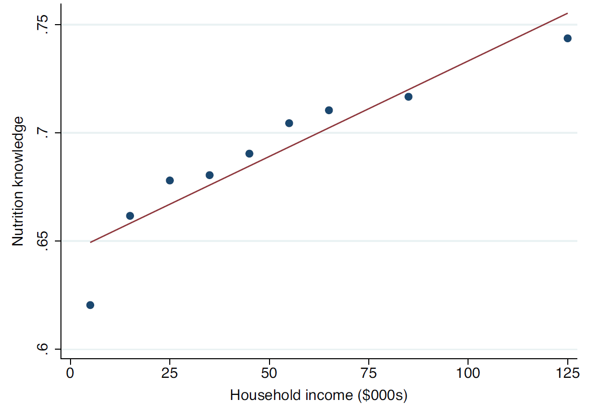
```

Correção de internalidades é *progressivo*: informação nutricional e auto-controle (omitido) são altamente correlacionados com a renda familiar `r Citep(myBib, "allcott2019regressive")`

---
class: middle
## Incidência

É importante também analisar a incidência do imposto: por exemplo, se o **pass-through** for zero, então é impossível corrigir ex-/internalides taxando SSBs

No caso geral, como o pass-through afeta o imposto ótimo depende se a sociedade dá mais valor ao bem-estar dos produtores ou consumidores de SSBs

Na prática, o pass-through sobre bens de consumo não-duráveis é bastante alto, e (nessa aplicação) considerações de incidência não afetam muito o resultado

---
class: middle
## Estimativas empíricas

Para estimar o imposto ótimo, eles precisam de estimativas empíricas das estatísticas relevantes

Eles estimam a elasticidade-preço da demanda por SSBs como -1,4: bem elástica! Isso significa que taxar SSBs é uma forma bastante efetiva de alterar o comportamento dos consumidores

Pesquisadores estimam o custo de saúde por SSBs em ¢1/oz, e o Dep. de Saúde americano estima que 85-88% desses custos são pagos por outros (externalidades): ¢0,8-0,9/oz de externalidades

---
class: middle
## Estimativas empíricas

Internalidades é mais difícil estimar empiricamente &mdash; `r Citep(myBib, "allcott2019regressive")` comparam com consumo de nutricionistas e estimam que pessoas comprariam 31-37% menos SSBs se tivessem informação boa sobre custos de saúde

Isso corresponde a ¢0,91-2,14/oz de externalidades

Mas essa internalidade é correlacionada com a renda! Em um survey sobre os danos de SSBs, erros de informação são 30% maiores em famílias com renda de 10.000 dólares/ano do que $100.000/ano 

Dado um peso na função de bem-estar social razoável, internalidades serem concentrados nos mais pobres aumenta o imposto ótimo em 20% 

---
class: middle
## Colocando tudo jundo

Juntando tudo, `r Citep(myBib, "allcott2019regressive")` calculam a taxação ótima de SSBs como ¢1,5/oz (R$0,75 por um refrigerante de 300ml)

Isso é ¢0,8/oz de externalidade fiscal, ¢1/oz de internalidades $\times$ 120% por causa da progressividade da internalidade, reduzido em ¢0,5/oz por causa da regressividade do imposto

Se o formulador de políticas públicas for filosóficamente oposto a taxar internalidades (*paternalismo*), ainda há espaço para *sin taxes*, mas muito menor: ¢0,4/oz (R$0,25 por lata)

---
class: middle
## Princípios da "taxação de pecado"

`r Citep(myBib, "allcott")` sugerem 7 princípios dos *sin taxes*:

1. O objetivo do imposto não é maximizar saúde, mas sim corrigir internalidades e externalidades
2. Focar a ação em quem gera mais int-/externalidades &mdash; por exemplo, se crianças tem menos controle próprio e consumo na infância gera hábito, então banir refrigerantes em colégios (p. ex.) faz sentido
3. É melhor taxar gramas de açucar que ml de bebida (**princípio da focalização**)

---
class: middle
## Princípios da "taxação de pecado"

4. Só taxar bebidas diet e sucos se eles também causam danos de saúde não internalizados
5. Regressividade importa, mas precisamos considerar também a *progressividade da correção de internalidades*
6. O imposto deve ser o menos local possível, para evitar **leakage**, que diminui o efeito corretivo
7. Sin taxes (pelo menos nos EUA) parece ser uma boa idéia; isto é, aumenta o bem-estar social, dadas preferências sociais razoáveis &mdash; como as que racionalizam o governo como é atualmente

Eles estimam que os ganhos com taxar SSBs são de $2,4-6,8 bilhões por ano


---
class:middle
# Referências
<small>
```{r refs, echo=FALSE, results="asis"}
PrintBibliography(myBib)
```
</small>
